@[TOC](目录)

----------

# 看前必读

* 只总结了一些自己认为可能考的考点
* 有一些冗余知识点
* 为了过考试的话，大部分不用背
* 只是为了自己过一遍知识点
* 有一些个人理解
* 欢迎大家提意见和指出错误
* ★ 标注猜测填空题

----------

# 考试范围

1. 1，2，3，4，5，6，7，10，11章，其中表*的不考。
2. 第6章中，“6.2.7多值依赖”和“6.2.8 4NF”不考。第6章，不考证明题。

----------

# 考试题型

1. 判断题 1*10
2. 填空题 2*10
3. 单项选择题 2*10
4. 分析题 10+20
5. 综合题 20

----------

# 知识点

## 1.1数据库系统概述

### 1.1.1数据库的4个基本概念

* 数据（Data）
	* 定义
		* 数据是数据库中存储的基本对象。
		* 描述事物的符号记录。
	* 数据的含义称为数据的语义，数据与其语义是不可分的。
* 数据库（DataBase，DB）
	* 定义：长期存储在计算机内、有组织的、可共享的数据集合。
	* 特征：按一定的数据模型组织、描述和储存，具有较小的冗余度、较高的数据独立性和易扩展性，并可为各种用户共享。
	* 基本特点：永久存储、有组织、可共享。 ★
* 数据库管理系统（DataBase Managerment System，DBMS）
	* 定义：位于用户与操作系统之间的一层**数据管理软件**，用于科学地组织和存储数据、高效地获取和维护数据。
	* 功能：数据定义，数据组织、存储和管理，数据操纵，数据库事务管理和运行管理，数据库的建立和维护。 ★
* 数据库系统（DataBase System，DBS）
	* 定义：在计算机系统中引入数据库后的系统构成。
	* 组成：数据库（DB），数据库管理系统（及其开发工具）（DBMS），应用系统（DBAS），数据库管理员（DBA）和（用户）构成。 ★

### 1.1.2数据管理技术 ###

* 三个阶段 ★
	1. 人工管理
	2. 文件系统
	3. 数据库系统

### 1.1.3数据库系统的特点 ###

* 特点 ★
	* 数据结构化
	* 数据共享性高、冗余度低且易扩充
	* 数据独立性高（指应用程序与数据库的结构之间相互独立）（数据独立性由数据库管理系统提供的**二级映像**功能保证。）
		1. 物理独立性：用户的**应用程序**与数据库中数据的**物理存储**是相互独立的。
		2. 逻辑独立性：用户的**应用程序**与数据库的**逻辑结构**是相互独立的。
	* 数据由数据库管理系统统一管理和控制
		* 数据库管理系统提供以下**数据控制功能** ★
			1. 数据的安全性保护
				* 数据库安全性指保护数据以防止不合法使用造成的数据泄密和破坏。
			2. 数据的完整性检查
				* **数据库完整性**指数据的正确性、有效性和相容性（两个空：正确性和相容性）。★
					* **正确性**：数据符合现实世界语义，反映当前实际状况
					* **相容性**：数据库同一对象在不同关系表中的数据是符合逻辑的
			3. 并发控制
			4. 数据库恢复

## 1.2数据模型 ##

* 数据模型概念：现实世界数据特征的抽象

### 1.2.1两类数据模型 ###

* 分类：
	* 概念模型（信息模型）（概念模型是按**用户**的观点对数据建模，强调其语义表达能力。）
	* 逻辑模型和物理模型
		* 层次模型（树）
		* 网状模型（有向图）（前两者统称为格式化模型）（前两者指针导航数据）
		* 关系模型（二维表）（关键码导航数据）
		* 面向对象数据模型
		* 对象关系数据模型
		* 半结构化数据模型
* 现实世界->信息世界（概念模型）->机器世界（数据模型）

### 1.2.2概念模型 ###

* **概念模型**的一种表示方法：实体-联系方法，用E-R图描述概念模型。

### 1.2.3数据模型组成要素 ###

* 实例：模式的一个具体值。
* **模式是相对稳定的，而实例是相对变动的。**
* **数据模型三个组成要素** ★
	1. 数据结构（静态）
	2. 数据操作（动态）
	3. 数据的完整性约束条件

### 1.2.7关系模型 ###	

* 关系模型术语
	* 关系（relation）：一个关系对应通常说的一张表。
	* 元组（tuple）：表中的一行即为一个元组。
	* 属性（attribute）：表中的一列即为一个属性，给每一个属性起一个名称即属性名。
	* 码（key）：也称为码键。表中的某个属性组，它可以**唯一确定**一个元组。包括候选码，主码。
	* 域（domain）：域是一组具有相同数据类型的值的集合。属性的取值范围来自某个域。
	* 分量：元组中的一个属性值。

### 1.3.2数据库系统的三级模式结构 ###

* 三级模式结构（数据的三个抽象级别）
  1. 模式（schema）
      * 也称逻辑模式，是数据库中全体数据的逻辑结构和特征的描述，是所有用户的公共数据视图。
  2. 外模式（external schema）
      * 也称子模式（subshema）或用户模式，它是数据库用户能够看见和使用的局部数据的逻辑结构和特征的描述，是数据库用户的数据视图，是以某一应用有关的数据的逻辑表示。
  3. 内模式（internal schema）
      * 也称存储模式（storage schema），一个数据库只有一个内模式。它是数据物理结构和存储方式的描述，是数据在数据库内部的组织方式。
* 三级模式结构把数据的具体组织留给DBMS管理，使用户能逻辑抽象地处理数据，而不必关心数据在计算机中的表示和存储。为了能够在内部实现这三个抽象层次的联系和转换，数据库系统在这三级模式之间提供了两层映像：外模式/模式映像和模式/内模式映像。分别保证了数据的逻辑独立性（数据与程序的逻辑独立性）和物理独立性（数据与程序的物理独立性）

## 1.4数据库系统的组成 ##

* 数据库的组成

1. 硬件平台及数据库
2. 软件
3. 人员：包括数据库管理员、系统分析员和数据库设计人员

* 数据库管理员职责
	* 决定数据库中的信息内容和结构
	* 决定数据库的存储结构和存储策略
	* 定义数据的安全性要求和完整性约束条件
	* 监控数据库的使用和运行
	* 数据库的改进和重组、重构

## 2.1关系数据结构及形式化定义 ##

### 2.1.1关系 ###

* 域
	* 是一组具有相同数据类型的值的集合
* 笛卡尔积
	* 域上的一种集合运算
* 关系
	* 超码：K→U则K是超码。候选码的超集一定是超码，候选码的任何真子集一定不是超码。
	* 候选码：特殊的超码，关系中的某一属性组的值能唯一地表示一个元组，而其子集不能，则称该属性组为候选码。
	* 主属性：候选码的诸属性。
	* 非主属性（非码属性）：不包含在任何候选码中的属性。
	* 全码：关系模式的所有属性是候选码。
	* **三种类型** ★
		1. 基本关系（基表、基本表、实表）：实际存在的表；
		2. 查询表（临时表、导出表）：查询结构对应的表；
		3. 视图表（导出表、虚表）：由基本表或其他视图表导出的表，不对应实际存储的数据。
	* 关系的描述称为关系模式
		* **组成**（区别[数据模型](#1.2.3数据模型组成要素)
			* 关系数据结构
			* 关系操作集合
			* 关系完整性约束
		* 表示：R(U,D,DOM,F)
			* R：关系名（表名）
			* U：组成该关系的属性名（字段名）集合
			* D：U中属性所来自的域（数据类型）
			* DOM：属性向域的映像集合（出自哪个域）
			* F：属性间数据的依赖关系集合
* 例题：在SQL中,关系模式称为 基本表，子模式称为 视图，元组称为 行，属性称为 列。

## 2.2关系操作 ##

### 2.2.1基本的关系操作 ###

* 基本的关系操作包括： ★
    * 查询（Query）操作
        * **5种基本操作**（其它的交∩、连接⋈和除÷运算均可用这五种基本运算来表达） ★
            1. 选择
            2. 投影
            3. 并
            4. 差
            5. 笛卡尔积
    * 插入（insert）操作
    * 删除（delete）操作
    * 修改（update）操作
* 特点：操作的对象和结果都是集合。
* 例题：关系的并、差、交操作，要求两个关系具有相同的关系模式（或相同的结构）

### 2.2.2关系数据语言的分类 ★ ###

1. 关系代数
2. 结构化查询语言（Structured Query Language）（介于两者之间） ★
	* 数据查询语言DQL
		* select
	* 数据定义语言DDL
		* create
		* drop：删表、数据库
		* alter
	* 数据操纵语言DML
		* insert
		* update
		* delete：删除记录用户
			* 例题
				* 使用DML语句对数据进行操作,实际上操作的是( C )。   A.数据库的记录 B.内模式的内部记录 C.外模式的外部记录 D.数据库的内部记录
	* 数据控制语言DCL
		* grant：授予权限
		* revoke：撤销权限
3. 关系演算

* 共同特点：具有完备的表达能力（关系完备性）

## 2.3关系的完整性 ##

* 三类**关系完整性**约束（前两个必须满足，被称作关系的两个不变性） ★
	* 实体完整性
		* 若属性A是基本关系R的**主属性**，则A不能取**空值**。
	* 参照完整性（引用完整性）
		* **外码**或者取空值null或者等于被参照关系中某个元组的主码值。
	* 用户定义完整性
		* 反映某一具体数据必须满足的语义要求。
* 设F是基本关系R的一个或一组属性，但不是关系R的码，K是基本关系S的主码。如果F与K相对应，则称F是R的外码（foreign key），并称基本关系R为参照关系（referencing relation），基本关系S为被参照关系（referenced relation）或目标关系(target relation）。关系R和S不一定是不同的关系。外码不一定和相应的主码同名，但一定同域。

## 2.4关系代数 ##

* 抽象的查询语言，用对关系的运算来表达查询。

* 例题

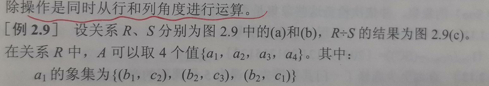

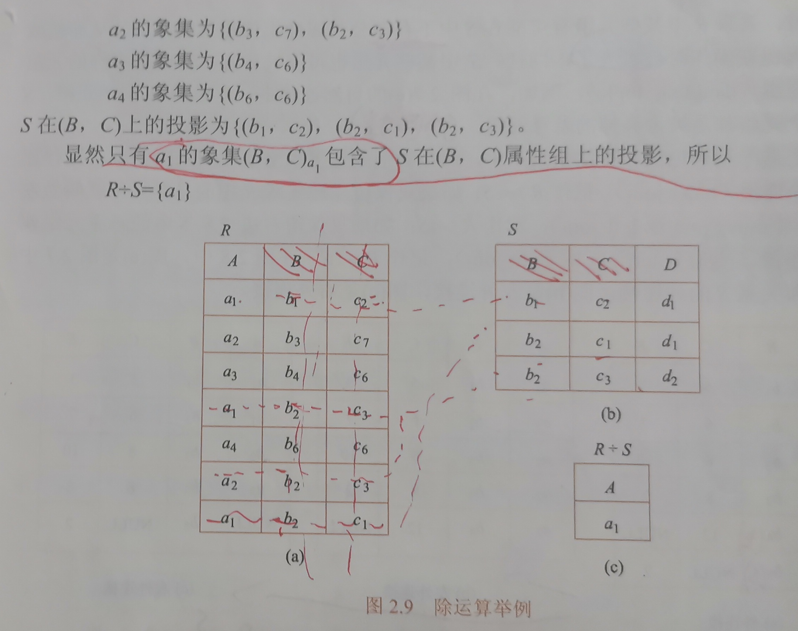

* 课后习题

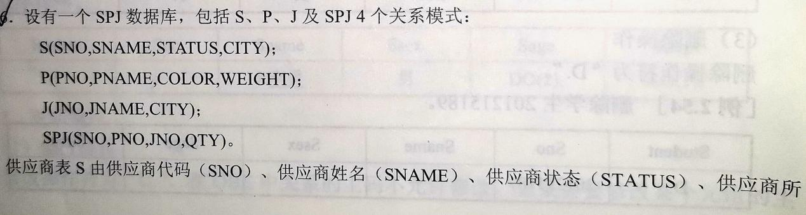

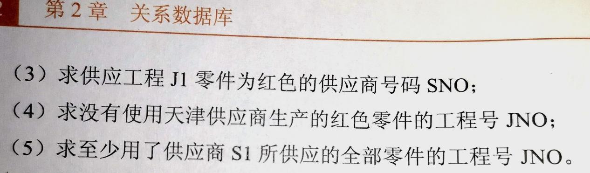

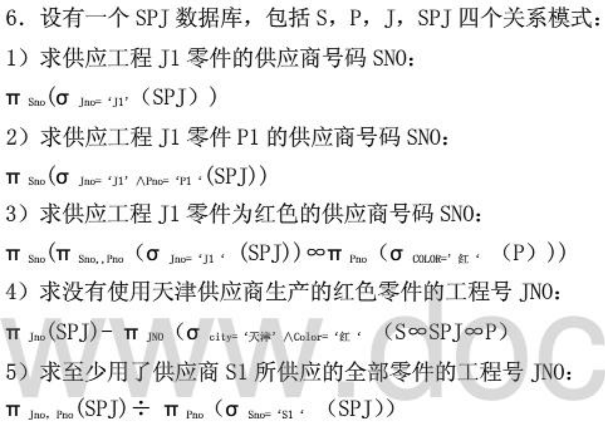

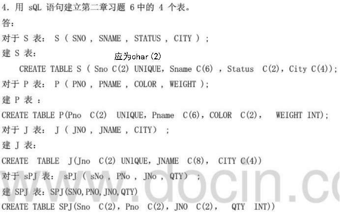

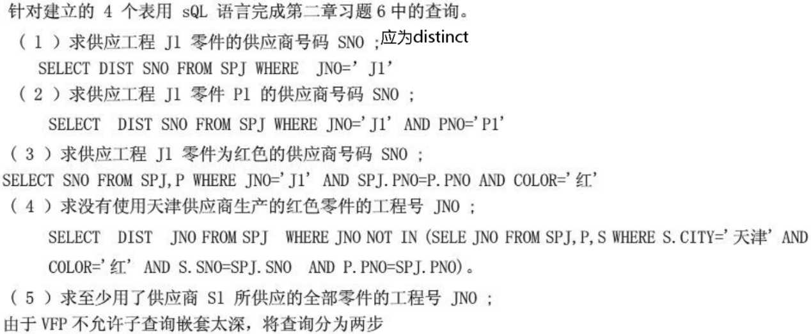

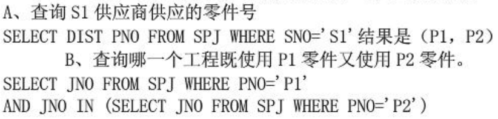

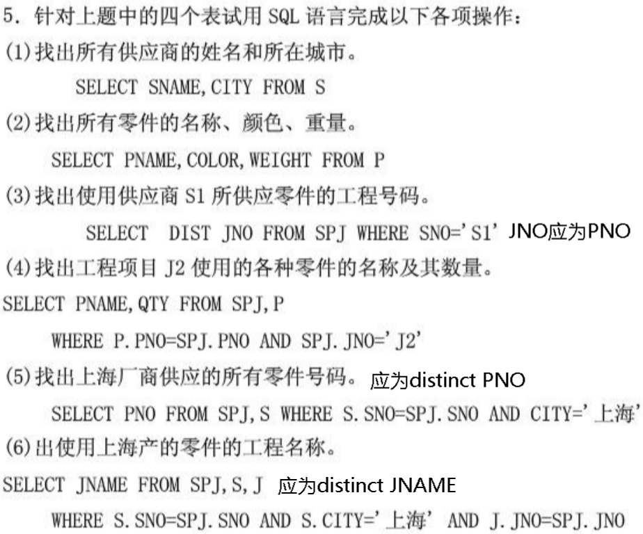

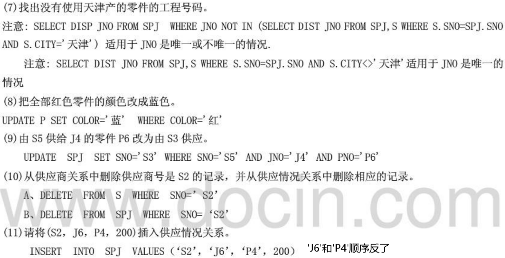

## 3.1SQL概述 ##

### 3.1.2SQL的特点 ###

* 特点 ★
	1. **综合统一**
	2. 高度**非过程化**
	3. **面向集合**的操作方式
	4. 以同一种语法结构**提供多种使用方式**（独立语言（交互式）、嵌入式语言【SQL 语言是面向集合的,一条 SQL 语句原则上可以产生或处理多条记录。主语言是面向记录的,一组主变量一次只能存放一条记录。】）
	5. 语言**简洁**，易学易用

## 3.3数据定义

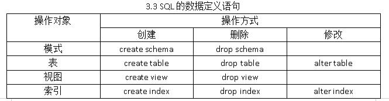

## 3.4数据查询 ##

* 除count(*)之外的聚集函数遇到空值null时都跳过而只处理非空值。
* 不相关子查询：子查询的查询条件不依赖于父查询。
* 相关子查询：子查询的查询条件依赖于父查询，其整个查询语句称为相关嵌套查询。
* 通配符
	* %：0~n个字符
	* _：单个字符（必须有一个）

## 3.7视图 ##

### 3.7.3更新视图 ###

* 视图是不存储数据的虚表，因此对视图的更新最终要转换为对基本表的更新。

### 3.7.4视图的作用 ###

1. 能够简化用户的操作
2. 能使用户能以多种角度看待同一数据
3. 重构数据库提供了一定程度的逻辑独立性
4. 对机密数据提供安全保护
5. 可更清晰地表达查询

* 什么是基本表?什么是视图?两者的区别和联系是什么?
    * 基本表是本身独立存在的表，在SQL中一个关系就对应一个表。视图是从一个或几个基本表导出的表。视图本身不独立存储在数据库中，是一个虚表。即数据库中只存放视图的定义而不存放视图对应的数据，这些数据仍存放在导出视图的基本表中。视图在概念上与基本表等同，用户可以如同基本表那样使用视图，可以在视图上再定义视图。

## 4.1数据库安全性概述 ##

* 数据库的安全性：保护数据库防止不合法使用所造成的数据泄露、更改或破坏。

### 4.1.1威胁数据库安全性的因素 ###

* 非授权用户对数据库的恶意存储和破坏
* 数据库中重要或敏感的数据被泄露
* 安全环境的脆弱性

## 4.2数据库安全性控制 ##

* 实现数据库安全性控制的常用方法和技术 ★
	1. 用户标识和鉴别：该方法由系统提供一定的方式让用户标识自己的名字或身份。每次用户要求进入系统时，由系统进行核对，通过鉴定后才提供系统的使用权。
	2. 存取控制：通过用户权限定义和合法权检查确保只有合法权限的用户访问数据库，所有未被授权的人员无法存取数据。例如CZ级中的自主存取控制( DAC ) ，Bl级中的强制存取控制(MAC )。
	3. 视图机制：为不同的用户定义视图，通过视图机制把要保密的数据对无权存取的用户隐藏起来，从而自动地对数据提供一定程度的安全保护。
	4. 审计：建立审计日志，把用户对数据库的所有操作自动记录下来放入审计日志中，DBA可以利用审计跟踪的信息，重现导致数据库现有状况的一系列事件，找出非法存取数据的人、时间和内容等。
	5. 数据加密：对存储和传输的数据进行加密处理，从而使得不知道解密算法的人无法获知数据的内容。

### 4.2.1用户身份鉴定

* 用户身份鉴定
	* 静态口令鉴别
	* 动态口令鉴别
	* 生物特征鉴别
	* 智能卡鉴别

### 4.2.2存取控制 ###

* 存取控制
	* 定义用户权限
	* 合法权限检查
* 自主存取控制（Discretionary Access Control,DAC）：用户对不同的数据库对象有不同的存取权限，不同的用户对同一对象也有不同的权限，而且用户还可将其拥有的存取权限转售给其他用户。非常灵活。
* 强制存取控制（Mandatory Access Control,MAC）：每个数据库对象被标以一定的密级，每一个用户也被授予某一个级别的许可证。对于任意一个对象，只有具有合法许可证的用户才能存取。比较严格。
	* 强制存取控制规则
		* 仅当主体的许可证级别大于或等于客体的密级时，该主体才能读取相应的客体
		* 仅当主体的许可证级别小于或等于客体的密级时，该主体才能写相应的客体

## 6.1问题的提出

* 关系模式存在的问题（为什么要引入范式?） ★
	1. 数据冗余（在数据库中，操作异常和数据不—致往往是由**数据冗余**引起的。）（数据冗余可能导致的问题有_浪费存储空间及修改麻烦_和_潜在的数据不一致性_。）
		* 比如姓名重复出现，浪费空间。
	2. 更新异常：更新数据库需要耗费很大的代价来维护数据库的完整性（相容性）
		* 某系更换主任后需要修改学生表上每一个元组
	3. 插入异常
		* 某系没有学生就没办法把系的名字和教授名录入数据库
	4. 删除异常：删除了不该删除的数据
		* 某系学生全没了该系相关的一切也都没有了
* 好的关系模式不会发生插入异常、删除异常和更新异常，数据冗余应尽可能小。

## 6.2规范化（重点看书） ##

### 6.2.2码（参见2.1.1） ###

* 主属性：包含在任何一个候选码中的属性。
* 非主属性（非码属性）：不包含在任何一个候选码中的属性。
* **易错点**：
	* SC(Sno,Cno,Grade)中属性组合(Sno,Cno)是码（候选码），但Sno或Cno不是码（候选码），但Sno或Cno是主属性。

### 6.2.3范式 ###

* 一个低一级范式的关系模式通过模式分解可以转换为若干个高一级范式的关系模式的集合，这种过程就叫规范化。

1. 1NF：关系的每一个分量（属性）必须是**不可分**的数据项。
2. 2NF：R∈1NF，且每一个**非主属性完全函数依赖**于任何一个候选码。
3. 3NF：在2NF基础上**非主属性不存在传递函数依赖**。相对于BCNF的不彻底性表现在可能存在**主属性**对码的部分依赖和传递依赖。
	* 全码一定是3NF，因为它不存在非主属性。
4. BCNF：在3NF基础上，**每一个决定因素都包含码**。
	* 例子
		1. SJP(S,J,P)有(S,J)→P;(J,P)→S，(S,J)与(J,P)都为候选码，无传递依赖和部分依赖，SJP∈3NF，且除了候选码之外没有其它决定因素，∴SJP∈BCNF。
		2. SJP(S,T,J)有(S,J)→T;(S,T)→J;T→J，(S,J)与(S,T)都为候选码，无传递依赖和部分依赖，SJP∈3NF，但T是决定因素，并且T不包含码，∴STJ不是BCNF。
			* 我的理解：(S,J)与(S,T)都为候选码∴S,J,T都是主属性，关系SJP中没有非主属性组，因此也不会存在非主属性的部份依赖和传递依赖，∴SJP∈3NF，（但是有主属性组的传递依赖【(S,J)→T;T→J，(
			  S,J)传递→J】和部分依赖【(S,T)→J;T→J，(S,T) P→ J】），T→J中T不包含码，∴STJ不是BCNF。

## 6.3数据依赖的公理系统 ##

* 闭包：我的理解：某属性组 直接/传递依赖 函数确定的属性组集合。
* 求所有的候选码
	1. 找出一定是候选码的，可能是候选码的，一定不是候选码的属性
		* 一定是候选码：只在左边出现或左右都不出现
		* 可能是候选码：左右都出现过
		* 一定不是候选码：只在右边出现过
	2. 求一定是候选码的闭包，如果不是全体属性，则将可能是候选码的属性依此加入求闭包，直至求出所有候选码。
* 求极小函数依赖集（最小依赖集/最小覆盖）：
	1. 用分解的法则，使F中的任何一个函数依赖的右部仅含有一个属性；
	2. 去除多余的函数依赖关系（与传递依赖函数关系一致的）；
		1. 依此去掉某个决定因素X的某个函数依赖关系X→Y，如果去除X后X的闭包仍然包括Y，则X→Y是冗余的（判断存在和传递函数依赖相等的直接函数依赖）。
		2. 再次执行1，直至去除X后X的闭包不包括Y，此时得到一种极小函数依赖集
		3. 再次执行1，但换一个决定因素Z。
		4. 直至所有的情况都考虑到。
	3. 去除部分函数依赖关系。
* 例题：
	1. 设关系模式R(ABCD)，F是R上成立的FD集，F={A→B，B→C}
		1. 试写出属性集BD的闭包(BD)+。
		2. 试写出所有左部是B的函数依赖（即形为“B→?”）。
	* 解
        1. 从已知的F，可推出BD→BCD，所以(BD)+ =BCD.
        2. B+ =BC，因此左部是B的FD有四个（2的n次方个）：   B→Φ，B→B，B→C，B→BC。
    2. F={A→B,B→A,B→C,A→C,C→A}
    * 解
        1. Fm1={A→B,B→C,C→A}
        2. Fm2={A→B,B→A,A→C,C→A}

## 7.1数据库设计概述

### 7.1.3数据库设计的基本步骤 ★

1. **需求分析**阶段
2. **概念**设计阶段
3. **逻辑**设计阶段
4. **物理**设计阶段
5. 数据库**实施**阶段
6. 数据库**运行和维护**阶段

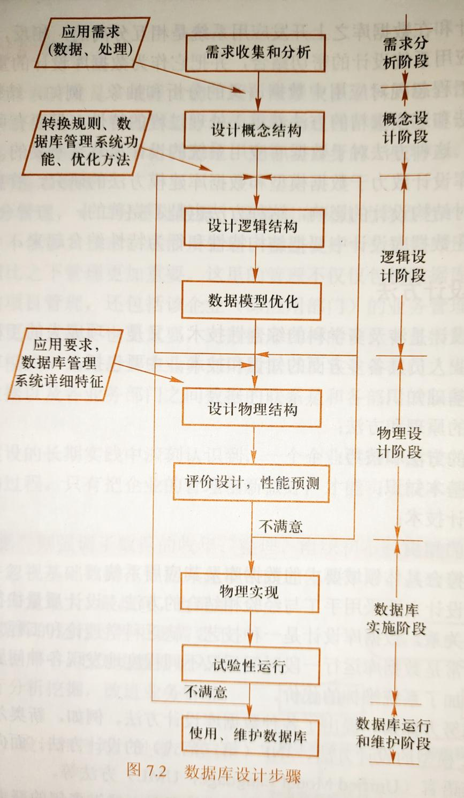

## 7.2需求分析 ##

### 7.2.3数据字典 ###

* 数据字典是关于数据库中数据的描述，即元数据。在需求分析阶段建立（第一阶段）。
	* 包括
		1. 数据项
		2. 数据结构
		3. 数据流
		4. 数据存储过程
		5. 处理过程

## 7.3概念结构设计 ##

* 主要特点：
	1. 能真实、充分地反映现实世界。
	2. 易于理解。
	3. 易于更改。
	4. 易于向关系、网状、层次等各种数据模型转换。

### 7.3.2 E*R模型 ###

* E*R图
	* 实体：矩形
	* 属性：椭圆
	* 联系：菱形

### 7.3.5 概念结构设计

* 各子系统的E-R图之间的冲突 ★
  1. 属性冲突
     1. 属性域冲突
     2. 属性取值单位冲突
  2. 命名冲突
     1. 同名异义
     2. 异名同义
  3. 结构冲突

## 7.4逻辑结构设计 ##

### 7.4.1 E*R图向关系模型的转换 ###

1. 一个实体型转换为一个关系模式
2. 1:1联系可以转换为一个独立的关系模式，也可以与任意一端对应的关系模式合并。
	* 如果转换为一个独立的关系模式，则与该联系相连的各实体的主码以及联系本身的属性均转换为关系的属性，每个实体的主码均是该关系的候选码。
	* 如果与某一端对应的关系模式合并，则需要在该关系模式的属性中加入另一个关系模式的主码和联系本身的属性。
3. 1:n联系的转换方法： 1:n联系可以转换为一个独立的关系模式，也可以与n端对应的关系模式合并。
	* 若转换为一个独立的关系模式，则与该联系相连的各实体的主码以及联系本身的属性均转换为关系的属性，而关系的主码为n端实体的主码。
	* 若与n端关系模式合并，则在n端实体集中增加新属性，新属性由联系对应的1端实体集的主码和联系自身的属性构成，而关系模式的主码不变。
4. m:n联系转换为一个关系模式：与该联系相连的各实体的码以及联系本身的属性均转换为关系的属性。而关系的码为各实体码的组合。
5. 三个或三个以上实体间的一个多元联系可以转换为一个关系模式。
6. 具有相同码的关系模式可合并。

* E*R图转换成关系模型最少表数目
	* 一个实体一张表
	* 一个n:m联系一张表

## 10.1事务的基本概念 ##

* 事务：用户定义的一个数据库操作序列，要么全做，要么全不做，是一个不可分割的工作单位。恢复和事务控制的基本单位。
	* 命令：
		* begin transaction;开启事务
		* commit;提交事务
		* rollback;回滚事务
	* 特性（ACID特性）： ★
		* 原子性（Atomicity）：要么全做，要么全不做。（由DBMS的事务管理子系统来实现）
		* 一致性（Consistency）：执行事务前后，数据库的完整性约束没有被破坏。（由DBMS的完整性子系统实现）
		* 隔离性（Isolation）：事务执行不能被其他事务干扰。（由DBMS的并发控制子系统实现）
		* 持续性（Duration）/永久性（Permanence）：事务一旦提交，其对数据库数据的改变是永久性的。（由DBMS的恢复管理子系统实现）
	* 恢复技术保证事务的原子性、一致性、持续性。

## 10.3故障的种类

1. 种类 ★
    1. 事务内部的故障
    2. 系统故障
    3. 介质故障
    4. 计算机病毒
2. 对数据库的影响
    1. **数据库本身被破坏**
    2. **数据库没有被破坏，但数据可能不正确。**
    3. 恢复的基本原理：**冗余** ★

## 10.4恢复的实现技术

### 10.4.1数据转储

* 概念：管理员定期地将整个数据库复制到磁带、磁盘或其他存储介质上保存起来的过程，这些备用的数据称为**后备副本**或后援副本。
* 局限性：数据库遭到破坏后可以将后备副本重新装入，但**重装后备副本只能将数据库恢复到转储时的状态。**

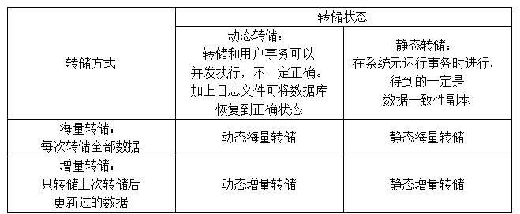

### 10.4.2登记日志文件 ###

* 日志文件概念：用来记录事务对数据库的更新操作的文件。
* 日志文件内容
	* 各个事务的开始
	* 各个事务的结束
	* 各个事务的所有更新操作
* 日志记录的内容
	* 事务标识
	* 操作的类型
	* 操作对象
	* 更新前数据的旧值
	* 更新后数据的新值
* 登记日志文件的原则
	* 登记的次序严格按并发事务执行的时间次序。
	* 必须先写日志文件，后写数据库。
        * 登记日志时把对数据的修改写到数据库中和把表示这个修改的日志记录写到日志文件中是两个不同的操作，在这两个操作之间也有可能发生故障，如果先完成数据库修改，而在运行记录中没有登记这个修改，则以后就无法恢复这个修改了，而先写日志，再修改数据库，按日志文件恢复不过是多执行一次UNDO操作，并不会影响数据的准确性。

## 10.5恢复策略

### 10.5.1事务故障的恢复

* 原因
	* 事务在运行至正常终止点前被终止。
* 恢复步骤
	1. 反向扫描日志文件
	2. 将事务的更新操作执行逆操作（撤销影响）
	3. 直至事务开始标记处。

### 10.5.2系统故障的恢复

* 原因
	* 未完成事务对数据库的更新可能已写入数据库
	* 已提交事务对数据库的更新可能还留在缓冲区没来得及写入数据库
* 恢复步骤
	1. Undo 故障发生时未完成的事务
	2. Redo 已完成的事务
* 系统故障的恢复由系统在重新启动时自动完成，不需要用户干预
* 介质故障的恢复需要数据库管理员介入
	* 数据库管理员的工作
		* 重装最近转储的数据库副本和有关的各日志文件副本
		* 执行系统提供的恢复命令
* 具体的恢复操作仍由数据库管理系统完成

### 10.5.3介质故障的恢复

* 恢复步骤
	1. 重装数据库
	2. 重做已完成的事务
* 对于动态转储的数据库副本，还须同时装入转储时刻的日志文件副本，利用恢复系统故障的方法（即REDO+UNDO），才能将数据库恢复到一致性状态。

## 10.6具有检查点的恢复技术

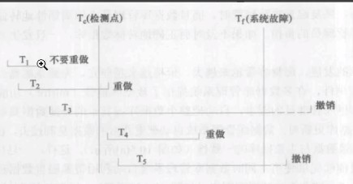

* 小结：**保证数据一致性是对数据库的最基本要求。**

## 11.1并发控制概述 ##

* 并发操作带来的数据的不一致性 ★
	1. 丢失修改（lost update）：两个事务T和T读入同一数据并修改，T2提交的结果破坏了T1提交的结果，导致T1的修改被丢失。如图11.2(a)所示。
	2. 不可重复读（non-repeatable read）：不可重复读是指事务T1读取数据后，事务T2执行更新操作，使T1无法再现前一次读取结果。具体地讲，不可重复读包括三种情况：
		1. 事务T1读取某一数据后，事务T2对其进行了修改，当事务T1再次读该数据时，得到与前一次不同的值。例如在图11.2(b)
		   中，T1读取B=100进行运算，T2读取同一数据B，对其进行修改后将B=200写回数据库。T1为了对读取值校对重读B，B已为200，与第一次读取值不一致。
		2. 事务T1按一定条件从数据库中读取了某些数据记录后，事务T2删除了其中部分记录，当T1再次按相同条件读取数据时，发现某些记录神秘地消失了。
		3. 事务T1按一定条件从数据库中读取某些数据记录后，事务T2插入了一些记录，当T1再次按相同条件读取数据时，发现多了一些记录。
		* 后两种不可重复读有时也称为幻影（phantom row)现象。
	3. 读“脏”数据（dirty
	   read）：事务T修改某一数据并将其写回磁盘，事务T2读取同一数据后，T1由于某种原因被撤销，这时被T1修改过的数据恢复原值，T2读到的数据就与数据库中的数据不一致，则T2读到的数据就为“脏”数据，即不正确的数据。例如在图
	   11.2(c)中T1将C值修改为200，T2读到C为200，而T1由于某种原因撤销，其修改作废，C恢复原值100，这时T2读到的C为200，与数据库内容不一致，就是“脏”数据。
* 主要原因：并发操作破坏了事物的隔离性。
* 并发控制主要技术：
	* 封锁
	* 时间戳
	* 乐观控制法
	* 多版本并发控制

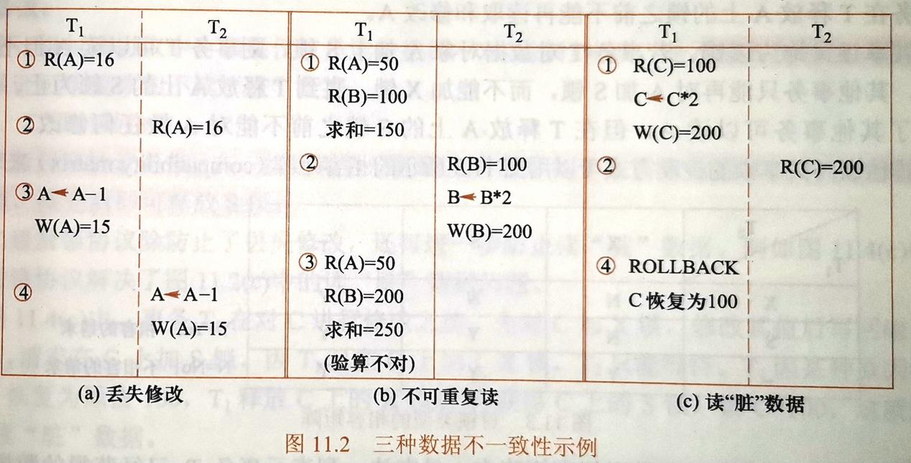

## 11.2封锁 ##

* 排他锁/写锁（exclusive locks,X锁）
* 共享锁/读锁（share locks,S锁）

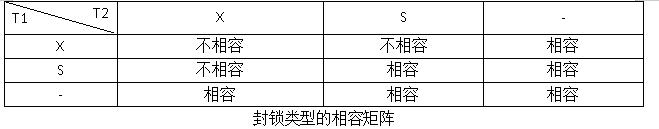

## 11.3封锁协议 ★ ##

1. 一级封锁协议：事务T在修改数据R之前必须先对其加X锁，直到事务结束（Commit/Rollback）才释放。读数据不加锁。
	* 解决问题
		* 丢失修改
	* 存在问题
		* 脏读
		* 不可重复读
2. 二级封锁协议：在一级封锁协议基础上增加事务T在读取数据R前必须先对其加S锁，**读完后**即可释放。
	* 解决问题
		* 丢失修改
		* 脏读
	* 存在问题
		* 不可重复读
3. 三级封锁协议：在一级封锁协议基础上增加事务T在读取数据R前必须先对其加S锁，**事务结束后**即可释放。
	* 解决问题
		* 丢失修改
		* 脏读
		* 不可重复读
	* 存在问题
		* 无

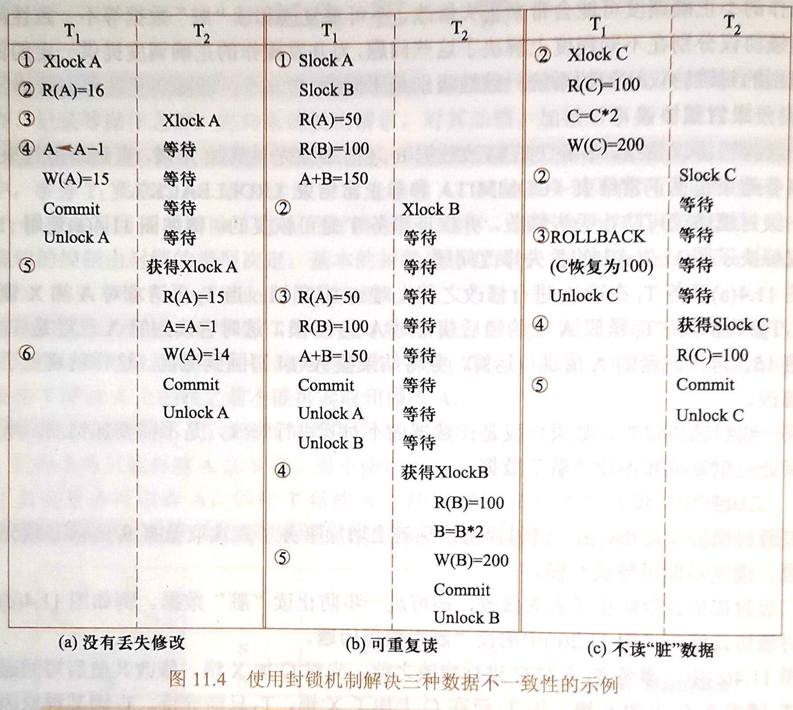

## 11.4活锁和死锁 ★ ##

### 11.4.1活锁 ###

* **活锁**：可能永远等待（饥饿）。

* 解决方法：先来先服务。

### 11.4.2死锁 ###

* **死锁**：两个或两个以上的进程在执行过程中，由于竞争资源或者由于彼此通信而造成的一种阻塞的现象，若无外力作用，它们都将无法推进下去。此时称系统处于死锁状态或系统产生了死锁，这些永远在互相等待的进程称为死锁进程（循环等待）。

* 解决方法 ★
    1. 死锁的**预防**（破坏产生死锁的条件）
        1. **一次封锁法**：要求每个事务必须一次将所有要使用的数据全部加锁，否则就不能继续执行。
            * 存在的问题：扩大封锁范围，降低系统并发度。
        2. **顺序封锁法**：预先对数据对象规定一个封锁顺序，所有事务都按这个顺序实行封锁。
            * 存在的问题：维护成本高，难以实现。
    2. 死锁的**诊断与解除**
        * **诊断**
            1. **超时法**：如果一个事务的等待时间超过了规定的时限，就认为发生了死锁
                * 优点：实现简单
                * 缺点
                    * 有可能误判死锁
                    * 时限若设置得太长，死锁发生后不能及时发现
            2. **等待图法**：事务等待图是一个有向图G=(T，U)，T为结点的集合，每个结点表示正运行的事务，U为边的集合，每条边表示事务等待的情况，若T1等待T2，则T1，T2之间划一条有向边，从T1指向T2。
                * 并发控制子系统周期性地（比如每隔数秒）生成事务等待图，检测事务。如果发现图中存在回路，则表示系统中出现了死锁。
        * **解除**
            * 选择一个处理死锁**代价最小**的事务，将其**撤消**；
            * 释放此事务持有的所有的锁，使其它事务能继续运行下去。

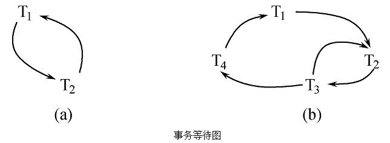

## 11.5并发调度的可串行性 ##

### 11.5.1可串行化调度 ###

* 可串行化调度（serializable）
	* 多个事务的并发执行是正确的，当且仅当其结果与按某一次序串行地执行这些事务时的结果相同。
* 可串行性(serializability)
	* 是并发事务正确调度的准则；
	* 一个给定的并发调度，当且仅当它是可串行化的，才认为是正确调度。
* 冲突可串行化调度
	* 前置概念
		* 冲突操作
			* 是指不同的事务对同一数据的读写操作和写写操作：

			  Ri(x)与Wj(x)       /*事务Ti读x，Tj写x，其中i≠j*/

			  Wi(x)与Wj(x)       /*事务Ti写x，Tj写x，其中i≠j*/

			  其他操作是不冲突操作。
		* 不能交换（swap）的动作
			* 同一事务的两个操作
			* 不同事务的冲突操作
	* 概念
		* 是可串行化调度的充分条件；
		* 一个调度Sc在保证冲突操作的次序不变的情况下，通过交换两个事务不冲突操作的次序得到另一个调度Sc’，如果Sc’是串行的，称调度Sc是冲突可串行化的调度。
	* 若一个调度是冲突可串行化，则一定是可串行化的调度。
	* 可用这种方法判断一个调度是否是冲突可串行化的。
* 例题

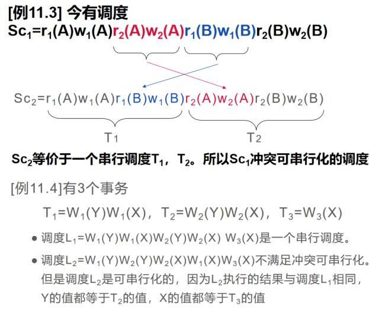

## 11.6两段锁协议

* 所有事物必须分两个阶段对数据项加锁和解锁
	* 第一阶段获取封锁（扩展阶段）
	* 第二阶段释放封锁（收缩阶段）
* 对任何数据读写前必须获得封锁
* 释放一个封锁后不能再申请获得封锁
* 两段锁协议是可串行化调度的充分条件
* 一次封锁法遵循两段锁协议，反之不然。

## 11.7封锁的粒度

* 封锁粒度大，并发度小，开销小
* 封锁粒度小，并发度大，开销大
