[toc]

# 前言

> [推荐lyf大佬的笔记](https://github.com/Lyfive/HnusterComputer/tree/main/%E6%95%B0%E6%8D%AE%E6%8C%96%E6%8E%98)

1. 首先感谢提供过线索的所有人（lyf,lqx,ly,hcy,zyx,llz...），感谢负责任的老师😭
1. 在各章知识点中标★的是老师明确画出的重点，标★★的是明确说考试考了的
1. 来源：老师PPT，老师画的重点，课本，各位大佬的笔记
1. 为加强理解或者为了保险，补充了一些知识点
1. 写得比较粗糙，求各位大佬指正ORZ

# 题型

## 名词解释

* 分值：20分
* 要求
  1. 题目给出中文名称要写出英文全称
  2. 题目给出英文名称要写出中文全称
  4. 给出解释
* 题目
  1. 数据挖掘/数据分析技术
  2. 机器学习
  3. 信息熵
  5. 数据仓库
  5. AGNES定义
  5. DIANA定义

## 简答题

* 分值：2*10分
* 题目（什么是）
  1. 神经网络
  2. 知识发现
  3. 爬虫
  5. 聚类
  6. 聚类优缺点及应用
  6. K 中心点算法定义
  7. 时间序列挖掘
  8. Web挖掘的主要数据源
  9. 权威页面和中心页面

## 综合题

* 分值：6*10分
* 考察类型
  1. 算法应用
  2. 伪代码（可能10行左右）
* 题目
  1. Apriori伪代码
  1. KNN伪代码
  1. ID3伪代码
  1. close算法闭合项集计算
  1. k-means算法描述、伪代码、优缺点
  1. AGNES伪代码
  1. DIANA伪代码
  2. DBSCAN算法描述、优缺点
  2. PageRank伪代码

# 第一章 绪论

## 数据挖掘（Data Mining）定义★★

从大量的、不完全的、有噪声的、模糊的、随机的数据集中识别有效的、新颖的 、潜在有用的，以及最终可理解的模式的非平凡过程。（从大型数据中挖掘所需要的知识）
它是一门涉及面很广的交叉学科，包括机器学习、数理统计、神经网络、数据库、模式识别、粗糙集等相关技术。

## 机器学习（Machine Learning）定义★★

研究如何使用机器来模拟人类**学习活动**的一门学科。

## 人工神经网络（Artificial Neural Networks，ANNs）★★

简称神经网络（NNs），是一种模仿动物神经网络行为特征，进行分布式并行信息处理的算法数学模型。
这种网络依靠系统的复杂程度，通过调整内部大量节点之间相互连接的关系，从而达到处理信息的目的。（百度百科）

## 人工智能（Artificial Intelligence）

研究如何应用机器来模拟人类某些**智能行为**的基本**理论、方法和技术**的一门科学。

## 大数据（Big Data）

### 定义

指一种规模大到在获取、存储、管理、分析方面大大超出了传统数据库软件工具能力范围的数据集合

### 特征

海量的数据规模、快速的数据流转、多样的数据类型和价值密度低

## 知识工程（Knowledge Engineering）

研究知识信息处理并探讨开发知识系统的技术。

## 广义知识（Generalization）

描述类别特征的概括性知识。
这类数据挖掘系统是对细节数据所蕴涵的概念特征信息的概括和抽象的过程。

## 关联知识（Association）

### 定义

反映⼀个事件和其他事件之间的依赖或关联。

### ⽬的

找出数据库中隐藏的关联信息

## 爬虫★★

spider/crawler，是一种按照一定的规则，自动地抓取万维网信息的程序或者脚本

## 传统数据仓库技术
使用**ETL（Extract，Transform，Load）**或**ETCL（Extract，Transform，Clean，Load）**工具实现数据的导出、转换、清洗和装入工具。使用操作型数据存储**（Operational Data Store，ODS）**存储明细数据，使用数据集市和数据仓库计数实现面向主题的历史数据存储，使用多维分析工具进行前端展现，以及使用数据仓库工具提供的挖掘引擎或基于单独的数据挖掘工具进行预测分析等。

## OLTP(On-Line Transaction Processing)

联机事务处理 传统的关系型数据库的主要应用，主要是基本的、日常的事务处理（增删改查），例如银行交易 （CSDN）。

## OLAP(On-Line Analytic Processing)

联机分析处理 数据仓库系统的主要应用，支持复杂的分析操作，侧重决策支持，并且提供直观易懂的查询结果 （CSDN）。

## 决策支持（Decision Support）

决策者通过数据、模型和知识，以人机交互方式进行半结构化或非结构化决策（百度百科）。 

## 事务数据库（Transaction Database）

一个事务数据库是对事务型数据的收集（P24）。 

## 分布式数据库（Distributed Database）

物理上分散而逻辑上集中的数据库系统【在逻辑上是一个统一的整体，在物理上则是分别存储在不同的物理节点上】（百度百科）。

# 第二章 知识发现过程与应用结构

## 知识发现★★

### 定义★★

知识发现（Knowledge Discovery in Database，**KDD**），是一个系统化的工作，
必须对可以利用的源数据进行分析，确定合适的挖掘目标，然后才能着手系统的设计和开发。
KDD是一个多步骤的处理过程，一般分为问题定义、数据采集、数据预处理、数据挖掘、 模式评估等基本阶段。

### 知识发现的过程★

1. 数据源中抽取感兴趣的数据，并把它组织成适合挖掘的数据组织形式；
2. 调用相应的算法生成所需的知识；
3. 对生成的知识模式进行评估，并把有价值的知识集成到企业的智能系统中。 

## 阶梯处理过程模型

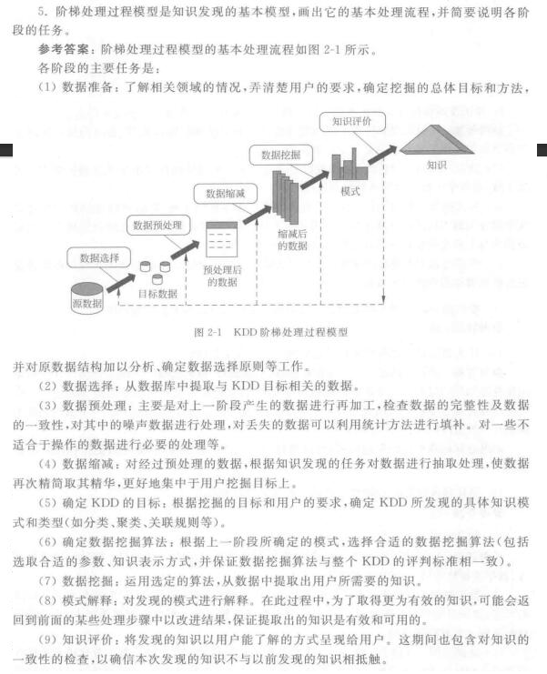

# 第三章 关联规则挖掘理论和算法

## 项目集格空间理论

### 定义

1. 频繁项目集的非空子集都是频繁项目集(Frequent Itemset)。
2. 非频繁项目集的超集都是非频繁项目集。

## Apriori算法★★

### 定义

是一种挖掘关联规则的频繁项集算法 ，其核心思想是通过候选集生成和情节的向下封闭检测两个阶段来挖掘频繁项集。

### 主要步骤

1. 扫描全部数据，产生候选1-项集的集合C1. 
2. 根据最小支持度，由候选1-项集的集合C1产生 频繁1-项集的集合L1. 
3. 对k>1,重复执行步骤4,5,6 
4. 由Lk执行连接和剪枝操作，产生候选k+1-项集 的集合 $C_{k+1}$ 
5. 根据最小支持度，由候选（k+1）-项集的集合 Ck+1，产生频繁（k+1）-项集的集合 $L_{k+1}$ 
6. 若L不等于∅，则k=k+1，步骤跳4，否则结束
7. 根据最小置信度，由频繁项集产生强关联规则

### 伪代码★★

#### 算法3-1  Apriori（发现频繁项目集）

输入：数据集D；最小支持数minsup_count
输出：频繁项目集L

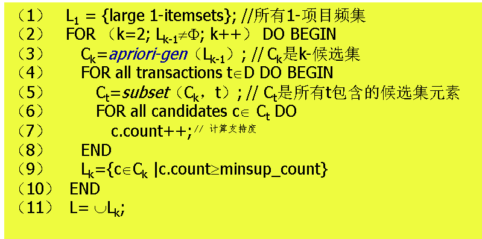

算法apriori中调用了apriori-gen $(L_{k-1})$ ，是为了通过（k-1）-频集产生K-侯选集。

#### 算法3-2 apriori-gen $(L_{k-1})$ 候选集产生

输入：（k-1）-频繁项目集 $(L_{k-1})$ 
输出：k-候选项目集 $C_{k}$ 

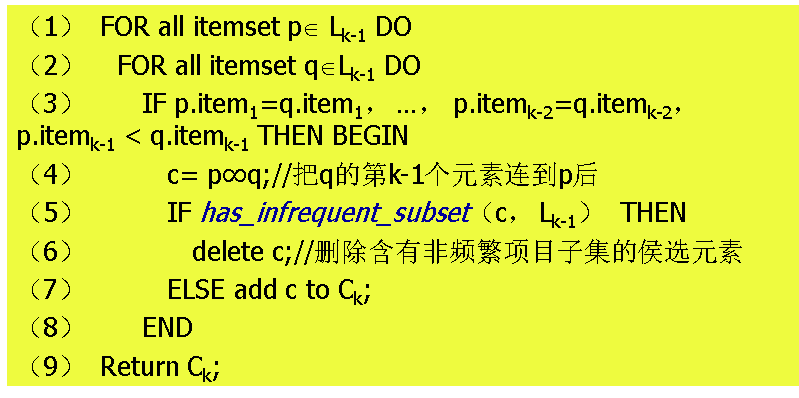

### 例题

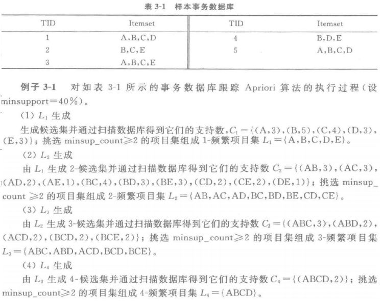

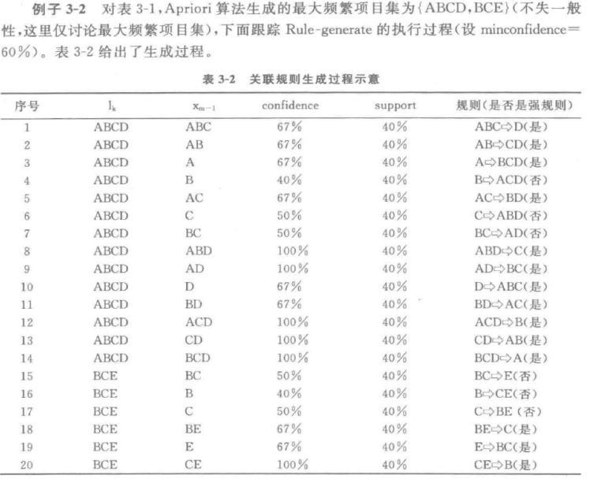

## CLOSE算法★★

### 原理

1. 频繁闭合项目集的非空闭合子集都是频繁闭合项目集。
2. 非频繁闭合项目集的闭合超集都是非频繁闭合项目集。

### 闭合项目集

一个项目集C，当且仅当对于在C中的任何元素，不可能在C中存在小于或等于它的支持度的子集。

### 算法步骤

（自己写的，加强理解）

1. 计算 $FCC_{i}$ 的产生式：数据库中每个个数为 i 的项目集（不重复）
2. 计算 $FCC_{i}$ 闭合项目集（closure）并求出支持度（support）：找出数据库中所有包含A的项⽬（数据库中的一行）的交集及其支持度（在数据库中包含这个闭合项目集的有几行）
3. 修剪候选闭合项目集，得到 $FC_{i}$ ：删除小于Min Support的候选闭合项目集（那一行都删除）
4. 利用 $FC_{i}$ 的generator生成 $FCC_{i+1}$ ：将产生式（Generator）两两组合，如果得到的这个新的产生式是
   ① $FC_{i}$ 中是 $FCC_{i+1}$ 中的某个候选项的子集的项选出来，称为Sp，
   如果 $FCC_{i}$ 这一项是Sp的字母的闭合项目集；
   ②其闭合项目集为空（在数据库中不存在这种组合）；
   ③非频繁项目集的超集
   其中任一，则删除。

5. 重复1.~4.，直至某一步生成的 $FCC_{i+1}$ 为空
6. 将闭合项目集的元素个数为i的放到 $L_{i}$ 集合中
7. 从 $L_{i}$ 最大的集合开始，分解该集合，找到它的所有的(i—1)项子集，如果它不属于 $L_{i-1}$ ，则把其加入 $L_{i-1}$ 
5. 重复7.直至 i =2

### 例题★

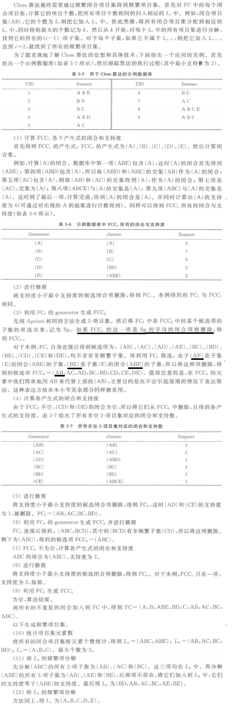

### 闭合项集(Closed Itemset)及其支持度★★

A的闭合项集是指所有包含A的项⽬的交集，⽀持度是指包含A的项⽬的交集 出现的频数

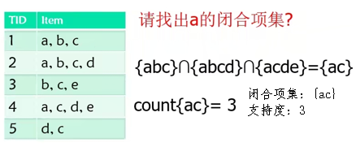

# 第四章 分类方法（监督学习）

## 分类★★

### 定义

分类是一种**监督学习**(Supervised Learning)，即每个训练样本的数据对象**己经有类标识**，通过学习可以形成表达数据对象与类标识间对应的知识。

### 目的

利用历史数据纪录来自动学习一个分类模型/函数（分类器），利用该模型把数据库中的数据项映射到给定类别中的某一个类别，从而能对未来数据进行类别预测。

## KNN★★

### 定义★

K-近邻分类算法（K Nearest Neighbors，**KNN**）通过计算每个训练数据到待分类元组的距离，取和待分类元组距离最近的K个训练数据，K个数据中哪个类别的训练数据占多数，则待分类元组就属于哪个类别。

### 伪代码★★

算法 4-2  K-近邻分类算法
输入：  训练数据T；近邻数目K；待分类的元组t。 
输出：  输出类别c。 

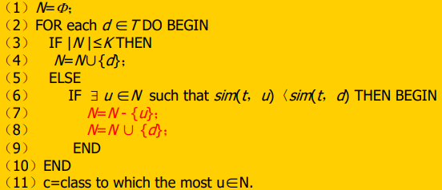

### 例题

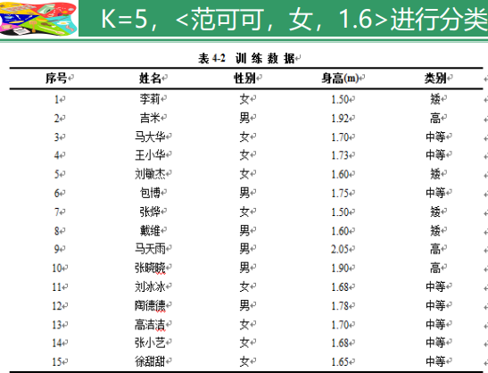

假如高度参与距离计算， k=5。
跟踪 算法：
前 5个记录， N={<李莉，女， 1.50>，<吉米，男，1.92>，<马大华，女，1.70>，
<王小华，女，1.73>，<刘敏杰，女，1.60>}。 

第6个记录 =<包博，男，1.75>，相比测试记录<范可可，女， 1.50>，
需要替换掉N中**和测试记录差别最大的**< 吉米，男，1.92>， 
得到 N={<李莉，女， 1.50>，<包博，男，1.75>，<马大华，女， 1.70>，<王小华，女，1.73>，
< 刘敏杰，女，1.60>}。 

第7个记录 =<张烨，女，1.50>，需要替换掉<包博，男，1.75>， 
得到 N={<李莉，女， 1.50>，<张烨，女，1.50>，<马大华，女， 1.70>，<王小华，女，1.73>，
< 刘敏杰，女，1.60>}。

第8个记录 =<戴维，男，1.60>，需要替换掉<王小华，女，1.73> ，
得到N ={<李莉，女， 1.50>，<张烨，女，1.50>，<马大华，女 ，1.70>，<戴维，男，1.60>，
< 刘敏杰，女，1.60>}。

第9、10个记录，没变化。 

第11个记录 =<刘冰冰，女，1.68>，需要替换掉<马大华，女， 1.70>，
得到N ={<李莉，女， 1.50>，<张烨，女，1.50>，<刘冰冰，女，1.68>，<戴维，男，1.60>，< 刘敏杰，女，1.60>}。 

第12～14个记录，没变化。 

第15个记录 =<徐甜甜，女，1.65>，需要替换掉<刘冰冰，女， 1.68>，

得到 N={<李莉，女， 1.50>，<张烨，女，1.50>，<徐甜 甜，女，1.65>，<戴维，男，1.60>，
< 刘敏杰，女，1.60>}。 

最后的输出 ={<李莉，女， 1.50，矮>，<张烨， 女，1.50，矮>，<徐甜甜，女，1.65，中等>，
<戴维，男，1.60，矮>，< 刘敏杰，女，1.60， 矮>}。

对照表4-2，在这五项中，四个属于矮个， 一个属于中等。最终K-最临近算法认为范可可为矮个。

## ID3★★

### 信息熵★★

是对随机变量不确定度的度量，熵越⼤，随机变量的不确定性就越⼤。

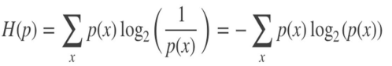

### 信息增益

#### 定义

针对特征而言的，就是看一特征，系统有它和没有它时的信息量各是多少，两者的差值就是这个特征给系统带来的信息量，即信息增益。

#### 公式★

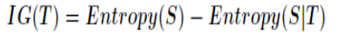

### 伪代码★★

* 输入：训练数据集D，特征集A ，阈值 $\epsilon$ 

* 输出：以node为根节点的——棵决策树

  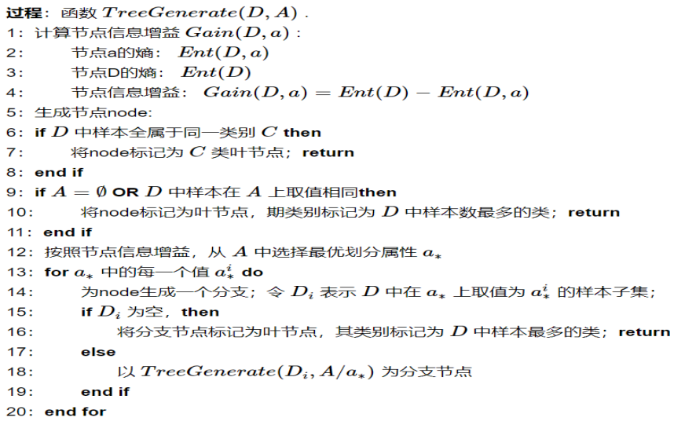

### 例题 4-5★

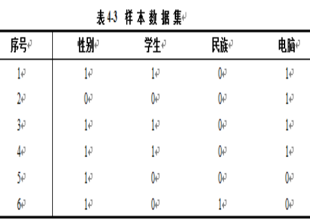

1. 给定样本电脑分类所需的期望信息

   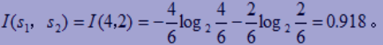

2. 计算每个属性的熵

   1. 性别属性

      1. “性别”=1，有3个 “电脑”=1，2个“电脑”=0； $-(\dfrac{3}{5}log_{2}\dfrac{3}{5}+\dfrac{2}{2}log_{2}\dfrac{2}{5})=0.971$ 

      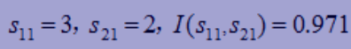

      2. “性别 ”=0，有1个“电脑”=1，没有“电脑 ”=0。 $-(log_{2}1)=0$ 

      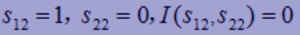

      3.  $E(性别)=\dfrac{5}{6}*0.971+\dfrac{1}{6}*0=0.809$ 
      3. 信息增益
   
      
   
   2. 类似的，可以计算：
   
      $Gain(学生)=-(\dfrac{1}{3}log_{2}\dfrac{1}{3}+\dfrac{2}{3}log_{2}\dfrac{2}{3})-(\dfrac{1}{2}(-\dfrac{3}{3}log_{2}\dfrac{3}{3})+\dfrac{1}{2}(-\dfrac{1}{3}log_{2}\dfrac{1}{3}-\dfrac{2}{3}log_{2}\dfrac{2}{3}))=0.459$ ；
      $Gain(民族)=-(\dfrac{1}{3}log_{2}\dfrac{1}{3}+\dfrac{2}{3}log_{2}\dfrac{2}{3})-(\dfrac{5}{6}(-\dfrac{4}{5}log_{2}\dfrac{4}{5}-\dfrac{1}{5}log_{2}\dfrac{1}{5})+\dfrac{1}{6}(-\dfrac{1}{1}log_{2}\dfrac{1}{1})=0.316$ 。 
   
   3. “学生属性”在所有属性中具有最高的信息增益，首先被选为测试属性
   
      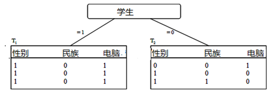
   
   4. 左子树的生成过程。对于“学生”=1的所有元组，其类别标记均为1。得到一个叶子结点。
   
   5. 右子树需要计算其他2个属性的信息增益：
   
      *  $Gain(性别)=-(\dfrac{1}{3}log_{2}\dfrac{1}{3}+\dfrac{2}{3}log_{2}\dfrac{2}{3})-(\dfrac{1}{3}(-\dfrac{1}{1}log_{2}\dfrac{1}{1})+\dfrac{2}{3}(-\dfrac{2}{2}log_{2}\dfrac{2}{2}))=0.918$ ；
   
      *  $Gain(民族)=-(\dfrac{1}{3}log_{2}\dfrac{1}{3}+\dfrac{2}{3}log_{2}\dfrac{2}{3})-(\dfrac{2}{3}(-\dfrac{1}{2}log_{2}\dfrac{1}{2}-\dfrac{1}{2}log_{2}\dfrac{1}{2})+\dfrac{1}{3}(-\dfrac{1}{1}log_{2}\dfrac{1}{1}))=0.251$ ；（书上答案错了）
   
      对于右子树T2，选取最大熵的“性别”
   
      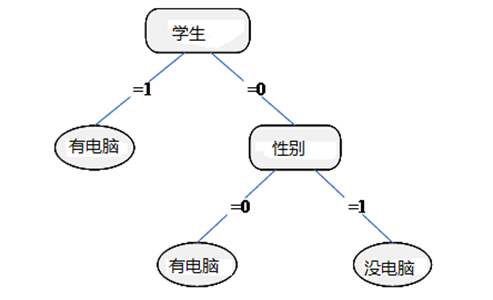

## EM算法★★

### 定义★★

最大期望算法（Expectation-maximization  algorithm，**EM**）用于寻找，依赖于不可观察的隐性变量的概率模型中，参数最大似然预计或者最大后验预计的算法。

### 步骤★★

最大期望算法经过两个步骤交替进行计算：

1. 计算期望（E），利用对隐藏变量（未知参数）的现有预计值，计算其最大似然预计值；
2. 最大化（M）。最大化在 E 步上求得的最大似然值来计算参数的值。M 步上找到的参数预计值被用于下一 个 E 步计算中。

### 举例（不考）

假设男、女身高都服从正态分布，通过抽样调查男、女群体的身高平均值。 
男人身高(cm)：170,180,180,190
女人身高(cm)：150,160,160,170 
如果出现了意外，把抽样信息中男女的标记给弄丢了，男女身高数据混在了一起，那么还有没有办法把男女身高的平均值分别求出来呢？

|   身高（x）   | 150  | 160  | 160  | 170  | 170  | 180  | 180  | 190  |
| :-----------: | :--: | :--: | :--: | :--: | :--: | :--: | :--: | :--: |
| 男人数目（M） |  ？  |  ？  |  ？  |  ？  |  ？  |  ？  |  ？  |  ？  |
| 女人数目（F） |  ？  |  ？  |  ？  |  ？  |  ？  |  ？  |  ？  |  ？  |

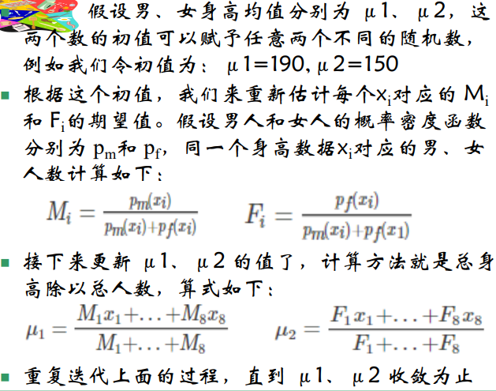

# 第五章 聚类（无监督学习）

## 聚类★★简答题

### 定义

把一组个体按照相似性归为若干类别。
聚类属于无监督学习（Unsupervised Learning）。

### 目的

使同一类别的个体之间的差别尽可能地小，不同类别上的个体间的差别尽可能地大

## 基本概念

* 在没有训练的条件下，把样本划分为若干类
* 无类别标签的样本
* 无监督学习★

## 评价准则

1. 类间距离大
2. 类内距离小

## 距离函数★

### 距离条件

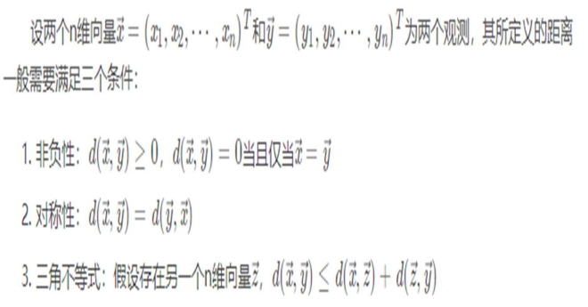

### 明可夫斯基距离

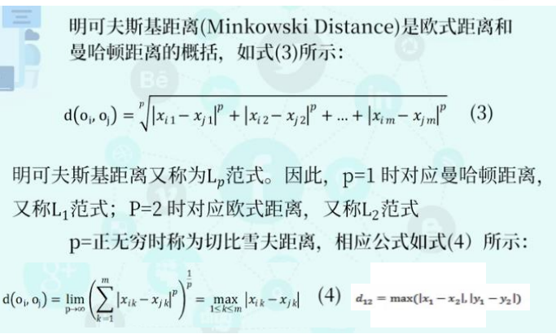

两种特殊情况：

#### 欧氏距离★

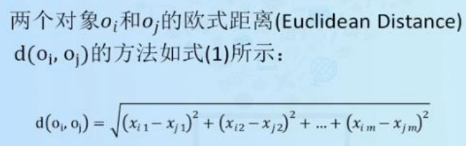

#### 曼哈顿距离★

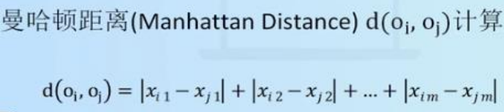

#### 切比雪夫距离

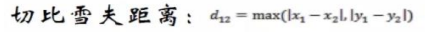

### 余弦相似度★

#### 余弦距离（二维）

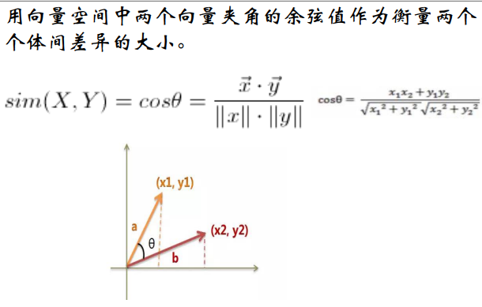

#### 余弦相似度（多维）

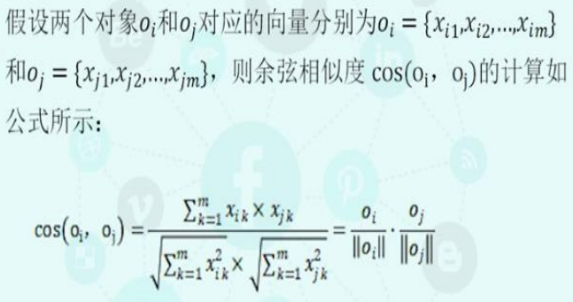

### Jaccard距离

处理集合，计算离散值距离（前面的距离函数都是计算连续值）

## k-means（划分聚类）★★

### 考点

会考到用哪种距离函数（看题目要求！）★★

### 算法描述★★

1. 给定集合D，有n个样本点
2. 随机指定k个点，作为k个子集的质心
3. 根据样本点与k个质心的距离远近，将每个样本点划归最近质心所在的子集
4. 对k个子集重新计算质心
5. 根据新的质心，重复操作3.
6. 重复操作4.和5.，直至结果足够收敛或者不再变化

### 伪代码★★（AB卷有一个考了）

算法5-1 k-means算法
输入：簇的数目k和包含n个对象的数据库。
输出：k个簇，使平方误差准则最小。

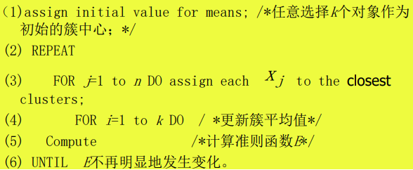

### 优缺点★★（AB卷有一个考了）

#### 主要优点

1. 是解决聚类问题的一种经典算法，简单、快速。
2. 对处理大数据集，该算法是相对可伸缩和高效率的。
3. 当结果簇是密集的，它的效果较好。

#### 主要缺点

1. 在簇的平均值被定义的情况下才能使用，可能不适用于某些应用。
2. 必须事先给出k（要生成的簇的数目），而且对初值敏感，对于不同的初始值，可能会导致不同结果。
3. 不适合于发现非凸面形状的簇或者大小差别很大的簇。 
3. 对于“噪声”和孤立点数据是敏感的

### 例题

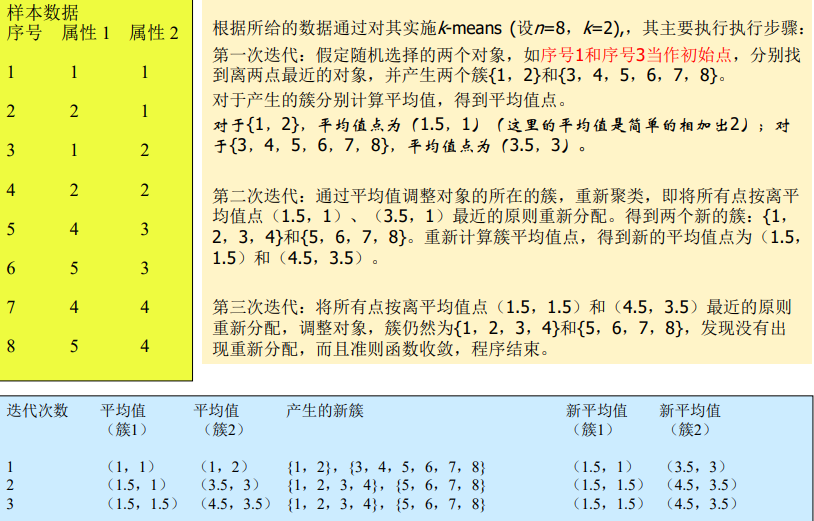

## K 中心点算法（k-medoid）★★

### 只考了简答题

### 定义★★（简答题）

K 中心点算法中，每次迭代后的质点都是从聚类的样本点中选取，
k中心点算法不采用簇中对象的平均值作为簇中心，而选用簇中**离平均值最近的对象**作为簇中心。
这样划分方法仍然是基于最小化所有对象与其参照点之间的相异度之和的原则来执行的。

### 例题

对下列表中的10个数据聚类， 每个数据的维度都为2 ， k=2。
c1=（3，4）， c2=（7，4）.（选出来的k个点使得cost最小[此处等于20]，而不是随机取的）
那么将所有点到这两点的距离（曼哈顿距离）计算出来：

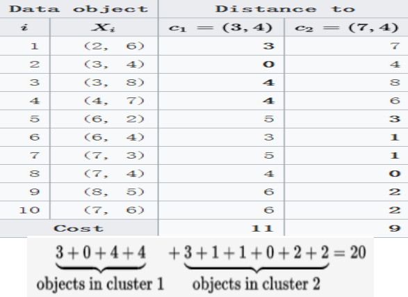

## AGNES（凝聚的层次聚类）★★

### 定义★★名词解释

AGNES (**AGglomerative NESting**)：自底向上凝聚的算法，先将每个对象作为一个簇，然后这些簇根据某些准则（类间距离最近的两个点）被一步步地合并，直到某个终结条件被满足（达到定义的簇的数目）。（写这些就够了）

两个簇间的相似度由这两个不同簇中**距离最近的数据点对**的相似度来确定。 

### 伪代码★★

算法5-3 AGNES（自底向上凝聚算法）
输入：包含n个对象的数据库，终止条件簇的数目k。 
输出：k个簇，达到终止条件规定簇数目。

1. 将每个对象当成一个初始簇；
2. REPEAT 
3.    根据两个簇中最近的数据点的距离找到最近的两个簇；
4.    合并两个簇，生成新的簇的集合；
5. UNTIL 达到定义的簇的数目；

### 例题

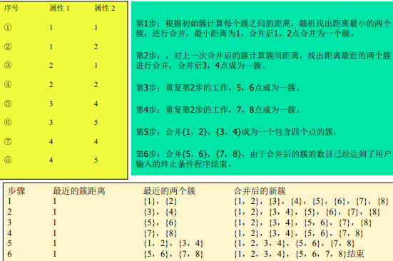

## DIANA（分裂的层次聚类）★★

### 考察方式：大题★

### 定义★★名词解释

DIANA (**Divisive ANAlysis**)：自顶向下分裂的算法，它首先将所有对象置于一个簇中，然后逐渐细分为越来越小的簇，直到达到了某个终结条件（达到了某个希望的簇数目，或两个最近簇之间的距离超过了某个阈值）。

### 伪代码★★大题

算法5-4 DIANA（自顶向下分裂算法）
输入：包含n个对象的数据库，终止条件簇的数目k。 
输出：k个簇，达到终止条件规定簇数目。

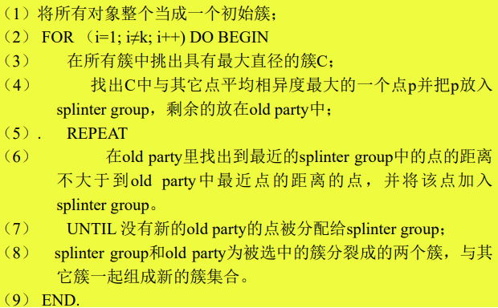

### 例题 5-4

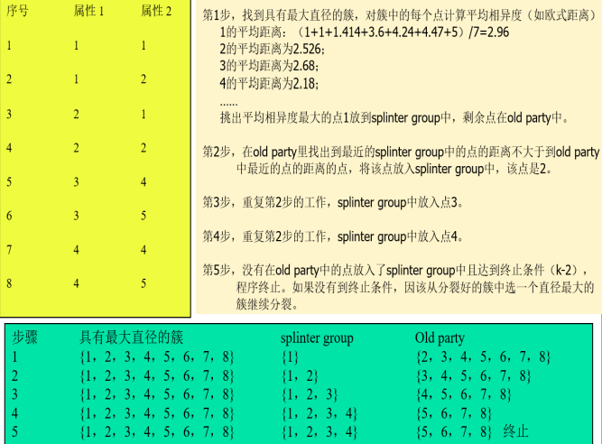

## DBSCAN★超级重点

### 考查方式：简答题、综合题共20分

### 噪声点

不包含在任何簇中的对象被认为是“噪声”。

### 边界点★

落在某个核心点的邻域内，是一个稠密区域边缘上的点。（非核心对象点）

### 定义★

DBSCAN（Density-Based Spatial Clustering of  Applications with Noise）：噪声环境下的密度聚类算法，将密度相连的点的最大集合聚成簇，并可在有“噪声”的空间数据库中发现任意形状的聚类。

### 特点

事先不知道会有多少个簇

### 相关概念

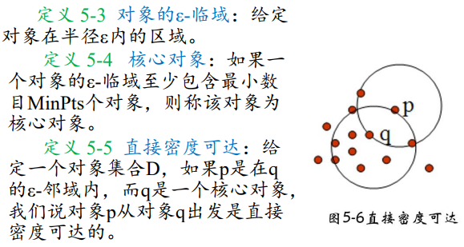

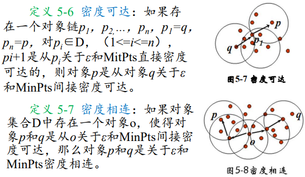

### 算法描述★★

如果一个点q的区域内包含多于Min Pts 个对象，则创建一个q作为核心对象的簇。然后，反复地从这些核心对象中寻找直接密度可达的对象，把一些密度可达簇进行合并。当没有新的点可以被添加到任何簇时，该过程结束。

核心思想：将密度相连的核心对象点都放在一个簇中。

### 伪代码（算法描述）★★10分

算法5-5 DBSCAN 
输入：包含n个对象的数据库，半径ε，最少数目MinPts。
输出：所有生成的簇，达到密度要求。

REPEAT
	从数据库中抽取一个未处理过的点；
	IF 抽出的点是核心点 THEN找出所有从该点密度可达的对象，形成一个簇
	ELSE 抽出的点是边缘点(非核心对象)，跳出本次循环，寻找下一点；
UNTIL 所有点都被处理；

### 优缺点★★简答题

#### 优点

1. 聚类速度快且能够有效处理噪声点和发现任意形状的空间聚类；
2. 与K-MEANS比较起来，不需要输入要划分的聚类个数；
3. 聚类簇的形状没有偏倚；
4. 对噪声数据不敏感。

#### 缺点

1. 当数据量增大时，要求较大的内存支持I/O消耗也很大；
1. 当空间聚类的密度不均匀、聚类间距差相差很大时，聚类质量较差，因为这种情况下参数MinPts和 $\epsilon$ 选取困难（对半径和Minpoints敏感）。 
1. 算法聚类效果依赖与距离公式选取， 实际应用中常用欧式距离，对于高维数据，存在“维数灾难”。

### 例题★

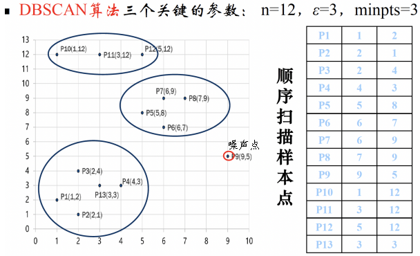

# 第六章 时间序列和序列模式挖掘

在本章中<a,b>与<b,a>不同，有时间先后之分

## 时间序列挖掘

类似关联规则挖掘

### 时间序列★★名词解释

时间序列（Time Series），从统计意义上来讲，时间序列是将某一指标在不同时间上的不同数值，按照时间先后顺序排列而成的数列。

### 什么是时间序列挖掘★★简答题

#### 定义

从大量的时间序列数据中提取人们事先不知道的、但又是潜在有用的与时间属性相关的信息和知识。

#### 作用★★

1. 用于短期、中期或长期预测， 指导人们的社会、经济、军事和生活等行为。
2. 通过对过去历史行为的客观记录分析，揭示其内在规律， 进而完成预测未来行为等决策性工作。
3. 通过研究信息的时间特性，深入洞悉事物进化的机制，是获得知识的有效途径。

# 第七章 Web挖掘技术

## Web挖掘的价值

1. 因特网（Web）上蕴藏着大量的信息 
2. 将Web上的丰富信息转变成有用的知识 
3. 对用户个性化挖掘与推荐

## Web挖掘的类型

1. Web内容挖掘（Web Content Mining）：对站点的Web页面的各类 信息进行集成、概化、分类等，挖掘某类信息所蕴含的知识模式。 
2.  Web访问信息挖掘（Web Usage Mining）：Web访问信息挖掘是对 用户访问Web时在服务器方留下的访问记录进行挖掘。通过分析日 志记录中的规律，可以识别用户的忠实度、喜好、满意度，可以 发现潜在用户，增强站点的服务竞争力。 
3. Web结构挖掘（Web Structure Mining）：Web结构挖掘是对Web页 面之间的链接结构进行挖掘。在整个Web空间里，有用的知识不仅 包含在Web页面的内容之中，而且也包含在页面的链接结构之中。 对于给定的Web页面集合，通过结构挖掘可以发现页面之间的关联 信息，页面之间的包含、引用或者从属关系等。

## Web挖掘的含义

是数据挖掘在Web上的应用，它利用数据挖掘技术从与WWW相关的资源和行为中抽取感兴趣的、有用的模式和隐含信息。

## Web挖掘的主要数据源★★

1. Web服务器**日志**数据
2. Web上的**电子商务**数据
3. Web上的**网页**
4. Web上的网页之间的**链接**
5. Web上的**多媒体**数据

## PageRank

### 页面等级（评级）的评价方法★

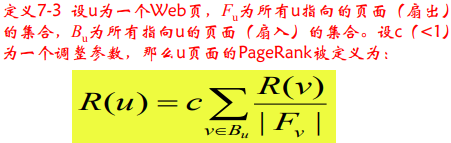

### PageRank的核⼼思想

1. 如果⼀个⽹⻚被很多其他⽹⻚链接到的话说话这个⽹⻚⽐较重要，也就是PageRank值会相对较⾼
2. 如果⼀个PageRank值很⾼的⽹⻚链接到⼀个其他的⽹⻚，那么被链接到的⽹⻚的PageRank值会相应地因此⽽提⾼。

### 简单pagerank模型（不考）

#### 例题

初始V0代表上网者一开始在哪个页面

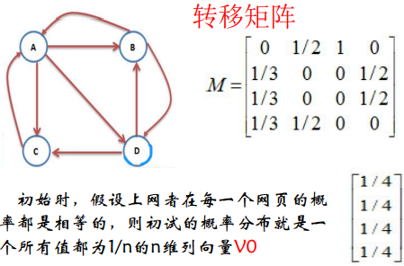

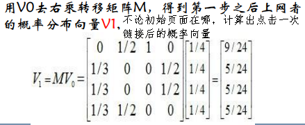

每用Vi右乘一次转移矩阵M，得到第i次点击链接后到达某一页面的概率

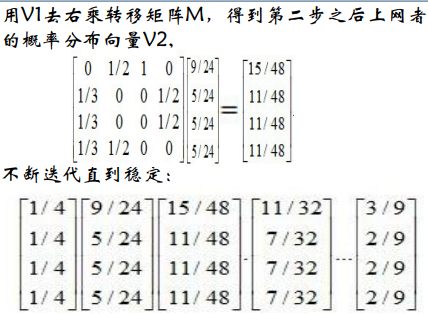

直到Vi稳定，代表不论用户从哪个页面开始访问，经过无数次点击超链接最终到达某个页面的概率，可以计算出某个页面排除了用户点击多少次超链接到达因素后的权重，比较客观。（个人理解）

#### 步骤

1. 计算每个网页一个PageRank（PR）值
2. 通过（投票）算法不断迭代，直至达到平稳分布为止。
3. 根据这个值的大小对网页的重要性进行排序。

### 基于随机冲浪的PageRank算法（考）

#### PPT例题

如果某个网页没有指向其它网页的超链接

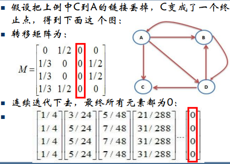

改进，加入一个系数，代表上网者多大概率 $\alpha$ 点击页面中的超链接，多大概率 $1-\alpha$ 在地址栏键入某个网页的链接。

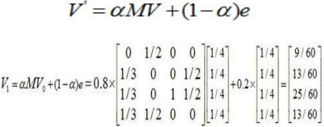

#### 书上例题 7-1

#### 定义★

#### 伪代码★★

算法7-3 基于随机冲浪的PageRank算法 
输入：页面链接网络G 
输出：页面等级值向量R

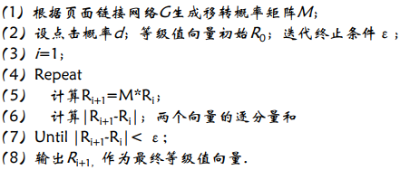

## HITS

### 定义

HITS（Hyperlink-Induced Topic Search）是遵照寻找权威 页面和中心页面的典型方法，基于一组给定的关键字，可 以找到相关的页面。

### 权威页面★★简答题

是指包含需求信息的最佳资源页面。是指与某个领域或者某个话题相关的高质量网页

### 中心页面★★简答题

是一个包含权威页面链接的页面。
