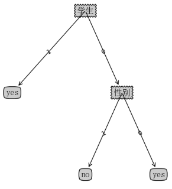

# 任务一 Apriori算法的编程实现

## 案例1：书上75页例子3-1

### 参数

| **输入参数：**             | **参数变量名**              | **值**                |
| -------------------------- | --------------------------- | --------------------- |
| 数据地址                   | file_path                   | data/data_in_book.txt |
| 最小支持度                 | min_support                 | 0.5                   |
| 最小置信度                 | min_confidence              | 0.8                   |
| 是否只求  最大频繁集的结果 | is_maximum_frequent_itemset | 1                     |

### 数据集

```
A,B,C,D
B,C,E
A,B,C,E
B,D,E
A,B,C,D
```

### 计算出的结果（仅输出最大频繁集中的强关联规则）

```
序号 	 Ik 	 Xm-1 	 置信度 	 支持度 	 规则
1 		 BCE 	 E 		 67 %	 40 %	 E → BC
2 		 BCE 	 CE 		 100 %	 40 %	 CE → B
3 		 BCE 	 BE 		 67 %	 40 %	 BE → C
4 		 ABCD 	 D 		 67 %	 40 %	 D → ABC
5 		 ABCD 	 A 		 67 %	 40 %	 A → BCD
6 		 ABCD 	 CD 		 100 %	 40 %	 CD → AB
7 		 ABCD 	 BD 		 67 %	 40 %	 BD → AC
8 		 ABCD 	 AD 		 100 %	 40 %	 AD → BC
9 		 ABCD 	 AC 		 67 %	 40 %	 AC → BD
10 		 ABCD 	 AB 		 67 %	 40 %	 AB → CD
11 		 ABCD 	 BCD 		 100 %	 40 %	 BCD → A
12 		 ABCD 	 ACD 		 100 %	 40 %	 ACD → B
13 		 ABCD 	 ABD 		 100 %	 40 %	 ABD → C
14 		 ABCD 	 ABC 		 67 %	 40 %	 ABC → D
```

### 参数

| **输入参数：**             | **参数变量名**              | **值**                         |
| -------------------------- | --------------------------- | ------------------------------ |
| 数据地址                   | file_path                   | data/data_in_excercice3.13.txt |
| 最小支持度                 | min_support                 | 0.5                            |
| 最小置信度                 | min_confidence              | 0.8                            |
| 是否只求  最大频繁集的结果 | is_maximum_frequent_itemset | 0                              |

### 计算出的结果（输出所有频繁项目集的强关联规则）

```
序号 	 Ik 	 Xm-1 	 置信度 	 支持度 	 规则
1 		 BC 	 B 		 80 %	 80 %	 B → C
2 		 BC 	 C 		 100 %	 80 %	 C → B
3 		 CD 	 D 		 67 %	 40 %	 D → C
4 		 AB 	 A 		 100 %	 60 %	 A → B
5 		 AB 	 B 		 60 %	 60 %	 B → A
6 		 AD 	 D 		 67 %	 40 %	 D → A
7 		 AD 	 A 		 67 %	 40 %	 A → D
8 		 BE 	 E 		 100 %	 60 %	 E → B
9 		 BE 	 B 		 60 %	 60 %	 B → E
10 		 CE 	 E 		 67 %	 40 %	 E → C
11 		 AC 	 A 		 100 %	 60 %	 A → C
12 		 AC 	 C 		 75 %	 60 %	 C → A
13 		 BD 	 D 		 100 %	 60 %	 D → B
14 		 BD 	 B 		 60 %	 60 %	 B → D
15 		 BCE 	 E 		 67 %	 40 %	 E → BC
16 		 BCE 	 BE 		 67 %	 40 %	 BE → C
17 		 BCE 	 CE 		 100 %	 40 %	 CE → B
18 		 ABC 	 A 		 100 %	 60 %	 A → BC
19 		 ABC 	 B 		 60 %	 60 %	 B → AC
20 		 ABC 	 C 		 75 %	 60 %	 C → AB
21 		 ABC 	 AB 		 100 %	 60 %	 AB → C
22 		 ABC 	 AC 		 100 %	 60 %	 AC → B
23 		 ABC 	 BC 		 75 %	 60 %	 BC → A
24 		 ACD 	 D 		 67 %	 40 %	 D → AC
25 		 ACD 	 A 		 67 %	 40 %	 A → CD
26 		 ACD 	 AD 		 100 %	 40 %	 AD → C
27 		 ACD 	 CD 		 100 %	 40 %	 CD → A
28 		 ACD 	 AC 		 67 %	 40 %	 AC → D
29 		 ABD 	 D 		 67 %	 40 %	 D → AB
30 		 ABD 	 A 		 67 %	 40 %	 A → BD
31 		 ABD 	 AD 		 100 %	 40 %	 AD → B
32 		 ABD 	 BD 		 67 %	 40 %	 BD → A
33 		 ABD 	 AB 		 67 %	 40 %	 AB → D
34 		 BCD 	 D 		 67 %	 40 %	 D → BC
35 		 BCD 	 BD 		 67 %	 40 %	 BD → C
36 		 BCD 	 CD 		 100 %	 40 %	 CD → B
37 		 ABCD 	 D 		 67 %	 40 %	 D → ABC
38 		 ABCD 	 A 		 67 %	 40 %	 A → BCD
39 		 ABCD 	 AD 		 100 %	 40 %	 AD → BC
40 		 ABCD 	 BD 		 67 %	 40 %	 BD → AC
41 		 ABCD 	 CD 		 100 %	 40 %	 CD → AB
42 		 ABCD 	 AB 		 67 %	 40 %	 AB → CD
43 		 ABCD 	 AC 		 67 %	 40 %	 AC → BD
44 		 ABCD 	 ABD 		 100 %	 40 %	 ABD → C
45 		 ABCD 	 ACD 		 100 %	 40 %	 ACD → B
46 		 ABCD 	 BCD 		 100 %	 40 %	 BCD → A
47 		 ABCD 	 ABC 		 67 %	 40 %	 ABC → D
```

## 案例2：书上116页习题三13题

### 参数

| **输入参数：**             | **参数变量名**              | **值**                     |
| -------------------------- | --------------------------- | -------------------------- |
| 数据地址                   | file_path                   | data/data/data_in_book.txt |
| 最小支持度                 | min_support                 | 0.5                        |
| 最小置信度                 | min_confidence              | 0.8                        |
| 是否只求  最大频繁集的结果 | is_maximum_frequent_itemset | 1                          |

### 数据集

```
a,c,d,e,f
b,c,f
a,d,f
a,c,d,e
a,b,d,e,f
```

### 计算出的结果（仅输出最大频繁集中的强关联规则）

```
序号 	 Ik 	 Xm-1 	 置信度 	 支持度 	 规则
1 		 ade 	 e 		 100 %	 60 %	 e → ad
2 		 ade 	 de 		 100 %	 60 %	 de → a
3 		 ade 	 ae 		 100 %	 60 %	 ae → d
4 		 adf 	 df 		 100 %	 60 %	 df → a
5 		 adf 	 af 		 100 %	 60 %	 af → d
```

### 参数

| **输入参数：**             | **参数变量名**              | **值**                         |
| -------------------------- | --------------------------- | ------------------------------ |
| 数据地址                   | file_path                   | data/data_in_excercice3.13.txt |
| 最小支持度                 | min_support                 | 0.5                            |
| 最小置信度                 | min_confidence              | 0.8                            |
| 是否只求  最大频繁集的结果 | is_maximum_frequent_itemset | 0                              |

### 计算出的结果（输出所有频繁项目集的强关联规则）

```
序号 	 Ik 	 Xm-1 	 置信度 	 支持度 	 规则
1 		 ad 	 a 		 100 %	 80 %	 a → d
2 		 ad 	 d 		 100 %	 80 %	 d → a
3 		 ae 	 e 		 100 %	 60 %	 e → a
4 		 de 	 e 		 100 %	 60 %	 e → d
5 		 adf 	 af 		 100 %	 60 %	 af → d
6 		 adf 	 df 		 100 %	 60 %	 df → a
7 		 ade 	 e 		 100 %	 60 %	 e → ad
8 		 ade 	 ae 		 100 %	 60 %	 ae → d
9 		 ade 	 de 		 100 %	 60 %	 de → a
```

## 代码

```python
import itertools


def load_data(file_path):
	"""
	加载数据集
	:param file_path: 文件路径
	:return:  data_list list类型
	"""

	data_list = []

	with open(file_path, encoding="utf-8") as f:
		for line in f:
			line = line.strip("\n")
			data_list.append(line.split(','))
	# print(data_list)
	return data_list


def data_2_index(data_set):
	"""
	把data_set中的字符串转为index
	:param data_set: 数据列表 list
	:return: data_set 数据列表 list
	"""
	# 把data_set拆包 然后取出其中的元素 通过set去重（无序） 得到所有样本的非重复集合
	items = set(itertools.chain(*data_set))
	# print(items)
	# 保存字符串到编号的映射
	str_2_index = {}
	# 保存编号到字符串的映射
	index_2_str = {}
	for index, item in enumerate(items):
		# print(index, '->', item)
		str_2_index[item] = index
		index_2_str[index] = item

	# print(str_2_index)
	# e.g: {'D': 0, 'E': 1, 'C': 2, 'A': 3, 'B': 4}

	# 把原来的矩阵中所有字符串转换为index
	for i in range(len(data_set)):
		for j in range(len(data_set[i])):
			data_set[i][j] = str_2_index[data_set[i][j]]

	# print(data_set)
	return data_set, index_2_str


def build_c1(data_set):
	"""
	创建候选1项集
	:param data_set: 数字化后的data_set
	:return: e.g:[frozenset({0, 45}), frozenset({1, 6})]
	"""
	# 把data_set中的元素（已转化为index）去重
	items = set(itertools.chain(*data_set))
	# print(items)
	# 用frozenset把项集装进新列表里
	"""
	Tips： 使用frozenset的原意是接下来的步骤需要使用items里的内容做key
	若直接将数字作为key的话也可以，但是后面还有生成二项集、三项集的操作，那就需要用list等来装，这样就不能作为key了
	
	即：
		my_dict = {}
		my_dict[frozenset([1, 2, 3])] = 2.2
		这个操作时可以的，打印my_dict是：{frozenset({1, 2, 3}): 2.2}
		
		my_dict = {}
		my_dict[[1, 2, 3]] = 2.2
		这个非操作是非法的，TypeError: unhashable type: 'list' 即list不能哈希
		
	
	当然，办法总比困难多，我试过将list转为str，将字符串作为key放入dict。这样也是可以，但是需要两个函数专门处理，
	并且这两个解析函数还需要根据不同的数据类型专门写。
	"""
	frozen_items = [frozenset(i) for i in enumerate(items)]
	# print(frozen_items)
	# e.g: [frozenset({0}), frozenset({1}), frozenset({2}), frozenset({3}), frozenset({4})]
	return frozen_items


def ck_2_lk(data_set, ck, min_support, no_frequent_set):
	"""
	根据候选k项集生成频繁k项集，依据min_support
	:param data_set: 数据集 list类型
	:param ck: 候选k项集 list类型，list装frozenset
	:param min_support: float 最小支持度
	:param no_frequent_set: 非频繁项目集
	:return: lk dict类型 频繁项目集
	"""

	# 频数字典 用来记录每个项集出现的频数
	support = {}
	# 用数据集的每一行跟候选项集的每个项对比，若该项集是其中子集，则+1，否则为0
	for item in ck:
		# print(item)
		# 判断集合item是否为集合row的子集
		flag = 0
		for i in no_frequent_set:
			# 非频繁项目集的超集也是非频繁项目集
			if i.issubset(item):
				flag = 1
				break
		# 剪枝
		if flag == 1:
			continue
		for row in data_set:
			# print(row)
			if item.issubset(row):
				# key -- 字典中要查找的键。
				# value -- 可选，如果指定键的值不存在时，返回该默认值。
				support[item] = support.get(item, 0) + 1
	# print(support)
	# 计算频率需要用到长度
	length = len(data_set)
	lk = {}
	for key, value in support.items():
		# print(key, value)
		percent = value / length
		# 频率大于最小支持度才能进入频繁项集
		if percent >= min_support:
			lk[key] = percent
		else:
			# 如果是非频繁项目集，记录之，包含其的子集都不用计算了
			no_frequent_set.append(key)
	return lk


def lk_2_ck_plus_1(lk):
	"""
	将频繁k项集（lk）两两组合转为候选k+1项集
	:param lk: 频繁k项集 dict
	:return: ck_plus_1
	"""
	lk_list = list(lk)
	# print(lk_list)

	# 保存组合后的k+1项集
	ck_plus_1 = set()
	lk_size = len(lk)
	# 若lk_size<=1则不需要再组合（最后一次）
	if lk_size > 1:
		# 获取频繁项集的长度
		k = len(lk_list[0])
		"""
		itertools.combinations(range(lk_size), 2) 相当于从lk_size中任选2个项集 i,j
		即c_n_2
		"""
		for i, j in itertools.combinations(range(lk_size), 2):
			# print(i, j)
			# 取并集
			t = lk_list[i] | lk_list[j]
			# print(lk_list[i],lk_list[j],t)
			# 两两组合后项集长度是k+1，否则不要
			if len(t) == k + 1:
				ck_plus_1.add(t)
	# print(t)
	# print(ck_plus_1)
	return ck_plus_1


def get_all_L(data_set, min_support):
	"""
	把所有的频繁项集拿到
	:param data_set: 数据
	:param min_support:  最小支持度
	:return:
	"""
	# 创建候选1项集
	c1 = build_c1(data_set)
	# print(c1)
	# 从候选1项集 到 频繁1项集（第一次不需要两两组合）
	no_frequent_set = []
	l1 = ck_2_lk(data_set, ck=c1, min_support=min_support, no_frequent_set=no_frequent_set)

	L = l1
	Lk = l1
	while len(Lk) > 0:
		lk_key_list = list(Lk.keys())
		# print(lk_key_list)

		# 频繁k 到 候选k+1 进行了两两组合
		ck_plus_1 = lk_2_ck_plus_1(lk_key_list)
		# 候选k 到 频繁k
		Lk = ck_2_lk(data_set, ck_plus_1, min_support, no_frequent_set)
		if len(Lk) > 0:
			# 把字典lk的键/值对更新到l
			L.update(Lk)
		else:
			break
	return L


def rules_from_item(item):
	"""
	将item两两组合，并返回其差集
	:param item: 所有关联规则中的一个键值对
	:return:
	"""
	# print(item)
	# 关联规则左边
	left = []
	for i in range(1, len(item)):
		"""
		若使用append 则会把combinations对象原封不动添加进列表里
		使用extend 则会把combinations对象拆包再添加到列表里
		combination对象是可以迭代的一个对象 combinations(item,1) = combinations((1,),(2,),(3,))
		"""
		# 将一个列表和数字 i 作为参数，并返回一个元组列表，每个元组的长度为 i，其中包含x个元素的所有可能组合。列表中元素不能与自己结合，不包含列表中重复元素
		left.extend(itertools.combinations(item, i))
	# left.append(itertools.combinations(item, i))

	# print(left)
	# difference()方法用于返回集合的差集。
	ans = [(frozenset(i), frozenset(item.difference(i))) for i in left]
	# print(ans)
	return ans


def rules_from_L(max_L, L, min_confidence):
	"""
	:param L: 所有关联规则（字典 frozenset为键，支持度为值）
	:param min_confidence:
	:return:
	"""
	# 保存所有候选的关联规则
	rules = []
	for Lk in max_L:
		# 频繁项集长度要大于1才能生成关联规则
		if len(Lk) > 1:
			# 用于在列表末尾一次性追加另一个序列中的多个值
			rules.extend(rules_from_item(Lk))
	result = []
	# print(rules)

	for left, right in rules:
		# left和right都是frozenset类型 二者可以取并集（分子 Ik） 然后L里去查询支持度
		support = L[left | right]
		# 置信度公式
		confidence = support / L[left]
		lift = confidence / L[right]
		if confidence >= min_confidence:
			result.append({"左": left, "右": right, "支持度": support, "置信度": confidence, "提升度": lift})
	return result


def return_2_str(index_2_str, result):
	"""
	把index转为具体商品名称
	:param index_2_str:  index：str 的dict
	:param result: 关联规则的list
	:return:
	"""
	for item in result:
		true_left = []
		true_right = []
		left = list(item['左'])
		for tem in left:
			true_left.append(index_2_str[tem])
		right = list(item['右'])
		for tem in right:
			true_right.append(index_2_str[tem])
		item['左'] = frozenset(true_left)
		item['右'] = frozenset(true_right)
	return result


def print_frozenset(fs):
	ans = []
	for i in fs:
		ans.append(i)

	return "".join(sorted(ans))


def get_maximum_frequent_itemset(L):
	"""
	求最大频繁项目集
	:param L:
	:return:
	"""

	max_L = {}
	for i in L:
		flag = 1
		for j in L:
			# 子集不能比本身长
			if len(i) >= len(j):
				continue
			# 是某个子集表示其不是最大频繁项目集
			if i.issubset(j):
				flag = 0
				break
		if flag == 1:
			# print(L[i])
			max_L[i] = L[i]
	# print(max_L)
	return max_L


if __name__ == '__main__':
	# 参数列表

	# 数据源
	# file_path = "data/data.txt"
	# # 最小支持度，需大于等于该值
	# min_support = 0.04
	# # 最小置信度
	# min_confidence = 0.06
	# file_path = "data/data_in_book.txt"
	# # 最小支持度，需大于等于该值
	# min_support = 0.4
	# # 最小置信度
	# min_confidence = 0.6
	file_path = "data/data_in_excercice3.13.txt"
	# 最小支持度，需大于等于该值
	min_support = 0.5
	# 最小置信度
	min_confidence = 0.8
	# 是否只求最大频繁集的结果
	is_maximum_frequent_itemset = 1

	# 加载数据
	data_set = load_data(file_path)
	# 把数据转为数字 方便比较计算
	data_set, index_2_str = data_2_index(data_set)

	# 得到所有频繁项目集
	L = get_all_L(data_set, min_support=min_support)

	if is_maximum_frequent_itemset:
		max_L = get_maximum_frequent_itemset(L)
		# print(max_L)
		# 仅算出最大频繁项目集的关联规则
		result = rules_from_L(max_L, L, min_confidence=min_confidence)
	else:
		# 得到所有关联规则
		result = rules_from_L(L, L, min_confidence=min_confidence)
	result = return_2_str(index_2_str, result)
	# print(result)

	print("序号", "\t", "Ik", "\t", "Xm-1", "\t", "置信度", "\t", "支持度", "\t",
	      "规则")
	index = 1
	for item in result:
		print(index, "\t\t", print_frozenset(item["左"] | item["右"]), "\t", print_frozenset(item["左"]), "\t\t",
		      round(item["置信度"] * 100), "%\t",
		      round(item["支持度"] * 100), "%\t",
		      print_frozenset(item["左"]), "→", print_frozenset(item["右"]))
		index += 1
```


# 任务二 KNN算法的编程实现

## 运行结果

```
{'矮': 3, '高': 0, '中等': 2}
KNN结果是： 矮
```

## 数据集（datingTestSet.txt）

```
1	1.5	矮
0	1.92	高
1	1.70	中等
1	1.73	中等
1	1.60	矮
0	1.75	中等
1	1.50	矮
0	1.60	矮
0	2.05	高
0	1.90	高
1	1.68	中等
0	1.78	中等
1	1.70	中等
1	1.68	中等
1	1.65	中等
```


## 代码

```python
import operator

import numpy
import pandas as pd
from numpy import tile


def read_data(file_path, header):
	"""
	读取数据集
	:param file_path: 文件路径
	:return: dating_data
	"""
	dating_data = pd.read_csv(file_path, delimiter="\t", names=header)  # 制表符为分隔符
	data = dating_data.iloc[:, :2]  # 数据信息，取所有的行，取前2列，存储内容第一列是序号，从0开始，接下来二列是从源数据中截取的
	target = dating_data.iloc[:, 2]  # 类别信息，取第3列（从1开始）
	return data, target


def to_normalize(data, header, sample):
	"""
	给数据做(0,1)归一化
	:param data: [1000,4]
	:return: data_normed
	"""

	# 取得data里的每个特征的最小值、最大值
	minVal = data.min(0)
	maxVal = data.max(0)
	# 各个特征的极差
	ranges = maxVal - minVal
	# print(ranges)
	# 使用numpy生成新矩阵，初始化为零矩阵
	new_matrix = numpy.zeros(shape=numpy.shape(data))  # [1000, 3]
	# 做(0,1)归一化
	for i in range(numpy.shape(data)[0]):  # 行数
		for j in range(numpy.shape(data)[1]):  # 列数
			new_matrix[i][j] = (data[header[j]][i] - minVal[j]) / ranges[j]
	# 将要分类的案例归一化
	for j in range(numpy.shape(data)[1]):  # 列数
		sample[j] = (sample[j] - minVal[j]) / ranges[j]
	return new_matrix, sample


def my_knn(data_normed, sample, labels, k=3):
	"""
	实现KNN算法
	:param data_normed: 归一化后的样本集
	:param sample: 需要predict的样本
	:param k: 最近的k个人
	:return: final_label
	"""
	# 通过sample数组构建[1000,3]矩阵，然后实现矩阵相减得到new_data_normed（两点距离差）
	new_data_normed = tile(sample, (data_normed.shape[0], 1)) - data_normed
	print(tile(sample, (data_normed.shape[0], 1)))
	# 计算欧氏距离
	double_matrix = new_data_normed ** 2
	double_distance = double_matrix.sum(axis=1)
	sqrt_distance = double_distance ** 0.5

	new_matrix = pd.DataFrame()
	new_matrix["distance"] = sqrt_distance
	new_matrix["label"] = labels
	# 排序
	new_matrix = new_matrix.sort_values(by=["distance"], ascending=True)
	# 取前k个
	final_matrix = new_matrix.iloc[:k, :]

	label_dict = {}

	for i in set(labels):
		label_dict[i] = 0

	# 计算距离最近的前k个数据中各种分类的情况
	for i in range(k):
		label_dict[final_matrix.iloc[i]["label"]] += 1

	print(label_dict)
	sorted_label = sorted(label_dict.items(), key=operator.itemgetter(1), reverse=True)
	return sorted_label[0][0]


if __name__ == '__main__':
	file_path = "./dataset/bookTestSet.txt"
	# 表头
	header = ["性别", "身高", "类别"]
	# 男0 女1
	# 需要预测的一组数据
	sample = [1, 1.5]
	data, target = read_data(file_path, header)

	data_normed, sample = to_normalize(data, header, sample)
	print(data_normed)  # 打印0,1归一化后的矩阵信息
	label = my_knn(data_normed, sample, target, k=5)
	print("KNN结果是：", label)
```


# 任务三 ID3算法的编程实现

## 运行结果截图



## 数据集（example.csv）

```
性别,学生,民族
1,1,0,yes
0,0,0,yes
1,1,0,yes
1,1,0,yes
1,0,0,no
1,0,1,no
```


## 代码

### 主程序

```python
# -*- coding: UTF-8 -*-
from math import log
import operator
import plot_decision_tree

"""
函数说明:计算给定数据集的经验熵(香农熵)
Parameters:
    dataSet - 数据集
Returns:
    shannonEnt - 经验熵(香农熵)
"""


def calcShannonEnt(dataSet):
	numEntires = len(dataSet)  # 返回数据集的行数
	labelCounts = {}  # 保存每个标签(Label)出现次数的字典
	for featVec in dataSet:  # 对每组特征向量进行统计
		currentLabel = featVec[-1]  # 提取标签(Label)信息
		if currentLabel not in labelCounts.keys():  # 如果标签(Label)没有放入统计次数的字典,添加进去
			labelCounts[currentLabel] = 0
		labelCounts[currentLabel] += 1  # Label计数
	shannonEnt = 0.0  # 经验熵(香农熵)
	for key in labelCounts:  # 计算香农熵
		prob = float(labelCounts[key]) / numEntires  # 选择该标签(Label)的概率
		shannonEnt -= prob * log(prob, 2)  # 利用公式计算
	return shannonEnt  # 返回经验熵(香农熵)


"""
函数说明:按照给定特征划分数据集
Parameters:
    dataSet - 待划分的数据集
    axis - 划分数据集的特征
    value - 需要返回的特征的值
"""


def splitDataSet(dataSet, axis, value):
	retDataSet = []  # 创建返回的数据集列表
	for featVec in dataSet:  # 遍历数据集
		if featVec[axis] == value:
			reducedFeatVec = featVec[:axis]  # 去掉axis特征
			reducedFeatVec.extend(featVec[axis + 1:])  # 将符合条件的添加到返回的数据集
			retDataSet.append(reducedFeatVec)
	return retDataSet  # 返回划分后的数据集


"""
函数说明:选择最优特征
Parameters:
    dataSet - 数据集
Returns:
    bestFeature - 信息增益最大的(最优)特征的索引值
"""


def chooseBestFeatureToSplit(dataSet):
	numFeatures = len(dataSet[0]) - 1  # 特征数量
	baseEntropy = calcShannonEnt(dataSet)  # 计算数据集的香农熵
	bestInfoGain = 0.0  # 信息增益
	bestFeature = -1  # 最优特征的索引值
	for i in range(numFeatures):  # 遍历所有特征
		# 获取dataSet的第i个所有特征
		featList = [example[i] for example in dataSet]
		uniqueVals = set(featList)  # 创建set集合{},元素不可重复
		newEntropy = 0.0  # 经验条件熵
		for value in uniqueVals:  # 计算信息增益
			subDataSet = splitDataSet(dataSet, i, value)  # subDataSet划分后的子集
			prob = len(subDataSet) / float(len(dataSet))  # 计算子集的概率
			newEntropy += prob * calcShannonEnt(subDataSet)  # 根据公式计算经验条件熵
		infoGain = baseEntropy - newEntropy  # 信息增益
		print("第%d个特征的增益为%.3f" % (i, infoGain))  # 打印每个特征的信息增益
		if (infoGain > bestInfoGain):  # 计算信息增益
			bestInfoGain = infoGain  # 更新信息增益，找到最大的信息增益
			bestFeature = i  # 记录信息增益最大的特征的索引值
	return bestFeature  # 返回信息增益最大的特征的索引值


"""
函数说明:统计classList中出现此处最多的元素(类标签)
Parameters:
    classList - 类标签列表
Returns:
    sortedClassCount[0][0] - 出现此处最多的元素(类标签)
"""


def majorityCnt(classList):
	classCount = {}
	for vote in classList:  # 统计classList中每个元素出现的次数
		if vote not in classCount.keys():
			classCount[vote] = 0
		classCount[vote] += 1
	sortedClassCount = sorted(classCount.items(), key=operator.itemgetter(1), reverse=True)  # 根据字典的值降序排序
	return sortedClassCount[0][0]  # 返回classList中出现次数最多的元素


"""
函数说明:递归构建决策树
Parameters:
    dataSet - 训练数据集
    labels - 分类属性标签
    featLabels - 存储选择的最优特征标签
Returns:
    myTree - 决策树
"""


def createTree(dataSet, labels, featLabels):
	classList = [example[-1] for example in dataSet]  # 取分类标签(是否放贷:yes or no)
	if classList.count(classList[0]) == len(classList):  # 如果类别完全相同则停止继续划分
		return classList[0]
	if len(dataSet[0]) == 1:  # 遍历完所有特征时返回出现次数最多的类标签
		return majorityCnt(classList)
	bestFeat = chooseBestFeatureToSplit(dataSet)  # 选择最优特征
	bestFeatLabel = labels[bestFeat]  # 最优特征的标签
	featLabels.append(bestFeatLabel)
	myTree = {bestFeatLabel: {}}  # 根据最优特征的标签生成树
	del (labels[bestFeat])  # 删除已经使用特征标签
	featValues = [example[bestFeat] for example in dataSet]  # 得到训练集中所有最优特征的属性值
	uniqueVals = set(featValues)  # 去掉重复的属性值
	for value in uniqueVals:
		subLabels = labels[:]
		# 递归调用函数createTree(),遍历特征，创建决策树。
		myTree[bestFeatLabel][value] = createTree(splitDataSet(dataSet, bestFeat, value), subLabels, featLabels)
	return myTree


"""
函数说明:使用决策树执行分类
Parameters:
    inputTree - 已经生成的决策树
    featLabels - 存储选择的最优特征标签
    testVec - 测试数据列表，顺序对应最优特征标签
Returns:
    classLabel - 分类结果
"""


def classify(inputTree, featLabels, testVec):
	firstStr = next(iter(inputTree))  # 获取决策树结点
	secondDict = inputTree[firstStr]  # 下一个字典
	featIndex = featLabels.index(firstStr)
	for key in secondDict.keys():
		if testVec[featIndex] == key:
			if type(secondDict[key]).__name__ == 'dict':
				classLabel = classify(secondDict[key], featLabels, testVec)
			else:
				classLabel = secondDict[key]
	return classLabel


def createDataSet(file_path):
	"""
	加载数据集
	:param file_path: 文件路径
	:param line: 读多少行，0代表都读，1代表只读取表头
	:return:  data_list list类型
	"""

	labels = []
	dataSet = []
	i = 1
	with open(file_path, encoding="utf-8") as f:
		for line in f:
			line = line.strip("\n")
			if i == 1:
				labels = line.split(',')
			else:
				dataSet.append(line.split(','))
			i = i + 1
	return dataSet, labels  # 返回数据集和分类属性


if __name__ == '__main__':
	path = "./dataSet/example.csv"
	dataSet, labels = createDataSet(path)
	featLabels = []
	myTree = createTree(dataSet, labels, featLabels)
	print(myTree)

	plot_decision_tree.createPlot(myTree)
```

### 绘图程序

```python
import matplotlib.pyplot as plt
from matplotlib.font_manager import FontProperties
from matplotlib.font_manager import FontProperties
import matplotlib.pyplot as plt

# 定义文本框和箭头格式
decisionNode = dict(boxstyle='sawtooth', fc='0.8')
leafNode = dict(boxstyle='round4', fc='0.8')
arrow_args = dict(arrowstyle='<-')
# 设置中文字体
font = FontProperties(fname=r"c:\windows\fonts\simsun.ttc", size=14)

"""
函数说明:获取决策树叶子结点的数目
Parameters:
    myTree - 决策树
Returns:
    numLeafs - 决策树的叶子结点的数目
"""


def getNumLeafs(myTree):
	numLeafs = 0  # 初始化叶子
	# python3中myTree.keys()返回的是dict_keys,不在是list,所以不能使用myTree.keys()[0]的方法获取结点属性，
	# 可以使用list(myTree.keys())[0]
	firstStr = next(iter(myTree))
	secondDict = myTree[firstStr]  # 获取下一组字典
	for key in secondDict.keys():
		if type(secondDict[key]).__name__ == 'dict':  # 测试该结点是否为字典，如果不是字典，代表此结点为叶子结点
			numLeafs += getNumLeafs(secondDict[key])
		else:
			numLeafs += 1
	return numLeafs


"""
函数说明:获取决策树的层数
Parameters:
    myTree - 决策树
Returns:
    maxDepth - 决策树的层数
"""


def getTreeDepth(myTree):
	maxDepth = 0  # 初始化决策树深度
	# python3中myTree.keys()返回的是dict_keys,不在是list,所以不能使用myTree.keys()[0]的方法获取结点属性，
	# 可以使用list(myTree.keys())[0]
	firstStr = next(iter(myTree))
	secondDict = myTree[firstStr]  # 获取下一个字典
	for key in secondDict.keys():
		if type(secondDict[key]).__name__ == 'dict':  # 测试该结点是否为字典，如果不是字典，代表此结点为叶子结点
			thisDepth = 1 + getTreeDepth(secondDict[key])
		else:
			thisDepth = 1
		if thisDepth > maxDepth:
			maxDepth = thisDepth  # 更新层数
	return maxDepth


"""
函数说明:绘制结点
Parameters:
    nodeTxt - 结点名
    centerPt - 文本位置
    parentPt - 标注的箭头位置
    nodeType - 结点格式
"""


def plotNode(nodeTxt, centerPt, parentPt, nodeType):
	arrow_args = dict(arrowstyle="<-")  # 定义箭头格式
	font = FontProperties(fname=r"c:\windows\fonts\simsun.ttc", size=14)  # 设置中文字体
	createPlot.ax1.annotate(nodeTxt, xy=parentPt, xycoords='axes fraction',  # 绘制结点
	                        xytext=centerPt, textcoords='axes fraction',
	                        va="center", ha="center", bbox=nodeType, arrowprops=arrow_args, fontproperties=font)


"""
函数说明:标注有向边属性值
Parameters:
    cntrPt、parentPt - 用于计算标注位置
    txtString - 标注的内容
"""


def plotMidText(cntrPt, parentPt, txtString):
	xMid = (parentPt[0] - cntrPt[0]) / 2.0 + cntrPt[0]  # 计算标注位置
	yMid = (parentPt[1] - cntrPt[1]) / 2.0 + cntrPt[1]
	createPlot.ax1.text(xMid, yMid, txtString, va="center", ha="center", rotation=30)


"""
函数说明:绘制决策树
Parameters:
    myTree - 决策树(字典)
    parentPt - 标注的内容
    nodeTxt - 结点名
"""


def plotTree(myTree, parentPt, nodeTxt):
	decisionNode = dict(boxstyle="sawtooth", fc="0.8")  # 设置结点格式
	leafNode = dict(boxstyle="round4", fc="0.8")  # 设置叶结点格式
	numLeafs = getNumLeafs(myTree)  # 获取决策树叶结点数目，决定了树的宽度
	depth = getTreeDepth(myTree)  # 获取决策树层数
	firstStr = next(iter(myTree))  # 下个字典
	cntrPt = (plotTree.xOff + (1.0 + float(numLeafs)) / 2.0 / plotTree.totalW, plotTree.yOff)  # 中心位置
	plotMidText(cntrPt, parentPt, nodeTxt)  # 标注有向边属性值
	plotNode(firstStr, cntrPt, parentPt, decisionNode)  # 绘制结点
	secondDict = myTree[firstStr]  # 下一个字典，也就是继续绘制子结点
	plotTree.yOff = plotTree.yOff - 1.0 / plotTree.totalD  # y偏移
	for key in secondDict.keys():
		if type(secondDict[key]).__name__ == 'dict':  # 测试该结点是否为字典，如果不是字典，代表此结点为叶子结点
			plotTree(secondDict[key], cntrPt, str(key))  # 不是叶结点，递归调用继续绘制
		else:  # 如果是叶结点，绘制叶结点，并标注有向边属性值
			plotTree.xOff = plotTree.xOff + 1.0 / plotTree.totalW
			plotNode(secondDict[key], (plotTree.xOff, plotTree.yOff), cntrPt, leafNode)
			plotMidText((plotTree.xOff, plotTree.yOff), cntrPt, str(key))
	plotTree.yOff = plotTree.yOff + 1.0 / plotTree.totalD


"""
函数说明:创建绘制面板
Parameters:
    inTree - 决策树(字典)
"""


def createPlot(inTree):
	fig = plt.figure(1, facecolor='white')  # 创建fig
	fig.clf()  # 清空fig
	axprops = dict(xticks=[], yticks=[])
	createPlot.ax1 = plt.subplot(111, frameon=False, **axprops)  # 去掉x、y轴
	plotTree.totalW = float(getNumLeafs(inTree))  # 获取决策树叶结点数目
	plotTree.totalD = float(getTreeDepth(inTree))  # 获取决策树层数
	plotTree.xOff = -0.5 / plotTree.totalW
	plotTree.yOff = 1.0  # x偏移
	plotTree(inTree, (0.5, 1.0), '')  # 绘制决策树
	plt.show()
```


# 任务四 朴素贝叶斯算法的编程实现

## 运行结果

```
['0', '0', '1', '1', '1', '0', '1', '0', '1', '1', '1', '1', '1', '0'] {'0', '1'}
--------------------------------------------------
0 num = 5
P(Y = 0) = 0.35714285714285715
特征0 num = 3
条件概率 = 0.6
特征1 num = 2
条件概率 = 0.4
特征1 num = 1
条件概率 = 0.2
特征0 num = 2
条件概率 = 0.4
P(X|Y= 0)P(Y= 0) = 0.006857142857142858
--------------------------------------------------
1 num = 9
P(Y = 1) = 0.6428571428571429
特征0 num = 2
条件概率 = 0.2222222222222222
特征1 num = 4
条件概率 = 0.4444444444444444
特征1 num = 6
条件概率 = 0.6666666666666666
特征0 num = 6
条件概率 = 0.6666666666666666
P(X|Y= 1)P(Y= 1) = 0.02821869488536155
**************************************************
预测类 为 = 1
```

## 数据集

```
age,income,student,credit_rating,buys_computer
0,2,0,0,0
0,2,0,1,0
1,2,0,0,1
2,1,0,0,1
2,0,1,0,1
2,0,1,1,0
1,0,1,1,1
0,1,0,0,0
0,0,1,0,1
2,1,1,0,1
0,1,1,1,1
1,1,0,1,1
1,2,1,0,1
2,1,0,1,0
```

## 代码

```python
# 统计yi的个数
def typeCount(typeList, t):
	cnt = 0
	for tL in typeList:
		if tL == t:
			cnt += 1
	return cnt


# 计算Y=-1或1的条件下，X等于某值 个数
def featCount(dataSet, i, feat, y):
	cnt = 0
	# print(i, feat, y)
	for row in dataSet:
		if row[i] == feat and row[-1] == y:
			cnt += 1
	return cnt


def calcBayes(dataSet, X):
	lenDataSet = len(dataSet)
	typeList = [row[-1] for row in dataSet]
	typeSet = set(typeList)  # 类别集合
	print(typeList, typeSet)

	pList = []  # 记录预计 各类类别 概率
	for t in typeSet:
		print('-' * 50)
		yNum = typeCount(typeList, t)  # 计算yi的个数
		print(f'{t} num =', yNum)
		py = yNum / lenDataSet
		print(f'P(Y = {t}) =', py)
		pSum = py
		# 对每个特征分量计数
		for i in range(len(X)):
			xiNum = featCount(dataSet, i, X[i], t)  # 统计Y条件下 Xi取相应特征 的数量
			print(f'特征{X[i]} num =', xiNum)
			# 条件概率P{X = xi | Y = yi}
			pxy = xiNum / yNum
			print(f'条件概率 =', pxy)
			pSum *= pxy
		print(f'P(X|Y= {t})P(Y= {t}) =', pSum)
		pList.append(pSum)
	# print(pList)
	return pList, typeSet


# 就是找最大的概率，记录下标
def predict(pList, typeList):
	for i in range(len(pList)):
		if pList[i] == max(pList):
			print('*' * 50)
			print(f'预测类为 = {typeList[i]}')
			return


def createDataSet(file_path):
	"""
	加载数据集
	:param file_path: 文件路径
	:param line: 读多少行，0代表都读，1代表只读取表头
	:return:  data_list list类型
	"""

	labels = []
	dataSet = []
	i = 1
	with open(file_path, encoding="utf-8") as f:
		for line in f:
			line = line.strip("\n")
			if i == 1:
				labels = line.split(',')
			else:
				dataSet.append(line.split(','))
			i = i + 1
	return dataSet, labels  # 返回数据集和分类属性


if __name__ == '__main__':
	path = "./data/book_p139.csv"
	X = ['0', '1', '1', '0']
	dataSet, labels = createDataSet(path)
	pList, typeSet = calcBayes(dataSet, X)
	predict(pList, list(typeSet))
```


# 任务五 K-Means算法的编程实现

## 运行结果截图


## 数据集

```
1,1,1
2,2,1
3,1,2
4,2,2
5,4,3
6,5,3
7,4,4
8,5,4
```


## 代码

```c++
#include <bits/stdc++.h>

using namespace std;

vector<vector<int> > sample;
//表格大小
int row = 0;
int column;

struct group {
    vector<double> avg;//簇每个属性的平均值
    vector<int> ids;//簇的成员id
    void cal_avg(int field_num) {
        //序号不求平均值
        for (int i = 1; i < field_num; i++)
        {
            double ans = 0;
            for (int j = 0; j < ids.size(); j++)
            {
                ans += sample[ids[j]-1][i];
            }
            avg.push_back(ans / ids.size());
        }
    }
};

vector<group> get_new_groups(vector<group>& old_groups, bool &flag) {
    vector<group> new_groups;
    for (int i = 0; i < old_groups.size(); i++)
    {
        group t;
        new_groups.push_back(t);
    }

    //每次取一个样本，分别计算其和各个簇的距离，最近的就把这个样本id放到那个簇里面去

    //依次计算每个属性离哪个中心点最近，把它放在最近中心点的簇中
    for (int i = 0; i < row; i++)
    {
        int min_distance = INT_MAX;
        int target_groups=-1;
        for (int k = 0; k < old_groups.size(); k++)
        {
            int t_distance = 0;
            //序号不计算
            for (int j = 1; j < column; j++)
            {
                //欧氏距离
                t_distance += pow(abs(sample[i][j] - old_groups[k].avg[j - 1]), 2);
            }
            if (min_distance > t_distance)
            {
                min_distance = t_distance;
                //应该分到哪一类
                target_groups = k;
            }
        }
        //避免了序号的重复
        new_groups[target_groups].ids.push_back(sample[i][0]);
    }

    for (int i = 0; i < new_groups.size(); i++) {
        new_groups[i].cal_avg(column);
    }

    for (int i = 0; i < new_groups.size(); i++) {
        int len = new_groups[i].avg.size(),j;
        //判断质心是否移动
        for (j = 0; j < len; j++)
        {
            if (new_groups[i].avg[j]!=old_groups[i].avg[j])
            {
                flag = false;
                break;
            }
        }
        if (j== len)
        {
            flag = true;
        }
        else
        {
            flag = false;
            break;
        }
    }

    old_groups.clear();
    return new_groups;
}

void print_head(vector<group> old_groups) {
    //打印
    string blank = "";
    cout << "迭代次数\t";
    for (int i = 1; i <= old_groups.size(); i++)
    {
        cout << "平均值（簇" << i << "）\t";
    }
    for (int i = 0; i < row / 2; i++)
    {
        blank += ' ';
    }
    cout << blank << "产生的新簇" << blank << endl;
}

void print_content(vector<group> current_groups,int &id) {
    cout << id << "\t\t";
    //打印平均值
    for (int i = 0; i < current_groups.size(); i++)
    {
        int length = current_groups[i].avg.size();
        cout << "(" << current_groups[i].avg[0];
        for (int j = 1; j < length - 1; j++)
        {
            cout << "," << current_groups[i].avg[j];
        }
        cout << "," << current_groups[i].avg[length - 1] << ")\t";
    }

    //打印簇
    for (int i = 0; i < current_groups.size(); i++)
    {
        cout << "{";
        int length = current_groups[i].ids.size();
        for (int j = 0; j < length - 1; j++) {
            cout << current_groups[i].ids[j] << ",";
        }
        cout << current_groups[i].ids[length - 1];
        if (i != current_groups.size() - 1)
        {
            cout << "},";
        }
        else
        {
            cout << "}";
        }
    }
    cout << endl;
    id++;
}

int main()
{
    string path = "data.csv";//书P178
    //string path = "data1.csv";
    //string path = "data2.csv";
    ifstream inFile(path, ios::in);
    if (!inFile)
    {
        cout << "打开文件失败！" << endl;
        exit(1);
    }
    string line;
    string field;
    while (getline(inFile, line))//getline(inFile, line)表示按行读取CSV文件中的数据
    {
        sample.push_back(vector<int>());
        string field;
        istringstream sin(line); //将整行字符串line读入到字符串流sin中
        while (getline(sin, field, ',')) {//将字符串流sin中的字符读入到field字符串中，以逗号为分隔符 
            sample[row].push_back(atoi(field.c_str()));
        }
        row++;
    }
    inFile.close();
    column = sample[0].size();

    for (int i = 0; i < row; i++)
    {
        for (int j = 0; j < sample[i].size(); j++)
        {
            cout << sample[i][j] << " ";
        }
        cout << endl;
    }

    //组数
    int k;
    cout << "请输入要分多少组：\n";
    cin >> k;
    while (k > row) {
        cout << "组数不合法";
        cin >> k;
    }
    vector<group> old_groups;

    set<int> initial;//初始各个簇随机放一个id [1,row]
    srand(time(0));
    while (initial.size()!=k)
    {
        int id = rand() % row + 1;
        initial.insert(id);
    }

    //待删除
    //initial.clear();
    //initial.insert(1);
    //initial.insert(3);

    for (set<int>::iterator i = initial.begin(); i!=initial.end(); i++)
    {
        group t;
        t.ids.push_back(*i);
        t.cal_avg(column);
        old_groups.push_back(t);
    }
    print_head(old_groups);
    int id = 1;
    print_content(old_groups, id);

    //第二次及以后迭代
    //返回的是new_groups
    bool flag = false;
    while (!flag)
    {
        old_groups = get_new_groups(old_groups,flag);
        print_content(old_groups, id);
    }

    return 0;
}
```

# 任务六 Agnes算法的编程实现

## 运行结果截图


## 数据集（dataset.csv）

```
1,1
1,2
2,1
2,2
3,4
3,5
4,4
4,5
```

## 代码

```python
# -*- coding:utf-8 -*-

import math
import pylab as pl


# 计算欧几里得距离,a,b分别为两个元组
def dist(a, b):
	return math.sqrt(math.pow(a[0] - b[0], 2) + math.pow(a[1] - b[1], 2))


# dist_min
def dist_min(Ci, Cj):
	return min(dist(i, j) for i in Ci for j in Cj)


# dist_max
def dist_max(Ci, Cj):
	return max(dist(i, j) for i in Ci for j in Cj)


# dist_avg
def dist_avg(Ci, Cj):
	return sum(dist(i, j) for i in Ci for j in Cj) / (len(Ci) * len(Cj))


# 找到距离最小的下标
def find_Min(M):
	min = 1000
	x = 0
	y = 0
	for i in range(len(M)):
		for j in range(len(M[i])):
			if i != j and M[i][j] < min:
				min = M[i][j]
				x = i
				y = j
	return (x, y, min)


# 算法模型：
def AGNES(dataset, dist, k):
	# 初始化C和M
	C = []  # 初始簇
	M = []
	for i in dataset:
		Ci = []
		Ci.append(i)
		C.append(Ci)
	for i in C:
		Mi = []
		for j in C:
			Mi.append(dist(i, j))
		M.append(Mi)
	q = len(dataset)
	# 合并更新
	while q > k:
		x, y, min = find_Min(M)
		C[x].extend(C[y])
		C.remove(C[y])
		M = []
		for i in C:
			Mi = []
			for j in C:
				Mi.append(dist(i, j))
			M.append(Mi)
		q -= 1
	return C


# 画图
def draw(C):
	colValue = ['r', 'y', 'g', 'b', 'c', 'k', 'm']
	for i in range(len(C)):
		coo_X = []  # x坐标列表
		coo_Y = []  # y坐标列表
		for j in range(len(C[i])):
			coo_X.append(C[i][j][0])
			coo_Y.append(C[i][j][1])
		pl.scatter(coo_X, coo_Y, marker='x', color=colValue[i % len(colValue)], label=i)

	pl.legend(loc='upper right')
	pl.show()


def load_data(file_path):
	"""
	加载数据集
	:param file_path: 文件路径
	:return:  dataset list类型
	"""

	dataset = []

	with open(file_path, encoding="utf-8") as f:
		for line in f:
			line = line.strip("\n")
			t = []
			for i in line.split(','):
				t.append(float(i))
			dataset.append(t)
	return dataset


if __name__ == "__main__":
	file_path = "./dataset/dataset.csv"
	category = 2
	dataset = load_data(file_path)
	C = AGNES(dataset, dist_max, category)
	draw(C)
```

# 任务七 DBSCAN算法的编程实现

## 运行结果截图

### 数据集一


### 数据集二


## 数据集

### 数据集一（book_p191.txt）

```
1,0
4,0
0,1
1,1
2,1
3,1
4,1
5,1
0,2
1,2
4,2
1,3
```

### 数据集二（788points.txt）

```
15.55,28.65
14.9,27.55
14.45,28.35
14.15,28.8
13.75,28.05
13.35,28.45
13,29.15
13.45,27.5
13.6,26.5
12.8,27.35
12.4,27.85
12.3,28.4
12.2,28.65
13.4,25.1
12.95,25.95
12.9,26.5
11.85,27
11.35,28
11.15,28.7
11.25,27.4
10.75,27.7
10.5,28.35
9.65,28.45
10.25,27.25
10.75,26.55
11.7,26.35
11.6,25.9
11.9,25.05
12.6,24.05
11.9,24.5
11.1,25.2
10.55,25.15
10.05,25.95
9.35,26.6
9.3,27.25
9.2,27.8
7.5,28.25
8.55,27.45
8.5,27.05
8.05,27.2
7.85,26.8
7.3,27.4
6.8,26.85
7,26.5
7.55,26.3
8.55,26.3
9,25.85
8.6,25.65
9.4,25.55
8.45,25.05
8.85,24.6
9.65,24.7
10.55,24.35
11.05,23.9
10.55,23.55
9.45,23.35
9.2,23.9
8.35,23.9
7.35,24.75
7.4,25.45
6.6,25.75
6.1,26
5.8,26.95
5.65,25.8
5.3,26.1
6.4,25.4
5.4,25.25
5.35,24.7
4.8,25.05
4.2,25.55
6.4,24.8
6.55,24.3
7.4,24.25
5.45,24.2
4.3,24
4,24.25
3.35,23.3
4.85,23.05
4.3,22.75
5.85,23.4
5.9,23.55
7.55,23.7
6.85,23.25
7.65,23.1
6.95,22.55
6.1,22.6
5.5,22.6
4.7,22.1
3.8,21.85
4.65,21.2
4.15,20.35
5.3,20.4
5.6,20.75
5.8,21.95
6.4,21.95
6.55,21.15
7.45,21.95
7.4,21.55
7.75,21.2
7.65,20.65
6.95,19.8
6.6,20.1
6.05,20.2
5.4,19.65
5.35,19.05
5.8,18.25
6.3,19.1
7,18.9
7.15,17.9
7.35,18.2
8.2,20.05
8.3,19.45
8.3,18.5
8.75,18.8
9.05,18.2
9.35,17.7
8.9,17.65
8.45,17.2
10.05,17.2
10.4,16.75
8.6,20.9
8.65,21.3
8.65,21.9
8.65,22.5
8.95,22.8
9.95,22.65
8.95,22.2
9.65,21.9
10.55,22.3
10.9,22.85
11.35,23.45
12.05,23.4
12.3,22.75
11.7,22.15
11.15,22.05
10.85,21.5
10.85,21.05
9.6,21.3
9.85,20.7
9.35,20.6
9.25,19.65
9.95,19.8
10.7,20.35
11.3,20.7
12.35,21.6
13.1,21.3
12.85,20.75
12,20
11,19.85
10.35,19
9.9,18.65
10.6,18.15
11.4,18.3
11.4,19.25
12.35,18.8
12.8,19.75
12.15,18.1
11.05,17.5
11.95,17.25
12.25,17.5
13.05,17.4
13.75,18.15
13.5,18.65
13.65,19.25
14,19.9
15.2,18.2
15.5,17.15
13.9,17.1
13.75,16.6
12.15,16.4
7.8,13.7
8.85,13.35
9,12.7
9.7,12.1
8.05,12.9
7.7,13.25
6.8,13.2
6.6,13.45
6.2,12.55
5.4,12.85
5.7,12.25
5.2,11.9
5.15,11.35
5.85,11.2
6.1,11.75
7,12.35
7.05,12.45
7.9,12.5
8.55,12.1
7.85,11.85
7.1,11.95
6.9,11.5
6.85,10.9
6.4,10.7
5.9,10.3
6.4,10.25
7.05,10.05
7.35,10.5
7.65,11.1
8.1,11.2
8.8,11.4
8.3,10.55
9,10.9
9.35,10.5
10.15,11
10.4,10.55
10.9,10
11.55,10.2
11.75,10.85
10.1,8.65
11.05,9.1
11.85,9.8
12.85,10.65
12.9,11.7
13.6,11.1
14.05,11.75
14.5,11.8
14.3,12.45
17,12.9
15.8,12.6
15.85,12
16.7,12.2
16.25,11.7
15.55,11.15
14.8,11.35
14.45,10.75
13.75,10.45
12.8,10.1
13.15,9.8
12.45,9.3
11.8,8.95
11.1,8.45
10.35,7.7
10.1,6.75
11.3,7.95
12.35,8.45
13.1,8.95
13.2,9.35
14.1,10.05
11.5,7.5
11.35,6.9
11.95,6.75
12.4,7.1
12.25,7.6
12.95,7.6
13.45,7.95
13.35,8.25
13.75,9
14.3,9.3
14.85,9.55
15.1,10.25
15.45,10.55
16.35,10.85
16.75,11.5
16.25,10.2
15.4,10.1
15.45,9.7
15.15,9.3
15.25,8.65
15.55,8.2
14.25,8.7
14.25,8.25
15.05,7.8
14.3,7.5
13.55,7.45
14.3,6.95
13.95,6.7
13.05,6.95
13.05,6.2
11.55,6.3
10.8,5.85
10.6,5.05
11.35,5.55
12.15,5.4
12.4,5.8
12.8,5.7
13.65,5.9
13.9,5.3
13.1,5.1
12.55,4.9
11.5,4.75
11.35,4.05
12.4,4.35
11.75,3.45
12.65,3.7
13.4,4.35
13.9,4.95
12.75,3
13.55,3.15
13.7,3.65
14.1,4.1
14.65,5.05
14.35,5.75
14.5,6.55
15.15,7.1
13.6,2.55
14.45,2.4
14.6,3.05
15,3.4
15.25,3.5
14.7,4.1
14.7,4.5
15.25,2.7
15.65,2.05
15.95,2.8
16.1,3.55
15.9,4
15.6,4.75
15.55,5.05
15.35,5.5
15.15,5.95
15.5,6.75
15.7,6.35
16.2,5.9
16.35,5.35
16.2,4.55
16.55,4.2
16.95,4.75
17.05,5.1
17.3,4.8
17.3,4.15
17.6,4.3
17.05,3.7
17.25,3.05
16.65,2.8
16.55,2.15
17.2,2.05
18.15,1.95
18.05,2.45
18.15,3.05
18.6,3.45
18.4,3.6
18.85,3.2
19.1,2.65
19.45,2.65
19,2.1
19.9,2.05
20.45,2.8
19.8,3.25
19.45,3.9
18.65,4.2
18.4,4.6
18.65,4.75
18.75,5.15
19.1,4.55
17.9,5.4
17.65,5.7
17.05,6.05
17.4,6.5
16.6,6.85
15.7,7.15
15.75,7.75
16.6,7.95
20.4,3.4
20.7,3.45
21.15,2.85
21.75,2.65
22,3.25
22.2,3.5
21.45,3.75
21.1,4.05
20.15,4.3
20.8,4.7
20.7,5.15
19.75,5.05
19.85,5.5
20.4,5.65
20.55,5.75
18.7,5.75
19.25,5.95
18.4,6
18.45,6.6
17.65,7.05
16.7,7.4
18.65,7.3
18.05,7.35
17.85,7.75
17.5,8.25
17.15,8.6
17.05,9
16.4,8.7
16.05,8.95
16.05,9.6
16.5,9.75
17.25,9.6
17.6,9.9
17.8,9.3
18,8.55
18.8,8.1
18.8,8.35
19.4,7.6
19.25,6.6
20.05,6.95
19.8,7.5
20.05,6.35
21.15,5.7
21.65,4.85
22.15,4.35
23.05,3.35
23.05,3.8
23.15,4.4
22.5,4.75
22.15,5.2
24.15,4.55
23.5,5.05
23.1,5.3
23,5.75
22.2,5.75
21.85,6.2
20.75,6.55
21,7.15
20.75,7.65
20,8.2
19.5,8.65
18.85,9.05
18.75,9.55
18.6,10
16.95,10.35
17.35,10.85
18,10.65
18.5,10.55
18.1,11.1
17.55,11.3
17.95,11.9
18.3,12
18,12.5
19,11.65
19.5,11.05
19.45,10.55
19.4,9.65
20.1,9.4
20.05,9.95
20.05,10.2
19.35,12.2
19.2,12.25
20.05,11.6
20.6,11.15
20.7,10.65
21.3,11.65
21.8,11.15
21.85,10.7
21.65,10.05
20.95,10.2
20.9,9.7
21.65,9.45
21.2,9.25
20.75,8.75
20.55,8.75
21.1,8
21.65,8.65
21.75,8.2
21.95,7.55
22,6.75
22.8,6.45
22.65,6.65
22.75,7.05
23,7.35
22.55,7.9
22.2,8.7
22.9,8.45
22.35,9.2
22.75,9.35
22.4,10.05
23.05,10.9
23.3,9.85
23.95,9.8
23.65,9.1
23.7,8.85
24.25,8.25
24.85,7.95
23.5,7.85
23.85,7.35
23.95,6.9
23.65,6.5
23.6,5.7
24.3,5.65
24.8,6.4
34.05,3.5
33.05,3.85
32,3.8
31.9,4.4
31.05,4.75
30.4,5.65
30.75,6.1
30,6.7
30.1,7.4
29.5,8.15
30.75,8
30.85,7.35
31.5,6.75
31.75,5.95
32.35,6.45
32.8,6
32.05,5.1
32.8,4.8
32.65,4.4
33.65,4.6
33.05,5.15
33.6,5.45
34.5,5.05
34.9,4.65
35.45,4.1
34.6,4.05
34.2,4.2
36.3,5.2
35.55,5.35
35.95,6.05
34.8,5.85
33.7,6.15
33.95,6.6
33.7,7.05
32.75,7.1
32.3,7.65
33,7.9
31.95,8.15
31.15,8.65
30.35,8.85
29.85,9
30.7,9.15
29.7,9.9
30.45,9.95
30.95,9.85
31.8,9.45
32.45,8.8
33.55,8.6
34.35,7.7
34.7,8
34.6,7.25
35,6.8
35.5,7.35
36.1,7.5
36.55,7
36,8.2
35.35,8.05
36.55,8.65
36.4,9.1
35.5,9.1
34.55,8.85
35.25,9.4
34.4,9.5
33.5,9.3
33.85,9.8
32.5,9.65
32.3,10.25
33.3,10.3
31.6,10.5
30.6,10.5
30.4,11.1
30.9,11.45
30.7,11.65
30.4,12.05
31.2,12
31.95,11.35
31.65,11.05
32.95,11.15
32.65,11.7
32.25,12.25
32.05,12.25
31.3,12.7
31.95,12.95
32.75,13.1
33.15,13.2
33.1,12.75
33.15,12.1
34.3,11.75
34,10.85
34.65,11
34.8,10.1
35.65,9.85
36.35,10
35.55,10.75
35.8,11.55
35.2,11.75
34.7,11.75
34.95,12.75
34.05,12.55
34.05,13.05
33.25,13.7
33.2,14.15
33.25,14.7
33,15.15
32.95,15.65
32.6,16.15
32.45,16.75
32.65,17.05
32.75,17.3
31.75,17.2
31.7,17.65
31,17.5
31.15,17.9
30.45,18.05
30.05,18.8
30.55,18.8
30.5,19.3
30.25,19.4
29.6,19.85
29.15,20.55
30.25,20.45
30.7,20.05
31,19.9
31.55,19.65
31.5,18.55
32.05,18.6
31.95,19.1
32.6,18.35
32.85,17.95
33.45,17.45
33.7,17
34.25,17.35
34.3,18.05
33.85,18.4
33.05,18.85
33.25,18.95
32.8,19.15
32.3,19.85
32.8,20
31.75,20.25
31.75,20.75
32.1,21.15
31.55,21.6
30.65,21.3
29.95,21.6
29.5,21.6
30.35,22.05
31.05,22
31.55,22.2
30.95,22.65
30.3,23.1
29.6,23.15
29.35,22.55
29.2,23.85
30.75,24
30.95,24.15
31.45,23.7
31.95,23.15
32.55,22.05
32.6,22.55
33.25,22.25
33.65,21.9
33.5,21.3
33.1,20.75
33.8,20.4
33.85,20
34.15,19.3
34.85,18.85
35.3,18.55
35.4,19.35
34.55,19.75
35.05,20
35.95,19.85
36.35,20.6
35.5,20.55
34.45,20.65
34.4,21.25
35,21.05
35.75,21.3
35.05,21.5
34.6,22.05
34.2,21.75
36.25,21.95
35.7,22.3
35.5,22.9
35.85,23.25
36.3,23.8
35.45,24.1
34.9,23.5
34.2,22.9
33.85,23.3
33.25,23.35
32.45,23.7
33.6,23.9
34.25,23.95
34.25,24.1
35.4,24.7
35.15,25.3
34.4,24.9
33.7,24.85
32.25,24.45
32.5,24.7
31.45,24.45
31.55,25.2
31.05,25
30.25,24.3
29.8,24.8
29.6,25.5
29.7,26.05
30.5,25.5
30.65,26
31.25,26.05
31.45,26.95
30.75,26.9
30.65,27.15
31.25,27.85
31.85,27.75
32.7,28.2
33.25,27.55
32.4,27.1
32.15,26.65
32.35,25.95
32.95,25.5
33.85,26.05
33.05,26.5
33.65,27
34.1,27.35
34.2,27.95
34.65,26.85
35.25,26
35.7,26.15
34.4,25.6
21.3,20.8
20.15,20.9
19.2,21.35
19.1,21.85
18.45,22.8
18.75,22.95
19.4,23
19.55,22.25
19.8,21.85
20.5,21.85
21.45,21.45
21.7,21.9
21.4,22.3
21,22.6
21.15,22.95
20.5,22.85
19.75,23.65
19.2,23.7
18.45,24.35
20.65,23.85
20.65,24.3
19.7,24.6
20.15,25.05
22.15,25.1
21.6,24.65
21.7,23.8
21.9,23.65
22.55,23.5
22.55,24.3
23.3,24.45
24.25,24.35
23.8,25.25
23.4,23.8
22.9,23.2
22.3,22.8
22.2,22.4
23.1,21.7
22.85,21.9
22.65,21.1
23.15,22.6
24.1,21.9
24.7,22.2
24.3,22.6
24.15,23.3
23.9,23.45
5.2,2.15
6.35,1.95
6.75,2.3
5.9,2.4
5.4,2.7
4.85,2.9
4.85,3.35
5.15,3.45
5.7,3.45
6.2,3
6.2,3.2
7.65,2.15
7.2,2.75
6.75,3.2
6.75,3.55
6.65,3.8
5.8,4
4.95,4.05
5.1,4.35
5.7,4.45
5.45,4.85
6.7,4.8
6.55,5.05
7.2,4.9
6.2,4.25
7.1,4.3
7.85,4.5
7.6,4.15
7.25,3.55
7.8,3.35
8.05,2.75
8.5,3.25
8.1,3.55
8.15,4
```

## 代码

```python
import matplotlib.pyplot as plt
import random
import numpy as np
import math

list_1 = []
list_2 = []


# 数据集一：随机生成散点图, 参数为点的个数
def scatter(num):
	for i in range(num):
		x = random.randint(0, 100)
		list_1.append(x)
		y = random.randint(0, 100)
		list_2.append(y)
	print(list_1)
	print(list_2)
	data = list(zip(list_1, list_2))
	print(data)
	plt.scatter(list_1, list_2)
	plt.show()
	return data


def dataSet1(num, Eps, MinPts):
	# 数据集一：随机生成散点图, 参数为点的个数
	dataSet = scatter(num)
	C = dbscan(dataSet, Eps, MinPts)
	print(C)
	x = []
	y = []
	for data in dataSet:
		x.append(data[0])
		y.append(data[1])
	plt.figure(figsize=(8, 6), dpi=80)
	plt.scatter(x, y, c=C, marker='o')
	plt.show()


def loadDataSet(fileName, splitChar='\t'):
	dataSet = []
	with open(fileName) as fr:
		for line in fr.readlines():
			curline = line.strip().split(splitChar)
			fltline = list(map(float, curline))  # 将字符串转换成浮点数
			dataSet.append(fltline)
	return dataSet


# 计算两个点之间的欧式距离，参数为两个元组
def dist(t1, t2):
	dis = math.sqrt((np.power((t1[0] - t2[0]), 2) + np.power((t1[1] - t2[1]), 2)))
	# print("两点之间的距离为："+str(dis))
	return dis


# dis = dist((1,1),(3,4))
# print(dis)


# DBSCAN算法，参数为数据集，Eps为指定半径参数，MinPts为制定邻域密度阈值
# 数据集二：788个点
def dbscan(Data, Eps, MinPts):
	num = len(Data)  # 点的个数
	# print("点的个数："+str(num))
	unvisited = [i for i in range(num)]  # 没有访问到的点的列表
	# print(unvisited)
	visited = []  # 已经访问的点的列表
	C = [-1 for i in range(num)]
	# C为输出结果，初始时是一个长度为所有点的个数的值全为-1的列表。之后修改点对应的索引的值来设置点属于哪个簇。
	# 用k来标记不同的簇，k = -1表示噪声点
	k = -1
	# 如果还有没访问的点
	while len(unvisited) > 0:
		# 随机选择一个unvisited对象
		p = random.choice(unvisited)
		# 每次访问一个点，unvisited列表remove该点，visited列表append该点，以此来实现点的标记改变。
		unvisited.remove(p)
		visited.append(p)
		# N为p的epsilon邻域中的对象的集合
		N = []
		for i in range(num):
			# 计算epsilon邻域中的对象的个数
			if (dist(Data[i], Data[p]) <= Eps):  # and (i!=p):
				N.append(i)
		# 如果p的epsilon邻域中的对象数大于指定阈值，说明p是一个核心对象
		if len(N) >= MinPts:
			k = k + 1  # 簇编号加一
			# print(k)
			C[p] = k
			# 对于p的epsilon邻域中的每个对象pi，将其加入p的簇中
			for pi in N:  # 深度优先搜索，一次找出某一个核心对象的所有密度可达点（好像广度优先会更合理？不过这样与原算法定义有差异）
				if pi in unvisited:
					unvisited.remove(pi)
					visited.append(pi)
					# 找到核心对象p的邻域中的对象pi
					# M是位于pi的邻域中的核心对象点的列表
					M = []
					for j in range(num):
						if (dist(Data[j], Data[pi]) <= Eps):  # and (j!=pi):
							M.append(j)
					if len(M) >= MinPts:
						for t in M:
							if t not in N:
								N.append(t)  # 将核心对象p领域内的核心对象加到N末尾，起到每次找出所有直接密度可达的点
				# 若pi不属于任何簇，C[pi] == -1说明C中第pi个值没有改动
				if C[pi] == -1:
					C[pi] = k
		# 如果p的epsilon邻域中的对象数小于指定阈值，说明p是一个噪声点
		else:
			C[p] = -1

	return C


def dataSet2(dataSet, Eps, MinPts):
	C = dbscan(dataSet, Eps, MinPts)
	print(C)
	x = []
	y = []
	for data in dataSet:
		x.append(data[0])
		y.append(data[1])
	plt.figure(figsize=(8, 6), dpi=80)
	plt.scatter(x, y, c=C, marker='o')
	plt.show()


if __name__ == '__main__':
	# dataSet1(1000, 10, 5)
	# dataSet2(loadDataSet('788points.txt', splitChar=','), 2, 14)
	dataSet2(loadDataSet('book_p191.txt', splitChar=','), 1, 4)
```

