[TOC]

# 前言

1. 本笔记与书

   > [汇编语言程序设计/刘慧婷，王庆生主编.--2版.--北京：人民邮电出版社，2017.1](https://weread.qq.com/web/reader/45332550720f0547453f722kc81322c012c81e728d9d180)（提醒：该电子书有的空格是全角空格，粘贴程序代码的时候务必注意！）

   配套

2. [建议参考lyf巨佬的复习资料](https://github.com/Lyfive/HnusterComputer)

2. Typora打开（[github传送门](https://github.com/3210448723/DocumentForHnustExam/tree/main/%E6%B1%87%E7%BC%96%E8%AF%AD%E8%A8%80/%E5%A4%87%E8%80%83%E7%AC%94%E8%AE%B0)）

3. 自己根据考试重点总结的，不保证全，不保证对，以老师PPT和电子书为主，辅以自己的魔改

4. ★自认为比较重要的

4. 求大佬指正与完善Orz

# 重点汇总

## 第一章

1. 机器语言与汇编的关系
2. 汇编语言的组成、编译、实现步骤

## 第二章

1. 计算机的组成（寄存器的组成)
2. 寄存器作用

## 第三章

1. 编写代码的步骤
2. 常用DOS功能调用（1 2 7 9 A)（int 21H）

## 第四章

1. 寻址方式，每一种寻址方式怎么做
2. 注意每一种寻址方式能与哪些寄存器搭配

## 第五章

1. 都掌握，程序题
2. 跟地址计算获取有关的

## 第六章

1. 伪指令，知道程序结构的框架，段地址赋值，不要求写子程序（有类似6.1的题目）
2. 存储、内存分配相关
3. 数据定义
4. 算内存偏移量

## 第七章

1. 3个编程程序
2. 程序填空

# 题型

1. 简答
2. 计算
3. 程序填空
4. 画图
5. 编程（最起码框架要写出来）
6. 讨论题（自由发挥)。

# 第1章 汇编语言基础知识

## ASCII码

* 记牢几个常用的十六进制，\$ 24H
* 理解 回车换行（Carriage-Return Line-Feed）
  * 回车（13，0DH）（转义序列\r），将光标移动到当前行的开头（改变横坐标）
  * 换行（10，0AH）（转义序列\n），将光标移动到下一行的当前位置（改变纵坐标）
  * 深入理解：CR 代表“回车”——CR 控制字符将打印头（“回车”）返回到第 0 列，而无需推进纸张。 LF 代表“换行”——LF 控制字符在不移动打印头的情况下将纸张前进一行。因此，如果您想将打印头返回到第 0 列（准备打印下一行）并推进纸张（以便在新纸上打印），则需要 CR 和 LF。

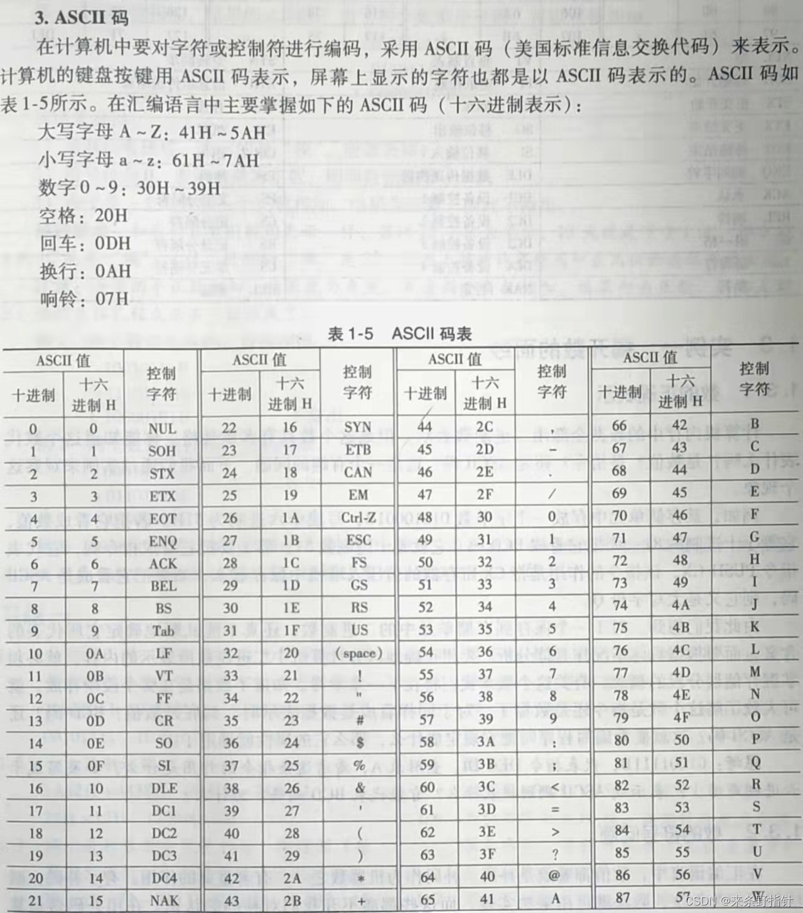


## 计算机程序设计语言分类★

1. 低级语言

  * 机器语言（Machine Language）

     * 计算机硬件直接识别和执行的程序设计语言。

     * 二进制编码的机器指令，即编码中只含二进制0或1，由计算机直接记忆、传输、识别和加工。

     * 被称为**第一代语言**，复杂难记，依赖于具体的机型。程序编写难度极大，调试修改困难，可移植性差。

  * 汇编语言（Assembly Language）
       * 一种面向机器的用**符号表示**的程序设计语言，也叫符号语言。
       * 和机器语言不同的是，汇编语言用直观、便于记忆和理解的英文单词或缩写符号（**助记符**）来表示指令和数据变量（助记符编写）
       * **要翻译**成**机器语言**程序才可以由计算机执行
       * 被称为**第二代语言**。

2. 高级语言（High Level Language）
   * 被称为第三代语言/算法语言。

## 汇编语言由以下三类指令组成★

（1）汇编指令：机器码的**助记符**，**有**对应的**机器码**。

（2）伪指令：由**编译器执行**，**没有**对应的机器码。

（3）其他符号：如+、-、*、/等，由**编译器识别**，**没有**对应的机器码。

## 汇编语言优缺点

### 优点

1. 直接控制计算机硬件部件，程序效率高，执行速度快，内存占用小
2. 可以编写在“时间”和“空间”两方面最有效的程序
3. 可以与高级语言配合使用（c/c++），应用广泛
4. 语言直接、简洁

### 缺点

1. 面向机器的低级语言，可移植性差
2. 编写繁琐，调试、维护、交流和移植困难
3. 受指令的限制

## 汇编

汇编语言源程序翻译成机器语言程序的过程。

## 汇编语言组成★

汇编指令：机器码的助记符，有对应的机器码。它是汇编语言的核心。

伪指令：没有对应的机器码，由编译器执行，计算机并不执行。

宏指令：是源程序中一段有独立功能的程序代码。

## 汇编程序与汇编源程序区别

汇编程序：特指将汇编源程序**翻译**成机器语言程序（目标程序）的编译程序。

汇编源程序：用汇编语言**编写的**程序。

## 为什么要学习汇编语言？★

1. 汇编语言程序是用符号指令写成的，本质上还是机器语言，与具体的**硬件密切相关**，可以**直接有效**地控制计算机硬件，程序运行速度快，程序短小精悍，占用内存少，在某些**特殊**应用**场合**更能发挥作用。如：智能化仪表，家用电器，实时控制系统，单片机控制，病毒研究等。
2. 学习汇编语言是从**根本上**认识和理解**计算机工作过程和原理**的最好方法。

# 第2章 计算机基本原理

## 冯诺依曼原理的计算机结构


计算机的基本工作原理：**存储程序**和**程序控制**，称为冯诺依曼原理

 冯诺依曼结构：主要由中央处理器（CPU），存储器（Memory）和输入/输出(I/O)子系统组成，用系统总线（Bus）连接在一起。

## 8086/8088内部结构

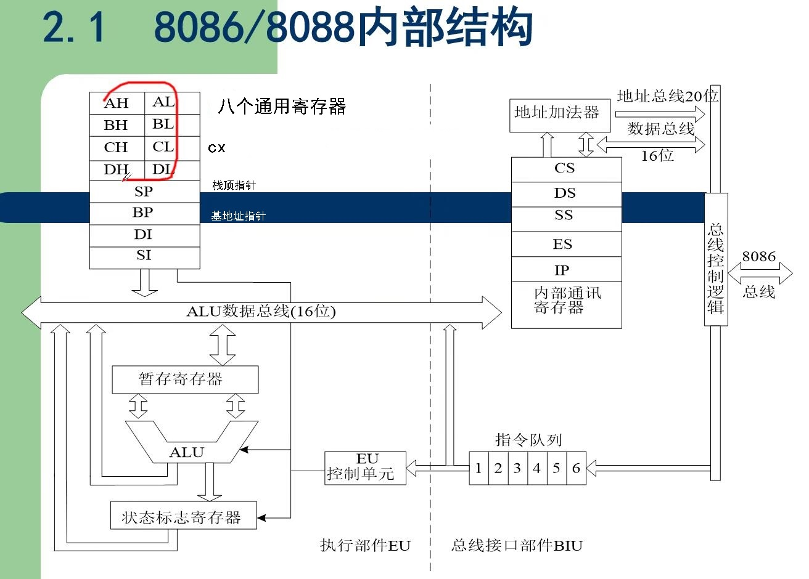

## 8086的结构特征：

1. 数据总线为16位；
2. 运算器一次最多可以处理16位的数据；
3. 寄存器的最大宽度为16位；
4. 寄存器和运算器之间的通路为16位

## 16位机的各类寄存器★

### 通用数据寄存器： Ax , Bx , Cx , DX 

8086 CPU的所有寄存器都是16位的，可以存放两个字节。AX、BX、CX、DX这4个通用数据寄存器通常用来存放一般性的数据，有时候也可以存放地址，被称为。

①AX：累加器，算术运算主要寄存器，有些指令规定必须使用它。

②BX：基址寄存器，除了存放数据，它经常用来存放一段内存的起始偏移地址。

③CX：计数寄存器，除了存放数据，它经常用来存放重复操作的次数。

④DX：数据寄存器，除了存放数据，它有时存放32位数据的高16位。

### 地址寄存器

16位的8086处理器有4个16位的通用地址寄存器。它们的主要作用是存放数据的所在**偏移地址**，也可以存放**数据**。这4个寄存器不能再拆分使用。

①SP：堆栈指针，这是一个专用的寄存器，存放堆栈栈顶的偏移地址。

②BP：基址指针，可以用来存放内存中数据的偏移地址。

③SI：源变址寄存器，它经常用来存放内存中源数据区的偏移地址，所谓变址寄存器，是指在某些指令作用下它可以自动地递增或递减其中的值。

④DI：目的变址寄存器，它经常用来存放内存中目的数据区的偏移地址，并在某些指令作用下可以自动地递增或递减其中的值。

### 段寄存器

16位80x86处理器有4个16位的段寄存器，分别命名为CS，SS，DS，ES。它们用来存放4个段的段基址。 

①CS：代码段寄存器，用来存放当前正在执行的程序段的段基址。

②SS：堆栈段寄存器，用来存放堆栈段的段基址。

③DS：数据段寄存器，用来存放数据段段基址。

④ES：附加段寄存器，用来存放另一个数据段的段基址。 

### 段的类型

代码段：用于存放指令，代码段段基址存放在段寄存器CS

数据段：用于存放数据，数据段段基址段地址存放在段寄存器DS

附加段：用于辅助存放数据，附加段段基址存放在段寄存器ES

堆栈段：是重要的数据结构，可用来保存数据、地址和系统参数，堆栈段段基址存放在段寄存器SS

### 专用寄存器

1. IP：指令指针寄存器，存放下一条指令的偏移地址。

2. Flags 标志寄存器，又称程序状态寄存器。它是存放cpu标志的寄存器。

   * 状态标志：反映处理器当前的状态，如有无溢出，有无进位等。状态标志有6个：CF、PF、AF、ZF、SF和OF

     
   
     1. OF：溢出标志。
        * 含义
          * OF=l表示两个有符号数的运算结果超出了可以表示的范围，结果是错误的；
          * OF=0表示没有溢出，结果正确。
        * 注意：进行无符号数运算时也会产生新的 OF 标志（CPU 不知道处理对象是否为有符号数），此时程序员可以不关心OF标志。
        * 公式：OF= $c_{n} \oplus c_{n-1}$ 
        * =1情况：正数相加得负数，或者负数相加得正数，或者正数减负数得负数，或者负数减正数得正数。
     2. DF：方向标志。DF=0时，每次执行字符串指令后，源或目的地址指针用**加法**自动修改地址；DF=l时用**减法**来修改地址。它用来控制地址的变化方向。
     3. IF：中断允许标志。IF=l 表示允许处理器响应可屏蔽中断请求信号，称为开中断，IF=0表示不允许处理器响应可屏蔽中断请求信号，称为关中断。
     4. SF：符号标志。
        * 含义：SF=1表示**运算结果的最高位**为“1”。对于有符号数，在溢出标志 OF=0时，SF=1表示运算结果为负，SF=0表示运算结果非负（正或零）。
        * 注意：OF=1时，由于结果是错误的，所以符号位也和正确值相反。例如，两个负数相加产生溢出（变成正数），此时SF=0。对于无符号数运算，SF无意义（但是可以看出结果的大小规模）。
     5. ZF：零标志。ZF=l表示运算结果为零，减法运算后结果为零意味着两个参加运算的数大小相等；ZF=0，表示运算结果非零。
     6. AF：辅助进位标志。在进行字操作时，低字节向高字节进位时，AF=1，否则为0。一般用于两个BCD数运算后调整结果用，对其他数的运算没有意义。
     7. PF：奇偶标志。**PF=1**表示运算结果的低8位中有**偶数**个“1”;**PF=0**表示有**奇数**个“1”（记忆方法：PF和运算结果的低8位中总共"1"的个数恒为**奇数个**）。它可以用来进行**奇偶校验**。
     8. CF：进位/借位标志。
        * 含义：CF=1表示两个无符号数的加法运算有进位，或者是减法运算有借位，需要对它们的高位进行补充处理；CF=0表示没有产生进位或借位。同样，进行有符号数运算时也会产生新的CF标志，此时程序员可以不关心CF标志。
        * 公式：CF= $c_n$ 
        * =1情况：最高位有进位。
   
   * 控制标志：用来控制处理器的工作方式，如是否响应可屏蔽中断等。控制标志有3个：TF、IF和DF（串传送方向标志）
   
   * 区别：状态标志在每次运算后自动产生，控制标志的值则由指令设置。

## 溢出标志 OF 与进位标志 CF 有何作用和区别？

答，处理器对两个操作数进行运算时，按照无符号数求得结果，并相应设置进标志 CF ;同时，根据是否超出有符号数的范围设置溢出标志OF。应该利用哪标志，则由程序员来决定。也就是说，如果将参加运算的操作数认为是无符号数应该关心进位；认为是有符号数，则要注意是否溢出。

## 8086 CPU的工作过程简要描述

（1）从CS:IP指向的内存单元读取指令，读取的指令进入**指令队列缓冲器**；

（2）IP=IP+所读取指令的长度，从而指向下一条指令；

（3）执行指令，转到步骤（1），重复这个过程。

# 第3章 汇编语言程序实例及上机操作

## 程序实例的上机步骤★

1. 编写汇编源程序
2. 对原程序进行汇编和连接（若出错回到第一步）
3. 执行或调试可执行文件中的程序

## 汇编语言源程序的建立到产生可执行文件的步骤和上机操作命令★

1. 用编辑程序 EDIT.COM /记事本 建立．ASM 源文件

2. 用汇编程序 MASM.EXE 把． ASM 文件原文件汇编成．OBJ文件

3. 用连接程序 LINK.EXE 将． OBJ 文件转换成． EXE 文件

4. 在 DOS 下直接运行． EXE 文件或在 DEBUG 下调试该． EXE 可执行文件。

   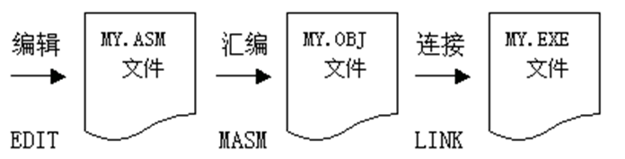

## 程序中用什么语句来结束程序的执行？

mov ah , 4cH
int 21h

## 用什么语句来表示程序的结束和指出程序执行的起点？

End start(标号不固定，start是程序执行的起点)

## 简述在WIN7系统中执行汇编的方法。

下载安装 DosBox ，运行该程序，出现 DosBox 运行界面，运行挂载命令 mount ,即可以将 Dos 程序放置在 Windows 环境下 Dos 模拟器中运行，其过程为挂载。

## debug命令

1. R命令
   查看、改变CPU寄存器的内容。
2. D命令
   查看内存中的内容。
3. E命令
   改写内存中的内容
4. 反汇编命令U
   把机器语言反汇编为汇编语言，便于用户看程序。命令格式为U[偏移地址]或U[段地址]:[偏移地址] [要查看多少字节的指令]。方括号表示可选。=表示不能省掉。
5. 运行程序命令G
   G命令用于执行程序，命令格式为G[=起始地址] [中止地址]。其中[中止地址]是为了给程序设置断点，让程序暂停在某个位置，便于观测。若不设置终止地址则直接执行到程序结束。若省掉起始地址，则以当前CS：IP作为起始地址。
6. 跟踪程序命令T
   类似于step into，用于单步执行程序，所以又叫跟踪程序。命令格式为T[=起始地址] [指令条数]。可以控制程序每执行一条指令就暂停，并显示当前机器情况。
   * 特别指出：对于INT指令不能使用T命令跟踪。因为INT指令实质上是调用一个系统中断程序，T命令使程序进入了中断程序内部命令
7. 单步执行程序命令P
   类似于step over，P命令用以执行loop**循环**、**重复的字符串指令**、软件**中断**或**子例程**(子程序)。例如T命令无法一次执行的INT指令，P命令就可以一次执行完这个系统例行程序，回到用户程序中。
8. 退出命令Q
   用Q命令退出Debug。

## DOS 系统功能 INT 21H调用方法★

(1）将调用功能的功能号存入 AH 寄存器。
(2）如必要，设置该调用功能的入口参数（调用参数）。
(3）执行 INT 21H指令，实现中断服务程序的功能调用。
(4）如必要，按规定取得出口参数（返回参数）。

## 21H号中断★

是DOS提供给用户的用于调用系统功能的中断，它有近百个功能供用户选择使用，主要包括设备管理、目录管理和文件管理三个方面的功能。

|  AH  |        功能        |                           调用参数                           |                           返回参数                           |
| :--: | :----------------: | :----------------------------------------------------------: | :----------------------------------------------------------: |
|  01  |   键盘输入并回显   |                              无                              |                         AL=输入字符                          |
|  02  |      显示输出      |                         DL=输出字符                          |                     （执行后**AL=DL**）                      |
|  07  | 键盘输入（无回显） |                              无                              |                         AL=输入字符                          |
|  09  |     显示字符串     |              DS:DX=串地址，<br/>字符串以\$结尾               |                              无                              |
|  0A  |  键盘输入到缓冲区  | DS:DX=缓冲区首地址<br/>(DS:DX)=缓冲区最大字符数（包括了回车符） | (DS:DX+1)=实际输入的字符数（不含回车符）；<br/>从(DS:DX+2)开始为输入的字符串，以回车符结尾 |
|  4C  |    带返回码终止    |                          AL=返回码                           |                              无                              |

补充：02的功能是：读入存放在DL的一个字符，将其送至向标准输出，然后将最后输出的那个字符存放在AL后返回。可以看到大多数情况下AL的返回值就是DL，但也有特殊情况。如DL是\t的情况下，屏幕上输出的实际上是一串空格，因此此时AL是空格。[来源](https://www.zhihu.com/question/277332951/answer/392685522)

建议：在每次使用int 21H中断调用前都保存一下寄存器的值，因为中断指令处理的子程序可能要用到寄存器（可以-t命令步入进去看看）。

##  Debug 命令调试含有“ INT 21H”命令的程序段时如何实现单步执行，“- t ”命令为何无法实现？

“ INT 2TH指令是 Dos 的系统调用，加果使用“ t ”跟踪，则进人DOS子程序。如果希望单步执行，可以通过 P 命令来实现。

## 何为段地址？何为有效地址？何为物理地址？

段地址：8086把内存分成许多逻辑段，其起始地址即段地址。

逻辑地址：用户编程时地址，分为段地址和偏移地址。

有效地址：段内的偏移地址即有效地址。

物理地址：段地址*16+偏移地址即内存单元的物理地址。

例如 DS =6542H，指令 mov ax , DS :[123A]:123AH为有效地址（偏移地址），6542H为段地址,65420H+0123AH=6665AH即物理地址


# 第4章 操作数的寻址方式

## 寻址方式定义

* 指令中寻找操作数的方式。

## 寻址方式分类★

### 立即寻址方式

* 定义
  * 操作数（立即数）就在指令中，紧跟在操作码之后，操作数作为指令的一部分存放在代码段。
* 举例
  * MOV AL, 6H
* 注意
  * 执行时无需去内存取数，因此称为立即数。
  * 主要用于寄存器赋初值。
  * 立即数只能作为源操作数，并且长度与目的操作数一致。

### 寄存器寻址方式

* 定义
  * 操作数就是寄存器中的值。指令中给出寄存器名。
* 举例
  * MOV AX,BX
* 注意
  * 以上两种寻址方式都与主存储器无关。
  * 以下介绍的各种寻址方式的操作数都在主存储器中。
  * 偏移地址也称为有效地址（EA）。

### 直接寻址方式

* 定义

  * 操作数的有效地址EA就在指令中（变量/常量/立即数），默认段地址=(DS)。

* 举例

  1. 存储器读操作
     例4-4 MOV AX, DS: [2000H]	;注意：在.asm源代码中若EA是立即数/常量，则ds:段超越前缀不能省
     该指令表示从数据段的2000H单元读出一个字送入AX。
     其中(DS)=1500H, (17000H)=31H, (17001H)=65H, (AX)=1020H。
     则有效地址EA=2000H
     物理地址=(DS)*10H+EA=15000H+2000H=17000H
     执行指令后：(AX)=6531H

  2. 存储器写操作
     例4-5  MOV DS: [4000H], AX
     将AX的值写入数据段的4000H单元。已知(DS)=1500H, (AX)=3946H。
     则有效地址EA=4000H
     物理地址 =(DS)*10H+EA
     =15000H+4000H=19000H
     执行指令后：(19000H)=46H，(19001H)=39H
     
  3. 符号地址
    
     直接寻址方式除了用数值作为有效地址之外，还可以用符号地址的形式。为存储单元定义一个名字，该名字就是符号地址。如果把存储单元看成变量，该名字也是变量名。
     
     例4-6
     VALUE DW 5678H
     MOV AX,VALUE ;或
     MOV AX,[VALUE]
     该指令表示从数据段的 VALUE 单元读出数据5678H送入 AX 。
     有效地址 EA = VALUE =1000H
     物理地址=( DS )x10H+ EA =15000H+1000H=16000H
     若(16000H)=78H,(16001H)=56H执行指令后：( AX )=5678H
     
  3. 段前缀
    
    在与内存有关的寻址方式中，操作数的段地址默认为数据段，80X86规定除了数据段之外，数据还可以存放在其他三种段(CS,SS,ES)中。如果操作数在其他段中存放，称为段超越，需要在指令中用段超越前缀(CS:,SS:,ES:)指出，即用操作数前加上段寄存器名和冒号表示。
    
    例4-7 
    VALUE EQU 1000H
    MOV AX, DS: [VALUE]
    MOV AX, ES: [VALUE]
    若已知(ES)=3600H，EA=VALUE=1000H，
    则有段超越前缀ES的指令源操作数的物理地址计算为：
    物理地址=(ES)\*10H+EA=36000H+1000H=37000H
    若字单元(37000H)=9091H
    执行完MOV AX, ES: [VALUE]后：(AX)=9091H

### 寄存器间接寻址方式

* 定义
  * 操作数的有效地址在特定的寄存器中，只允许使用BX、BP、SI和DI寄存器。
* 举例
  1. 例4-8 MOV AX,[BX]
     已知（DS）=1500H，（BX）=4580H，则
     EA=（BX）=4580H
     物理地址=（DS）\*10H+EA=15000H+4580H=19580H
     若（19580H）=2364H
     执行指令后：（AX）=2364H
  2. 例4-9 MOV SS:[DI],AX
     已知（SS）=2500H，（DI）=5318H，则
     EA=（DI）=5318H
     物理地址=（SS）\*10H+EA=25000H+5318H=2A318H
     若（AX）=2468H
     执行指令后：（2A318H）=68H
     （2A319H）=24H
* 注意
  * 只允许使用BX、SI、DI和BP寄存器。
    * 物理地址=10H x (DS) + (BX)：MOV AX,[BX]
    * 物理地址=10H x (DS) + (SI)：MOV AX,[SI]
    * 物理地址=10H x (DS) + (DI)：MOV AX,[DI]
    * 物理地址=10H x (SS) + (BP)：MOV AX,[BP]
      * 无需段超越前缀，因为BP默认与SS搭配

### 寄存器相对寻址方式

* 定义
  * 操作数的有效地址是一个**寄存器**和**位移量**（变量/常量/立即数）之和，只允许使用BX、BP、SI和DI寄存器。

* 举例
  1. 例4-13
     MOV  AX，ARRY[BX]
     MOV  AX，[ARRY] [BX]
     MOV  AX，[ARRY+BX]
     MOV  AL，BUF[BX]
     MOV  AL，[BX+8H]
     MOV  AL，[BX].8H
  2. 例4-11 MOV AX, TOP[SI]
     以上指令TOP为符号地址，即位移量。
     已知（DS）=1500H，（SI）=7310H，TOP=25H，则
     有效地址EA=（SI）+TOP=7310H+25H=7335H
     物理地址=（DS）\*10H+EA=15000H+7335H=1C335H
     若（1C335H）=2428H，执行指令后，（AX）=2428H
* 注意
  * 只允许使用BX、S、DI和BP寄存器。
    * 物理地址=10H x (DS) + (BX) + 8(16)位位移量：MOV AX,[BX+00H]
    * 物理地址=10H x (DS) + (SI) + 8(16)位位移量：MOV AX,[SI+0000H]
    * 物理地址=10H x (DS) + (DI) + 8(16)位位移量：MOV AX,[DI+0000H]
    * 物理地址=10H x (SS) + (BP) + 8(16)位位移量：MOV AX,[BP+00H]
      * 无需段超越前缀，因为BP默认与SS搭配

### 基址变址寻址方式

* 定义
  * 操作数的有效地址是一个**基址寄存器**和一个**变址寄存器**的内容之和，基址寄存器为BX和BP，变址寄存器为SI和DI。
* 举例
  1. 例4-14 MOV AX, [BX+DI]
     执行前：已知（DS）=2100H，（BX）=0158H，（DI）=10A5H，（221FD）=34H，（221FE）=95H，（AX）=0FFFFH。则
     有效地址EA=（BX）+（DI）=0158H+10A5H=11FDH
     物理地址=（DS）\*10H+EA=21000H+11FDH=221FDH
     执行后，（AX）=9534H
  2. 例4-15
     MOV  AX，[BX] [SI]         ；默认DS寄存器作段地址
     MOV  AX，[BP] [DI]         ；默认SS寄存器作段地址
     MOV  AX，ES:[BX] [DI]   ；指定ES寄存器作段地址
     MOV  DX，[BP] [SI]		；默认SS寄存器作段地址
     MOV  [BX+DI], CX		  ；默认DS寄存器作段地址
     MOV  [BP+SI], AL		   ；默认SS寄存器作段地址
* 注意
  * 允许使用的基址寄存器BX和BP，变址寄存器SI和DI。
    * 物理地址=10H x (DS) + (BX) + (DI)：MOV AX,[BX+DI]
    * 物理地址=10H x (DS) + (BX) + (SI)：MOV AX,[BX+SI]
    * 物理地址=10H x (SS) + (BP) + (SI)：MOV AX,[BP+SI]
    * 物理地址=10H x (SS) + (BP) + (DI)：MOV AX,[BP+DI]

### 相对基址变址寻址方式

* 定义
  * 操作数的有效地址是一个基址寄存器和一个变址寄存器以及一个位移量（变量/常量/立即数）之和，基址寄存器为BX和BP，变址寄存器为SI和DI。

* 举例
  1. 例4-16
     MOV  AX，MASK[BX] [SI]      ；默认DS寄存器作段地址
     MOV  AX，[MASK+BX+SI]	；默认DS寄存器作段地址
     MOV  AX，[BX+SI].MASK	；默认DS寄存器作段地址
     以上三种表示形式实现的功能是一样的。其有效地址EA=MASK+(BX)+(SI)；
     物理地址=(DS)*10H+EA。
* 注意
  * 允许使用的基址寄存器BX和BP，变址寄存器SI和DI。
    * 物理地址=10H x (DS) + (BX) + (DI) + 8(16)位位移量：MOV AX,[BX+DI+00H]
    * 物理地址=10H x (DS) + (BX) + (SI) + 8(16)位位移量：MOV AX,[BX+SI+0000H]
    * 物理地址=10H x (SS) + (BP) + (SI) + 8(16)位位移量：MOV AX,[BP+SI+0000H]
    * 物理地址=10H x (SS) + (BP) + (DI) + 8(16)位位移量：MOV AX,[BP+DI+00H]

# 第5章 常用指令

## 80x86汇编语言指令语句的一般格式

*  [标号:]  指令助记符  [操作数]  [;注释] （[ ]中的内容可选）
   * 标号：指令的符号地址，表示指令在内存中的位置。标号后应加冒号：。
   * 指令助记符/操作码：指令名称，是指令功能的英文缩写。
   * 操作数：指令要操作的数据或数据所在的地址。寄存器，常量，变量，表达式。
   * 注释：每行以分号“；”开头，汇编程序不处理。

## 双操作数指令的几个要点

1.  双操作数指令的两个操作数，长度须匹配。
2. 双操作数指令的两个操作数中，不能两个操作数同为内存单元。
3. 目的操作数不能为CS和IP，因为CS：IP是程序当前地址。
4. 目的操作数不可以是立即数

## 数据传送指令

### 通用数据传送指令

* 数据传送方向

  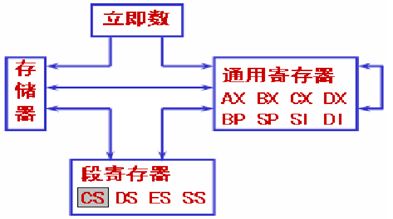

* MOV                     传送

  * 格式: MOV  DST,  SRC
  * 操作: (DST)←(SRC)
    * DST 表示目的操作数, SRC 表示源操作数。

  * 功能：将源操作数传送到目的操作数。
  * 注意
    * 源操作数与目的操作数的长度必须一致。
    * 源操作数与目的操作数不能同时为存储器。
    * 目的操作数不能为CS和IP，因为CS：IP是程序当前地址。
    * 目的操作数不可以是立即数。
  * 举例
    1. 例5.1立即数与寄存器的传送
       MOV  AH, 89	        ；十进制数
       MOV  AX, 2016H        ；十六进制数，后面加H
       MOV  AX, 0ABCDH	；十六进制数，因非数字(0～9)开头，前面加0，避免被误认为标号或变量
       MOV  AL, 10001011B	 ；二进制数，后面加B，一个字节以内
       MOV  AL, ‘A’        ；字符‘A’的ASCII码是41H，相当于立即数
    2. MOV  BL, OFFSET  TABLE ;错误，不管变量类型如何，其有效地址总是16位。

* PUSH                   进栈

  * 格式: PUSH   SRC

  * 操作
    * (SP)←(SP)-2
    * (( SP)+1,(SP))←(SRC) 
    
  * 功能：后进先出内存区，以字为单位传送，SS:SP总是指向栈顶。

  * 举例
    
    例5.6 进栈和出栈。
    MOV　BX,1234H
    PUSH　 BX
    POP　AX
    指令执行结果如图5-1所示，进栈时SP-2,SP向低地址移动。出栈时SP+2,SP向高地址移动。

  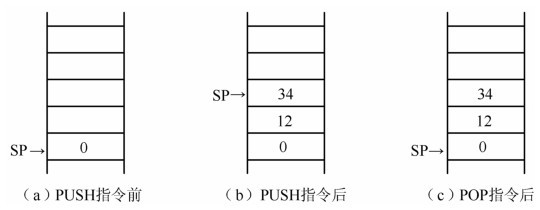

* POP                      出栈
  * 格式: POP   DST
  * 操作
    * (DST)←((SP)+1,(SP))
    *  (SP)←(SP)+2 

* XCHG                   交换
  * 格式: XCHG   OPR1,  OPR2
  * 操作: (OPR1) ↔(OPR2)
  * 功能：把两个操作数互换位置。
  * 注意：遵循双操作数指令的规定，但操作数不能为立即数。
  * 举例
    例5.8
    XCHG　AX,　 BX　　　　; 两个寄存器长度相等
    XCHG　AX,　[BX]　　　; AX要求[BX]也取字单元
    XCHG　AX,　 VAR　　　 ; VAR 必须是字变量
    以下指令是错误的：
    XCHG　AX,　 5　　　　 ; 显然操作数不能为立即数
    XCHG　[BX],　VAR　　 ; 操作数不能同为内存单元
    XCHG　AX,　 BH　　　　; 操作数长度要一致

### 累加器专用传送指令（估计不考）

* 其中I/O端口是CPU 与外设传送数据的接口,单独编址,不属于内存,端口地址范围0000~FFFFH.这组指令只限于AX,AL累加器。
* IN        		 ;从I/O端口输入
* OUT     		;向I/O端口输出
* XLAT(translate)   ;换码 （查表）

### 地址传送指令

* LEA（Load Effective Address）           有效地址送寄存器
  * 格式：LEA  REG,SRC
  * 操作：REG←SRC
  * 功能：把源操作数的有效地址EA送到指定的寄存器。
  * 举例
    1. 例5.13   取变量的有效地址
       LEA   BX， TABLE
       MOV   BX， OFFSET TABLE
       上面2条指令等效。TABLE无论是何类型的变量，其有效地址总是16位。
       
    2. 例5.14 
       LEA   BX， [2016H]
       MOV  BX,  OFFSET  [2016H]
       指令执行后，BX=2016H。
* LDS（Load DS with Pointer）            指针送寄存器和DS
  * 格式： LDS   REG, SRC
  * 操作
    * REG←（SRC）
    * DS←（SRC+2）

  * 功能：把源操作数SRC所指向的内存单元中的两个字送到指定的寄存器REG和DS。
  * 举例
    1. 例5.15 
       LDS   SI， [BX]
       指令执行前，如DS=2000H，BX=0400H，(2000:0400)=1234H, (2000:0402)=5678H,
       指令执行后，SI=1234H，DS=5678H。
* LES（Load ES with Pointer）            指针送寄存器和ES
  * 格式： LES   REG, SRC
  * 操作
    * REG←（SRC）
    * ES←（SRC+2）

  * 功能：把源操作数SRC所指向的内存单元中的两个字送到指定的寄存器REG和ES。
  * 举例
    1. 例如 LES   DI,  [10H] 
       DS=C000H,  (C0010H)=0180H,    (C0012H)=2000H
       结果 DI=0180H,  ES=2000H 

### 标志寄存器传送（估计不考）

## 算术运算指令

### 类型扩展指令

* CBW（Convert Byte to Word）
  * 功能：AL扩展为AX
* CWD（Convert Word to Double word）
  * 功能：AX扩展为DX，AX
* 注意
  * 这两条指令的格式相同，只有操作码部分，无操作数部分。
  * 操作数默认为累加器，无需在指令中给出。

* 功能
  * 当执行CBW时，默认将AL寄存器的内容扩展到AX寄存器中，扩展方法为符号扩展，即如果AL的最高位为1（负数），则CBW指令扩展时使AH=FFH，如果AL的最高位为0（正数），则CBW指令扩展时使AH=00H。
  * 当执行CWD时，默认将AX寄存器的内容扩展到（DX，AX）中，其中DX存放双字中的高位，AX存放双字中的低位。如果AX的最高位为1（负数），则 CWD 指令扩展时使 DX=FFFFH，如果 AX 的最高位为0（正数），则 CWD 指令扩展时使DX=0000H。

* 举例
  1. 例5.17   正数的扩展
     MOV  AL，52H    ；AL中的52H是正数（0101 0010B）
     CBW                   ；指令执行后，AX=0052H
     CWD                   ；指令执行后，DX=0000H，AX=0052H
  2. 例5.18   负数的扩展
     MOV  AL，88H     ；AL中的88H是负数（1000 1000B）
     CBW                    ；指令执行后，AX=FF88H
     CWD                    ；指令执行后，DX=FFFFH，AX=FF88H

### 加法指令

* ADD               加法
  * 格式：ADD   DST，SRC 
  
  * 操作：（DST）← （DST） + （SRC）
  
  * 举例
    
    例5.19 
    MOV   AL，72H
    ADD   AL，93H
    105H，超出8位表示范围，丢失256。(AL)=05H，CF=1，OF=0
  
* ADC(ADd with Carry)      带进位加法
  * 格式：ADC   DST，SRC 
  
  * 操作：（DST）←（DST）+（SRC）+CF
  
  * 举例
    
    例5.21  用16位指令实现32位的双精度数的加法运算。设数A存放在目的操作数寄存器DX和AX，其中DX存放高位字。数B存放在寄存器BX和CX，其中BX存放高位字。如：
    DX=2000H， AX=8000H
    BX=4000H， CX=9000H
    指令序列为：
    ADD   AX，  CX           ；低位字加
    ADC   DX，  BX           ；高位字加
    第一条指令执行后，AX=1000H，CF=1，OF=1，此处OF=1不必在意。 
    第二条指令执行后，DX=6001H，CF=0，OF=0，表示结果正常，无溢出。
  
* INC                 加1
  * 格式：INC   OPR 
  * 操作：（OPR）←（OPR）+1

* 注意：除 INC 不影响CF，它们都影响状态标志位。

### 减法指令

* SUB(SUBtract)             减法
  * 格式：SUB   DST，SRC 
  * 操作：（DST）← （DST） -（SRC）
  
* SBB(SuBtract with Borrow)   带借位减法
  * 格式：SBB   DST，SRC 
  
  * 操作：（DST）← （DST） -（SRC）-CF
  
  * 举例
    
    例5.23  用16位指令实现32位的双精度数的减法运算。设数A存放在目的操作数寄存器DX和AX，其中DX存放高位字。数B存放在寄存器BX和CX，其中BX存放高位字。如：
    DX=2001H， AX=8000H
    BX=2000H， CX=9000H
    指令序列为：
    SUB   AX，  CX           ；低位字减法
    SBB   DX，  BX           ；高位字减法
    第一条指令执行后，AX=F000H，CF=1，而对OF=0，ZF=0,SF=1，不必在意。
    第二条指令执行后，DX=0000H，CF=0，OF=0，表示结果正确。ZF=1,SF=0。
  
* DEC             减1
  * 格式：DEC   OPR 
  * 操作：（OPR）←（OPR）-1
  
* NEG(NEGate)            求补
  * 格式：NEG   OPR 
  
  * 操作：（OPR）←-（OPR）
  
  * 功能：对OPR求补,求- OPR, 即反码+1。
  
  * 注意：实质上是0-(OPR)，因此只有OPR为0时，CF=0。
  
  * 举例
    
    例5.24   考察NEG指令
    MOV   AX，  3
    NEG   AX
    MOV   DX，  0
    NEG   DX
    指令序列执行后，AX=FFFDH=－3(补码)，DX=0H。
    可以看出，NEG指令实际上就是求数X的相反数，即 求0－X，只有当X=0时，CF=0，其它情况CF=1。
  
* CMP(CoMPare)            比较
  * 格式：CMP   OPR1, OPR2 
  
  * 操作：（OPR1）-（OPR2）
  
  * 注意：不回送结果，只产生标志位。
  
  * 举例
    
    例5.25   考察CMP指令
    MOV   AX，  5
    DEC   AX
    CMP   AX，  5 ;0100-0101=1 1111
    指令序列执行后，AX=4，ZF=0，SF=1，CF=1，OF=0。
    CMP指令虽作减法，但不回送结果，只是产生标志位，为程序员比较两个数的大小提供判断依据。

### 乘法指令

* MUL（unsigned MULtiple）   无符号数乘法
  * 格式：MUL   SRC
  * 操作
    * 操作数为字节时: (AX)← (AL) X (SRC) 
    * 操作数为字时: (DX,AX)← (AX) X (SRC) 
  
* IMUL（sIgned MULtiple）    有符号数乘法 
  * 格式：IMUL   SRC
  * 操作
    * 操作数为字节时: (AX)← (AL) X (SRC) 
    * 操作数为字时: (DX,AX)← (AX) X (SRC) 
  
* 注意
  * 两个相乘的数必须长度相同，因为会根据SRC的长度选择寄存器。
  * SRC不能是立即数，因为长度不确定。
  
* 举例
  
  例5.26   无符号数和带符号数的乘法
  MOV   AL，  0F1H
  MOV   BL，  AL
  MUL   BL ;15*16+1=241，241^2=58081
  指令序列执行后，AX=E2E1H。
  如果看成是两个带符号相乘，则应选择如下指令：
  MOV   AL，  0F1H
  MOV   BL，  AL
  IMUL  BL ;0F1H=1111 0001B，0-1111 0001=0000 1111=15， 15^2=225
  指令序列执行后，AX=00E1H。说明了两个负数相乘，结果为正数。

### 除法指令

* DIV     无符号数除法
   * 格式：DIV SRC
      * 字节操作
         * (AL)←(AX)/(SRC)的商
         * (AH)←(AX)/(SRC)的余数

      * 字操作
         * (AX)←(DX,AX)/(SRC)的商
         * (DX)←(DX,AX)/(SRC)的余数

* IDIV    有符号数除法
   * 格式：IDIV SRC
      * 字节操作
        * (AL)←(AX)/(SRC)的商
        * (AH)←(AX)/(SRC)的余数
      * 字操作
        * (AX)←(DX,AX)/(SRC)的商
        * (DX)←(DX,AX)/(SRC)的余数
   * 注意
     * 余数和被除数同符号。
     * 商的符号是两个操作数符号的异或。

* 注意
  * 被除数长度应为除数长度的两倍。
  * SRC不能是立即数，因为长度不确定。
  * 当除数是字节类型时，除法指令要求商为8位。此时如果被除数的高8位绝对值≥除数的绝对值，则商会产生溢出。e.g.：11 0000 1000 /3=01 0000 0010余2，结果大于8位，产生溢出。
  * 当除数是字类型时，除法指令要求商为16位。此时如果被除数的高16位绝对值≥除数的绝对值，则商会产生溢出。
  * 商出现溢出时，系统转0号类型中断处理，提示“divide overflow”，并退出程序，返回到操作系统，程序已经崩溃了。要想避免出现这种情况，必须在作除法前对溢出作出预判。

* 举例
  1. 例5.27    作(字节)除法300H/2H，商产生溢出
     MOV  AX，  300H
     MOV  BL，  2
     DIV  BL
     此时被除数的高8位(AH=3)绝对值＞除数的绝对值2, 则商会产生溢出。实际上换成十进制计算也可说明商会产生溢出：300H/2H=768/2=384>255，显然，8位的AL寄存器容不下商384。 
     
  2. 例5.28   作(字)除法300H/2H，商不会产生溢出
     MOV  AX，  300H
     CWD ;(DX)=0000H，(AX)=0300H
     MOV  BX，  2
     DIV  BX
     此时被除数的高16位(DX=0), 则商不会产生溢出。显然AX寄存器完全能容下商384。
     
  3. 例5.29   算术运算综合举例，计算:(V－(X×Y＋Z－16))／X，其中X、Y、Z、V均为16位带符号数，在数据段定义，要求上式计算结果的商存入AX，余数存入DX寄存器。

     ```assembly
     data   segment
     	x  dw  4
     	y  dw  2
     	z  dw  14H
     	v  dw  18H
     data   ends
     
     code   segment
     assume  cs:code,ds:data
     start:
     	mov    ax,data
     	mov    ds,ax
     	
     	mov    ax,x
     	imul   y             ;x×y=8
     	
     	mov    cx,ax         ;暂存(x×y)的结果 
     	mov    bx,dx
     	
     	mov    ax,z         
     	cwd                  ;z符号扩展，等于mov dx,0
     	
     	add    cx,ax         ;加z=28
     	adc    bx,dx
     	
     	sub    cx,16         ;减16=12
     	sbb    bx,0
     	
     	mov    ax,v
     	cwd                  ;v符号扩展
     	
     	sub    ax,cx         ;v减(x×y)的结果=12
     	sbb    dx,bx         ;V－(X×Y＋Z－16)=12
     	
     	idiv   x	         ;12/4=3，未溢出
     	
     	mov    ah,4ch
     	int    21h
     code   ends
     end  start
     ```


### BCD码的十进制调整指令（估计不考）

* 为便于十进制计算,计算机提供了十进制调整指令,在二进制数计算的基础上,给予十进制调整,直接得到十进制结果。

## 逻辑指令与移位指令

### 逻辑指令

* 相同点：均按位操作,至少一个操作数是寄存器。
* AND     ;与
  * 格式: AND   DST，SRC
  * 操作: (DST)←(DST)∧(SRC)
* OR       ;或
  * 格式: OR   DST，SRC
  * 操作: (DST)←(DST)∨(SRC)
* NOT     ;非
  * 格式: NOT   OPR
  * 操作: $(OPR)←(\overline{OPR})$
* XOR     ;异或
  * 格式: XOR   DST，SRC
  * 操作: $(DST)←(DST) \oplus (SRC)$ 
* TEST    ;测试
  * 格式: TEST   OPR1，OPR2
  * 操作: (OPR1)∧(OPR2)
  * 注意：TEST执行AND操作, 但不保存结果,只根据其特征置标志位。
* 举例
  1. 例5.37   屏蔽AL寄存器的高四位，如AL=36H
     AND    AL，0FH
     指令执行的结果使AL=06H
  1. 例5.38    对AL寄存器的最低两位置1，如AL=36H=0011 0110B。
     OR    AL，03H ;0000 0011B
     指令执行的结果使AL=37H=0011 0111B
  1. 例5.39  对AL寄存器的最低两位取反，如AL=36H=0011 0110B。
     XOR    AL，03H ;0000 0011B
     指令执行的结果使AL=35H=0011 0101B
  1. 例5.40  测试AL寄存器中的数，如果是负数则转到标号NEXT去执行。如AL=86H。
     TEST    AL，80H ;1000 0110B∧1000 0000B=1000 0000B SF=1
     JS      NEXT ;如果SF=1，则程序跳转至标号NEXT处继续执行
     指令执行的结果AL=86H(不变)，我们只要注意到FLAGS标志寄存器的SF=1，所以程序转到标号NEXT去执行。

### 移位指令

* 相同点

  * 指令均是双操作数指令，指令的格式相同。

  * 以SHL为例，则格式

    1. SHL　 OPR,1

    2. SHL　 OPR,CL

  * 其中CL寄存器的值大于1，OPR为寄存器或内存单元，移位次数可以是1或CL寄存器，如需移位的次数大于1，则可以在该移位指令前把移位次数先送CL寄存器中。

* SHL（SHift Logical Left）　　　　　　逻辑左移

  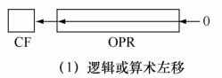

  * 最低位补0，移出的最高位送CF标志位；
  * 用来将无/有符号数乘以2

* SAL（Shift Arithmetic Left）　　　　　算术左移
  * 最低位补0，移出的最高位送CF标志位；
  * 用来将有/无符号数乘以2

* SHR（SHift logical Right）　　　　　 逻辑右移

  

  * 最高位补0，移出的最低位送CF标志位；

  * 用来将无符号数除以2

* SAR（Shift Arithmetic Right）　　　　 算术右移

  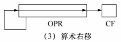

  * 此时OPR被认为是有符号数，则最高位补符号位SF，移出的最低位送CF标志位；
  * 用来将有符号数除以2

* ROL（ROtat Left）　　　　　　　　     循环左移

  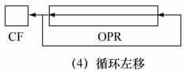

  * OPR整体向左移一位，最高位移出，同时将其送CF标志位和最低位；

* ROR（ROtat Right）　　　　　　　　  循环右移

  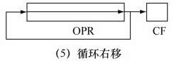

  * OPR整体向右移一位，最低位移出，同时送CF标志位和最高位；

* RCL（Rotat Left with Carry）　　　　   带进位循环左移

  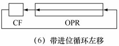

  * OPR整体向左移一位，此时最高位移出，送CF标志位，而CF标志位原始的数值送OPR最低位；

* RCR（Rotat Right with Carry）　　　　带进位循环右移移位

  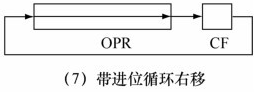

  * OPR整体向右移一位，此时最低位移出，送CF标志位，而CF标志位原始的数值送OPR最高位。

* 举例

  1. 例5.37
     设指令执行前，AX=13H=00010011B,CF=1。
     （1）SHL　 AX,1 ;等价于SAL　 AX,1
     若AX=00010011整体左移，最高位0送入 CF 标志位，最低位补0，结果为AX=00100110B=26H,CF=0，相当于对AX的内容乘以2。
     （2）SHR　 AX,1
     若AX=00010011整体右移，最低位1送入CF标志位，最高位补0，结果为00001001=09H,CF=1，相当于对AX的内容除以2；
     若AX=10010011，则SHR执行的结果为01001001=49H,CF=1。
     （3）SAR　 AX,1
     若AX=00010011整体右移，最低位1送入CF标志位，最高位补符号位本身，即0，结果为00001001=09H；
     若AX=10010011，则SAR执行的结果与SHR不同，结果为11001001=C9H,CF=1。
     （4）ROL　 AX,1
     若AX=00010011整体左移，最高位0同时送入 CF 标志位和最低位，结果为AX=00100110=26H,CF=0。
     （5）ROR　 AX,1
     若AX=00010011整体右移，最低位1同时送入 CF 标志位和最高位，结果为AX=10001001=89H,CF=1。
     （6）RCL　 AX,1
     若AX=00010011整体左移，最高位0送入CF标志位，而CF标志位原始的值（CF=1）送入最低位，结果为AX=00100111=27H,CF=0。
     （7）RCR　 AX,1
     若AX=00010011整体右移，最低位1送入CF标志位。
     若CF标志位原始的值（CF=1）送入最高位，结果为AX=10001001=89H,CF=1；
     若CF标志位原始的值CF=0，则结果为AX=00001001=09H,CF=1。
  
  2. 例5.42  对AX中内容实现半字交换，即交换AH和AL中的内容。
     MOV   CL， 8
     ROL   AX， CL ;循环左移
     如指令执行前，AX=1234H，指令执行后，AX=3412H。

## 串操作指令

* 串操作指令每次处理的是一个字节或字，因此需要重复执行串操作指令才能处理完一个数据串。
* 数据传送是从内存到内存。
* 串操作指令通常需要和以下前缀配合使用：

1. REP（REPeat）

   重复执行串操作指令，每执行一次，CX自动减1，直到CX=0为止。

2. REPE / REPZ （REPeat while Equal/Zero）

   当CX≠0  并且  ZF=1时，重复执行串操作指令，每执行一次，CX自动减1，直到CX=0 或者 ZF=0为止。

   应用举例：若用以比较两个字符串是否相等，每次的串操作指令把源串中的一个字节和目的串中的一个字节进行比较，如果相等（即ZF=1），则还需继续执行串操作指令，若不相等或者比较全部串的数据（CX=0），则停止。

3. REPNE / REPNZ（REPeat while Not Equal/NotZero）      

   当CX≠0  并且  ZF=0时，重复执行串操作指令，每执行一次，CX自动减1，直到CX=0 或者 ZF=1为止。

   应用举例：若在一个字符串中查找是否存在某一个字符，串操作指令把字符串中的一个字节和要找的这个字符进行比较，如果不相等（即ZF=0），则还需继续执行串操作指令，直到找到（ZF=1）或者查找完整个串的数据（CX=0），才停止。

### MOVS（Move String）串操作指令

* MOVS   DST,  SRC  ;操作数寻址方式固定

  * 格式

    MOVS　 ES: BYTE PTR [DI],DS:[SI] ;等效于MOVSB
    或
    MOVS　 WORD PTR ES:[DI],WORD PTR DS:[SI] ;等效于MOVSW

* MOVSB                    ;字节

  * (ES:DI)←(DS:SI), SI=SI±1, DI=DI±1

* MOVSW                   ;字

  * (ES:DI)←(DS:SI), SI=SI±2, DI=DI±2

* 当方向标志DF=0,用+,DF=1,用- 

* 实现整个串传送的准备工作

  1. SI=源串首地址（如反向传送则是末地址）.
  2. DI=目的串首地址（如反向传送则是末地址）.
  3. CX=串长度.
  4. 设置方向标志DF.  

* 设置方向标志DF：

  * CLD    设置正向 (DF=0,向前,SI和DI自动加)
  * STD    设置反向 (DF=1,向后,SI和DI自动减)

* 举例

  例5.43   在数据段中有一个字符串MESS，其长度为19，要求把它们转送到附加段中名为BUFF的一个缓冲区中，并显示出BUFF字符串，编制程序如下所示。
  
  ```assembly
  data  segment
  	mess db 'COMPUTER SOFTWARE $' ;长度为19（包括回车符）
  data  ends
  
  ext  segment
  	buff db 19 dup(?)
  ext  ends
  
  code  segment
  	assume  cs:code，ds:data，es：ext
  start:
  	mov    ax, data             ;赋段地址
  	mov    ds, ax
  	mov    ax, ext
  	mov    es, ax
  	
  	lea    si, mess              ;赋偏移地址
  	lea    di, buff
  	
  	mov    cx, 19
  	cld							;置为正向
  	rep    movsb                ;完成串传送（以字节为单位）
  	
  	mov    bx, es               ;准备显示buff字符串
  	mov    ds, bx               ;DS:DX指向待显示串的地址（以$结尾）
  	lea    dx, buff 
  	mov    ah, 9
  	int    21h
  	
  	mov    ah, 4ch
  	int    21h
  code  ends
  	end  start
  ```

### CMPS（CoMPare String）串比较指令

* CMPS  SRC，DST ;操作数寻址方式固定

* CMPSB                   ;字节

  * (ES:DI)←(DS:SI), SI=SI±1, DI=DI±1

* CMPSW                   ;字 

  * (ES:DI)←(DS:SI), SI=SI±2, DI=DI±2

* 当方向标志DF=0,用+,DF=1,用-

* 把两个串的对应位置的字节或字相减，不保存结果，只是根据结果设置标志位。

* 与前缀REPE联用时，可比较两个串是否相等。在每次比较过程中，一旦发现不相等，ZF=0，则终止重复执行，而不必等到整个串全部比较结束，此时CX≠0,ZF=0。该指令终止执行后，可根据标志ZF判断两个串是否相等。

* 举例

  例5.40 在数据段中有一个长度为19的字符串MESS1，还有一个长度为19的字符串MESS2，比较它们是否相等。若相等显示‘Y'，否则显示‘N'。

  ```assembly
  DATA　SEGMENT
  	MESS1　 DB　 'COMPUTER SOFTWARE $ '
  	MESS2　 DB　 'COMKUTER SOFTWARE $ '
  DATA　ENDS
  
  CODE　SEGMENT
  ASSUME　CS:CODE,DS:DATA
  START:
  	MOV　 AX,DATA
  	MOV　 DS,AX
  	MOV　 ES,AX　　　　 ; DS=ES
  	
  	LEA　 SI,MESS1
  	LEA　 DI,MESS2
  	MOV　 CX,19　　　　 ; 串长
  	CLD　　　　　　　　　; 设置DF方向
  	REPE　 CMPSB　　　　; 当CX=0或者ZF=1时，比较结束
  	JZ　YES　　　　　　  ; 如果ZF=1,说明相等，跳转到标号YES
  	MOV　 DL,'N'　　　　; 两串不相等
  	JMP　 DISP　　　　　 ; 跳转到标号DISP
  YES: 
  	MOV　 DL,'Y'
  DISP: 
  	MOV　 AH,2
  	INT　 21H
  	
  	MOV　 AH,4CH
  	INT　 21H
  CODE　ENDS
  END　START
  ```

  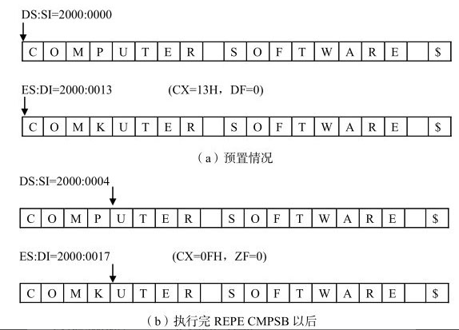

### SCAS（SCAn String）串扫描指令

* SCAS  DST   ;操作数寻址方式固定

* SCASB          ;字节

  *  AL-(ES:DI), DI=DI±1

* SCASW         ;字 

  * AX-(ES:DI), DI=DI±2

* 当方向标志DF=0,用+,DF=1,用-

* 指令不保存结果，只是根据结果设置标志位。

* 与前缀REPNE联用时，可在目的串中查找有无和AL/AX寄存器中的内容相同的字节或字。在每次执行串扫描指令过程中，一旦发现相等，即ZF=1，则终止执行，此时CX≠0,ZF=1，说明已找到相同的内容，而不必等到整个串全部扫描结束。该指令终止执行后，可根据标志位 ZF 判断是否找到。

* 举例

  例5.45 在附加段中有一个字符串MESS，其长度为19，要求查找其中有无空格符，若有空格符，把首次发现的空格符改为‘#’，存回该单元，并显示‘Y’，否则显示‘N’。

  ```assembly
  ext   segment
  	mess   db   'COMPUTER SOFTWARE $ '
  ext   ends
  
  code  segment
  assume  cs:code,es:ext
  start:
  	mov    ax, ext
  	mov    es, ax
  	lea    di, mess
  	
  	mov    cx, 19			;串长19
  	mov    al, 20h        ;空格符
  	cld
  	repne  scasb
  	jz     yes            ;如果zf=1跳转到标号yes
  	mov    dl,'n'
  	jmp    disp           ;跳转到标号disp
  yes: 
  	dec    di				;每循环一次都会指向下一个，因此要减1
  	mov    byte ptr es:[di],23h    ;‘#’送原空格位置
  	mov    dl,'y'
  disp:
  	mov    ah,2
  	int    21h  
  	
  	mov    ah, 4ch
  	int    21h
  code  ends
  end  start 
  ```

  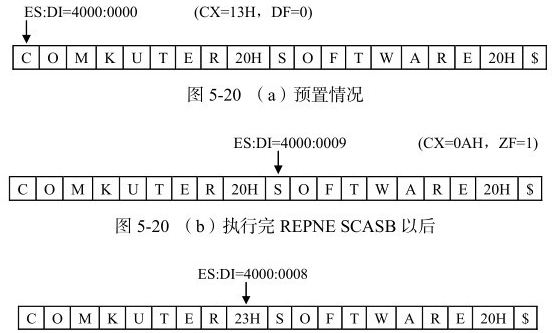

### STOS（STOre in to String）存入串指令

* STOS  DST   ;操作数寻址方式固定

* STOSB          ;字节

  * (ES:DI)←AL, DI=DI±1

* STOSW         ;字 

  * (ES:DI)←AX, DI=DI±2

* 当方向标志DF=0,用+,DF=1,用-

* 举例

  例5.46   写出把附加段EXT中的首地址为MESS，长度为9个字的缓冲区置为0值的程序片段。

  ```assembly
  	MOV    AX, EXT
  	MOV    ES, AX
  	LEA    DI, MESS
  	MOV    CX, 9
  	MOV    AX, 0      
  	CLD
  	REP    STOSW
  ```

  注意：REP STOSW是字操作，每次执行时DI自动+2。

  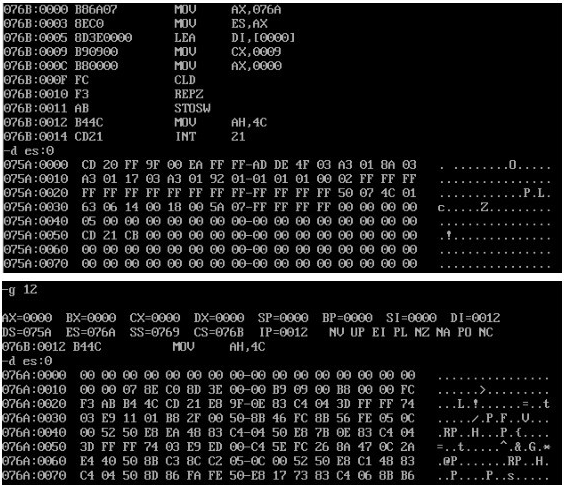

### LODS（LOaD from String）从串取指令

* LODS  SRC   ;操作数寻址方式固定
* LODSB          ;字节
  * AL←(DS:SI), SI=SI±1
* LODSW         ;字
  * AX←(DS:SI), SI=SI±2
* 当方向标志DF=0,用+,DF=1,用-
* 指令一般不和REP连用

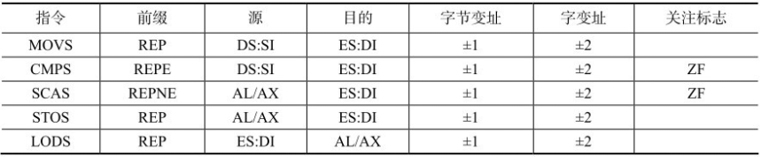

## 程序转移指令

### 无条件转移指令JMP

* 定义：无条件转移到指令指定的地址去执行程序。

* 根据目标地址分类
  * 段内转移：转移的目标地址和本跳跳转指令在同一个代码段（NEAR  PTR）
  * 段间转移：转移的目标地址和本条跳转指令不在同一个代码段（FAR  PTR）
  
* 根据目标地址是否在跳转指令中直接给出分类
  * 直接转移：转移的目标地址在跳转指令中直接给出（立即数）
  * 间接转移：转移的目标地址在跳转指令中通过其他方式间接给出
  
* 两两组合
  1. 段内直接转移
     * 格式: JMP  NEAR  PTR   OPR
     
     * 操作: IP←IP+16位位移量
     
     * 注意
       * NEAR  PTR为目标地址OPR的属性说明，表明是一个近（段内）跳转，通常可以省略。
       * 位移量是带符号数（相对于原地址），IP的值可能减小（程序向后跳），也可能增加（程序向前跳）。
       * 程序的重新定位并不影响程序的正确执行。
       
     * 举例
       
       例5.43   关于程序的可重新定位的讨论。
       1000：JMP  P1           ；1000H是本条指令的所在偏移地址（段内短转移）
       1002：MOV  AX， BX
       1004：MOV  DX，CX
       P1：    ADD  AX， DX   ；P1是标号，其值为1006H
       如果把这个程序放在内存中的另一个位置，如下所示：
       2000：JMP  P1           ；2000H是本条指令的所在偏移地址
       2002：MOV  AX， BX
       2004：MOV  DX， CX
       P1：    ADD  AX， DX    ；P1是标号，其值为2006H
       
       两个程序中JMP  P1 命令的机器码均为：EB04H
       
       解释：EBH是JMP指令的机器码，04H是偏移量，当JMP指令被取出将要执行时，当前的IP的值自动加2（指令长度为2），指向下一条指令，而JMP指令执行的结果使得IP←IP+4
     
  2. 段内间接转移
  
     * 格式: JMP  WORD PTR   OPR 
  
     * 操作: IP←（EA） 
  
     * 注意：可以使用除立即数以外的任何一种寻址方式。
  
     * 举例
  
       例5.48   如果BX=2000H，DS=4000H，(42000H)=6050H，(44000H)=8090H，TABLE的偏移地址为2000H，分析下面四条指令单独执行后IP的值。
       JMP   BX                                 ；寄存器寻址，IP=BX
       JMP   WORD PTR [BX]         ；寄存器间接寻址，IP=[DS:BX]
       JMP   WORD PTR TABLE    ；直接寻址，IP=[DS:TABLE]
       JMP   TABLE[BX]                   ；寄存器相对寻址，IP=[DS:(TABLE+BX)]
       第一条指令执行后，IP=BX=2000H。
       第二条指令执行后，IP=(DS:2000H)=(40000H+2000H)=(42000H)=6050H。
       第三条指令执行后，IP=(DS:2000H)=(40000H+2000H)=(42000H)=6050H。
       第四条指令执行后，IP=(DS:4000H)=(40000H+4000H)=(44000H)=8090H。
  
  3. 段间直接转移（跨段直接远转移）
  
     * 格式: JMP  FAR  PTR  OPR
     * 操作
       * IP←OPR的偏移地址
       * CS←OPR所在段的段地址
     * OPR可采取符号地址（标号）
  
  4. 段间间接转移
  
     * 格式: JMP  DWORD PTR   OPR 
  
     * 操作
  
       * IP←（EA）
       * CS←（EA+2）
  
     * 注意：可以使用除立即数和寄存器方式以外的任何一种寻址方式。
  
     * 举例
  
       例5.49   如果BX=2000H，DS=4000H，(42000H)=6050H，(42002H)=1234H，指出下面指令执行后IP和CS的值。
       JMP   DWORD PTR [BX]
       指令执行后，IP=(DS:2000H)=(40000H+2000H)=(42000H)=6050H；CS=(42002H)=1234H。 

### 条件转移指令

* 定义：条件转移指令根据上一条指令所设置的标志位来判别测试条件，从而决定程序转向。

* 注意
  * 通常在使用条件转移指令之前，应有一条能产生**标志位**的前导指令，如CMP指令。
  * 汇编指令格式中，转向地址由**标号**表示。
  * 所有的条件转移指令都**不影响标志位**。 
  
* 分类
  1. 根据单个条件标志的设置情况转移
     * 指令格式：JZ　 OPR　　　　　; 结果为零则转移
       等效指令：JE　 OPR　　　　　; 结果相等则转移
       测试条件：ZF=1,则转移。
     * 指令格式：JNZ　 OPR　　　　 ; 结果不为零则转移
       等效指令：JNE　 OPR
       测试条件：ZF=0,则转移。
     * 指令格式：JS　 OPR　　　　　; 结果为负则转移
       测试条件：SF=1,则转移。
     * 指令格式：JNS　 OPR　　　　 ; 结果为非负则转移
       测试条件：SF=0,则转移。
     * 指令格式：JO　 OPR　　　　　; 结果溢出则转移
       测试条件：OF=1,则转移。
     * 指令格式：JNO　 OPR　　　　 ; 结果不溢出则转移
       测试条件：OF=0,则转移。
     * 指令格式：JC　 OPR　　　　　; 结果进位则转移
       等效指令：JB　 OPR　　　　　; 低于(below)则转移
       等效指令：JNAE　 OPR　　　   ; 不高于(above)等于则转移
       测试条件：CF=1,则转移。
     * 指令格式：JNC　 OPR　　　　 ; 进位位为0则转移
       等效指令：JNB　 OPR　　　　  ; 不低于则转移
       等效指令：JAE　 OPR　　　　  ; 高于等于则转移
       测试条件：CF=0,则转移。
     * 指令格式：JP　　OPR　　　　 ; 奇偶位为1则转移
       等效指令：JPE　 OPR　　　　 ; 偶数个1则转移
       测试条件：PF=1,则转移。
     * 指令格式：JNP　 OPR　　　　 ; 奇偶位为0则转移
       等效指令：JPO　 OPR　　　　 ; 奇数个1则转移
       测试条件：PF=0,则转移。
     
  2. 测试CX寄存器的值为0则转移 
  
     * 指令格式：JCXZ　 OPR　　　　　 ; CX寄存器为零则转移
       测试条件：CX=0,则转移。
  
  3. 比较两个无符号数,根据结果转移(Below/Above)
  
     * 指令：JC（JB,JNAE）OPR　　　　   ; 进位位为l（低于，不高于等于）则转移
       测试条件：CF=1,则转移。
  
     * 指令：JNC（JNB,JAE）OPR　　　　; 进位位为0（不低于，高于等于）则转移
       测试条件：CF=0,则转移。
  
     * 指令：JBE（JNA）OPR　　　　　　　; 低于等于（不高于）则转移
       测试条件：CF|ZF=1,即CF与ZF的或为1,则转移。
  
     * 指令：JNBE（JA）OPR　　　　　　　; 不低于等于（高于）则转移
       测试条件：CF|ZF=0,即CF与ZF的或为0,则转移。
  
  4. 比较两个有符号数, 根据结果转移(Lower/Greater)
  
     * 指令：JL（JNGE）　OPR　　　　　　 ; 小于（不大于等于）则转移
       测试条件：SF^OF=1,即SF与OF的异或为1,则转移。
  
     * 指令：JNL（JGE）　OPR　　　　　　 ; 不小于（大于等于）则转移
       测试条件：SF^OF=0,即SF与OF的异或为0,则转移。
  
     * 指令：JLE（JNG）　OPR　　　　　　; 小于等于（不大于）则转移
       测试条件：（SF^OF）|ZF=1,即SF与OF的异或为1或者ZF=1,则转移。
  
     * 指令：JNLE（JG）　OPR　　　　　　; 不小于等于（大于）则转移
       测试条件：（SF^OF）|ZF=0,即SF与OF的异或为0且ZF=0,则转移。

### 循环指令

* LOOP                          循环

  * 指令：LOOP    OPR
    测试条件:CX ≠ 0，则循环

* LOOPZ / LOOPE        为零或相等时循环

  * 指令：LOOPZ / LOOPE    OPR
    测试条件:ZF=1  AND  CX≠0 ，则循环

* LOOPNZ / LOOPNE   不为零或不相等时循环

  * 指令：LOOPNZ / LOOPNE    OPR
    测试条件:ZF=0  AND  CX≠0 ，则循环

* 相同操作: 首先CX寄存器减1，然后根据测试条件决定是否转移。

* 例题
  例5.47
  在首地址为MESS长为19字节的字符串中查找‘空格’（20H）字符，如找到则继续执行，否则转标号NO。用循环指令实现程序的循环。
  
  ```assembly
  	MOV　　AL,20H
  	MOV　　CX,19
  	MOV　　DI,-1
  LK: 
  	INC　　DI
  	CMP　 AL,MESS[DI]
  	LOOPNE　LK　 ; 当CX≠0且ZF=0时跳转
  	
  	JNZ　　NO　　; 当ZF=0时跳转
  YES: …
  	JMP EXIT
  NO: …
  EXIT: 
  	MOV AH,4CH
  	INT 21H…
  ```
  
  
  当LOOPNE LK结束时有两种可能，即CX=0或者ZF=1，而这两种可能对应的结果是不相同的，因此在LOOPNE下方紧跟着一条JNZ的跳转指令，用以区分这两种情况。需特别注意CX=0与 ZF=1同时成立的情况，即比较的最后一个字符是相同的，所以区分以上两种情况时，需**优先判断ZF=1**是否成立。

### 子程序调用指令

### 中断调用指令

## CMP 和 TEST 指令与其他指令的不同之处在于什么？它们通常都紧跟着跳转指令，用在什么场合？

答， CMP 和 TEST指令分别执行减法和逻辑与操作，但不回送结果，只影响标志位，通常用于判断两个数的大小或者用于判断操作数的某些位是1或0。

# 第6章 伪指令与源程序格式

## 伪指令

### 指令和伪指令的区别★

|                      |                    伪指令                     |      指令       |
| :------------------: | :-------------------------------------------: | :-------------: |
| 有对应的机器语言代码 |                      否                       |       是        |
|      处理/执行       |             汇编程序处理（软件）              | cpu执行（硬件） |
|       出现位置       |               数据段代码段均可                |     代码段      |
|         功能         | 对汇编过程进行控制<br/>定义数据变量和程序结构 |  告诉CPU做什么  |

### 段定义伪指令

* 段定义
  segment_name    SEGMENT
      ……
  segment_name    ENDS
  
* 简化的段定义伪指令

  * . MODEL定义存储模型。
    .DATA定义数据段，默认段名为\_DATA。
    @DATA表示段名\_DATA，在指令中表示段地址。

  * 举例

    例6.2

    ```assembly
    ·model   small          ；定义存储模型为small  
    ;·MODEL伪指令说明在内存中如何安排各个段，存储模型为SMALL的意思是：所有数据都放在一个64KB的数据段，所有代码都放在另一个64KB的代码段，数据和代码都为近访问。这是最常用的一种模型。
    ·data                   ；定义数据段data
       string   db 'hello,world!$'
    ·code	                  ；定义代码段code
    start: 
       mov ax,@data     ；对ds赋data段基地址
       mov ds,ax
       mov dx,offset string	   
       mov ah,9
       int 21h	             
       mov ah,4ch
       int 21h
    end start 
    ```

    

* ASSUME
  * 伪指令格式
    ASSUME register_name : segment_name，register_name : segment_name
  * 注意
    * 只是指定把某个段分配给哪个段寄存器，并不能把段地址装入段寄存器中
    * 所以在代码段中，还必须把段地址装入相应的段寄存器中，通常用两条MOV指令完成这一操作，但是代码段不需要这样做，它在程序初始化的时候完成。


### 程序开始和结束伪指令

* 表示源程序结束的伪指令格式：
   END [标号]

* 含义：标号指示程序开始执行的起始地址。

  e.g.：
  code segment
  start: ... 
  code ends
  end start

* 注意：只有主程序开始时的标号xxx:才能用end xxx，表示主程序的范围(类似main函数)，其它标号仅起标记程序段地址的作用。

### 数据定义与存储器单元分配伪指令★

* 格式

   [变量名] 伪指令 N个操作数 [;注释]

* 变量定义：实质上就是某一个或几个存储单元。

* 变量的三种属性

  1. 段属性（指明存在于哪个段中）
     变量（名字）对应存储单元的段地址

  2. 偏移属性（指明段内的位置）
     变量（名字）对应存储单元的偏移地址

  3. 类型属性（指明每个变量占用的字节数）

     * DB(1字节)：用来定义字节，其后的每个操作数都占用1个字节。

     * DW(2字节)：用来定义字，其后的每个操作数都占用1个字。
     * DD(4字节)：用来定义双字，其后的每个操作数都占用2个字。

     * DF(6字节)：用来定义六个字节的字，其后的每个操作数都占用48位。（.286之后才支持）
     * DQ(8字节)：用来定义4个字，其后的每个操作数都占用4个字。

     * DT(10字节)：用来定义10个字节，其后的每个操作数都占用10个字节。

     MASM6允许DB,DW,DD,DF,DQ,DT伪操作分别用BYTE,WORD,DWORD,FWORD,QWORD,TBYTE代替

* 注意

  * 程序中默认的数据为十进制数。
  * 当数据第一位不是数字时，应在前面加0，避免被误认为是变量或常量。
  * 负数均为补码形式存放。
  * 字符串用' '括起来。
  * ‘？’表示只分配存储单元，不存入数值。（实际上一般以0填充）

* DUP 复制伪指令

  * 格式：count  DUP (operand, …, operand)
  * 操作：将括号中的操作数重复count次，count可以是一个表达式，其值应该是一个正数。DUP操作可嵌套。 

* 举例

  1. 例6.4  操作数为字符串。问号‘?’仅预留空间。 
     MESSAGE   DB ‘HELLO?’,?     ；问号?通常被系统置0
     		               DB ‘AB’，?
     		               DW ‘AB’        ；注意这里‘AB’(4142H)作为串常量**按字类型存放**，高位41H，低位42H

     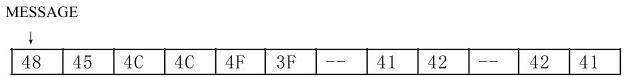

  2. 例6.5用操作符复制操作数
     ARRAY   DB 2 DUP(1,3,2 DUP(4,5))

     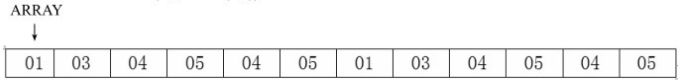

### 类型属性操作符

* WORD PTR    ；字类型      

* BYTE PTR     ；字节类型 

* 注意：类型属性操作符仅是指定变量的“访问类型”，并不改变变量本身的类型。

* 举例

  例6.7  在指令中用类型属性操作符指定对内存变量的访问类型，以匹配两个操作数。 
  	OPER1    DB  3, 4
  	OPER2    DW  5678H, 9
  	┇
  	MOV   AX，WORD PTR OPER1     ；从OPER1处取一个字，使AX=0403H
  	MOV   BL, BYTE PTR OPER2     ；从OPER2处取一个字节，使BL=78H
  	MOV   BYTE PTR[DI], 0               ；常数0送到内存字节单元，使(DS*10H+DI)=00H

### THIS操作符和LABEL伪操作

* 一个变量可以定义成不同的访问类型，THIS操作符或LABEL伪操作都可以实现。

* 格式

  * THIS  type
  * name   LABEL  type

* 操作：指定一个类型为type的操作数，使该操作数的地址与下一个存储单元地址相同。

* 举例

  例6.8  把变量定义成不同访问类型，以便指令中可灵活选用。指令执行结果如图所示。  
  BUF=THIS  WORD ;BUF常量
  DAT   DB  8,9 
  OPR_B    LABEL  BYTE
  OPR_W    DW  4 DUP(2)
  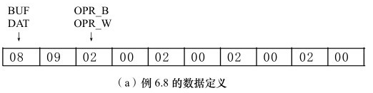
  MOV   AX,  1234H ;AX=1234H
  MOV   OPR_B, AL ;(OPR_B)=34H
  MOV   OPR_W+2, AX ;(OPR_W+2)=1234H
  MOV   DAT+1, AL ;(DAT+1)=34H
  MOV   BUF, AX ;(BUF)=1234H
  表达式BUF=THIS  WORD使BUF和DAT指向同一个内存单元。
  LABE伪操作使得OPR_B和OPR_W指向同一个内存单元。
  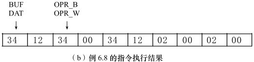

### 表达式赋值伪指令“EQU” 和 “=”

* 可以用赋值伪操作给表达式赋予一个常量或名字。格式如下：
  Expression_name  EQU  Expression
  Expression_name  =  Expression
* 注意

  * 表达式中的变量或标号，必须先定义后引用。
  * EQU伪操作中的表达式名是不允许重复定义的，而“＝”伪操作则允许重复定义。 
* 举例
  VALUE=53
  VALUE=VALUE+89
  如果把上面的两条赋值伪指令的“=”改成“EQU”，则为重复定义表达式名VALUE，是不允许的。

### 汇编地址计数器\$与定位伪指令

1. 地址计数器 \$

   * 定义

     * 地址计数器是一个16位的变量，用\$表示
     * 当\$用在伪操作的参数字段时，它所表示的是地址计数器的当前值。
     * 开始汇编或在每一段的开始，地址计数器初始化为零，接着每处理一条指令，地址计数器就增加一个值，此值为该指令所需要的字节数，以安排下条指令的存放位置。
     
   * 举例

     1. array dw 1,2,\$+4,3,4,\$+4，array分配的偏移地址 为0074H。
         [0074]  01,00 ,  02,00,  7C,00，03,00,  04,00, 82,00
                                            0078+4                       007E+4
        注：ARRAY数组中的两个\$+4得到的结果是不同的，这是由于\$的值在不断变化。

     2. 例6.9 考察\$的作用，假定\$初值=0，数据在内存中的存放如图所示。
        ARRAY　 DW 3,\$+7,7
        COU=\$
        NEW　　 DW COU
        
        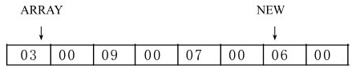

2. ORG 伪操作 

   * 定义：用来设置当前地址计数器的值。

   * 格式：ORG  constant或expression

   * 操作：如常数表达式的值为n，则该操作指示下一个字节的存放地址为n。

   * 举例

     例6.10  考察ORG伪操作,数据在内存中的存放如图所示。 
     ORG  0
     DB   3
     ORG  4
     BUFF   DB  6
     ORG    \$+6
     VAL    DB  9

     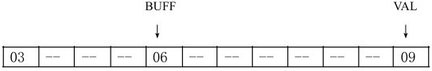

3. EVEN 伪操作
   EVEN伪操作使下一个变量或指令开始于偶数地址。

4. ALIGN 伪操作
  ALIGN伪操作使下一个变量的地址从4的倍数开始。

### 基数控制伪指令

* 汇编程序默认的数为十进制数，所以在程序中使用其他基数表示的常数时，需要专门给以标记如下。

  1. 二进制数：由一串0和1组成，其后跟以字母B(Binary)，如00101001B。

  2. 十进制数：由0～9的数字组成的数，一般情况下，后面不必加上标记，在指定了其他基数的情况下，后面跟字母D(Decimal)，例如23D。

  3. 十六进制数：由0～9及A～F组成的数，后面跟字母H(Hexadecimal)。这个数的第一个字符必须是0～9，所以如果第一个字符是A～F时，应在其前面加上数字0，如0FFFFH。

* 汇编程序默认的数为十进制数，程序中使用其它基数表示的常数要标记。
  .RADIX伪操作可以把默认的基数改变为2~16范围内的任何基数。
  * 格式：
    .RADIX     expression   ； 表达式表示基数值（用十进制数表示）。
  * 注意： 在用.RADIX把基数定为十六进制后，十进制数后面都应该跟字母D。

### 过程定义伪指令

* 过程/子程序，是能完成特定功能的独立的代码模块。是进行模块化程序设计的基础。

* 80x86中调用过程指令是CALL，从过程返回的指令是RET。

* 格式

  过程名  PROC  [属性]     ；过程开始
                               		  ；过程体
  过程名  ENDP              	；过程结束

* 过程名是标识符，起到标号的作用，是子程序入口的符号地址。

* 过程的属性可以是FAR或NEAR类型。NEAR为近，是段内调用。FAR类型为远，是跨段调用，缺省时为NEAR。

* 举例

  例 6.11

  ```assembly
  data    segment                 ；定义数据段data
      string   db 'hello,world!$'
  data    ends
  
  code    segment                 ；定义代码段code
  assume  cs:code,ds:data         
  main    proc   far                 ；定义过程main
  	mov  ax,data             
  	mov  ds,ax
  	mov  dx,offset string	
  	mov  ah,9 ;输出字符串
  	int  21h
  	
  	mov  ah,4ch
  	int  21h
  main    endp
  code    ends
  	end   main                 ；汇编结束, 程序起始点main 
  ```

  

## 语句格式

### 指令和有关数据定义的伪指令格式

[name]　 operation　 operand　[; comment]
[名字]　　　 操作　　操作数　  [; 注释]
上面带方括号的两项是可选项。各项之间必须用‘空格’隔开。

* 名字项
  * 定义：是一个符号，可以是指令的**标号**，也可以是**变量名**。
  * 组成：字母、数字和专用字符（?,·,@,_,\$）
  * 属性
    1. 段值（指明存在于哪个段中）
       名字项对应存储段的段地址
    2. 偏移值（指明段内的位置）
       名字项在存储段内的偏移地址
    3. 类型（指明名字项的类型属性）
       标号的类型可以是NEAR和FAR两种
       变量的类型可以是 BYTE,WORD,DWORD,FWORD,QWORD,TBYTE
    
  * 注意
    * 除数字外，所有字符都可以放在源语句的第一个位置。
    * 名字中如果用到·，则必须是第一个字符。
    * 不能与保留字相同。
    * 不能重复定义。

* 操作项
  * 定义：是一个操作码的助记符，它可以是**指令**、**伪指令**或**宏指令名**。

* 操作数项
  * 定义：由一个或多个表达式组成，它提供该操作所要求的操作数或相关信息。

  * 注意
    * 表达式在**汇编阶段**起作用，只有正确的表达式才能通过汇编。

  * 分类

    * 算术操作符

      * 算术运算符主要有+、－、*、/、MOD。

        * MOD也称为取模，它得到除法之后的余数。
        * 减法运算可用于段内两个操作数地址（以变量名表示）的运算，其结果是一个常数，表示这两个变量之间相距的字节数。

      * 注意：算术操作符在表达式中的使用，其结果必须有明确的物理意义时才是有效的

      * 举例
        例6.12  算术操作符的使用，设有如下定义：
        ORG 0
        VAL=4
        DA1  DW  6，2，9，3
        DA2  DW  15，17，24
        COU=\$-DA2
        VAL是常数，无需确定它的位置就可以使用。
        DA1和DA2是变量的符号地址，它们在内存中有确定的位置，我们只能根据它们的地址才能访问。
        MOV    AX，DA1\*4          ;错，地址乘或除，没有意义
        MOV    AX，DA1\*DA2        ;错，地址乘或除，没有意义
        MOV    AX，DA1+DA2        ；错，地址相加，没有意义
        MOV    AX，BX+VAL          ；错，BX+VAL须用指令实现
        MOV    AX，[BX+VAL]        ；地址表达式，汇编成MOV  AX， [BX+4]，寄存器相对寻址
        MOV    AX，DA1+VAL        ；地址表达式，汇编成MOV  AX，[4]，直接寻址
        MOV    AX，[DA1+VAL]      ；地址表达式，汇编成MOV  AX，[4]
        MOV    AX，VAL\*4/2           ；数字表达式，汇编成MOV  AX，8，立即寻址
        MOV    AX，[VAL\*4/2]         ；数字表达式，汇编成MOV  AX，8（masm中若不加段超越前缀，[数字]外的中括号会被去除）
        MOV    CX，(DA2-DA1)/2    ；得到DA1区数据个数，汇编成MOV  CX，4
        MOV    BX，COU                 ；得到DA2区的字节数， 汇编成MOV  BX，6

    * 逻辑与移位操作符

      * 逻辑操作符：AND,  OR,  NOT, XOR。
      * 移位操作符：SHL和SHR。
      * 格式：expression  操作符 number
      * 注意
        * 逻辑与移位操作符都是**按位**进行的。
        * 逻辑与移位操作符都只能用于**数字表达式**中。
      * 举例
        1. 例6.13  逻辑操作符的使用
           ARY  DW   8
           VAL=4
           MOV   AX，BX AND 0FFH    ；错，BX AND VAL须用指令实现（而且编译时也不肯定AX这个地方的值）
           MOV   AX，ARY AND 0FFH  ；错，ARY AND VAL须用指令实现
           MOV   AX，VAL AND 0F0H   ；汇编成MOV  AX，0
           AND   AX，VAL OR 0F0H      ；汇编成AND  AX，0F4H
        2. 例6.14  移位操作符的使用
           ARY  DW   8
           VAL=4
           MOV    AX，BX SHL 2      ；错，BX 左移须用指令实现
           MOV    AX，ARY SHL 2    ；错，ARY 左移须用指令实现
           MOV    AX，VAL SHL 2    ；汇编成MOV  AX，10H
           MOV    AX，8  SHL 2        ；汇编成MOV  AX，20H
           MOV    AX，VAL SHL 15  ；汇编成MOV  AX，00H

    * 关系操作符

      * 关系操作符用来对两个操作数的大小关系作出判断。

        * EQ（相等）
        * NE（不相等）
        * LT（小于） 
        * LE（小于等于）
        * GT（大于）
        * GE（大于等于）

      * 注意

        * 关系操作符的两个操作数必须都是**数字**，或是**同一段**内的两个存储器**地址**。
        * 计算结果为逻辑值，结果为真表示为0FFFFH，结果为假表示为0。
      
    * 举例
      
      例6.15  关系操作符的使用
        VAL=4,val1=6,val2=3
        MOV    AX，BX  GT 2     		；错，BX 是否大于2须用指令实现判断
        MOV    AX，VAL GE 2			；汇编成MOV  AX，0FFFFH
        MOV    AX，8  LE VAL    		；汇编成MOV  AX，0
        MOV    AX，(val2-val1) GE 5  ；汇编成MOV  AX，0（是编译器在编译期间处理，因此看做有符号数！）
        MOV    AX，255 GE 5      	   ；汇编成MOV  AX，0FFFFH
        MOV    AX，65536 GE 5      	；编译不通过，65536超过了2^16-1
    
  * 数值回送操作符

    * TYPE

      * 格式：TYPE  expression
      * 操作
        * 表达式为变量，则汇编程序回送该变量的以字节数表示的类型。 
          DB        回送1           DW       回送2
          DD        回送4           DF         回送6
          DQ        回送8           DT         回送10
        * 表达式为标号，则汇编程序回送代表该标号类型的数值。
          NEAR    回送-1
          FAR       回送-2
        * 表达式为常数则回送0。 

    * LENGTH

      * 格式： LENGTH  variable 
      * 操作
        * 若变量用DUP定义，则返回**总变量数**，否则为1。
        * 嵌套的DUP不计。所以，对于使用嵌套的DUP复制的数据不能据此得到正确的总变量数。

    * SIZE

      * 格式：SIZE  variable 
      * 操作
        * SIZE=TYPE*LENGTH
        * 若变量用DUP定义，则返回**总字节数**，否则为单个变量的字节数。
        * 嵌套的DUP不计，所以，对于使用嵌套的DUP复制的数据不能据此得到正确的总字节数。

    * OFFSET

      * 格式：OFFSET    variable或label
      * 操作：回送变量或标号的偏移地址（16位）。

    * SEG

      * 格式：SEG    variable或label
      * 操作：回送变量或标号的段地址（16位）。 

    * 举例

      例6.16  数值回送操作符的使用
      设有如下定义：
      ORG  0
      VAL=4
      ARR   DW  4  DUP(3)
      BUF   DW  4  DUP( 4 DUP(3))
      DAT   DW  15，17，24
      STR   DB  ‘ABCDEF’
      汇编程序对下面的指令汇编结果为：
      MOV    AX，TYPE ARR                ；汇编成MOV  AX，2
      MOV    AX，LENGTH  ARR         ；汇编成MOV  AX，4
      MOV    AX，LENGTH  BUF         ；汇编成MOV  AX，4
  MOV    AX，LENGTH  DAT         ；汇编成MOV  AX，1
  MOV    AX，SIZE  ARR                ；汇编成MOV  AX，8
  MOV    AX，SIZE  BUF                ；汇编成MOV  AX，8（不是32）
      MOV    AX，SIZE  DAT                ；汇编成MOV  AX，2
  MOV    AL，SIZE  STR                 ；汇编成MOV  AX，1
  MOV    AX，OFFSET  ARR         ；汇编成MOV  AX，0
  MOV    BX，SEG  ARR                ；汇编成MOV  BX，(DS)

* 注释项
  * 定义：用来说明程序或语句的功能。

## 标号与变量

### 区别

|                                     |                            变量                            |            标号            |
| :---------------------------------: | :--------------------------------------------------------: | :------------------------: |
|              定义位置               |                      数据段代码段均可                      |           代码段           |
|                含义                 |               变量数据在内存中存放的符号地址               | 指令在内存中存放的符号地址 |
|                作用                 |                      为指令提供操作数                      |   为指令提供标识（地址）   |
|                组成                 |                           标识符                           |   标识符及后面的一个冒号   |
| 类型属性<br/>(可以使用type指令区分) | BYTE(1B),WORD(2B),DWORD(4B),FWORD(6B),QWORD(8B),TBYTE(10B) |          near,far          |

### 共同点

均具有偏移属性、段属性、类型属性

## 例题★

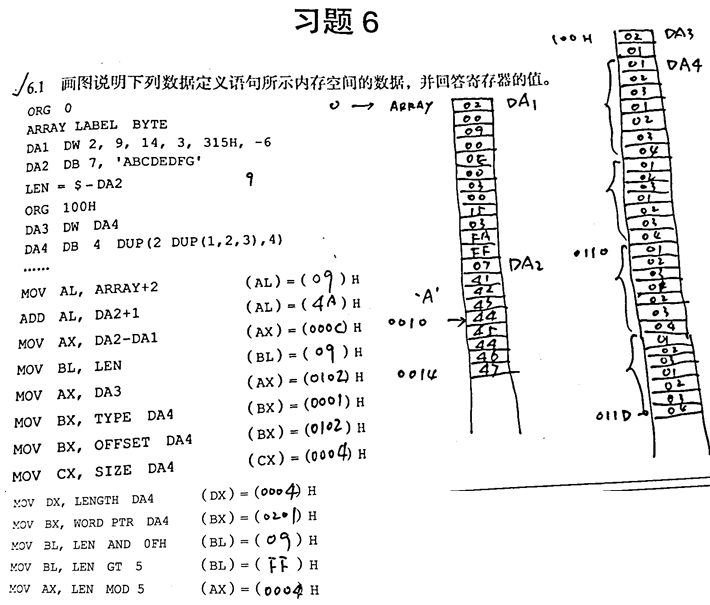

# 第7章 分支与循环程序设计

## 程序设计的一般步骤:

1. 分析问题，确定算法和数据结构。
2. 根据算法绘制程序流程图。
3. 根据流程图编写程序。
4. 上机调试程序。

## 程序结构分类

有顺序, 分支,循环,子程序4种

## 分支程序设计

### 分支程序结构

### 单分支程序

* 题目

例7.1   双字长数存放在DX和AX寄存器中(高位在DX)，求该数的绝对值(用16位指令)。 

* 算法分析

   1. 双字长数高字在DX中，低字在AX中；
   2. 判该数的正负，为正数（最高位为0），该数不处理；为负数，就对该数求补（即反码加1）。

* 图解

  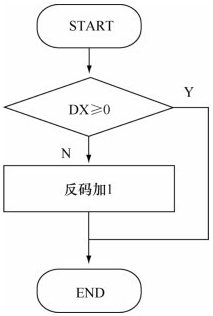

* 代码

```assembly
code  segment
	assume  cs:code
start:
    test   dx,8000h         ;测试数的正负，等价于dx最高位与1
    jz     exit             ;不为负数就退出
    
    not    ax				;求补，反码加一
    not    dx
    add    ax,1
    adc    dx,0
exit:  
    mov    ah,4ch
    int    21h
code  ends
	end    start
```

### 复合分支程序

* 题目

  例7.2   从键盘输入一位十六进制数，并将其转换为十进制数输出显示。

  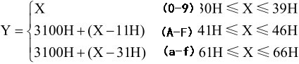

* 算法分析：从键盘输入一个十六进制数，有以下四种情况
  
     1. 为数字0～9（ASCII码30～39H），无需处理，直接输出；
     2. 为大写字母A～F（ASCII码41～46H），先输出31H（1），再输出该数ASCII码-11H；
     3. 为小写字母a～f（ASCII码61～66H），先输出31H，再输出该数ASCII码-31H；
     4. 该数不为0～9、A～F、a～f，是非法字符，应退出程序或输出错误信息。
     
* 图解

   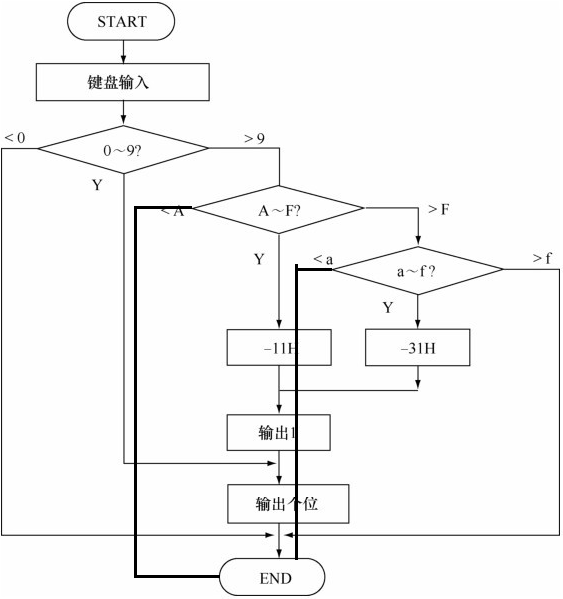

* 代码

  ```assembly
  code segment
  	assume cs:code
  start:  
      mov   ah,1                ;键盘输入至AL
      int   21h
      
      cmp   al,30h           
      jl    exit                        ;非法输入
      
      cmp   al,39h
      jle   dig                        ;输入是数字0～9
      
      cmp   al,41h
      jl    exit                         ;非法输入
      
      cmp   al,46h 
      jle   print                      ;输入是大写A～F
      
      cmp   al,61h
      jl    exit                         ;非法输入
  
      cmp   al,66h
      jg    exit                     ;非法输入
      
      sub al,31h            
      jmp   out1                  ;输入是小写a～f
  print: sub   al,11h           
  out1: mov   dl,31h             ;输出字符1
      push  ax                     ;暂存AX
      mov   ah,2
      int   21h                      ;2号中断在int 21H指令子程序中改写了AL=DL！！！
      pop   ax                      ;恢复AX
  dig: mov dl,al                ;输出个位
      mov   ah,2
      int   21h
  exit: mov ah,4ch            ;程序终止并退出  
  	int 21h  
  code ends
  	end start
  ```

### 多分支程序

* 题目

  例7.3  根据键盘输入的一位数字(1～4)，使程序转移到4个不同的分支中去，以显示键盘输入的数字。

* 算法分析

  1. 从键盘输入一个数1～4
  2. 建立一个分支向量表branch ，集中存放四个分支的偏移地址；
  3. 每个偏移地址位16位，占用2个单元；
  4. 四个分支的偏移地址在转移地址表的地址是：转移地址表首址+输入数字（0～3）×2；
  5. 用间接寻址方式转向对应分支。

* 图解

  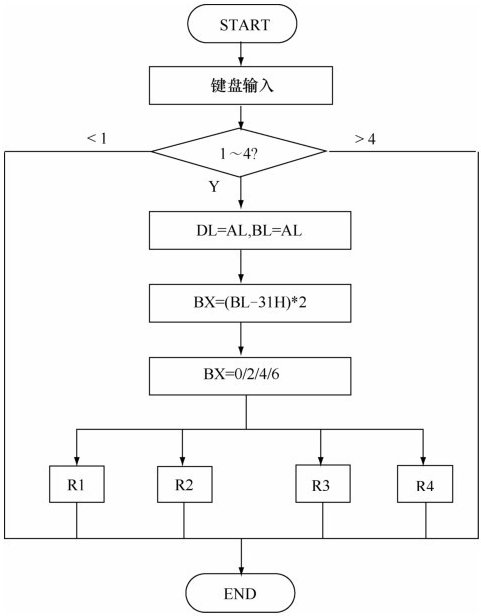

* 代码

  ```assembly
  code    segment
  	assume  cs:code,ds:code
  start:    
      mov   ax,code           ;ds=cs
      mov   ds,ax
      
      mov   ah,7             ;键盘输入无回显
      int   21h
      
      cmp   al,31h           
      jl    exit                     ;非法输入
      cmp   al,34h
      jg    exit                    ;非法输入
      
      mov   dl,al             ;放入dl,待显示
  
      mov   bl,al
      sub   bl,31h             ;转换ascii码为数值
      
      shl   bl,1                   ;(bl)×2,指向分支向量表中某地址
      mov   bh,0
      
      jmp   branch[bx]        ;转向分支 
  r1:    mov   ah,2
      int   21h                       ;显示键盘输入的数字DL
      jmp   exit
  r2:    mov   ah,2
      int   21h
      jmp   exit
  r3:    mov   ah,2
      int   21h
      jmp   exit
  r4:    mov   ah,2
      int   21h
      jmp   exit
  exit: mov   ah,4ch           ;程序终止并退出
      int   21h
      
  branch dw r1 ;变量，存放各个分支首地址（注意：变量名和变量值定义必须在同一行）
      dw    r2
      dw    r3
      dw    r4
  code    ends
  	end   start
  ```

## 循环程序设计

### 循环程序结构

### 计数循环程序

* 题目

  例7.4  把BX中的二进制数用十六进制显示.（设BX=123AH）

* 算法分析

  1. 屏幕显示字符用2号DOS功能调用，DL=输出字符。 
  2. BX寄存器每4位表示一位十六进制数位：BX=123AH=0001 0010 0011 1010
  3. BX=1         2               3                A          H,
     1-->31H     2-->32H     3-->33H      A-->41H 
  4. BX从左到右循环移位，每移4位，就把要显示的4位二进制位移到最右边。
  5. 取出最右边的4位，加上30H，转换成8位ASCII字符码。
  6. 当8位二进制数大于39H时，应再加上7。（41H-3AH=7H）

* 图解

  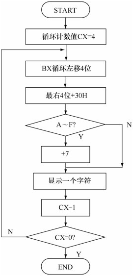

* 代码

  ```assembly
  code    segment
  	assume  cs:code
  start:  mov   cx,4
  shift:
  	rol   bx,1             ;连续循环左移4位
      rol   bx,1
      rol   bx,1
      rol   bx,1
      mov   al,bl
      and   al,0fh           		;取最右4位
      add   al,30h           	;转为ascii
      cmp   al,39h
      jle   dig              	 ;是0～9则转dig
      
      add   al,7            	 ;是A～F
   dig: mov   dl,al
       mov   ah,2
       int   21h
       loop  shift
       
       mov   ah,4ch
       int   21h
  code    ends
  	end   start
  ```

### 条件循环程序

* 题目
  例7.5 从键盘输入8位二进制数作为逻辑尺。再输入一个英文字母，根据逻辑尺当前的最高位标志显示输出该字母的相邻字符，标志位为0则显示其前趋字符，标志位为1则显示其后继字符。显示相邻字符后，逻辑尺循环左移一位，再接收下一个字母的输入，并依据逻辑尺显示相邻字符，直到回车键结束程序。

* 算法分析

    1. 循环次数已知，但每次循环所做的操作不同； 
    2. 设置逻辑尺，循环中依据逻辑尺中的标志位选择操作。

* 图解

    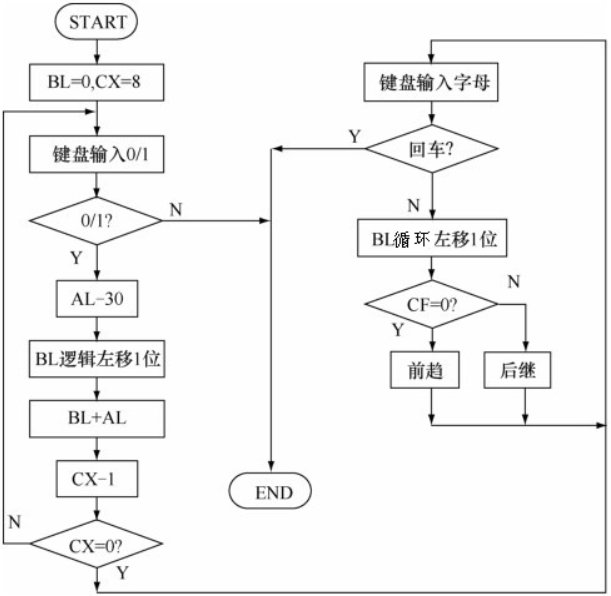

* 代码

    ```assembly
    code    segment
        assume  cs:code
    start:    
    	mov   bx,0            	;初始化，BL存储逻辑尺
        mov   cx,8
    inlog: 
    	mov   ah,1            	 ;键盘输入0/1逻辑尺
        int   21h
        
        cmp   al,30h           
        jb    exit             		 ;非法输入
        cmp   al,31h
        ja    exit             		 ;非法输入
        
        sub   al,30h       		 ;输入是0/1，减'0'
        shl   bl,1					;逻辑左移
        add   bl,al
        loop  inlog
        
        mov   ah,2
        mov   dl,10            ;输出换行
        int   21h
    inchr: 
    	mov   ah,1             ;键盘输入字母
        int   21h
        
        cmp   al,13 
        je    exit       	       ;回车键
        
        mov   dl,al			;dl存储输入的字母
        rol   bl,1			;循环左移，OPR整体向左移一位，最高位移出，同时将其送CF标志位和最低位
        jnc   k30              	 ;cf=0 则转k30	
        
        inc   dl			;后继
        jmp   putc
    k30: dec   dl			;前驱
    putc: mov   ah,2
        int   21h
        jmp   inchr
    
    exit: mov   ah,4ch          	 ;程序终止并退出  
    	int   21h
    code    ends
    	end   start
    ```

### 条件计数循环程序

* 题目

  例7.6  设置键盘缓冲区为16个字节，从键盘输入一串字符，然后再从键盘输入一个单个字符，查找这个字符是否在字符串中出现，如果找到，显示该字符串，否则显示‘NOT FOUND’。

* 算法分析

    1. 使用DOS系统功能调用10号功能实现键盘缓冲区输入，
    2. 使用1号功能实现单个字符输入，
    3. 使用9号功能实现字符串显示输出。
    4. 程序采用循环结构实现查找，最大计数值为实际输入的字符个数。 

* 图解

  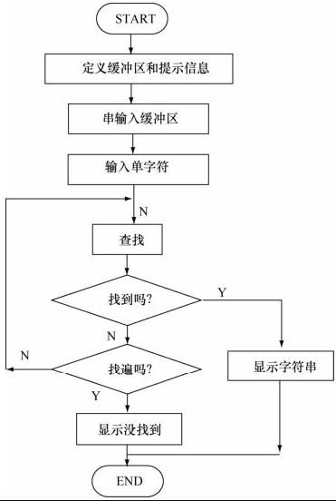

* 代码

  ```assembly
  data    segment
      buffer   db   16,?,16 dup(?),13,10,'$' ;包括回车符的最大输入字符串长度为16，13回车10换行
      inputs   db   13,10,'input string:$' ;回车换行符加提示字符串
      getc     db   13,10,'input char:$'   ;回车换行符加提示字符串
      output   db   13,10,'not found$'     ;回车换行符加提示字符串
  data    ends
  
  code    segment
  	assume  cs:code,ds:data
  start:
      mov   ax,data             ;ds赋值
      mov   ds,ax
      
      lea   dx,inputs           ;信息提示输入串
      mov   ah,9
      int   21h 
      
      lea   dx,buffer           ;键盘输入串到缓冲区
      mov   ah,10
      int   21h
      
      lea   dx,getc            ;信息提示输入字符
      mov   ah,9
      int   21h
      
      mov   ah,1              ;输入字符到al
      int   21h
      
      mov   bl,al              ;输入要查找的字符保存到bl
      lea   di,buffer+1     	 ;di作为指针指向缓冲区，第一次循环时指向输入字符串第一个字符
      mov   cl,buffer+1        ;cx设置计数值为实际字符串长度
      mov   ch,0				;cx高位置为0
  seek:
  	inc   di
      cmp   bl,[di]
      loopne   seek             	 ;未完且没找到,转seek继续循环
  
      jne   nof                     ;没找到,转nof输出‘not found’
      
      mov   dl,10             	 ;输出换行	
      mov   ah,2
      int   21h
      
      lea   dx,buffer+2             ;指向缓冲区,输出字符串
      mov   ah,9                   
      int   21h
      jmp   exit 
  nof: lea   dx,output
      mov   ah,9                   
      int   21h
  exit: mov   ah,4ch
      int   21h
  code    ends
  	end   start
  ```
  

### 多重循环程序

* 题目

  例7.7  显示输出20H～7EH的ASCII码字符表，每行16个字符。

* 算法分析

  1. 20H～7EH的ASCII字符共有95个，需6行显示。（8*16-1-32=95）（‘空格'=20H）

  2. 程序需两重循环，内循环输出每行16个字符，循环计数初值为16，程序终止条件是显示最后一个字符。

* 运行结果截图

  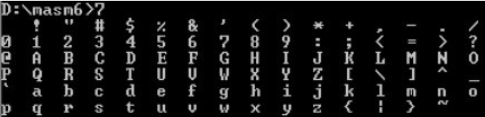

* 代码

  ```assembly
  code    segment
  assume  cs:code
      ;常量
      k=16
      first=20h
      last=7eh
  start:  
  	mov   dx,first              ;从第一个开始
  a10:    
  	mov   cx,k                ;每行16个
  a20:    
  	mov   ah,2
      int   21h				;显示字符
      
      cmp   dl,last              ;是最后一个则退出
      je    exit
      
      push  dx                   ;暂存dx
      mov   dl,20h               ;空2格
      int   21h
      int   21h
      
      pop   dx                   ;恢复dx
      add   dx,1
      loop  a20                  ;进入内循环
      
      push  dx                    ;暂存dx
  
      mov   dl,13               ;回车
      int   21h
      mov   dl,10               ;换行
      int   21h
      
      pop   dx                      ;恢复dx
      loop  a10                    ;进入外循环
  exit: 
  	mov   ah,4ch
      int   21h
  code    ends
  	end   start
  ```
