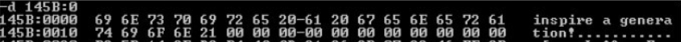

# 习题3

3.13 假定数据段存放情况如下图所示，请写出代码，输出数据段的字符串“inspire a generation!”。



```assembly
data segment
	str db 'inspire a generation!'
	last db ? ;注意，9号中断输出字符串要以$作为结尾
data ends
assume cs:code,ds:data
code segment
start:
	mov ax,data
	mov ds,ax
	mov last,'$' ;给末尾补充一个字符串结束标志符
	
	lea dx,str
	mov aH,9
	int 21H
	
	mov aH,4cH
	int 21H
code ends
	end start
```

# 习题5

5.8 在Debug下设置（SP）=20H，设置AX、BX、CX、DX为不同值，把这四个寄存器内容依次压入堆栈，再从堆栈中依次弹出到SI、DI、BP、BX寄存器。写出一段程序实现上述操作，并画出每条入栈指令执行后SP和堆栈中数据的变化。

```assembly
data segment
	stack dw 16 dup(?)
	top dw $ ;设置(SP)=20H
data ends
assume cs:code,ss:data
code segment
start:
	mov ax,data
	mov ss,ax
	
	mov sp,top
	mov ax,255
	mov bx,256
	mov cx,257
	mov dx,258
	
	push ax
	push bx
	push cx
	push dx
	
	pop si
	pop di
	pop bp
	pop bx
	
	mov ah,4cH
	int 21H
code ends
	end start
```

5.13 把AX中的内容依次倒排序，即第0位移到第15位，第1位移到第14位…

```assembly
assume cs:code
code segment
start:
	mov ax,0111100001111000B ;ax=7878H
	mov cx,16 ;循环次数
	mov bx,0 ;存放中间结果
circle:
	shl bx,1
	shr ax,1
	adc bx,0
	loop circle

	mov ax,bx ;bx=1e1eH

	mov ah,4cH
	int 21H
code ends
	end start
```

5.17 在下列程序段的括号中分别填入如下指令，程序执行完后，AX、CX的内容是什么？
（1）LOOP　 L1		;cx=0，ax=0180H
（2）LOOPE　 L1	;cx=0，ax=0180H
（3）LOOPNZ　L1	;cx=2，ax=0030H（无论如何循环体至少会执行一次）
MOV　 AX,　6
MOV　 CX,3
L1: ROL　 AX,CL
TEST　 AL,3
（　　　　）

```assembly
assume cs:code
code segment
start:
	mov ax,6 ;0110B
	mov cx,3 ;0011B
L1:
	rol ax,cl ;每次循环左移cl位
	test al,3 ;al and 3，仅影响标志位
	loop l1
	;loope l1 ;等效loopz
	;loopnz l1
	
	mov ah,4cH
	int 21H
code ends
end start
```


# 实验4 算术及位串处理程序

1. 在数据段预先存放16个十六进制数的ASCII码，首地址为ASC。从键盘输入一位十六进制数到BX，用ASC[BX]寻址方式找到对应数位的ASCII码，并取出显示。

    ```assembly
    assume cs:code,ds:data
    data segment
        ; 用ASC[BX]寻址方式找到对应数位的ASCII码，所以要按照ascii码排列
        asc db '0','1','2','3','4','5','6','7','8','9','A','B','C','D','E','F' ;数据段定义,这里我们把这个16进制的ascii码全部存到db中去
    data ends

    code segment
    start:
        mov ax,data 
        mov ds,ax

        mov ah,1h
        ; 这个int表示调用dos系统的功能（在使用int21h功能的时候，必须给ah这个寄存器赋值，我们这里赋值1） 
        ; 这个表示调用DOS 1h号功能：键盘输入并回显，输入的值进入al
        int 21h 

        ; 将al的值赋给bl
        mov bl,al 
        ; bx的h为置为0
        mov bh,0 
        ; 从键盘输入一位十六进制数到BX
        ; 由于下面要与40h比较而cmp必须是字比较
        ; cmp是比较函数,比较的结果会影响ZF，SF ，
        ; 如果ZF=1则AX=BX 
        ; 如果ZF=0则AX!=BX 
        ; 如果SF=1则AX<BX 
        ; 如果SF=0则AX>=BX
        cmp bx,40h
        ; 由于A的ascii码是40h，小于则是数字，大于等于则是字母
        ; jns用于判断SF为不为1（bx>=A），如果不为1那么就跳转到test这段
        ; alp为alpha即字母SF=0未产生标志位则说明bx比A大是字母跳转到alp
        jns alp
        js num;否则跳转到num
    num:
        sub bx,30h;bx为数字(因为数字0的ASCII为48,16进制为30，所以我们减去30)
        jmp over ; 跳转到over函数
    alp:
        sub bx,37h;bx-41H(A)+10(偏移量)=bx-37H则为数字
        jmp over
    over:
        mov cl,asc[bx];cl的值是对应数位的下标，这里我们给cl寄存器放入asc这个数组对应的字符串
         mov dl,cl
         mov ah,2 ;调用DOS 2h号回显功能,注意回显功能只能显示dl，所以我们需要把内容放到d1中
         int 21h

        mov ah,4ch
        int 21h;结束
    code ends
    end start
    ```

2. 用16位指令编制程序，处理32位的加减乘除算术四则运算题。

    ```assembly
    assume cs:code,ds:data
    ; 这里我们计算（3*X+Y-Z）/5的值
    data segment
        ; 下面这里是自己定义的数据段
        ; db定义字节类型变量，一个字节数据占1个字节单元，读完一个，偏移量加1
        ; dw定义字类型变量，一个字数据占2个字节单元，读完一个，偏移量加2
        ; dd定义双字类型变量，一个双字数据占4个字节单元，读完一个，偏移量加4
        ; 我们这里定义了x,y,z,v （v 用于显示结果)
        x dw 5 ; 自定义数据
        y dw -2 ;0FFFEH
        z dw 3
        v dd ?
    data ends;定义数据段，其中X,Y,Z为一个字节，V为32位结果双字
    
    code segment
    start:
        mov ax,data 
        mov ds,ax
        ; ax寄存器先赋值为3
        mov ax,3
        ; imul是有符号数的乘法，操作数为ax也就是3，然后3再去乘以ax
        imul x;IMUL结果保存在AX（低位）和DX（高位）中=15=0000 000FH
        ; 把低位结果转移到cx中
        mov cx,ax
        ; 然后把高位的结果转移到bx中
        mov bx,dx;转移DX到BX中
    
        ; 我们进行下一轮计算这里我们先把y放入ax中
        mov ax,y
        cwd;将Y扩展为32位，以下若干行相同
        ; add加法计算，计算ax+cx，结果放入cx中
        add cx,ax
        ; 这里还要计算dx和bx（这里是计算进位）
        adc bx,dx ;15-2=13=0000 000DH
    
        mov ax,z
        ; cwd把字扩展成字节（就是16位变成32位，这里扩展的是ax寄存器）
        cwd
        ; 减法计算
        sub cx,ax
        sbb bx,dx ; 带借位减法指令 13-3=10=0000 000AH
    
        ; 计算完(3*X+Y-Z)后，我们准备计算除法
        ; 先把cx的值放入ax中
        mov ax,cx
        ; 然后把bx的值放入dx中
        mov dx,bx
        ; 把要除的数放入cx
        mov cx,5
        ; 除法计算，这里ax放的是操作数
        idiv cx ;10/5=2=0000 0002H
    
        ; lea 加载有效地址，可以将有效地址传送到指定的的寄存器 这里我们把变量v的地址放入bx寄存器中
        lea bx,v;取V的地址
        ; 这里我们把余数dx的值放入v的低位
        mov [bx],dx ;0000H
        mov [bx+2],ax;将结果保存在[bx]到[bx+4]的内存位置32位 ;0002H
    
        mov ah,4ch
        int 21h
    code ends
    end start
    ```

3. 用字符串处理指令编制程序，处理字符串的比较和查找，显示结果。

    1. 字符串的比较程序中，一个字符串在数据段定义，另一个相等长度的字符串在程序执行时从键盘输入，必须定义键盘缓冲区，并指出不相等的位置。

        ```assembly
        assume cs:code,ds:data,es:ext
        ext segment
            BS=11 ;字符串长度
            string db '1806040103$'
        ext ends
        data segment
            len db BS ;缓冲区大小
            num db ? ;读入字符串后自动填充其长度
            buffer db BS dup('?')
        data ends
        
        code segment
        start:
            mov ax,data
            mov ds,ax
            mov ax,ext
            mov es,ax
        
            ; 下面这两段的作用是从键盘输入内容
            mov ah,0ah
            int 21h
            ; 把字符串长度放入cl寄存器中
            mov cl,num
            mov ch,0 ;cx用于循环计数
            
            mov bl,num
            mov bh,0
            mov byte ptr buffer[bx],'$' ;这三句可加可不加
            
            ; si存储buffer的首地址
            lea si,buffer
            ; di存储string的首地址
            lea di,string
            ; cld相对应的指令是std，二者均是用来操作方向标志位DF（Direction Flag）。cld使DF复位，即是让DF=0，std使DF置位，即DF=1
            ; 这两个指令用于串操作指令中。通过执行cld或std指令可以控制方向标志DF，决定内存地址是增大（DF=0，向高地址增加）还是减小（DF=1，向地地址减小）。
            cld
            ; 用于存放比较结果，当字符串不匹配时，用于指示从哪一位（从1开始）开始不匹配
            mov bl,'0'
            
        xy:
            ; b1的值+1
            inc bl
            ; CMPSB用于比较字节（这里是比较ds:si和es:di所指向的两个字节是否相等）
            ; 如果发现不相等，那么ZF就会置为0
            cmpsb
            ; LOOPZ（为零跳转）指令的工作和 LOOP 指令相同，只是有一个附加条件：为零控制转向目的标号，ZF必须置 1。
            ; 首先执行 CX=CX-1；然后判断，若CX!=0并且同时ZF=1，则转到循环开始标号处执行程序，否则向下继续执行。当进行循环的时候，如果遇到CX=0或者ZF=0，则终止循环。
            loopz xy
            
            ; 等效jz，SF=1就跳转
            jz correct
            ; 我们跳转到xx这段
            jmp xx
        correct:
            ; 这里说明两个字符串完全相同，我们就直接把y放入dl寄存器中
            mov bl,'Y'
        xx:
            ; 把dl寄存器的值输出
            ; 一般DOS中断，单字节输入的都是al，输出的都是dl
            mov ah,2
            mov dl,10 ;'\n'
            int 21h
            mov dl,13 ;'\r'
            int 21h
            mov dl,bl ;显示提示字符
            int 21h
            
            ; 下面这段表示结束本程序，返回dos系统
            mov ah,4ch
            int 21h
        code ends
        end start
        ```
    
    2. 在字符串中查找某个字符，字符串在数据段定义，要查找的字符在程序执行时从键盘输入，并指出找到的位置。
    
        ```assembly
        assume cs:code,ds:data
        data segment
            BS=9 ;字符串长度（没有包括'$'）
            string db '123456789$'
        data ends
        
        code segment
        start:
            mov ax,data
            mov ds,ax
            
            ; 从键盘输入字符al
        	mov ah,01h
            int 21h
            
            ; 把字符串长度放入cl寄存器中
            mov cl,BS
            mov ch,0
            
            mov bx,-1
        xy:
            ; b1的值+1
            inc bx
            ; 如果发现不相等，那么ZF就会置为0
            cmp byte ptr ds:[bx].string,al
            loopnz xy
            
            ; 把dl寄存器的值输出
            ; 一般DOS中断，单字节输入的都是al，输出的都是dl
            jnz error ;没找到
            
            add bx,'1' ;下标从1开始
            jmp output
        error:
            mov bl,'N'
            
        output:
            mov ah,2
            mov dl,10 ;'\n'
            int 21h
            mov dl,13 ;'\r'
            int 21h
            mov dl,bl
            int 21h
            
            mov ah,4ch
            int 21h
        code ends
        end start
        ```

4. AL字节内容反向排序

   ```assembly
   assume cs:code
   code segment
   start:
   	mov al,01010101B ;55H
   	mov ah,0
   	mov bx,0 ;中间结果
   	mov cx,8 ;循环次数为8
   circle:
   	shl bl,1
   	shr al,1 ;把移出来的最低位放到cf中
   	adc bl,0 ;加上al最高位
   	loop circle
   	
   	mov al,bl ;放回 0aaH
   	
   	mov ah,4cH
   	int 21H
   code ends
   	end start
   ```

# 实验5 伪指令

用16位指令编写完整程序，实现下列数据定义语句和相关指令，在Debug下查看内存数据的定义情况，单步跟踪查看各寄存器的值。

```assembly
; 这里我们定义了多个数据
DATA SEGMENT
    ORG 0
    ARRAY LABEL BYTE
    DA1 DW 2,9,14,3,315H,-6
    DA2 DB 7,'ABCDEDFG'
    LEN = $-DA2
    ORG 100H
    DA3 DW DA4 ;注意这里存的是da4的偏移地址0102H
    DA4 DB 4 DUP(2 DUP(1,2,3),4);1 2 3 1 2 3 4   *4times
DATA ENDS
CODE SEGMENT
    ASSUME CS:CODE,DS:DATA
    START:
        ; 下面这些是我们的实际代码，主要就是在进行移位的各种操作
        MOV AX,DATA
        MOV DX,AX
        
        MOV AL,ARRAY+2;MOV AL,[0002]
        ADD AL,DA2+1;MOV AL,[000D]
        MOV AX,DA2-DA1;MOV AX,000C;DA1的长度
        MOV BL,LEN;MOV BL,09；DA2的长度
        MOV AX,DA3;MOV AX,[0100]
        MOV BX,TYPE DA4;MOV BX,0001
        MOV BX,OFFSET DA4;MOV BX,0102
        MOV CX,SIZE DA4;MOV CX,0004
        MOV DX,LENGTH DA4;MOV DX,0004
        MOV BX,WORD PTR DA4;MOV BX,[0102]
        MOV BL,LEN AND 0FH;MOV BL,09
        MOV BL,LEN GT 5;MOV BL,0FFH
        MOV AX,LEN MOD 5;MOV AX,0004
        
        MOV AH,4CH
        INT 21H
    CODE ENDS
END START
```

用16位指令编写完整程序，并上机调试，计算W=（X+Y）×Z，其中所有变量均为16位带符号变量。

```assembly
assume cs:code,ds:data
; 数据段定义，这里我们定义好了x,y,z这四个变量的默认值
data segment
    x db 5
    y db -3 ;0FFFDH
    z db 2
    w db ?
data ends;

code segment
    start:
        mov ax,data
        mov ds,ax
        
        ; 我们把x的值赋给al
        mov al,x
        ; adc是一个带进位的加法指令
        ; 我们这里是计算x+y
        add al,y ;5-3=2
        ; 我们在z放入bl寄存器中
        mov bl,z
        ; 这里我们进行乘法计算（这个是有符号的乘法计算）
        imul bl ;ax=2*2=4
        ; 这里我们获取w的地址并放入bx寄存器中
        lea bx,w
        ; 这里我们把ax的值也就是计算结果，放入w中
        mov [bx],ax
    
        ; 这里我们给al加上'0'=30h 因为我们要显示ascll
        add al,30h

        ; 这里我们输出结果
        mov dl,al
        mov ah,02h
        int 21h

        ; 结束程序
        mov ah,4ch
        int 21h
code ends
	end start
```

# 实验6 分支程序设计

编写程序，如果输入的是大写字母，则输出对应的小写字母；如果输入的是小写字母，则输出对应的大写字母；如果输入的是数字，原样输出；按回车结束。

```assembly
code segment
assume cs:code
; 代码部分
start:
inchr:	
    ; 这里我们读取键盘的输入
    mov ah,1		;输入字符
	int 21h
    ; 判断我们键盘输入的值al是否为回车，如果是那么
	cmp al,13
    ; 这里是如果我们输入的值为回车就直接退出 
	je exit
    ; 这里是判断 是否小于30('0')，如果不是也直接退出程序
	cmp al,30h
	jl exit
    ; 这里我们如果输入的是数字，我们就直接跳转到输出
	cmp al,39h
	jle outnum
    ; 这里判断是否输入的是否为字母，如果不是那么也直接退出
	cmp al,41h 'A'
	jl exit
    ;输入为大写字母，则跳转	
	cmp al,5Ah ;'Z'
	jle outs
    ; 这里判断是否为小写字母
	cmp al,61h ;'a'
	jl exit
    ;输入为小写则跳转
	cmp al,7Ah ;'z'
	jle outl
; 我们输入的是数字的情况 
outnum:
    ; 这里我们输出数字，输出完毕后我们直接跳转到输入部分继续输入
    mov dl,al
	mov ah,2
	int 21h
	jmp inchr
; 这里是大写字母的情况
outs:	
	;将输入的大写字母加上20h转成小写字母
    add al,20h
    ; 输出内容
	mov dl,al
	mov ah,2
	int 21h
	jmp inchr
outl:
    ;同理,将小写字母减去20h转成大写字母
    sub al,20h
    ; 输出内容
	mov dl,al
	mov ah,2
	int 21h
	jmp inchr
; 退出程序 
exit:	
    mov ah,4ch
	int 21h
code ends
	end start
```

分离字数组ARRAY中的正、负数，把其中的正数复制到PDATA数组；负数复制到NDATA数组，并分别统计正、负数个数。

```assembly
ASSUME CS:CODES,DS:DATAS,es:ext
; 我们这里定义一个数组里面并赋初值
DATAS SEGMENT
    array  dw 1,2,3,-4,5,-6,7,-8 
DATAS ENDS
; 这里我们定义两个数组，默认分配8位数据
ext segment
	pdata dw 8 dup(?)
	ndata dw 8 dup(?) ;存储负数
	a db  30h ;存储负数的个数(assci码)
	b db  30h ;'0'=30H
ext ends

; 代码部分
CODES SEGMENT
START:
    ; 这里我们把数组放入ds中
    MOV AX,DATAS
    MOV DS,AX

    ; 我们把ext（就是我们自己定义的数组），放入es寄存器中
    mov ax,ext
    mov es,ax

    ; 同时我们分别把array数组的值，放入寄存器中
    lea bx,array
    lea si,pdata
    lea di,ndata
    ; cx置为8，表示比较次数
    mov cx,8 ;总共8个数
    
T:  
    ; 把array放入ax寄存器中
    mov ax,[bx]
    ; 对ax和8000H进行与运算，判断array的值是否为正数（如果是负数，那么最高位就是1）
    test ax,8000h
    ; 判断ZF标志位是否为1，如果是1那么就跳转到P（为1就说明这个值为正数）
    jz P
    ; 我们这里就是负数的逻辑，我们把ax的值放入es：[di]中（也就是es数据段的负数哪里）
    mov es:[di],ax
    ; a进行加1操作，用于统计负数的个数
    add a,1
    ; 地址+2（因为我们的是16位的数，所以需要进行+2）
    add di,2
    ; 跳到L去
    jmp L
 P: 
    ; 这里是正数的计算逻辑，和上面一样，这里不解释了  
    mov es:[si],ax
    inc b ;inc可以直接改变内存单元
    add si,2 
 
 L:
    ; 数组的移动位数+1
    add bx,2
    ; 我们再次循环，因为我们设置的cx为8。所以这里我们循环8次
    loop T
    
    ; 输出负数的个数
    mov dl, a ;3
    mov ah,2
    int 21h

    ; 输出空格
    mov dl,20h
    mov ah,2
    int 21h

    ; 输出正数的个数
    mov dl, b ;5
    mov ah,2
    int 21h  

    ; 结束程序 
    MOV AH,4CH
    INT 21H
CODES ENDS
	end start
```

在数据段定义分支地址表，通过键盘输入数字1～8，实现转移。

```assembly
;定义分支地址表
data segment
	PTABLE dw p1,p2,p3,p4,p5,p6,p7,p8
data ends
; 代码端
code segment
	assume cs:code,ds:data
start:
	mov ax,data
	mov ds,ax
    ; 这里我们获取键盘输入的数字，无回显
	mov ah,7		
	int 21h
    ; 判断我们输入的数字是否合法，即判断是否大于1小于8
	cmp al,31h
	jl exit
	cmp al,38h
	jg exit
    ; 这里我们把输入的值存入dl，用于后面输出
	mov dl,al
    ; 这里我们把al的值放入bl中
	mov bl,al
    ; 我们把bl减去31h也就是把ascll码转换至0-7之间
	sub bl,31h
    ; 对bl进行左移操作
	shl bl,1		;此操作将bl乘2，用于指向地址表中的地址（0,2,4,6,8,a,c,e）
    ; 这里PTABLE表中的内容来进行分支跳转
	jmp PTABLE[bx]	;根据地址转向对应分支
p1:	
    mov ah,2		;显示输入的数字，下同
	int 21h
	jmp exit
p2:	
    mov ah,2
	int 21h
	jmp exit
p3:	
    mov ah,2
	int 21h
	jmp exit
p4:	
    mov ah,2
	int 21h
	jmp exit
p5:	
    mov ah,2
	int 21h
	jmp exit
p6:	
    mov ah,2
	int 21h
	jmp exit
p7:	
    mov ah,2
	int 21h
	jmp exit
p8:	
    mov ah,2
	int 21h
	jmp exit
exit:	
    mov ah,4ch	;程序结束
	int 21h
code ends
	end start
```

# 实验7 循环程序设计

从键盘输入一个单个字符（8位），显示该字符的ASCII 码（十六进制）(8位数字由两个16进制数表示)，回车键退出循环，终止程序。

```assembly
code segment
assume cs:code
start:
    mov ah,01H
    int 21H
    mov bh,al ;将输入的字符的ascii 放到bh中
    mov cx,2  ;设置两次循环
lk:
   rol bx,1
   rol bx,1  ;采用循环左移  4次将ah中 高四位的值放到放到bl中
   rol bx,1
   rol bx,1
  
   and bl,0FH  ; 用AND语句 实现bl中低四位为原值，高四位为0
   cmp bl,00H  ;  由于输入的是字符被存入的是ACSII码 只有字母和数字
   jc zxc
   cmp bl,09H ;判断是否是数字 是数字则跳转到num
   jbe num
  
   cmp bl,0AH
   jc zxc   ;  由于字母中只能有ABCDEF所以除了ABCDEF外所有字母跳转到结束
   cmp bl,0FH
   jnbe zxc
  
   add bl,37H   ;如果是字母的话加上37H 就会转换为其字母对应的ACSII码 41H+bl-0AH=bl+37H
   jmp output ;  这个是我自己举一个字母算的 例如从A转换到41H
num:
   add bl,30H
   jmp output ;  如果是数字的话直接加上30H 就会转为其数字对应的ACSII码
output:
   mov dl,bl
   mov ah,02H
   int 21H   ;  输出
zxc:
   loop lk
   
   mov ah,4ch 
   int 21H
code ends
end start     
```

从键盘输入7位二进制数，显示对应的字符，回车键退出循环，终止程序。

```assembly
code segment
    assume cs:code
start:
    mov bl,0; bl置为0，bl存放要显示的字符，即将输入的每个0/1存入bl中
    mov cx,7; cx置为7 cx用于设置循环次数 
L1:    
    mov ah,1; 这里获取键盘的输入
    int 21h
    
    cmp al,30h; 因为二进制只有0和1，所以我们要判断输入的数字是否是0或1
    jb exit
    cmp al,31h
    ja exit
    
    shl bl,1 ; 输入通过后对bl进行移位操作，算数左移，每输入一个字符，执行L1一次，BL向左移动一次
    sub al,30h ; 把输入的ascll码转换为0或者1  输入的是0/1字符即30H/31H
    and al,0Fh; 进行与运算，获取al的最低位
    add bl,al; 进行与运算，把al的最低位放到bl中。将判断之后的AL的值给BL,防止程序执行过程中改变部分值
    loop L1 ; 继续循环，直到获取完所有的数据
output:
    mov dl,13; 这里我们输出回车符号
    mov ah,2
    int 21h
    mov dl,10;输出换行符
    mov ah,2
    int 21h
    mov dl,bl;输出结果
    mov ah,2
    int 21h
; 退出程序 
exit:
    mov ah,4ch
    int 21h
code ends
    end start
```

从键盘输入一个四位的十六进制数（其中字母为大写），并将其转换为二进制数显示输出（如 0ABCDH=1010 1011 1100 1101）

```assembly
CODE SEGMENT
	ASSUME CS:CODE, DS:DATA
START:
	MOV AX, DATA
	MOV DS, AX
 
INIT:
	MOV AX, 0
	MOV CX, 4 ;读入四个十六进制数
	MOV BX, 0 ;最终结果，每次左移一位，输出移出的位即可
 
LOOP_BODY:
	MOV AH, 1     ;要求输入的十六进制数中的字母必须用大写！！！
	INT 21H
	
	CMP AL, '9'
	JA LETTER
	;小于等于9的情况
	SUB AL, '0'
	AND AL, 0FH	;保证低四位有效
	JMP STORE
 
LETTER:
	SUB AL, 'A'
	ADD AL, 10
	AND AL, 0FH
	JMP STORE
	
STORE: 
    SHL BX, 4 ;左移四位腾出空间
    MOV AH, 0 
	OR BX, AX ;al存的是新输入的十六进制数
	LOOP LOOP_BODY
	MOV CX, 16
 
OUT:
	TEST BX, 8000H ;bx and 8000H
	JZ ZERO ;最高位为0，输出0
	
	SHL BX, 1
	MOV DL, '1'
	MOV AH, 2
	INT 21H
	LOOP OUT
	JMP EXIT
 
ZERO:
    SHL BX, 1
	MOV DL, '0'
	MOV AH, 2
	INT 21H
	LOOP OUT
 
EXIT:
	MOV AX, 4C00H
	INT 21H
CODE ENDS
END START
```
