[TOC]

# 前言

* 根据老师上课画的重点总结
* typora打开，Night主题
*  ★概念题

# 考点(来自67x)

1. 第一章
   1、编译器的五个组成部分；
   2、编译器前后端的划分；
2. 第二章
   1、上下文无关文法及组成部分；
   2、文法和句子、最左/最右推导；
   3、二义文法及二义性证明文法；
   4、乔姆斯基四型文法及区别；
3. 第三章
   1、词法分析器，状态转换图；
   2、语言描述、词法描述、正规式；
   3、正则表达式转换NFA；
   4、NFA转换DFA；
   5、DFA的最简化；
4. 第四章
   1、消除左递归、回溯及提取公共左因子；
   2、求FIRST集和FOLLOW集；
   3、LL（1）文法判定；
   4、预测分析程序、LL（1）分析表的构造；
5. 第五章
   1、归约、规范归约、句柄、移进-归约；
   2、算符优先文法；
   3、FIRSTVT集和LASTVT集；
   4、LR（0）项目、LR（0）自动机、LR（0）文法判定、LR（0）分析表构造；
   5、SLR（1）文法判定、SLR（1）分析表构造；
6. 第六章
   1、属性分类和属性文法；
   2、抽象语法树；
   3、根据属性文法计算属性值；
   4、S-属性文法；
7. 第七章
   1、中缀式、后缀式、三地址代码的转换；
   2、不同中间代码之间的比较；
8. 第八章
   符号表；
9. 第十章
   优化

# 知识点总结

## 第一章 引论

* 翻译程序包括编译程序和解释程序以及汇编程序

  * 编译方式，高级语言程序的执行分两步★

    1. 将高级语言程序翻译成机器代码程序

    2. 执行机器代码程序

  * 解释方式，逐句读入源程序，边解释边执行★

* 编译方式和解释方式的根本区别是是否产生目标代码

### 编译程序的五个阶段 ★

1. 词法分析
   * **任务**
     * 输入**源程序**，对其字符串进行扫描和分解，识别出一个个的**单词**（单词符号/符号）。e.g:基本字、标识符、常数、算符、界符。
   * 工具
     * 正规式、有限自动机。
   * 类型
     * 线性分析
2. 语法分析
   * **任务**
     * 根据语法规则，将**单词符号串**分解成各类**语法单位**（**语法范畴**）。e.g:短语、子句、句子（语句）、程序段和程序。
     * 确认整个输入串是否**语法正确**。
   * 工具
     * 上下文无关文法
   * 类型
     * 层次结构分析
   * [词法分析](https://so.csdn.net/so/search?q=词法分析&spm=1001.2101.3001.7020)器的输出结果是**单词的种类编码和自身值**
   * 词法分析器不能发现**括号不匹配**
   * 语法分析对符号栈的使用有四类操作
     * 移进
     * 归约
     * 接受
     * 出错处理
3. 语义分析与中间代码生成
   * **任务**
     * **分析语法范畴含义**，进行初步翻译，产生**中间代码**。
       1. 对语法范畴进行静态语句检查；e.g:变量是否定义、类型是否正确。
       2. 中间代码翻译，通常使用属性文法描述语言的语义规则。
4. 优化
   * **任务**
     * 对中间代码进行**加工变换**
     * 以期最后阶段产生**更高效**的目标代码
5. 目标代码生成
   * **任务**
     * 把中间代码变换成特定机器上的低级语言代码。
     

### 编译程序的结构

	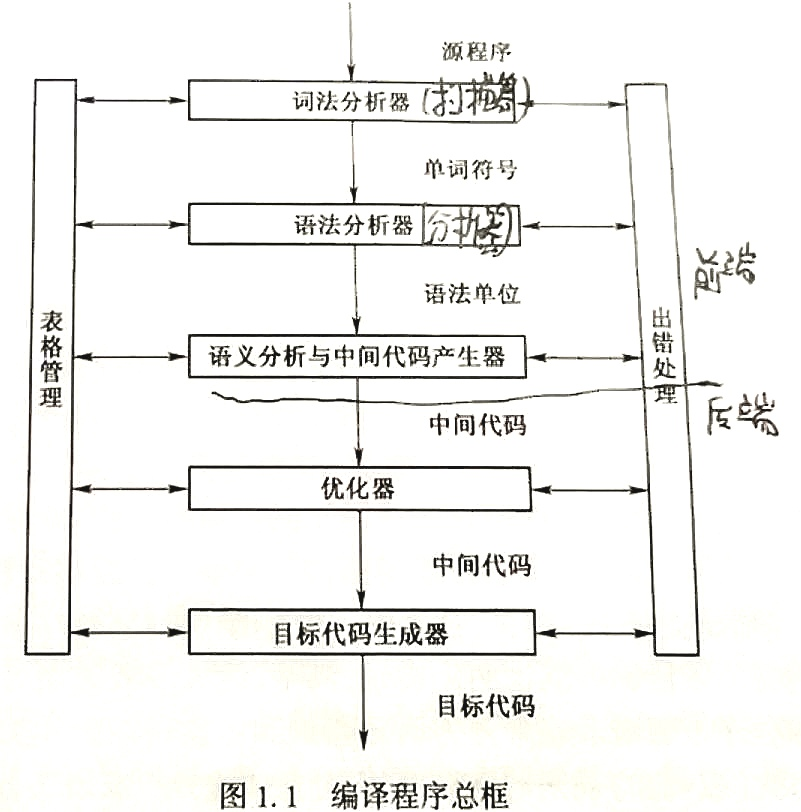

* 表格管理的时间最长
* 例题
  1. 编译过程中，语法分析器的任务
     1. 分析单词串是如何构成语句和说明的
     2. 分析语句和说明是如何构成程序的
     3. 分析程序的结构
  2. 代码生成器要着重考虑目标代码的质量问题，衡量质量主要有下列两方面
     1. 占用空间
     2. 执行效率

### 遍

* 对源程序或源程序的中间结果从头到尾扫描一次，并作有关的加工处理，生成新的中间结果或目标程序。
* 通常，每遍的工作由从外存上获得的前一遍的中间结果开始，完成它所含的有关工作之后，再把结果记录于外存。
* 既可以将几个不同阶段合为一遍，也可以把一个阶段的工作分为若干遍。
* 当一遍中包含若干阶段时，各阶段的工作是穿插进行的。

## 第二章  高级语言及其语法描述

* 文法：描述语言的语法结构的形式规则（即语法规则）；★
* ε、Φ（“{}”）和{ε}的区别★
  * ε空字：不包含任何符号的序列（长度为0的**字符串**）
  * Φ（“{}”）**空集**：不包含任何元素的集合
  * {ε}：是含有一个长度为0的字符串的**集合**。

### 最左推导

* 任务一步α⇒β都是对α中的最左非终结符进行替换的。

### 上下文无关文法

* 文法G所描述的语言是由文法的开始符号推出的所有终结符串

* 组成部分★
  1. 终结符号：组成语言的不可再分的基本符号；
  2. 非终结符：代表语法范畴，表示一定符号串的集合（由终结符与非终结符组成的串）；
  3.  开始符号：特殊的非终结符，代表所定义语言的语法范畴（句子）；
  4.  产生式：定义语法范畴(语法成分)的书写规则；

### 文法二义性★

* 二义性
  * 一个文法**存在某个句子**对应**两颗不同的语法树**。(若一个文法中存在某个句子,它有两个不同的最左(最右)推导。)

* 文法的**二义性不可判定**
  * 不存在一个**算法**,它能在**有限**的步骤内确切地判定一个文法**是否具有二义性**。

### 乔姆斯基(Chomsky)文法★

1.   0型文法 （短语文法）

   * 产生式 $\alpha \rightarrow \beta$
     * $\alpha∈(V_{\N}∪V_{\\T})^{*}$且至少有一个非终结符，而$\beta∈(V_{\N}∪V_{\\T})^{*}$

   * 描述能力相当于图灵机(Turing)
   * 0型语言$\Leftrightarrow$递归可枚举
2.   1型文法（上下文有关文法）
     * 对非终结符进行替换必须考虑上下文
     * 产生式 $\alpha \rightarrow \beta$ 
       * |α|≤|β|（其中||代表长度）
       *  $S \rightarrow \varepsilon$除外，且S不得出现在任何产生式右部
3.   2型文法（上下文无关文法）
     * 对非终结符进行替换可以不必考虑上下文
     * 产生式 $A \rightarrow \beta$
       * $A∈V_{\N}$，$\beta∈(V_{\N}∪V_{\\T})^{*}$ 
     * 对应非确定的下推自动机
4.   3型文法（正规文法）
     * 右线性文法
       * 产生式 $A \rightarrow \alpha B$或 $A \rightarrow \alpha$
         * $\alpha∈V_{\\T}^{*}$，$A、B∈V_{\N}$ 
     * 左线性文法
       * 产生式 $A \rightarrow B \alpha$或 $A \rightarrow \alpha$
         * $\alpha∈V_{\\T}^{*}$，$A、B∈V_{\N}$

## 第三章 词法分析

* DFA（确定有限自动机） $M=(S,Σ,\delta ,s_{0},F)$

  * S有限状态集
  * Σ有穷输入字符表
  * δ(s,a)=s'，当状态为s，输入字符为a时，将转换到后继状态s'
  * $s_{0}∈S$ ，是唯一的初态
  * $F\subseteq S$，是一个可空的状态集

* NDA（非确定有限自动机） $M=(S,Σ,\delta ,S _{0},F)$ 

* DFA与NFA区别：

  |   区别   |    DFA     |   NFA   |
  | :------: | :--------: | :-----: |
  |   初态   |    唯一    | 不唯一  |
  | 后继状态 | 确定且唯一 | 不唯一  |
  |   输入   |    字符    | 字符，ε |

* NFA→DFA确定化：子集法

  * 替换规则

  

      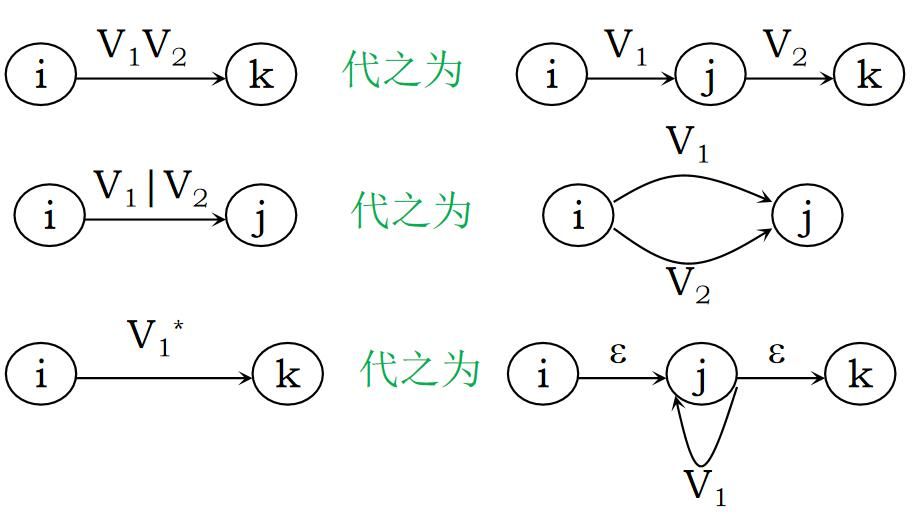
  

  * 计算闭包

### 例题

1. 

       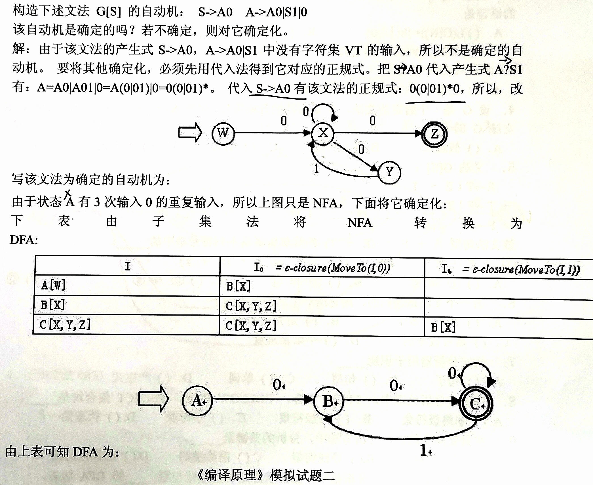
   

1. DFA化简

   

       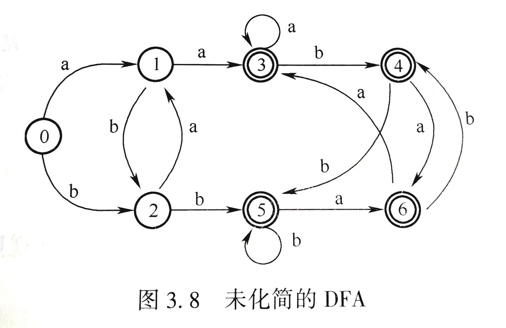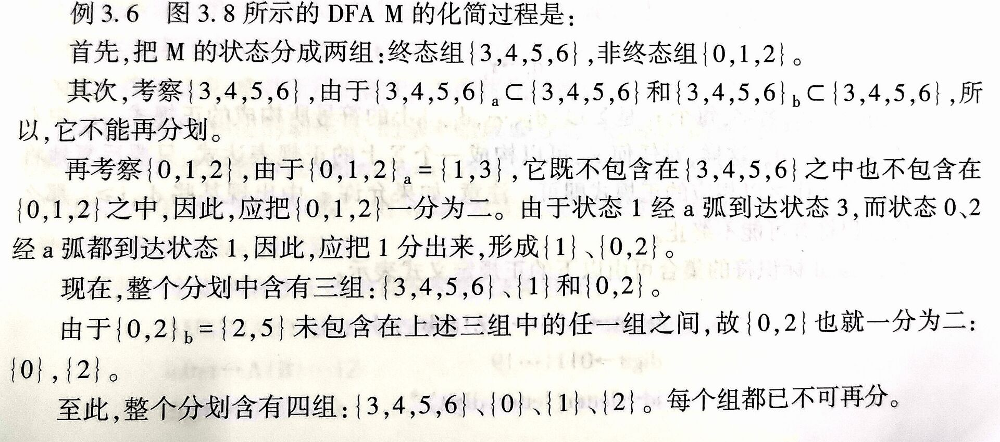
   

2. 构造一个DFA，它接收∑={a, b}上所有满足下述条件的字符串：字符串中的每个a都有至少一个b直接跟在其右边。

   * 正规式为：(b\*abb\*)\*

   

       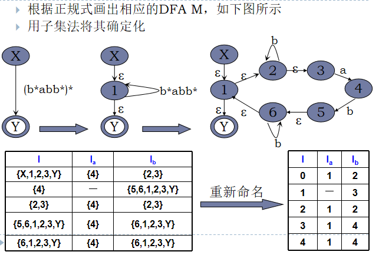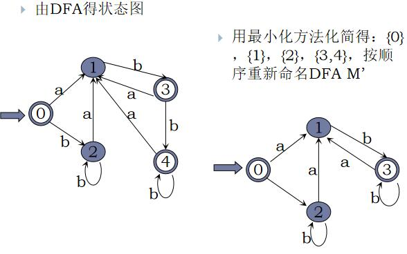
   

3. P64-12

   

       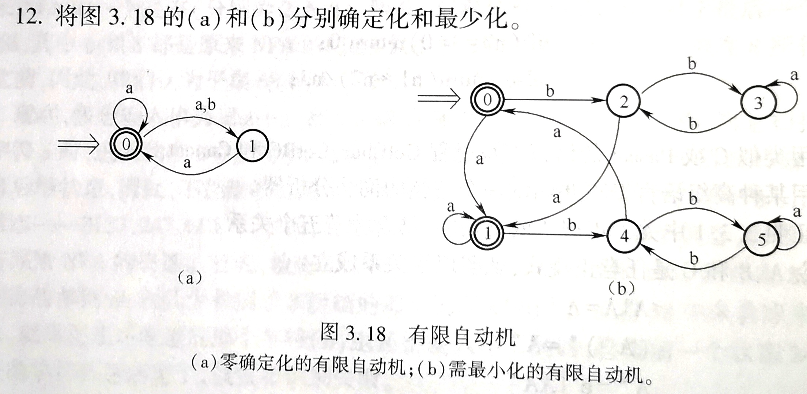
       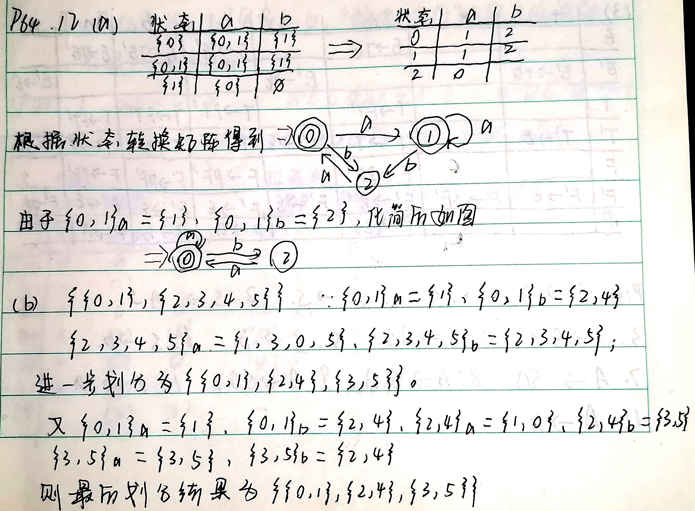
       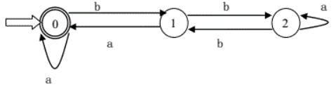
   

## 第四章  语法分析——自上而下分析

* 自上而下的分析，是从[文法](http://www.so.com/s?q=文法&ie=utf-8&src=internal_wenda_recommend_textn)的开始[符号](http://www.so.com/s?q=符号&ie=utf-8&src=internal_wenda_recommend_textn)出发，试图推导出句子。它要解决的[关键](http://www.so.com/s?q=关键&ie=utf-8&src=internal_wenda_recommend_textn)问题是在对某一个非终结符进行推导时，选择以它为左部的多个产生式中的哪一个。（候选式的选择）
* 自上而下分析**必须消除左递归**

### LL(1)分析法

* 消除左递归公式 
  * $P\rightarrow Pα|β$ 
  * 改写为 
  * $P\rightarrow βP'$
  * $P'\rightarrow αP'| \varepsilon$
* 消除间接左递归

 

    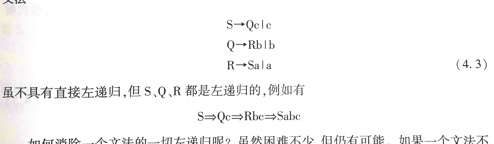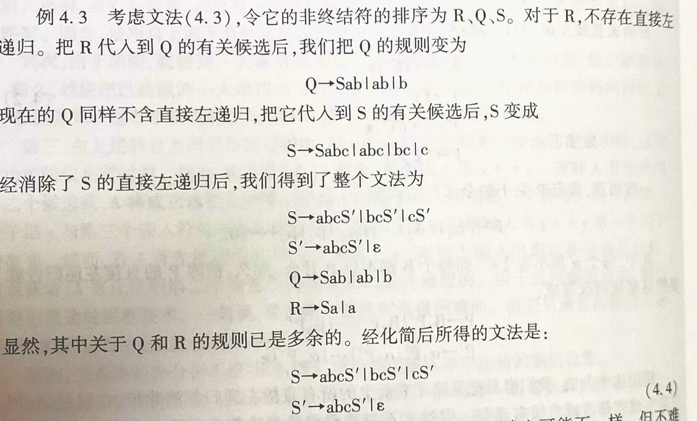

* 提取公共左因子

 

    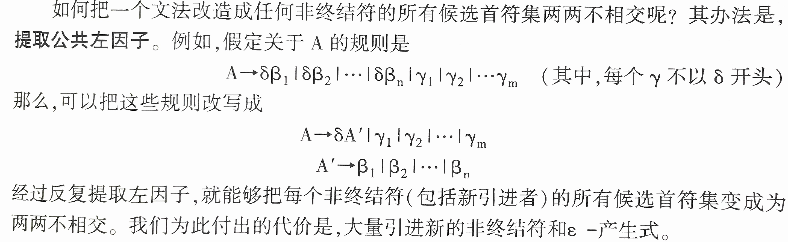

* LL(1)文法

  * 条件

    * 不含左递归
    * 每个非终结符A的各个产生式的候选首符集两两不相交，即若 $A \rightarrow \alpha_{1}|\alpha_{2}|···|\alpha_{n}$ 则 FIRST($\alpha_{i}$)∩FIRST($\alpha_{i}$)=$\phi$
    * 对文法中的每个非终结符A，若它存在某个候选首符集包含$\varepsilon$，则FIRST(A)∩Follow(A)=$\phi$
    
  * 每个文法都能改写成LL(1)文法
  
* FIRST(A)：非终结符A的首符集（可能推导出的第一个终结符或可能的'$\varepsilon$'）
* FOLLEW(A)：在所有句型中出现在非终结符A后的终结符或'#'
* 开始符号（如E）的follow集要加上'#'，$\varepsilon$在follow集中为'#'。
* LL(1)预测分析表
  * 列表头非终结符，行表头终结符+'#'
  * 当终结符a∈FIRST(A)，把对应的产生式加到M[A,a]中
  * 若$\varepsilon$∈FIRST(A)，则把所有b∈FOLLOW(A)以产生式$A \rightarrow \varepsilon$加到M[A,a]中

	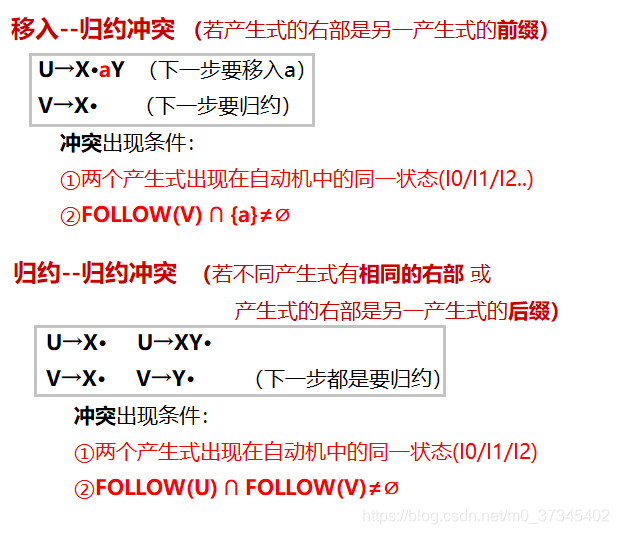

### 例题

1. 

    

       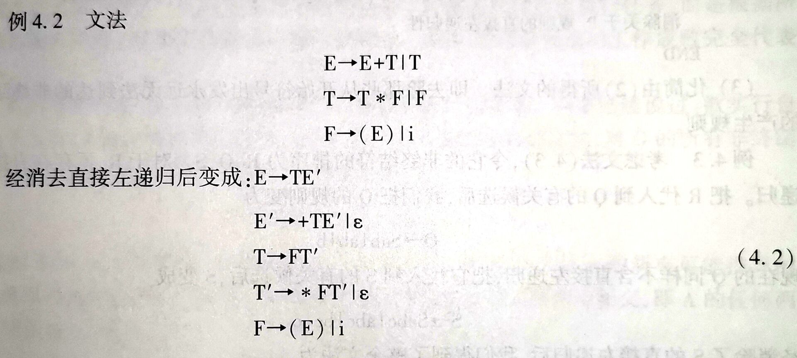
        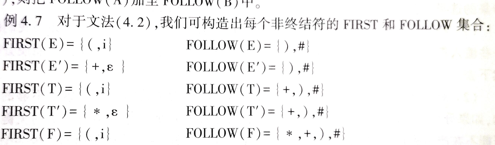
        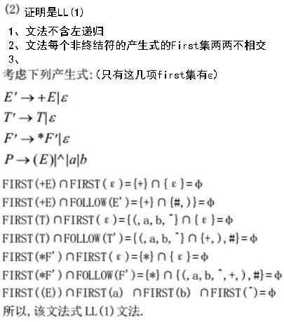
   

2. P81-2

   

       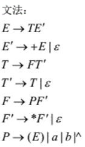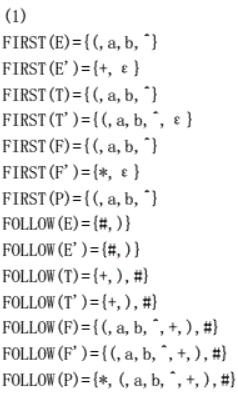
       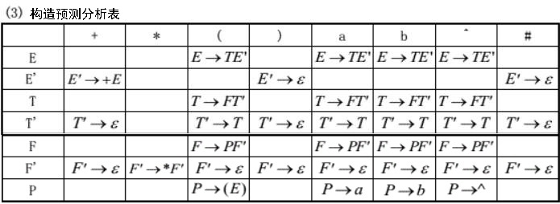
   

## 第五章  语法分析——自下而上分析

* 自下面上的分析，是从输入符号串出发，试图归约到文法的开始符号。分析过程中，每次选择与某个产生式右部符号串相同的一个子串进行归约。它要解决的关键问题是如何确定一个可归约的子串。

### 规范规约

    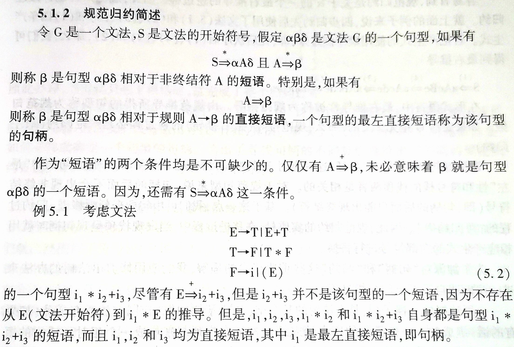
    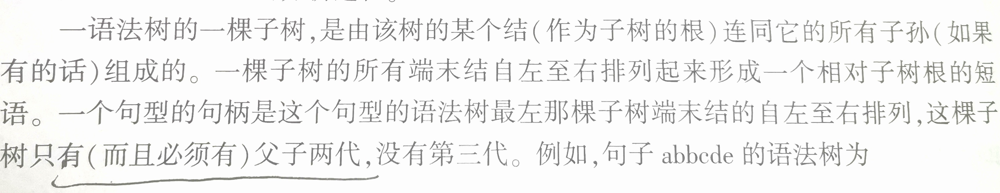
    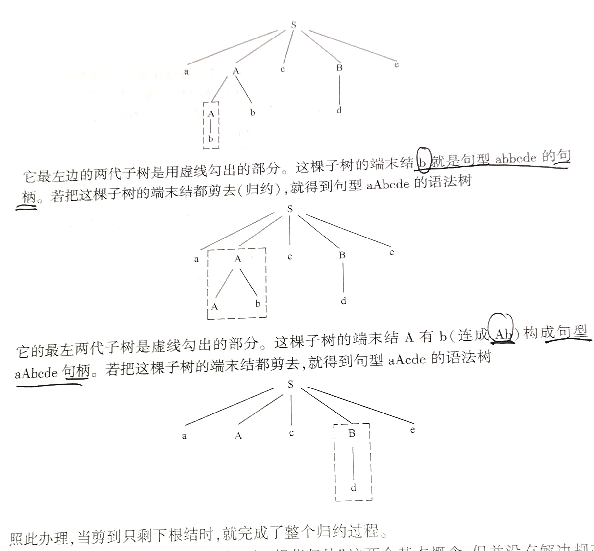

* 假定G是一个文法，S是它的开始符号，如果

  ${S \Rightarrow } * α$

  则称α是一个**句型**；

  仅含终结符的句型是一个**句子**；

  文法G所产生的**句子**的全体是一个**语言**，记为L(G)

* 短语：一个句型的语法树中任一子树叶节点所组成的符号串

* 直接短语：当子树不包含其他更小的子树时，该子树叶节点所组成的字符串

* 句柄：最左直接短语

* 素短语：是一个**短语**，它**至少含有一个终结符**，而且除它之外**不含有其他素短语**。

* 最左素短语：句型最左边的那个素短语。

* 若文法无二义性，则规范推导（最右推导）的逆过程必是规范规约（最左规约）

### 算符优先分析

* 每步被直接规约的是最左素短语

* 一个算符优先文法可能不存在算符优先函数与之对应

* 

      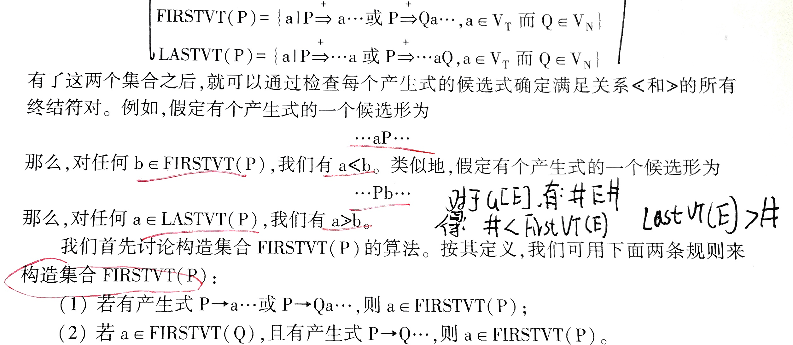
  

### LR分析法（<a href="https://www.bilibili.com/video/BV1Ar4y1M7vG?p=1&spm_id_from=pageDriver&vd_source=1bc100667023b8b7cf4b2c05a5895d7a">推荐视频</a>）  

* LR分析法在自左至右扫描输入串时就能发现错误，能准确的指出出错地点。
* LR分析器包括一个总控程序和一张分析表
* 关键问题：寻找句柄（每步被直接规约的是句柄）
* LR(0)文法
  * 不存在移进-规约冲突
  * 不存在规约-规约冲突
* <a href="https://blog.csdn.net/weixin_56537692/article/details/124765496">LR（0）分析表（偏人话）</a>
* SLR(1)分析法9
  * 存在移进-规约冲突，但能解决

### 例题

1. 

       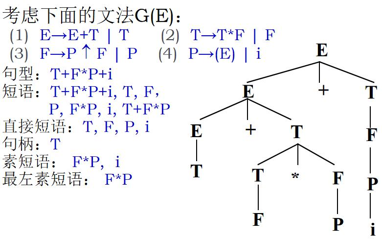
   

1. 已知文法 A->aAd|aAb| ε

   判断该文法是否是 SLR(1) 文法，若是构造相应分析表，并对输入串 ab# 给出分析过程。

   A→aAd|aAb|ε

   拓广文法为G′，增加产生式S′→A

   ①若产生式排序为：

   0 S' →A

   1 A →aAd

   2 A →aAb

   3 A →ε

   ②由产生式知：

   First (S' ) = {ε,a}

   First (A ) = {ε,a}

   Follow(S' ) = {#}

   Follow(A ) = {d,b,#}

   ③G′的LR(0)项目集族及识别活前缀的DFA 如下图所示

   

   

       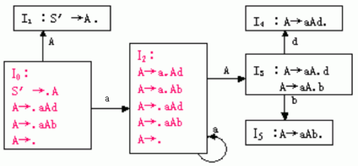
   

   在$I_{0}$ 中：

   A →·aAd 和A →·aAb 为移进项目，A →·为归约项目，存在移进-归约冲突，因此所给文法不是LR(0)文法。

   在$I_{0}$ 、$I_{2}$ 中：

   Follow(A) ∩{a}= {d，b，#} ∩{a}=$\phi$ （要规约的follow集和要移进的终结符无交集）（如果分析表中一处既要写S又要写R证明有移进-规约冲突）

   ④所以在$I_{0}$ 、$I_{2}$ 中的移进-归约冲突可以由Follow 集解决，所以G 是SLR(1)文法。 构造的SLR(1)分析表如下：

   （$r_{j}$表示用序号为j的产生式进行规约【SLR(1)只写排序后的产生式对应的Follow集，LR(0)全写】，$S_{j}$表示跳转到 action下 的状态$I_{j}$，j表示跳转到 GOTO 下的状态j，acc写在 $S' \rightarrow A·$ 对应的状态1下的#处【follow集为#】）

   

       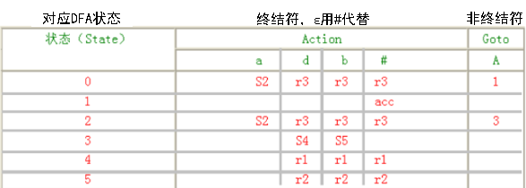
   

   ⑤对输入串ab#的分析过程:

   

       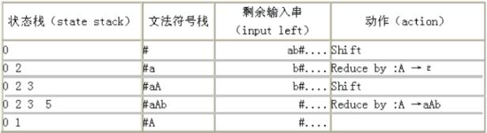
   

3. 

       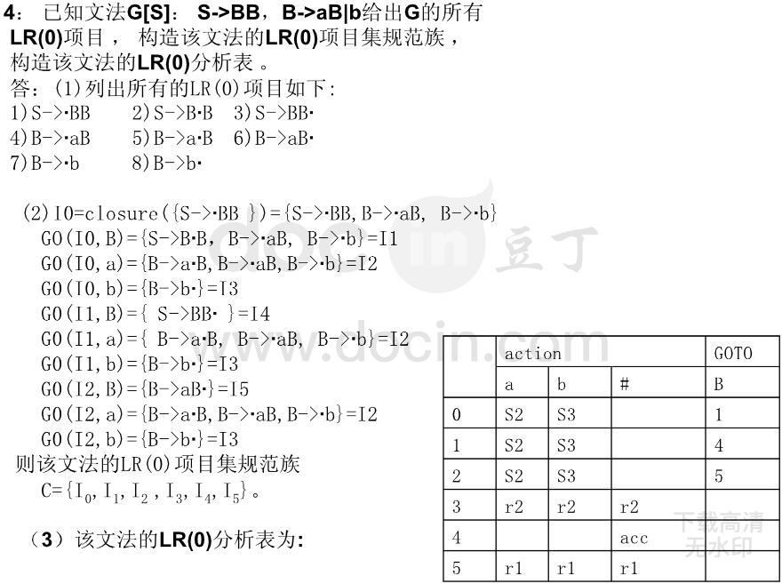
   

4. 

       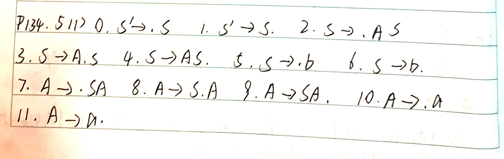
       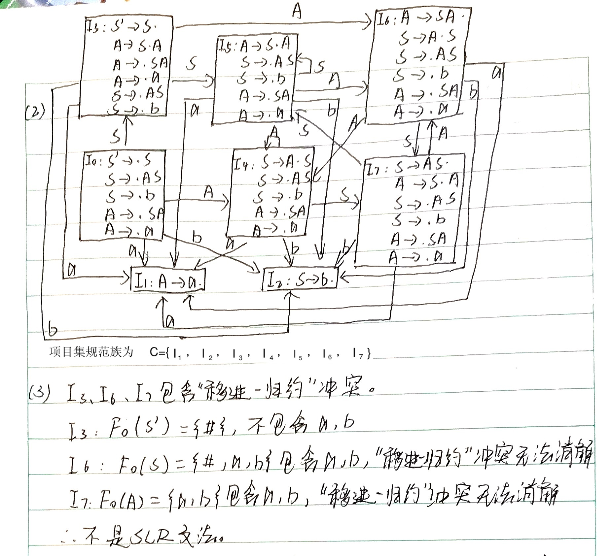
   

## 第六章 属性文法

* 定义：在上下文无关文法的基础上，为每个文法符号（终结符或非终结符）配备相关的“值”（称为属性）
* 分类★
  * 综合属性
    * 自下而上传递信息
    * 语法规则：根据右部候选式中的符号的属性计算左部被定义符号的综合属性
    * 语法树：根据**子结点的属性**和**父结点自身的属性**计算父结点的**综合属性**

  * 继承属性
    * 自上而下传递信息
    * 语法规则：根据右部候选式中的符号的属性和左部被定义符号的属性计算右部候选式中的符号的继承属性
    * 语法树：根据**父结点**和**兄弟结点的属性**计算子结点的**继承属性**

* 终结符只有综合属性（由词法分析器提供），非终结符可以有两种属性★
* 文法开始符号的所有继承属性作为属性计算前的初始值；★
* S-属性文法★
  * 仅使用综合属性的属性文法

### 例题

    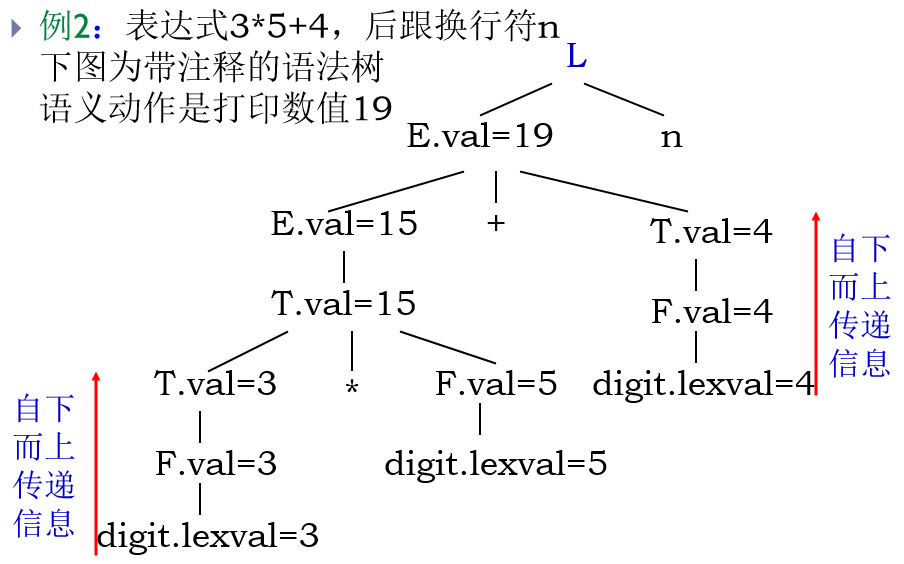
    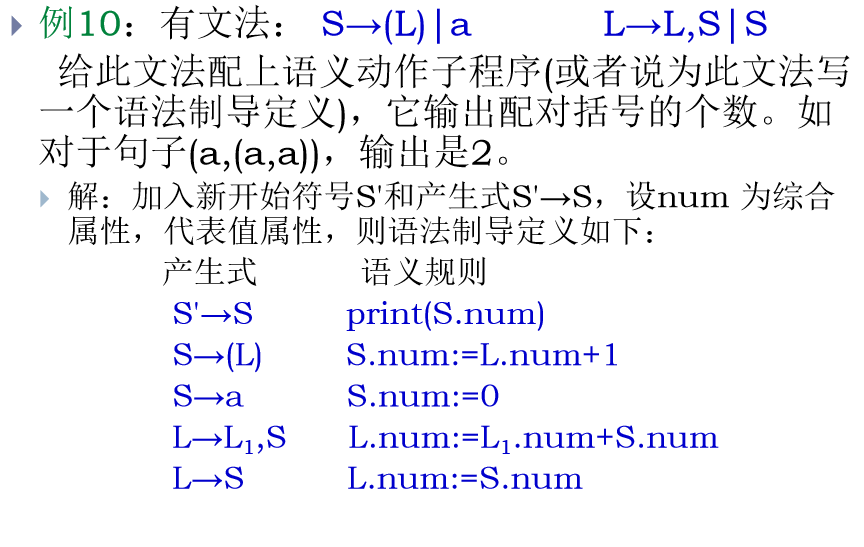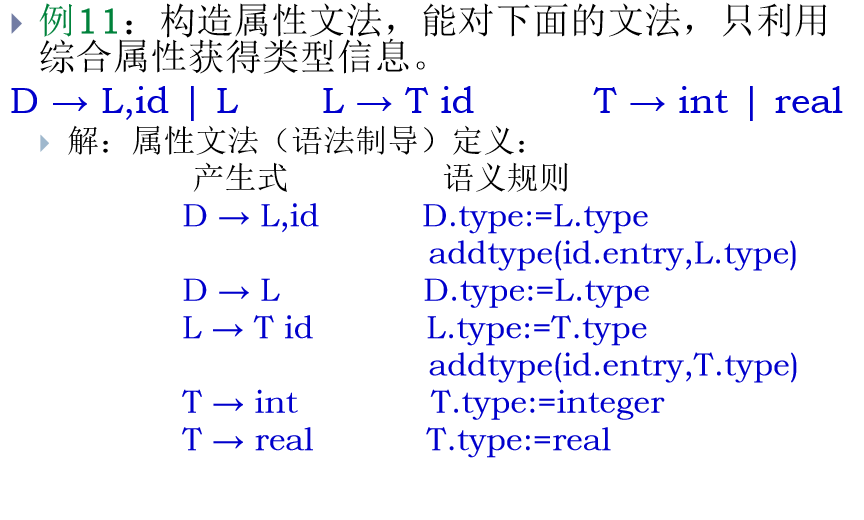

## 第七章 语义分析和中间代码生成

### 三地址代码与DAG

三地址代码是语法树或DAG的线性化表示

### 例题

1. 原式子：-(a+b)*(c+d)-(a+b+c)
   

   	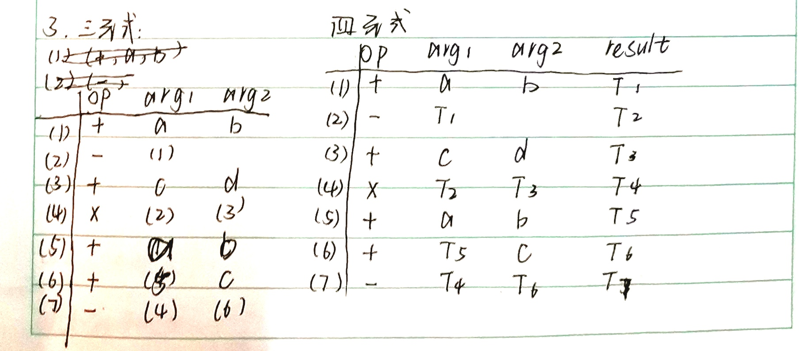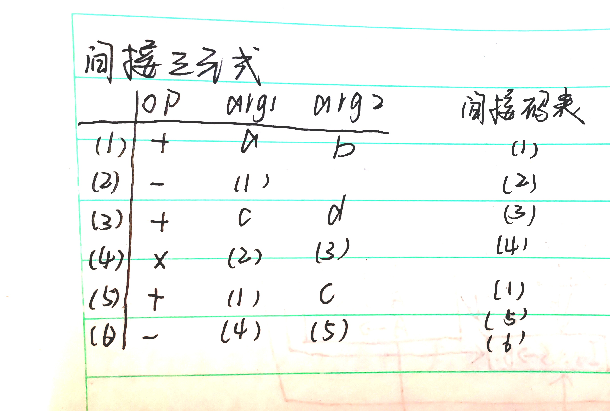
   

1. <a href="https://max.book118.com/html/2017/0916/134155446.shtm">参考链接</a>

   

   	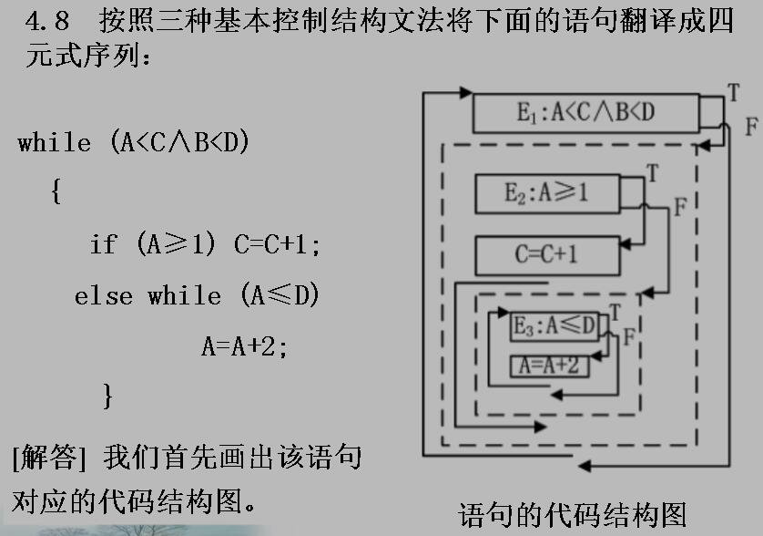
   	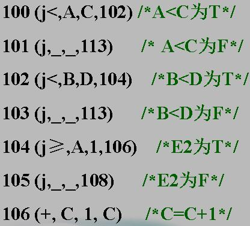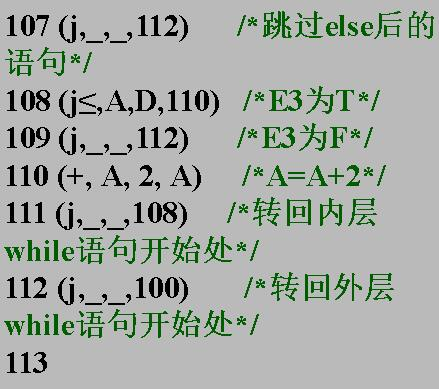
   

## 第八章 符号表★

* 概念：是一种用于语言翻译器（例如编译器和解释器）中的数据结构。记录源程序中各种名字的属性和特征等有关信息

* 作用

  * 一致性检查和作用域分析
  * 辅助代码生成

* 符号表的每一项(入口)包含两大栏

  * 名字栏，也称主栏，关键字栏

    * 名字栏的内容称为关键字

  * 信息栏，记录相应的不同属性 
  
    |                | NAME | INFORMATION        |
    | :------------: | :--: | ------------------ |
    | 第1项（入口1） |  M   | 形参，整型值参数   |
    | 第2项（入口2） |  N   | 形参，浮点型值参数 |
    | 第3项（入口3） |  K   | 整型变量           |

### 符号表的不同实现方法及特点

1.  线性表与线性查找：最简单，但效率低；
2. 二叉树与对折查找：查找效率高一些，实现上略困难；
3.  杂凑技术（哈希）：效率最高，实现上比较复杂且要消耗额外存储空间；

## 第十章 优化★

* 概念：[参考](#编译程序的五个阶段)
* 原则
  1. 等价原则：经过优化后不应改变程序运行的结果；
  2.  有效原则：优化后所产生的的目标代码的运行时间较短，占用的存储空间较小；
  3.  合算原则：尽可能以较低的代价取得较好的优化效果；
* 常见优化方法及其作用
  1.  删除公共子表达式：避免对公共子表达式的重复计算；
  2. 复写传播：使对某些变量的赋值变得无用；
  3.  删除无用代码：将某些对程序运算结果无用的赋值变量删除；
  4.  代码外提：使某些循环中产生结果不变的代码提出循环，减少运算次数；
  5. 强度削弱：将乘除法变换为加减法，提高代码运行速度；
  6. 删除归纳变量：减少代码量和部分代码的执行次数，提高运行速度；
* 基本块
  * 一段顺序执行的代码
  * 一个入口，一个出口
  * 入口为第一条语句
  * 出口为最后一条语句
  * 执行时只能从入口进入，从出口退出
* 分类
  * 局部优化（基本块内的优化）
    * 局限于基本块范围内的优化
  * 全局优化
    * 利用全局数据流信息
  * 循环优化
    * 代码外提
    * 强度削弱
    * 删除归纳
