[TOC]

# 前言

* 自己根据老师画的重点总结的
* 总结以过考试为主，知识点不全面
* 以lqx的文档为主
* ★要背
* ▲理解

# 分值与题型

一、简答题（含画图、填表形式，共12小题，每题5分，共60分）
二、计算题（共4小题，共35分）
三、论述题（共5分）
  考核内容说明：

1、 光纤通信技术占20分；
2、数据通信原理主要考1-5章，其中第4、5章15分的基本概念，第1章占15分，第3章占20分，第2章占30分。

# 数据通信

## 第一章 概述

### 基本概念

* 数据通信定义

  * 依照通信协议,利用数据传输技术在两个功能单元之间传递数据信息。
  
* 数据信号的基本传输方式

  * 基带传输
  * 频带传输
  * 数字数据传输

* 

  	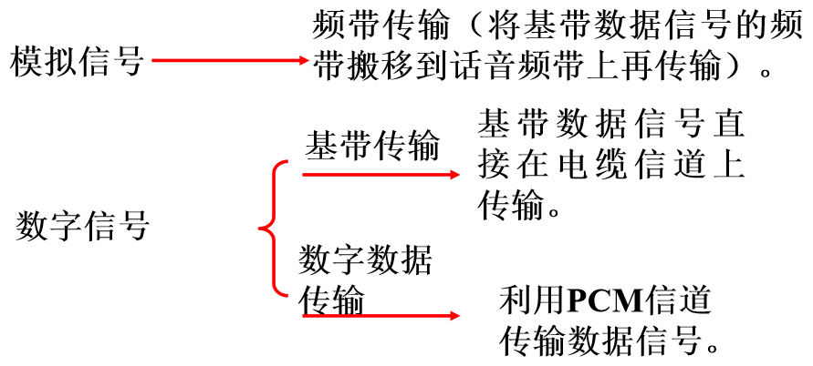
  

* 常用二进制代码

  * 国际5号码(IA5/ASCII码)，7位
  * 国际电报2号码(ITA2/波多码/电传码)，5位

* 信息量：衡量信息的多少

* 

  	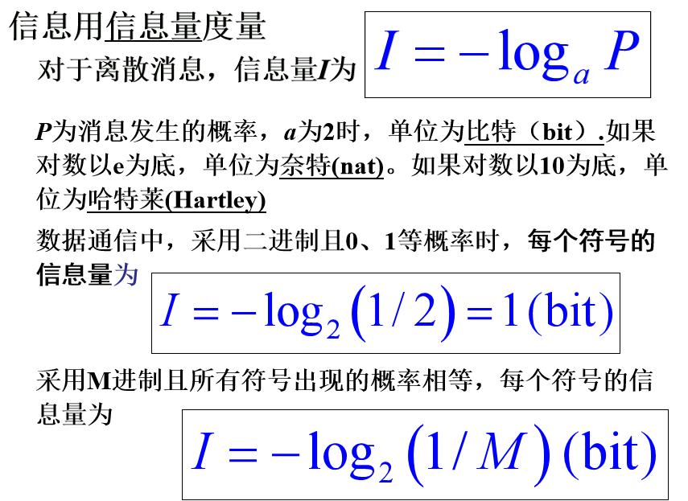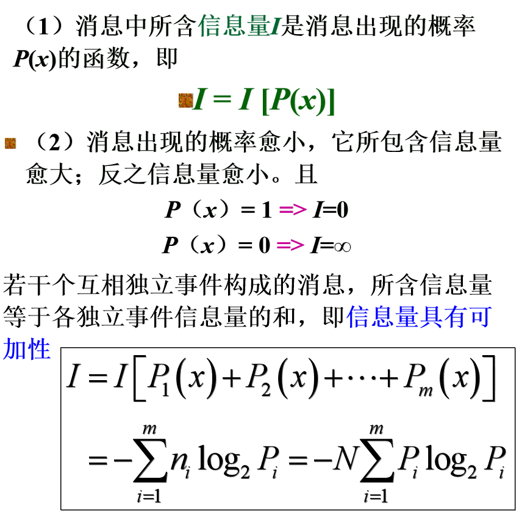
  

### 数据通信系统的基本组成

* 数据通信系统主要由中央计算机系统、数据终端设备（DTE）、数据电路三部分构成。
  
* 构成图 DTE(Data Terminal Equipment) DCE（data circuit terminating equipment）
  
  

  	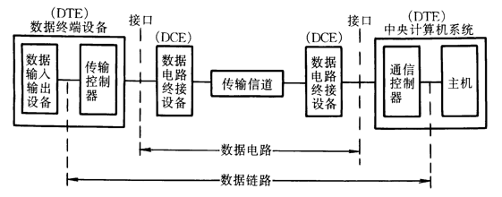
  

  
* 数据电路（Data Circuit）
  
  * 数据电路**连接**两个**数据终端设备**(DTE)，负责将数据信号从一个数据终端设备传输到另一个数据终端设备
  
* 数据链路

  * 数据电路加上数据传输控制功能（DTE中的传输控制器提供）

* 数据电路终接设备(**DCE**)**功能**

  * 基带传输时
    1. 对**来自DTE的数据信号**进行某些**变换**
    2. 使**信号功率谱与信道**相适应
  * 频带传输时
    1. 作为**调制解调器**(modern)
    2. 发送时，调制**数据信号**，将其频带搬移到对应的载频频带上进行传输（将**数据信号**转换成适合模拟信道上传输的**模拟信号**）
    3. 接收时，解调**模拟信号**，还原成**数据信号**
  * 数字信道传输时
    1. 作为**数据服务单元**(DSU)
    2. 信号**格式变换**
       1. 消除信号中的**直流**成分
       2. 防止**长串零编码**
    3. 信号**再生和定时**

* **结论**：只有建立起**通信链路**之后，通信双方才能真正**有效**、**可靠**地进行**数据通信**

### PCM调制原理简图

### 信噪比

	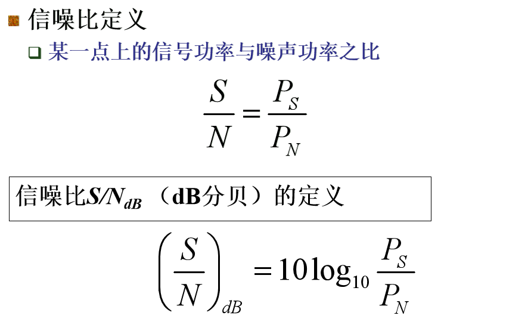

### 异步传输

* 原理
  * 每次传送**一个**字符，在发送每一个字符代码的前面均加上一个"起"信号，其长度规定为一个码元,极性为"0"，后面均加一个"止"信号
  * 字符可以连续发送,也可以单独发送；不发送字符时,连续发送"止"信号。
* 含义
  * 每一字符的起始时刻可以是**任意**的
* 优点
  * 实现字符同步比较**简单**,收发双方的时钟信号**不需要精确的同步**。
* 缺点
  * 每个字符增加了起，止的比特位，降低了传输**效率**。
* 应用
  * 1200bit/s及其以下的**低速**数据传输。

### 同步传输

* 原理
  * 以**固定时钟节拍**来发送数据信号
  * 数据的发送以一帧（**串**字符）为单位
  * 一帧的**开头**和**结束**加上预先规定的起始序列和终止序列作为标志
* 优点
  * 通常要比异步传输**快**速得多
  * 开销少，**效率高**
* 缺点
  * **技术复杂**
  * 数据**比特位越长**，缓存数据所需要的**缓冲区也越大**，**限制**了一个**帧**的**大小**
  * 帧越大，它占据传输媒体的**连续时间**也**越长**。在极端的情况下，这将导致其他用户**等**得太久
* 应用
  * 2400bit/s及其以上的数据传输。

### 有效性指标

* 指通信系统传输消息的“速率”问题，即快慢问题。
  * 工作速率
    * 调制速率 $fs$ (码元速率 $N_{Bd}$ 、波特率、符号速率) 
      * 定义：单位时间（每秒钟）内传输码元的数目
      * 单位：波特(Baud)，常用符号“B”表示（不能用小写）
      * 公式： $N_{Baud}=\dfrac{1}{T\left( s\right) }$ T(s)为信号码元持续时间
    * 数据传信速率（传信率、比特率）
      * 定义：每秒传输的信息量（比特数），简称信息速率
      * 单位：bit/s或bps等，表示为 $N_{b}$ 或 $f_{b}$ 
      * 公式：当信号为M电平/进制时 $R_{b}=N_{Bd}·log_{2}M$ 
    * 数据传送速率
      * 定义：单位时间内在数据传输系统相应设备间传送的比特、字符或码组平均数
      * 单位：比特/秒（bit/s）、字符/秒、码组/秒
      * 特点
        * 是相应设备之间**实际**能达到的**平均数据转移速率**
        * 受差错控制方式、通信规程、信道差错率的影响，**与传输的效率有关**
        * 总是**小于数据传信速率**
  * 频带利用率（η ）
    * 定义：单位频带内的传输速率
    * 特点：真正体现出信息的传输效率的指标
    * 公式
      1.  频带利用率 $η=\dfrac{N_{Bd}}{B}$ 即 $η=\dfrac{符号速率}{频带宽度}$ （Baud/Hz）
         * 极限为2Bd/Hz
      2.  传信效率 $η=\dfrac{N_{b}}{B}$ 即 $η=\dfrac{数据传信速率}{频带宽度}$ （bit/(s·Hz)）

### 可靠性指标

* 定义：衡量数据传输的可靠性，是一个统计平均值

* 公式

  1. 码元差错率 $P_{e}$ （误码率）  $ P_{e}=\dfrac{单位时间接收的错误码元数}{单位时间内系统传输的总码元数} $ 
  2. 信息差错率 $P_{b}$ （误信率）(二进制信号情况下与误码率在数值上相等)  $P_{b}=\dfrac{错误的比特数}{传输的总比特数}$ 
  3. 误字符（码组）率 $P_{g}$   $P_{g}=\dfrac{错误的字符（码组）数}{传输的总字符（码组）数}$ 

* 例 

  

  	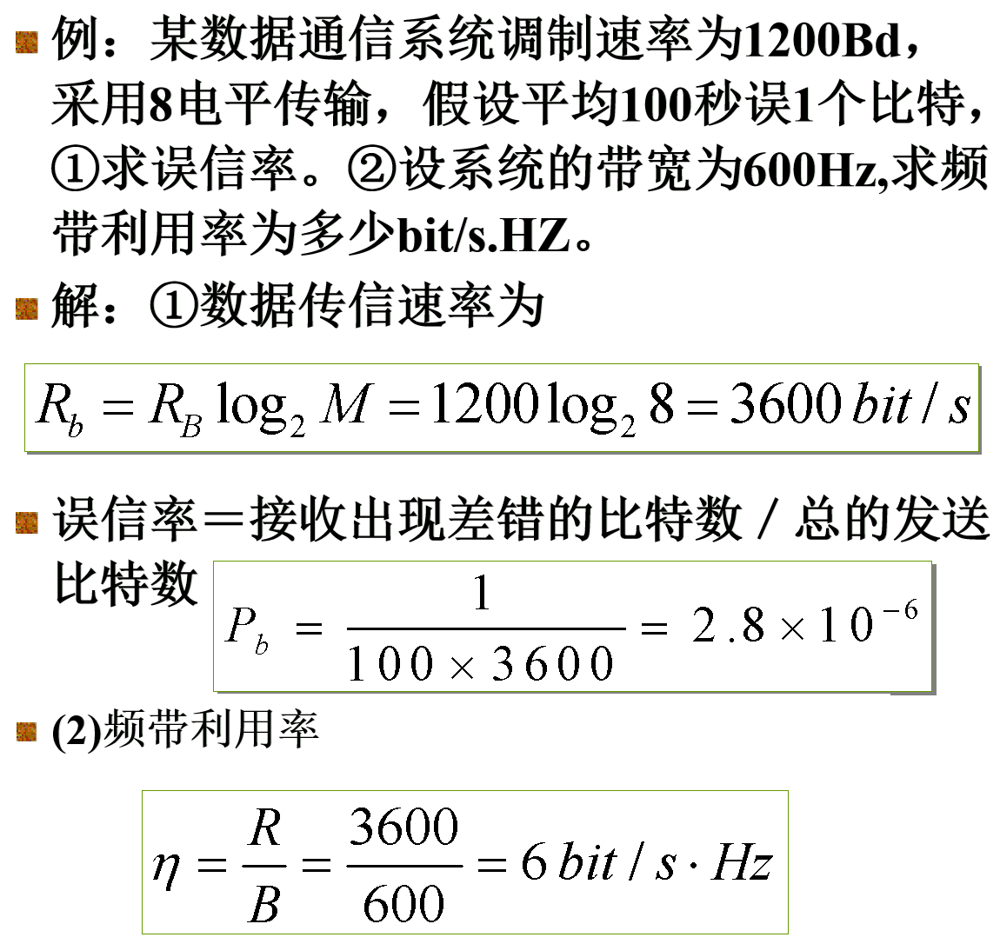
  

### 信道容量

* 定义：信道**单位时间**内能传输的**最大信息量**，即信道的**最大传信速率**

* 公式

  1. 模拟信道——香农定律  $C=Blog_{2}(1+\dfrac{S}{N})$  其中，信道的带宽为B(Hz)，信号功率为S(W)，N= $n_{0}B$​ ，S/N是平均信号噪声功率比（信噪比）。

     

     	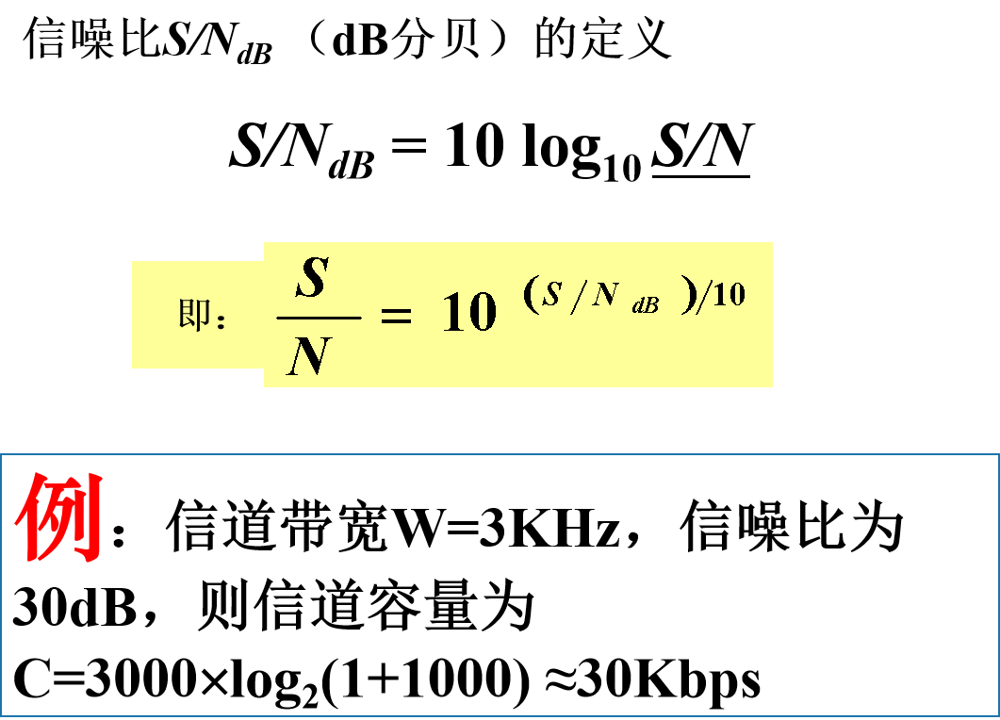
     

  2. 数字信道——奈奎斯特(Nyquist) 公式（用于离散、无噪声数字信道）

     

     	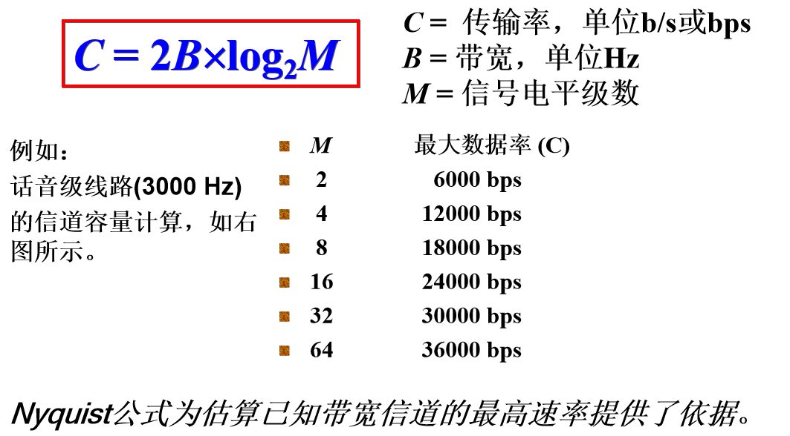
     

### 多路复用技术

* 目的：提高通信信道利用率
* 分类
  1. FDM (频分复用)
  2. TDM (时分复用)
     1. 一般时分复用
        * 原理：把时间分割成小的时间片，每个时间片分为若干个通道（时隙） ，每个用户占用一个通道传输数据。
     2. 统计(异步)TDM——STDM
        * 原理：根据用户实际需要动态地分配线路资源（逻辑子信道）的方法。
  3. WDM (波分复用)
  4. CDM (码分复用)

### 例题

1. 一路语音信号带宽为64kps
   1. 语音信号的频带范围是300~3400Hz
   2. $f_{m}$ 取最大值4000Hz
   3. 由采样定理（香农采样定理/奈奎斯特采样定理） $f_{s}>=2f_{m}$ $f_{s}$ =8000Hz
   4. 语音信号分为256个非均匀量化级，量化值采用8位二进制表示
   5. 8*8000求得带宽为64kps

2. 

	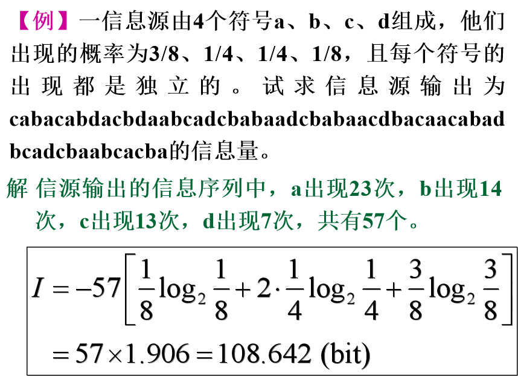

## 第二章 数据信号的传输

### 数据信号及特性描述

* RZ：归零信号

* NRZ：不归零信号

* 占空比( $τ$ )：一个码元内高电平的持续时间与码元持续时间之比

* 基本的基带数据信号分类

  1. 

     * 绝对码

     * 差分码（避免倒“Π”【相位模糊】）要说明初始电位
       * 0
       * 1

  2. 
     * 单极性
     * 双极性（避免直流分量）

  

  	
  

* 对基带传输码型的要求

  1. **直流分量**，**低频分量**，**高频分量**要尽量**少**
  2. 便于**定时时钟**的**提取**
  3. 传输码型应具有一定的**检测误码**能力
  4. 对**信源统计依赖性**最小
     * 对信源经信源编码后，直接转换的数字信号的类型不应有任何限制（例如“1”和“0”出现的概率及连“0”多少等）。
  5. 码型**变换设备简单**、易于实现

* 随机脉冲序列的**双边带功率谱密度**

  

  	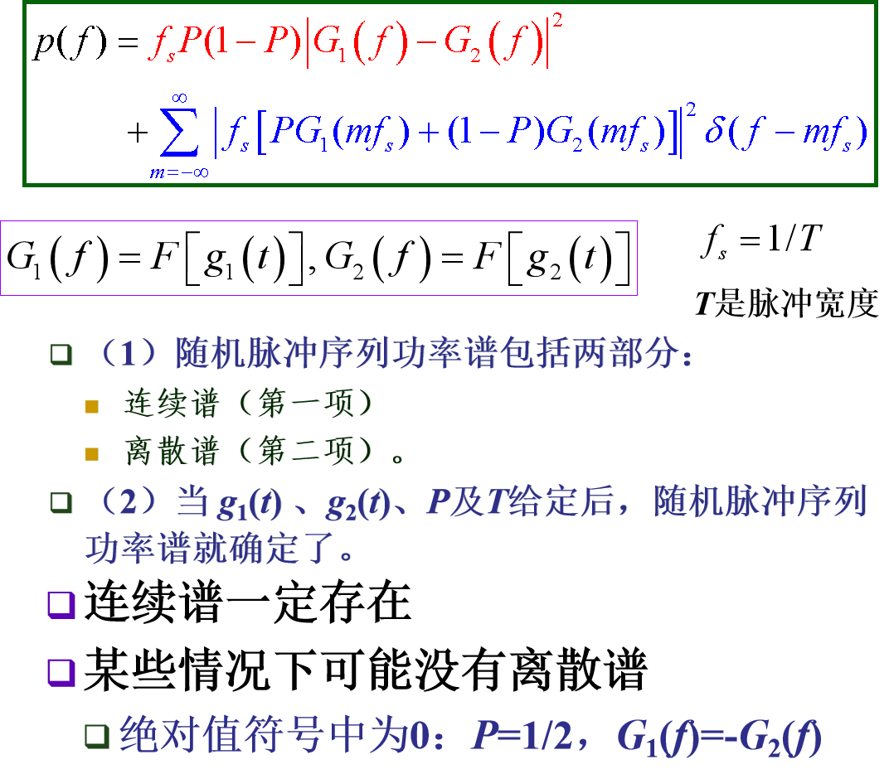
  

* 基带数据信号的功率谱密度

  * 规律

    * 单极性码——既有连续谱，也有离散谱。

    * 双极性码——只有连续谱，没有离散谱。

    * 不归零码——连续谱第一个零点为
       $f_{B}$ = 1/ $τ$ 	 (1/ $τ$  =1/T = $f_{B}$ )

      基带宽度B= $f_{B}$ 

    * 归零码(半占空)——连续谱第一个零点为
      2 $f_{B}$ = 1/ $τ$    (1/ $τ$  = 2/T = 2 $f_{B}$ )

      基带宽度B=2 $f_{B}$ 

  * 图

    

    	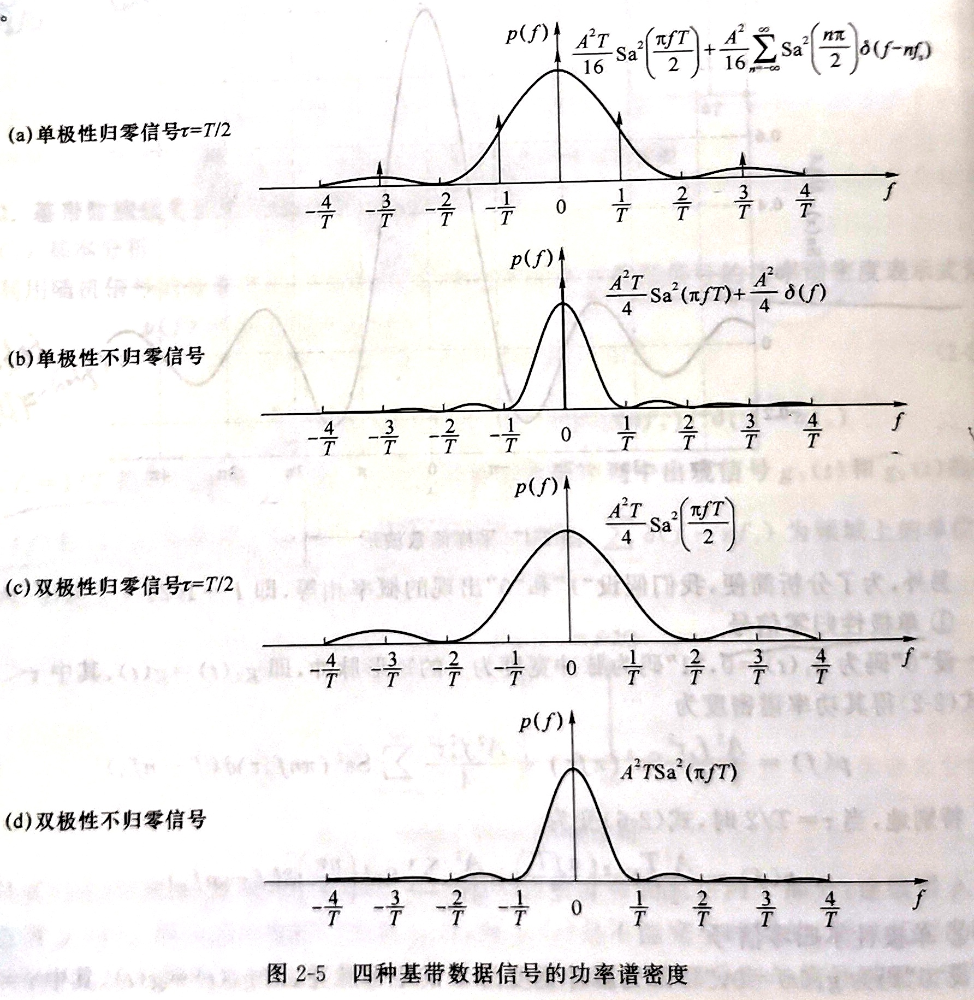
    

  * **意义**

    * 大致可以掌握传输某一数据信号所需要的**基带宽度**：B>=1/ $τ$ 
    * 决定如何从数据信号的谱特性中提取收端需要的**码元定时信息**。

### 数据信号的基带传输

* 基带传输系统模型

  

  	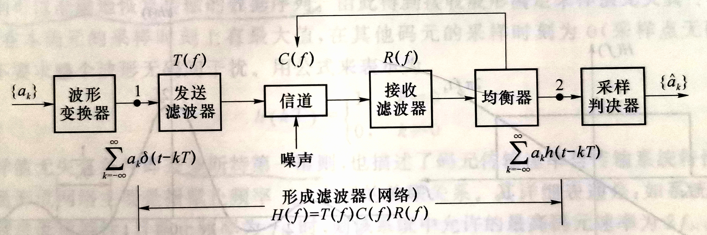
  

* 奈奎斯特第一准则（判断是否有码间干扰）

  

  	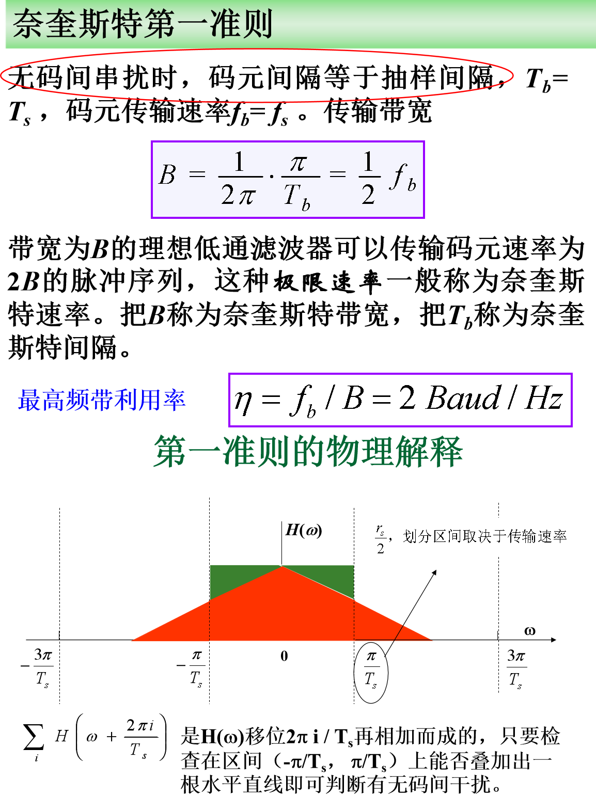
  

* 理想基带传输系统

  * 特点
    1. 满足奈奎斯特第一准则（无符号间干扰）
    2. 频带利用率达到极限
    3. 冲激响应波形“尾巴”以 $\dfrac{1}{t}$ 的速度衰减（对定时脉冲的精度要求较高。）
    4. 物理上不可实现（理想化）
  * η=2Baud/Hz

* 具有幅度滚降特性的低通形成网络

  *  $f_{N}$ ：截止频率，奈奎斯特频带宽度
  *  $f_{a}$ ：截止频率之外的频带宽度
  * α滚降系数∈(0,1]，α= $\dfrac{f_{a}}{f_{N}}$ 
  * 特点
    1. 满足奈奎斯特第一准则
    2. 在时间间隔为 $T=\dfrac{1}{2f_{N}}$ 的采样点处不产生码间干扰（此处为零点）
    3. 冲激响应波形“尾巴”以 $\dfrac{1}{t^{3}}$ 的速度衰减
    4. 滚降部分波形关于 $(f_{N},\dfrac{1}{2})$ 对称
    4. 相同的传输速率所需的有效带宽较大，频带利用率较低
    
  * $η= \dfrac{f_{b}}{B}=\dfrac{2f_{N}}{(1+α)f_{N}}=\dfrac{2}{(1+α)}$ Baud/Hz

  * 例题

    

    	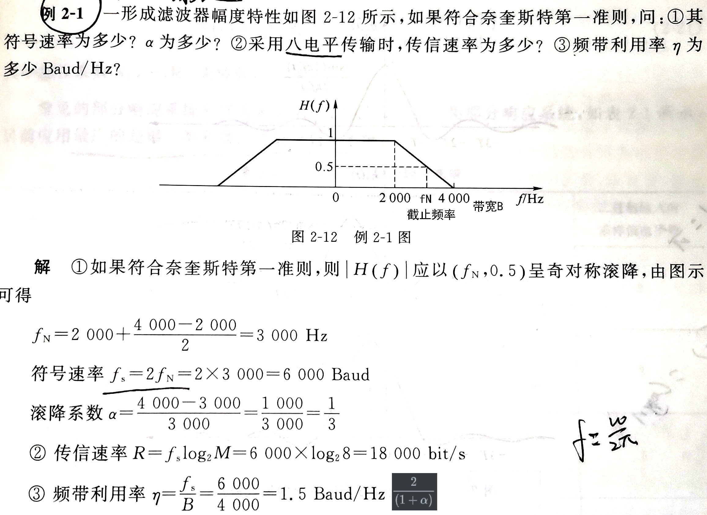
    

* 部分响应系统

  * 存在误码扩散

    

    	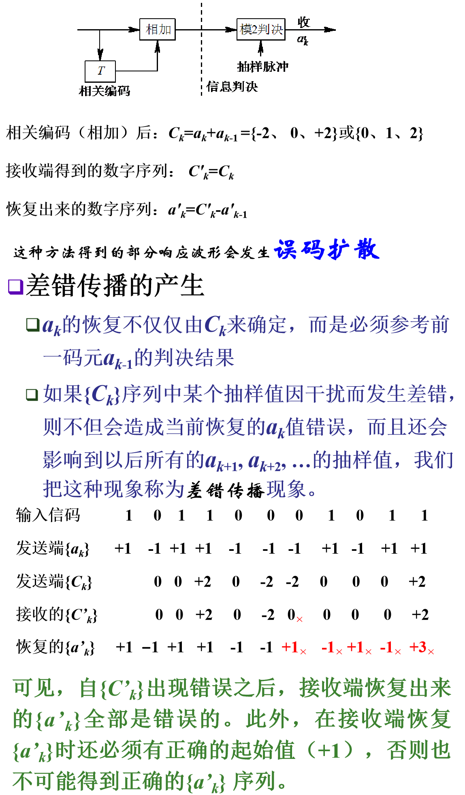
    

  * 发送端要有预编码相关编码电路来打破相关性

    

    	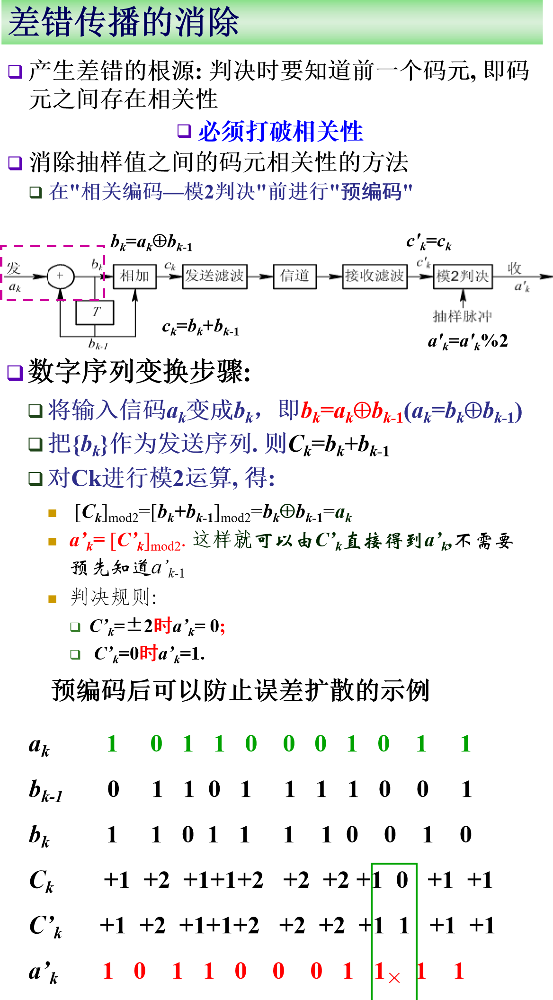
    

  * 特点

    1. 满足奈奎斯特第二准则
    1. 有固定的、可消除的**码间干扰**
    2. 频带利用率**η=2Baud/Hz**达到极限
    3. 形成波形的前导和后尾**衰减较快**，**降低**了对接收端的**精度要求**
    4. 物理上**可实现**
    5. 接收信号电平数大于发送信号电平数，**抗干扰能力**要**差**一些

* 时域均衡

  * 分类
    * 频域均衡(H(f))
    * 时域均衡(H(t))
  * 基本原理：利用**波形补偿**的方法将失真的波形直接加以**校正**，消除采样点**码间干扰**，提高判决可靠性

* 数据序列的扰乱和解扰

  * 定义
    * 扰乱：将输入序列按某种规律变换成长周期序列，使之具有足够的随机性
    * 解扰：在接收端还原经扰乱的数据序列成原始数据序列
  * 作用
    1. 打乱短周期确定性数据序列、长“0”、长“1”序列（直流分量）
    2. 避免交流串音
    3. 避免传输系统失步
    4. 避免均衡器调节信息丢失

* 数据传输系统中的时钟同步

  * 接收端需要一个时钟信号来按时对接收到的信号取最大值的时刻进行采样

  * 对定时时钟信号的要求

    * 定时时钟信号的速率=码元速率
    * 定时时钟信号与接收码元保持固定的最佳相位关系（保持对准）

  * 时钟同步

    * 在接收端获取或生成定时时钟信号的过程

  * 分类

    * 外同步法

      * 由发送端发送专门的同步信息，接收端把这个专门的同步信息检测出来作为同步信号的方法，称为外同步法。

    * 自同步法（又称内同步法）

      * 发送端不发送专门的同步信息，接收端设法从收到的信号中直接提取同步信息的方法，称为自同步法。

      

      	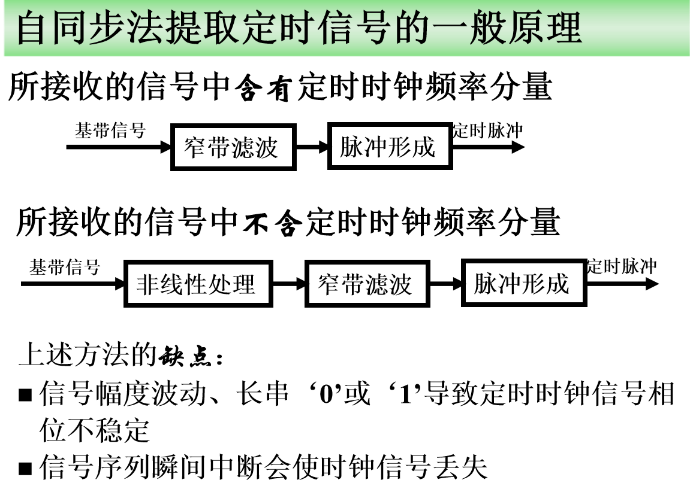
      	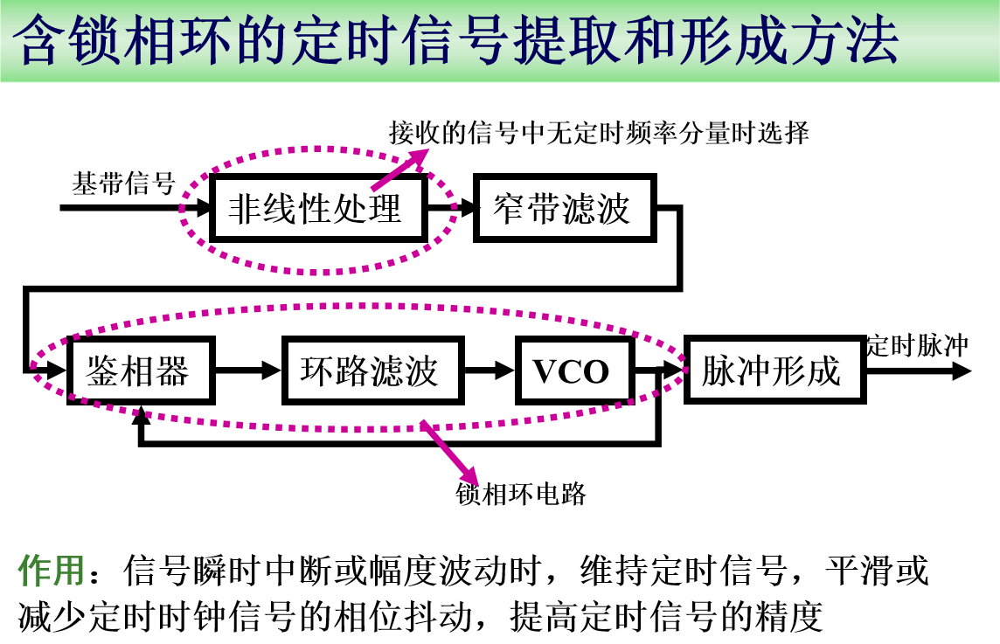
      

### 频带传输系统组成

* 数字调幅（幅移键控）ASK

  * 定义：是正弦载波的幅度随数字基带信号而变化的数字调制。

  * 二进制振幅键控(2ASK：Amplitude Shift Keying )

    * 产生方法

      * 相乘法(a)
      * 键控法(b)

      

      	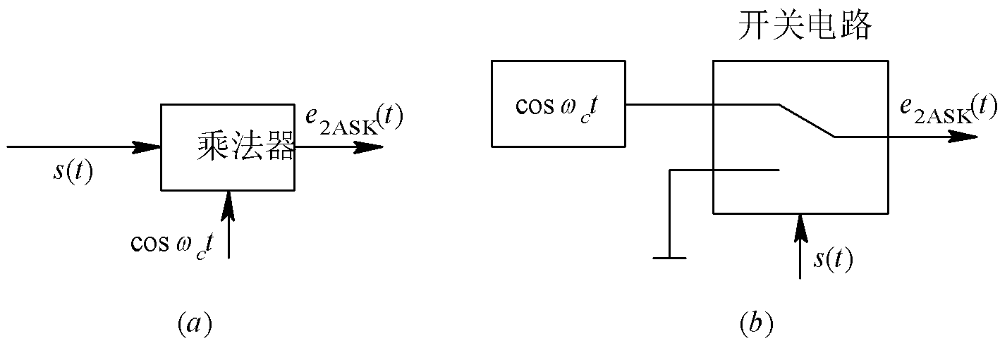
      

  * 2ASK信号波形

    

    	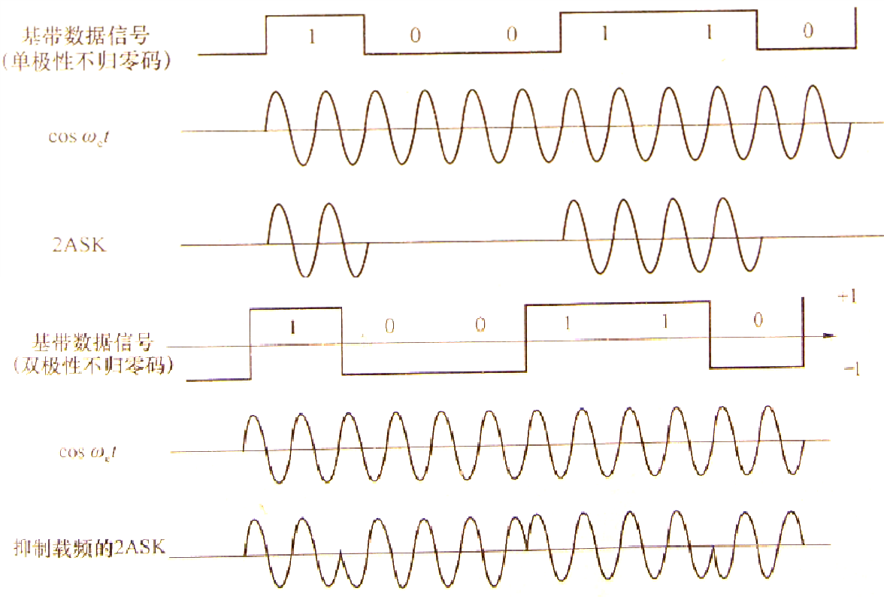
    

  * 功率谱密度图

    

    	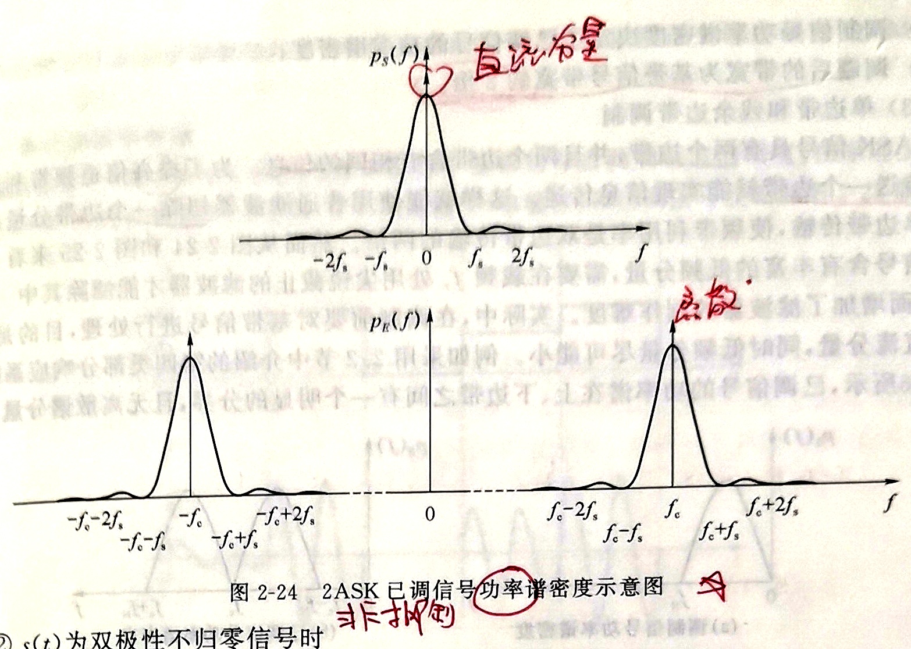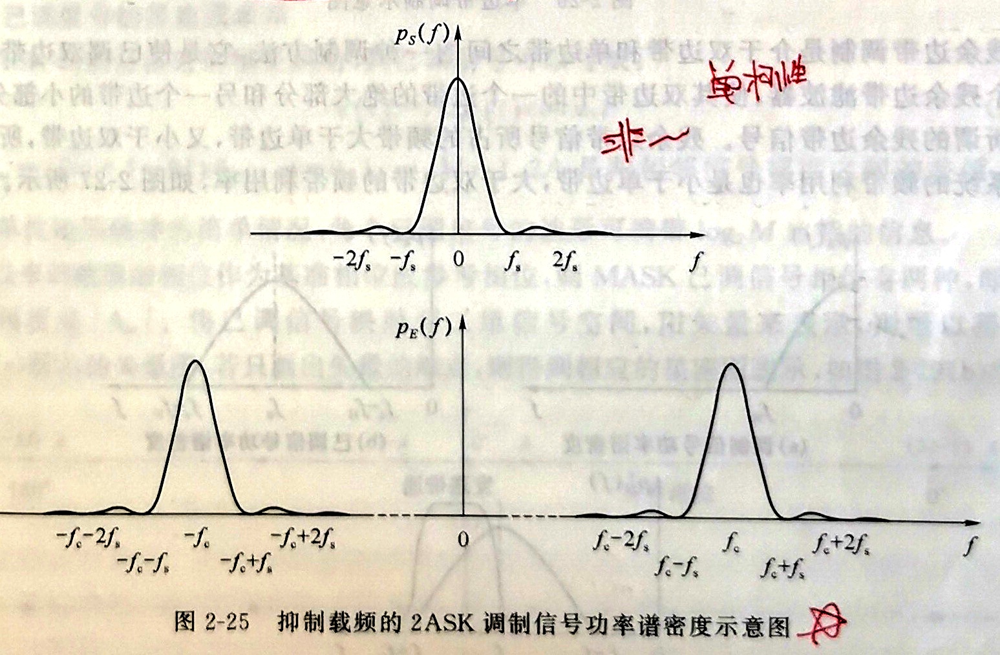
    

* 数字调相（相移键控）PSK

  * 二进制数字调相（2PSK）

    * 移相规则

      

      	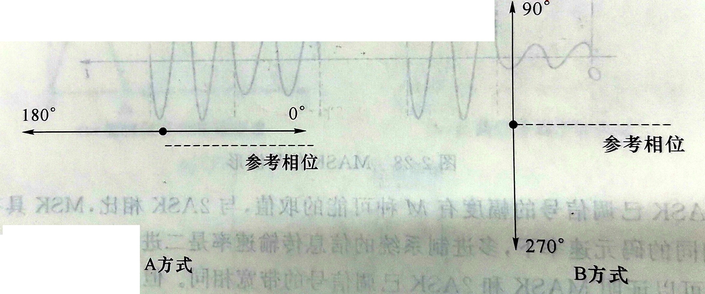
      

    * 根据载波相位表示数字信息的方式不同，数字调相分为	

      * 绝对相移（PSK）

        

        	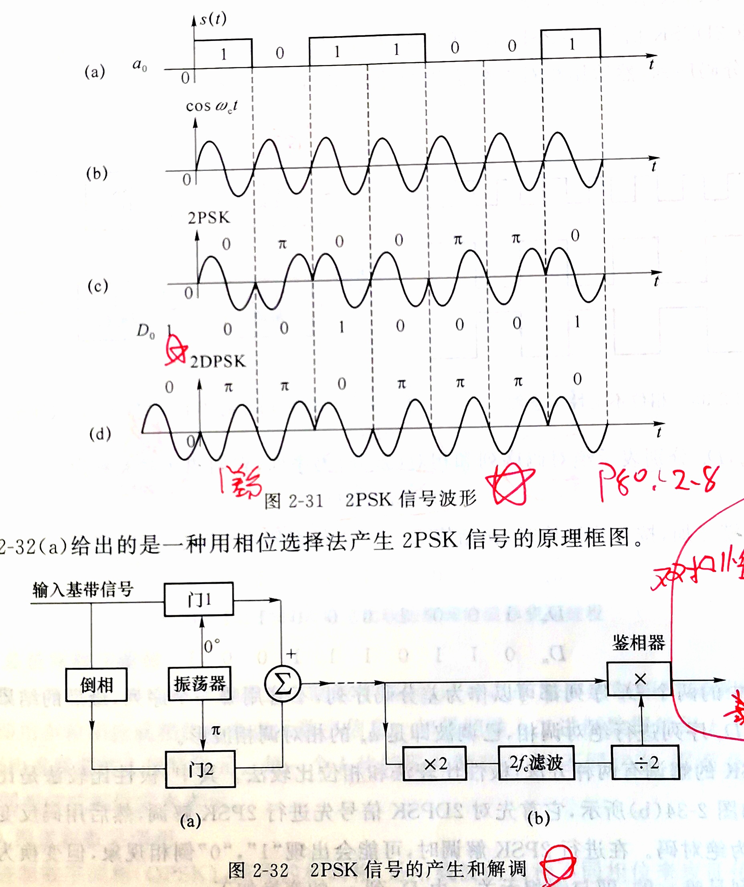
        

      * 相对相移（DPSK）

        

        	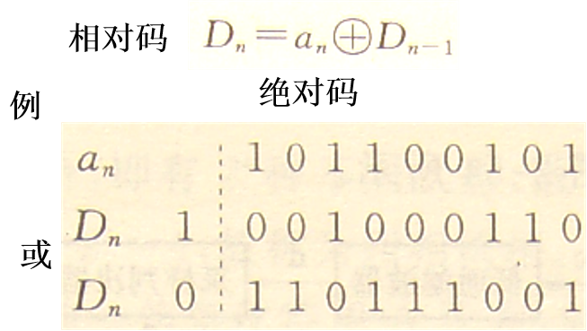
        

      * 例题：设发送数据信号为1001101,试画出其2PSK和2DPSK波形（P80-2-8）

        

        	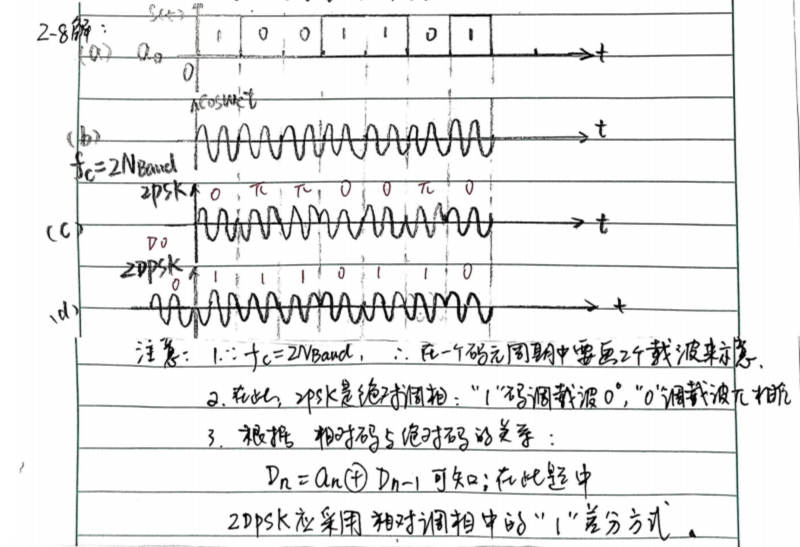
        

  * 多进制数字相位调制(MPSK)

    * 四进制数字相位调制信号矢量图

      

      	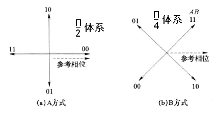
      

    * 四相制信号波形图

      

      	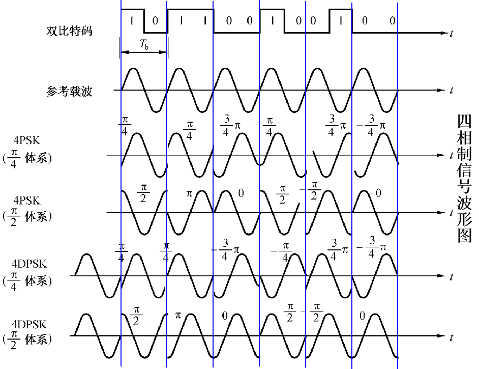
      

    * 例题：（P80-2-12）

      

      	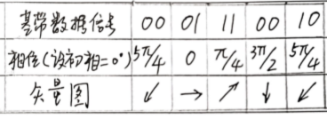
      

* 数字调频（频移键控）FSK

### 正交幅度调制（QAM）

* 原理

  * 定义
    * 将两路独立的基带波形分别对两个相互正交的同频载波进行抑制载波的双边带调制，并将所得到的两路已调信号叠加起来的过程。
  * 在QAM系统中，由于两路已调信号在相同的带宽内频谱正交，可以在同一频带内并行传输两路数据信息，因此，其频带利用率和单边带系统相同。

* 多进制正交幅度调制（MQAM）

  * 原理图

    

    	
    

  * 16QAM信号的星座图

    

    	
    

  * MQAM的频带利用率

    

    	
    

  
  * 结论：M星点数越大，其频带利用率就越高，但M越大，在相同信号空间内，星点的空间距离小，则系统的抗干扰能力下降，误码率升高。

  * 例题

    * 注意
      * 1. ∵正交调幅采用双边带传输∴ $B=2(1+α)f_{N}$ 
        2. A路=B路=总调制速率
        3. A路+B路=总传信速率
  
    

    	
    

### 数据信号的数字传输

* 概念：在数字信道中传输数据信号，简称数字数据传输。
* 优点
  1. 传输质量高
     * 数字信号直接或经过复用即可在数字信道上传输，无须经过调制和解调的变换，通过再生中继传输，无噪声积累，这都将使数据传输.质量得到大大提高。
  2. 信道传输效率高
     * 一个话路的传输速率可为64 kbit/s的数据，较低速率的数据可通过时分复用方式复用到64 kbit/s

### 例题

    已知基带信号的功率谱如下图所示,画出调制后的双边功率谱。
	

## 第三章 差错控制

### 差错控制基本概念

* 基本思路

  * 在被传送的信息码序列上，按照一定的规则**加入**若干“**监督码元**”后进行传输，这些加入的码元与原来的信息码序列之间**存在**着某种确定的**约束关系**。
  * 在接收数据时，**检验**信息码元与监督码元之间的既定的**约束关系**，如该关系遭到破坏，则在接收端可以发现传输中的错误，乃至纠正错误。

* 差错控制编码的码组：码组(n)=信息码(k)+监督码(r)

* 差错控制方式 

  

  	
  

  * 检错重发（ARQ，Automatic Repeat reQuest）

    * 停发等候重发

      

      	
      

    * 返回重发

      

      	
      

    * 选择重发

      

      	
      

  * 对比

    |                | **停发等候重发** | **返回重发** |     **选择重发**     |
    | :------------: | :--------------: | :----------: | :------------------: |
    |  **发送方式**  |   断续发送   | 连续发送 |     连续发送     |
    |  **传输效率**  |     最小     |  比较高  |       最高       |
    |  **控制方法**  |     简单     | 比较简单 |     比较复杂     |
    | **缓冲存储器** |   发送端有   | 发送端有 | 发送和接收端都有 |
    |    **成本**    |      低      |   较低   |       较高       |

### 汉明距离与检错和纠错能力的关系

* 概念

  * 编码效率R（信息传输效率）：R=k/n，其中，k是信息元的个数，n为码长，n=k+r。
  * 码长:编码码组的码元总位数称为码组的长度
  * 码重:码组中，“1”码元的数目称为码组的重量
  * 码距:两个等长码组之间对应位上码元不同的数目称为这两个码组的距离
  * 汉明距离 $d_{min}$ ：任意两个许用码组间距离的最小值

* 关系

  * 检测e个随机错误

    * 要求最小码距dmin ≥e+1；（用于ARQ）

    * 原理

      * 设有一个码组A，它位于0点，若A中发生一个错码，则A的位置将移动到以0为中心，以1为半径的圆上。因此，若最小码距不小于3，例如图中B点为最小码距的码组，则当发生不多于两个错码时，码组A的位置就不会移动到另一个许用码组B的位置上。

      

      	
      

  * 纠正t个随机错误

    * 要求最小码距dmin ≥2t+1；（用于FEC）

    * 原理

      * 若A和B中的错码不多于两个，其位置均不会超出以2为半径的圆，因而不会错到另一个码组的范围内。若此编码中任意两个码组之间的码距都不小于5，则只要错码不超过两个就能够纠正。

      

      	
      

  * 纠正t个同时检测e(e>t)个随机错误

    * 要求最小码距dmin ≥t+e+1。（用于HEC）

### 奇偶校验

* 奇偶监督码 

  * 分类

    * 奇监督码

      

    * 偶监督码

      

  * 检错能力

    1. 只能检测奇数个错误，而不能检测出偶数个错误。（奇、偶检错能力相同）
    2. 适合检测随机差错
    3. 奇偶监督码属于线性分组码，它是检错码。

* 水平垂直奇偶校验码

  

  * 检错能力

    * 可检出某行、某列的所有奇数个错,能发现大部分偶数个错,可以纠正不能同时满足行、列校验关系的一位错；
    * 不能检出某些互相补偿的偶数个错。

  * 例题

    

### 线性分组码

* 线性分组码
  * 定义
    * 线性码：信息码元与监督码元之间的关系可以用一组**线性方程**来表示
    * 分组码：监督码元**仅由本码组的信息码元**来确定，而与其他码组的码元无关
  * 特点
    1. **封闭性**，指一种线性分组码中的任意两个码组之逐位模2和仍为这种码的另一个许用码组。
    2. **码的最小距离等于非零码的最小码重**（除全“0”码组外）。
  * 常见线性分组码
    * 汉明码
      * 定义
        * 汉明码是一种**只能够纠正一位错码**且编码效率较高的**线性分组码**。
    * 循环码
      * 特点
        1. 相比于普通的线性分组码增加了**循环性**（任意一个许用码组经过**循环移位**后得到的码组仍然为它的一个许用码组）

## 第四章 数据交换

### 电路交换方式

* 电路交换概念

  * 空分交换方式：**不同用户**对在交换机内部所用的接续转接**线路不同**，即占不同的空间位置。通信之前所建立的物理链路指的就是实际的物理链路。
  * 时分交换方式：不同用户对在交换机内部占**同一条**接续转接线路，但**时间**位置**不同**，即占不同的时隙。

* 电路交换优点★

  ①信息的**传输时延小**，且对一次接续而言，传输时延**固定**不变。
  ②交换机对用户的数据信息不存储、分析和处理，传用户数据信息时不必附加许多控制信息，交换机在**处理方面的开销比较小**，**信息传输效率比较高**。
  ③信息的编码方法和信息格式由通信双方协调，不受网络的限制。

* 电路交换缺点★

  ①电路接续时间较长。
  ②电路资源被通信双方独占，电路利用率低。
  ③不同类型的终端（终端的数据速率、代码格式、通信协议等不同）不能相互通信。
  ④有呼损。可能因忙碌而叫不通。
  ⑤传输质量较差。 

### 存储-转发方式

#### 报文交换方式

* 优缺点▲

  * 优点

    ① 报文以存储/转发方式通过交换机，输入输出电路的速率、代码格式可以不同，很容易实现**各种不同类型用户间的相互通信**；

    ② 报文交换中没有电路接续过程，来自不同用户的报文可以在同一线路上以报文为单位实现时分多路复用，线路的**利用率**大大提**高**；

    ③ 用户不需要叫通对方就可以发送报文，**没有呼损**，并可以节省通信终端操作人员的时间；

    ④ 可实现同文报通信，即**同一报文可以由交换机转发到不同的收信地点**

  * 缺点

    ① 不利于实时通信；

    ② 报文交换机的设备比较庞大，**费用高**；

    ③ 报文交换**不适于实时**交换数据的场合。

#### 分组交换方式

* 分组交换的优缺点

  * 优点
    1. 传输质量高 
    2. 可靠性高
    3. 为不同种类的终端相互通信提供方便
    4. 能满足通信实时性要求
    5. 可实现分组多路通信
    6. 经济性好
  * 缺点
    1. 对长报文通信的传输效率比较低
    2. 要求交换机有较高的处理能力。

* 原理图▲

  

* 分类

  * 数据报方式
  * 虚电路方式
  * 数据报方式和虚电路方式的优缺点互换

#### 帧中继

#### ATM交换

### 交换方式的比较

	

## 第5章 数据通信网络体系结构

### OSI-RM各层功能概述

1. 物理层

   * 功能

     * 物理层提供有关同步和全双工比特流在物理媒介上的传输手段

     * 【基本单位：比特】。

   * 说明
     * 物理层是指在物理媒体之上为上一层（数据链路层）提供一个传输原始比特流的物理连接。 
     * 物理层**无控制信息**，不进行差错控制。

2. 数据链路层

   数据链路的建立、维持和拆除；差错控制、流量控制等；将一条可能有差错的实际(物理)线路变成无差错的数据链路，即从网络层向下看到的好像是一条不出差错的链路【基本单位：帧】。

3. 网络层

   网络连接的建立、拆除；将高层传送下来的信息分组；进行必要的路由选择、差错控制、流量控制等【基本单位：分组】。

4. 运输层

   实现用户的端到端的或进程之间数据的透明传送；弥补各种通信子网的质量差异；端到端的顺序控制、流量控制、差错控制及监督服务质量；给予用户一些选择，从网络获得某种等级的通信质量【基本单位：报文】。

5. 会话层

   会话层在两个进程之间建立一个逻辑上的连接（会话）；负责进程间建立会话和终止会话，并且控制会话期间的对话；会话建立时会话双方资格的核实和验证；对话方向的交替管理、故障点定位和恢复等各种服务【基本单位：报文[不同于运输层的报文]】。

6. 表示层

   提供数据的表示方法，其主要功能有代码转换、数据格式转换、数据加密与解密、数据压缩与恢复等。【基本单位：报文[不同于运输层的报文]】。

7. 应用层

   面向用户以满足用户的不同需求；确定应用进程之问通信的性质，以满足用户的需要；负责用户信息的语义表示，并在两个通信用户之间进行语义匹配。【基本单位：报文[不同于运输层的报文]】。

### 物理层接口规程的基本特性

1. 机械特性（结构，形状等）
   机械特性描述连接器即接口接插件的插头（阳连接器）、插座（阴连接器）的规格、尺寸、针的数量与排列情况等。
2. 电气特性（与电磁波传输的相关参数）
   电气特性规定了物理接口处多条连线的连接方式、适用元件、传输速率、信号电平、电缆长度及阻抗等。
3. 功能特性
   功能特性是指接口中各条信号线的用途，即每条接口线的功能。
   V.24定义了100系列和200系列接口电路
4. 规程特性
   规程特性是指接口两侧为建立、维持、拆除物理连接以及传送比特流而在各信号线上采用的动作序列，这些动作是靠信号线上电平的升降来体现的。
   并不是所有的标准都规定了四种基本特性。

### 数据链路层协议

* 数据链路控制规程的功能
  1. 帧控制；
  2. 透明传送；
  3. 流量控制（为了避免链路阻塞）；
  4. 差错控制；
  5. 链路管理；
  6. 异常状态的恢复；

* 高级数据链路控制规程（*HDLC*，High-level Data Link Control）帧结构

  

  1. 标志字段（Flag）

     * 作用
       * 用于帧同步，表示一帧的开始和结束；相邻两帧之间的F既可作为前一帧的结束，又可作为下一帧的开始。

     * “0”插入技术和删除技术

       * 在发送站检查两个F之间的字段，若有5个连“1”就在第5个“1”之后插入一个“0”。  在接收站对接收帧的比特序列进行检查，当发现起始标志和结束标志之间的比特序列中有连续5个“1”时，自动将其后的“0”删去。这样既可避免过早地终止帧，又使HDLC帧所传送的用户信息内容不受任何限制，从而达到**数据的透明传输**又避免过早结束帧。

       

  2. 地址字段（Address） 
  3. 控制字段（Control） 
  4. 信息字段（Information） 
  5.  帧校验字段（FCS）
     * 校验范围包括除标志字段和为了透明传输而插入的“0”之外的所有字段。即A、C、I、和FCS字段（不包括填充的“0”比特）

### 网络层协议（X.25建议）

# 光纤通信

**光纤传输原理**

将光限制在有简单包层的光纤纤芯中的作用原理是在纤芯一包层边界上的全内反射。