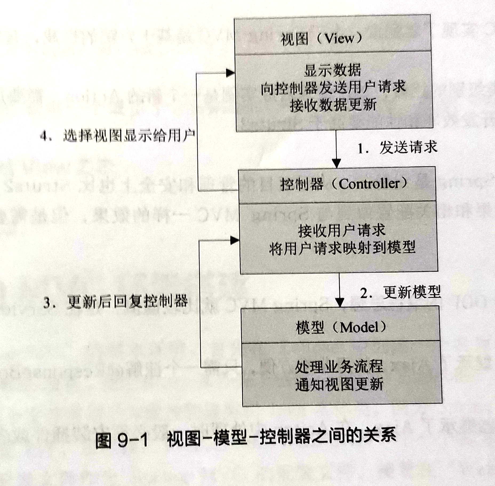
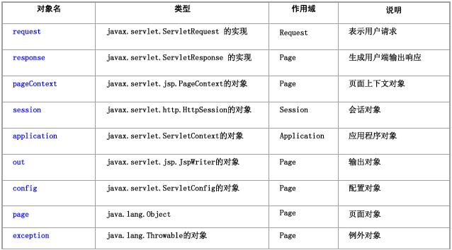
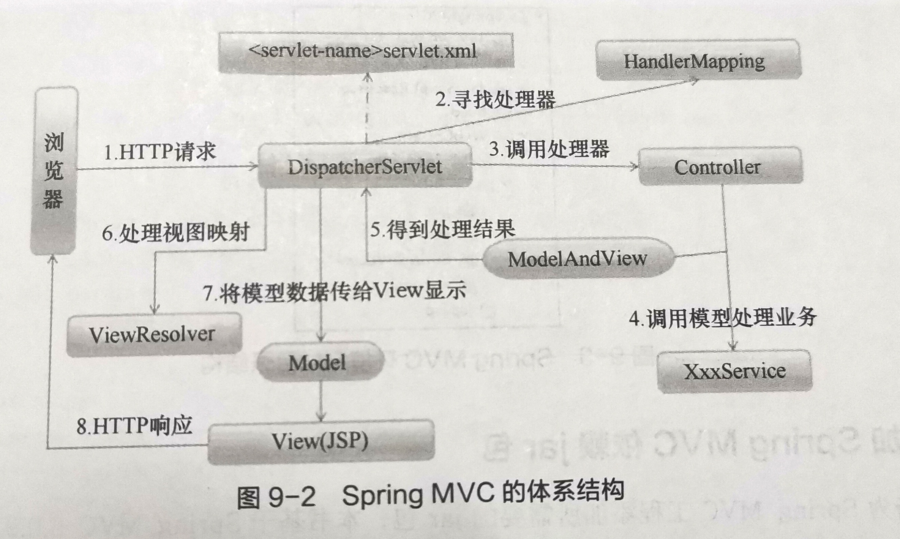

[原链接](https://blog.csdn.net/qq_33843237/article/details/124573544)

分值
==

名词解释4\*5  
选择2\*10  
填空2\*15  
论述3\*10

名词解释
================

C/S
-------

**Client/Server， 客户端/服务器**结构，服务器常采用**高性能的PC或工作站**，并采用**大型数据库系统**（Oracle或SQL Server）。需要安装**专用的客户端软件**。（在**2000年前**，C/S结构占据网络程序开放领域的主流）。

B/S
-------

**Browser/Server，浏览器/服务器**结构，客户端**不需要**开发任何用户界面，而**统一采用浏览器**，通过**Web浏览器向Web服务器发送请求，**由**Web服务器进行处理**，并将处理结果逐级传回客户端。这种结构**利用不断成熟和普及的浏览器技术**实现原来需要复杂专用软件才能实现的强大功能，从而**节约了开发成本**，是一种全新的软件体系结构。这种体系结构已经成为当今应用软件的**首选**体系结构。
MIME：
-----

Multipurpose Internet Mail Extensions，**多用途互联网邮件扩展类型**，用于设定某种扩展名的**文件的类型**，可以告诉浏览器如何**显示或打开**该文件。

DOM：
----

Document Object Model，**文档对象模型**，定义了访问HTML和XML文档的标准api，DOM提供了对整个文档的访问模型，HTML文档被解析后，转化为DOM树，因此对HTML文档的处理可以通过对DOM树的操作实现。DOM模型还定义了结点对象的行为，利用对象的方法和属性，可以方便地访问、修改、添加和删除DOM树的结点和内容。

Filter：
-------

过滤器，servlet的一个接口，用于在进入或离开servlet时**处理请求和响应**或**执行某些操作**的**可重用**代码

json：
-----

javascript object notation，**轻量级独立于语言的数据交换文本格式**。

ajax：
-----

asynchronous javascript and xml，通过js**异步发起请求**，**局部更新网页**。可以在不刷新页面的情况下与服务器通信，减少用户等待时间，改善用户体验，减轻服务器压力。

Ajax优点
------

1、按需获取数据，可将一部分工作转移到客户端，**减轻服务器负担**

2、无刷新更新网页，**用户体验感好**

3、可调用xml等外部数据，进一步**促进页面显示和数据的分离**

4、基于标准化并被广泛支持的技术**不需要下载其它插件**。

html：
-----

Hyper Text Markup Language，**超文本标记语言**，用标签描述网页，由浏览器解释执行。

xml：
----

   Extensible Mark-up Language， **可扩展标记语言**，标准通用标记语言的子集，简单的**数据存储**语言。

css：
----

 Cascading Style Sheets，**层叠样式表**，用于表现HTML或XML等文件**样式**的语言。

js：
---

 javascript，具有**解释型**、**基于对象**、**事件驱动**、**安全性**、**跨平台**特点的一门**解释型**编程**脚本语言**。

jsp：
----

 java server pages，sun公司倡导的**动态网页**技术标准，运行在服务器端的**脚本语言**，简化了servlet输出页面。

jsp特点
-----

1、跨平台（基于Java）；

2、业务代码分离；

3、组件重用（重用JavaBean）；

4、继承servlet功能；

5、预编译（只在第一次访问时编译，之后只需执行编译好的字节码）。

JSTL
----

 Java server pages standarded tag library，即[JSP标准标签库](https://baike.baidu.com/item/JSP%E6%A0%87%E5%87%86%E6%A0%87%E7%AD%BE%E5%BA%93/13679684 "JSP标准标签库")，它一个标准通用的标签库，可利用这些标签取代JSP页面上的[Java](https://baike.baidu.com/item/Java/85979 "Java")代码，从而提高程序的可读性，降低程序的维护难度。

超文本传输协议
---------------

 Hypertext Transfer Protocol，**HTTP**，是一个基于**请求与响应**，**无状态的**，**应用层**的协议，常基于**TCP/IP协议**传输数据。HTTP 是一个在计算机网络里传输**超文本数据**的约定和规范。

JVM 
-----

 java virtual machine，是可运行 Java 代码的假想计算机 ，包括一套字节码指令集、一组寄存器、一个栈、一个垃圾回收，堆和 一个存储方法域。 JVM 是运行在操作系统之上的，它与硬件没有直接的交互。引入Java语言虚拟机后，Java语言在不同平台上运行时不需要重新编译。Java语言使用Java虚拟机屏蔽了与具体平台相关的信息，使得Java语言编译程序只需生成在Java虚拟机上运行的目标代码（字节码），就可以在多种平台上不加修改地运行。

什么是session,cookie,application
-----------------------------

Cookie:是由Web服务器管理的存放在**客户端**的一个数据集合,这些数据是客户端、服务器端相关的信息，一般**有一定的生存期，有大小限制**，在每次客户端发送请求时请求头都会带上cookie（如果存在）。

Session:**会话，**用于保存客户访问网站期间，在多个页面之间跳转的信息，从客户**第一个请求**开始,到**会话超时**为止。

Application:它是**服务器运行期间所有用户**共享的一个容器,用于用户之间的**数据共享**，类似于服务器运行期间的全局变量。

servlet概念
---------

 Server Applet，**狭义**的Servlet是指Java的一个**接口**，**广义**的Servlet是指任何**实现了这个Servlet接口的类**，一般情况下，人们将Servlet理解为后者。Servlet必须**运行在**支持Java的Web**服务器上**（如Tomcat），可以对客户端**请求**进行**处理**，**返回响应**，生成动态Web内容。

servlet特点
---------

*   方便、实用的API方法。
    *   封装了针对HTTP请求的方法，用来处理表单数据、会话跟踪、设置HTTP头信息等。
*   高效的处理方式
    *   表现在Servlet对象具有多线程功能，当多个客户端请求一个servlet时，servlet为每一个请求分配一个线程处理。
*   跨平台
    *   Servlet用java编写，继承了Java的跨平台的特点。
*   更加灵活、扩展
    *   Servlet与Java关系密切，Servlet可以使用Java平台丰富的类库、同时能对Servlet进行面向对象操作，使得Servlet可以编写更多接口进行扩展。
*   安全性
    *   Servlet采用Java的安全框架，同时Servlet容器对Servlet提供了额外的功能，保证了Servlet的安全性非常高。

spring概念
---------

是轻量级开源框架，致力于解决企业应用开发的复杂性，整合各种流行框架，以IOC和AOP为基础。

IOC（依赖注入Dependency Injection）
------------------------------

 Inversion of Control控制反转，将创建对象的任务交给IOC容器，需要对象时通过IOC容器获取，解耦。

AOP
---

 Aspect oriented programming，面向切面编程，通过预编译方式和运行期动态代理实现程序功能的统一维护的一种技术，是OOP的延续，实现在不修改源代码的前提下对方法进行增强。利用AOP可以使得业务逻辑各部分之间的耦合度降低，提高程序的可重用性，减少重复代码，同时提高了开发的效率。

spring mvc 概念
--------------

 model-view-controller 模型-视图-控制器设计模式，强制的将应用程序的输入、处理和输出分开，基于mvc架构模式的轻量级web框架，其目的是将web开发模块化，对整体架构进行解耦，简化web开发流程。

model :体现应用**功能**，包括**业务逻辑层**（业务逻辑处理）和**数据库访问层**（数据库操作）

view: 负责应用程序**外观**，用于描述模型，一般由jsp和html组成，用于接收用户输入并将其交给控制器，根据控制器响应的数据更新视图。

controller:负责交互和将用户发送的数据提交给模型处理，并将处理的结果发送给相应的视图。



SSM
---

spring+spring mvc+mybatis，

spring负责管理bean，实例化对象，配置数据源，事务控制，组件管理，核心是**IOC(控制反转)，DI(依赖注入)和AOP(面向切面编程)**；

spring mvc负责实现业务逻辑，网站功能，核心是**Dispatcher Servlet(前端控制器)**；

mybatis负责数据库CRUD持久化操作，核心是**ORM(对象/关系映射【把关系数据库包装成面向对象的模型】)**。

Socket:
-------

套接字，网络上的两个程序通过一个双向的通信连接实现数据的交换,这个连接的一端称为一个 socket。

odbc：
-----

 Open Database Connectivity，开放数据库连接，为不同的数据库访问提供统一接口，允许应用程序以SQL为数据存取标准，存取不同DBMS管理的数据；使应用程序直接操纵DB中的数据。

jdbc：
-----

 Java Database Connectivity，Java数据库连接，Java语言中用来规范客户端程序如何来访问**数据库**的应用程序**接口**，提供了诸如查询和更新数据库中数据的方法，由java语言编写的类和接口组成。

javabean：
---------

遵循**特定书写规范的java类**，通常由如下特点

1、成员变量私有；

2、必须有无参构造函数；

3、通过标准的getter和setter访问私有属性；

4、可序列化。

tomcat
------

免费开源的轻量级web应用服务器。

web服务器
------

运行及发布web应用的容器，只有将web项目放置到该容器中，才能使网络中的所有用户通过浏览器进行访问。

www
---

World Wide Web， 即**全球广域网**，也称为**万维网**，它是一种基于**超文本**和**HTTP**的、**全球性的**、**动态交互的**、**跨平台的分布式图形信息系统**。是建立在Internet上的一种网络服务，为浏览者在Internet上查找和浏览信息提供了图形化的、易于访问的直观界面，其中的文档及超级链接将Internet上的信息节点组织成一个互为关联的网状结构。

网页（web）
-------

是网站中的页面，通常是html格式的，可以展示超文本（文字图片视频等），需要通过浏览器阅读。

知识点
===============

http协议状态码
---------

1xx 服务器已接受请求，正在处理

2xx 成功

3xx 重定向

4xx 客户端错误

5xx 服务器内部错误

css选择器
------

通配符选择器：\*{}

id选择器：#id{}

类选择器：.类名{}

元素选择器：标签名{}

派生选择器（子选择器、后代选择器）：a>b{}、a b{}

并集选择器：a,b{}

伪类选择器

jsp三大指令标签
----------

[JSP基本语法\_海盗船长没有船y的博客-CSDN博客](https://blog.csdn.net/weixin_44826356/article/details/106412573) "

指令标识主要用于设定整个JSP页面范围内都有效的相关信息，它是被服务器解释并执行的，对客户端浏览器是不可见。

### page指令

定义整个JSP页面的相关属性，这些属性在JSP被服务器解析成Servlet时会转换为相应的Java程序代码。

语法

```jsp
<%@ page 属性1="属性值1" 属性2="属性值2"...%>
```

常用属性

<table border="1" cellspacing="0"><tbody><tr><td style="vertical-align:top;width:170px;"><p style="margin-left:.0001pt;text-align:center;">属性</p></td><td style="vertical-align:top;width:518px;"><p style="margin-left:.0001pt;text-align:center;">作用</p></td></tr><tr><td style="vertical-align:top;width:170px;"><p style="margin-left:.0001pt;text-align:center;">language</p></td><td style="vertical-align:top;width:518px;"><p style="margin-left:.0001pt;text-align:center;">设置JSP页面使用的语言</p></td></tr><tr><td style="vertical-align:top;width:170px;"><p style="margin-left:.0001pt;text-align:center;">extends</p></td><td style="vertical-align:top;width:518px;"><p style="margin-left:.0001pt;text-align:center;">设置JSP页面继承的Java类，所有JSP页面在执行之前都会被服务器解析成Servlet，而Servlet是由Java类定义的，所以JSP和Servlet都可以继承制定的父类。</p></td></tr><tr><td style="vertical-align:top;width:170px;"><p style="margin-left:.0001pt;text-align:center;">import</p></td><td style="vertical-align:top;width:518px;"><p style="margin-left:.0001pt;text-align:center;">设置JSP导入的类包。JSP页面可以嵌入Java代码片段，这些Java代码在调用API时需要导入相应的类包。</p></td></tr><tr><td style="vertical-align:top;width:170px;"><p style="margin-left:.0001pt;text-align:center;">pageEncoding</p></td><td style="vertical-align:top;width:518px;"><p style="margin-left:.0001pt;text-align:center;">用于定义JSP页面的编码格式，也就是指定文件编码。JSP页面中的所有代码都使用该属性指定的字符集。</p></td></tr><tr><td style="vertical-align:top;width:170px;"><p style="margin-left:.0001pt;text-align:center;">contentType</p></td><td style="vertical-align:top;width:518px;"><p style="margin-left:.0001pt;text-align:center;">设置JSP页面的MIME类型和字符编码，浏览器会据此显示页面内容。</p></td></tr></tbody></table>

### include指令

在JSP页面中静态包含另一个JSP页面。

语法

```jsp
<%@ include file="JSPPath"%>
```

该指令只有一个file属性，用于指定要包含文件的路径。该路径是相对路径，也可以是绝对路径，但不可以是通过<%=%>[表达式](https://so.csdn.net/so/search?q=%E8%A1%A8%E8%BE%BE%E5%BC%8F&spm=1001.2101.3001.7020 "表达式")所代表的文件。

### taglib指令

用于加载自定义标签（JSTL）。

语法

```jsp
<%@ taglib prefix="tagPrefix" uri="tagURI"%>
```

jsp标识
-----

### 代码片段

在jsp页面嵌入java代码，将在页面请求的处理期间被执行。

语法

```
<% Java代码 %>
```

### 声明

定义jsp页面的全局的成员变量或方法。

语法

```jsp
<%! 声明全局变量或方法的代码 %>
```

### jsp表达式

可直接输出java表达式结果到jsp页面中，结果类型转换为字符串输出。

语法

```jsp
<%= 表达式 %>
```

### 注释

1、html注释

不会显示在页面中，但是在浏览器中查看源代码可以看到。

语法

```jsp
<!--注释文本-->
```

2、jsp注释

相比html注释安全性更高，在浏览器源代码中也不会显示

语法

```jsp
<%--注释内容--%>
```

3、动态注释

由于HTML注释对JSP嵌入的代码不起作用，因此可以利用他们的组合构成动态的HTML注释文本。  
例如：在JSP页面中添加动态注释，显示请求的日期，代码如下：

```jsp
<!--<%=new Date()%>-->
```

4、内部注释

JSP内部注释和Java注释一致。 // 和 /\* \*/。

jsp四大作用域
--------

application：整个应用

session：某一用户第一次请求开始直至用户关闭浏览器或会话超时

request：一次请求（包括请求转发）

page：用户请求的当前页面内有效

七个动作指令
-------

jsp:forward: 执行页面转向，将请求的处理转发到下一个页面。

jsp:param: 用于传递参数，必须与其他支持参数的标签一起使用。

jsp:include: 用于动态引入一个 JSP 页面。

jsp:plugin: 用于下载 JavaBean 或 Applet 到客户端执行。

jsp:useBean: 声明并创建JavaBean对象。

jsp:setProperty: 设置 JavaBean 实例的属性值。

jsp:getProperty: 获取 JavaBean 实例的属性值。

9个内置对象
------



 jsp运行过程
--------

1.客户端向服务器发出请求；

2.JSP服务器将JSP翻译成Servlet源代码（.java代码）;

3.将产生的Java代码进行编译，使之成为.class文件，将.class 文件加载到内存执行；

4.把执行后的结果（HTML文本）作为响应发至客户端由浏览器解释显示。

servlet生命周期
------------

加载类并实例化

初始化(调用Servlet init()方法)

处理请求(调用Servlet service()方法)

销毁（调用Servlet destroy()方法）。

h5新特性
------

1.  更多的语义元素
2.  表单控件更多
3.  更强大的图形与多媒体支持
4.  更强大的api

http报文
-------

请求报文：请求行（请求方式、请求URL、报文协议及版本）、请求头、空行、请求体

响应报文：响应行（报文协议及版本、状态码）、响应头、空行、响应体

Spring MVC体系结构
--------------

### 1\. HTTP请求

   客户端发出一个HTTP请求，Web应用服务器接收这个请求。如果请求匹配DispatcherServlet的请求**映射路径**，就将之转发给DispatcherServlet处理。

### 2\. 寻找处理器

   DispatcherServlet接受到请求后，将根据请求的信息及HandlerMapping的配置找到处理请求的**处理器**（Controller）

### 3\. 调用处理器

   **DispatcherServlet**把请求交给**处理器**。

### 4\. 调用模型处理业务

   处理器调用**服务层**方法处理**业务逻辑**。

### 5\. 得到处理结果

   **处理器**的返回结果为**ModelAndView**

### 6\. 处理视图映射

   DispatcherServlet查询一个或多个**ViewResolver视图解析器**，找到ModelAndView指定的视图。

### 7\. 将模型数据传给View显示

### 8\. HTTP响应

将结果显示到客户端



区别与优缺点
==================

xml与html区别
----------------------

<table border="1" cellspacing="0"><tbody><tr><td style="vertical-align:top;width:142pt;"><p style="margin-left:.0001pt;text-align:center;">对比</p></td><td style="vertical-align:top;width:142.05pt;"><p style="margin-left:.0001pt;text-align:center;">xml</p></td><td style="vertical-align:top;width:142.05pt;"><p style="margin-left:.0001pt;text-align:center;">html</p></td></tr><tr><td style="vertical-align:top;width:142pt;"><p style="margin-left:.0001pt;text-align:center;">语法</p></td><td style="vertical-align:top;width:142.05pt;"><p style="margin-left:.0001pt;text-align:center;">语法严谨</p></td><td style="vertical-align:top;width:142.05pt;"><p style="margin-left:.0001pt;text-align:center;">松散</p></td></tr><tr><td style="vertical-align:top;width:142pt;"><p style="margin-left:.0001pt;text-align:center;">用途</p></td><td style="vertical-align:top;width:142.05pt;"><p style="margin-left:.0001pt;text-align:center;">数据存储与传输</p></td><td style="vertical-align:top;width:142.05pt;"><p style="margin-left:.0001pt;text-align:center;">显示网页内容</p></td></tr><tr><td style="vertical-align:top;width:142pt;"><p style="margin-left:.0001pt;text-align:center;">大小写</p></td><td style="vertical-align:top;width:142.05pt;"><p style="margin-left:.0001pt;text-align:center;">区分</p></td><td style="vertical-align:top;width:142.05pt;"><p style="margin-left:.0001pt;text-align:center;">不区分</p></td></tr><tr><td style="vertical-align:top;width:142pt;"><p style="margin-left:.0001pt;text-align:center;">标记</p></td><td style="vertical-align:top;width:142.05pt;"><p style="margin-left:.0001pt;text-align:center;">自定义、可扩展</p></td><td style="vertical-align:top;width:142.05pt;"><p style="margin-left:.0001pt;text-align:center;">预定义</p></td></tr></tbody></table>

js与java区别
----------

js：基于对象和事件驱动的脚本语言、解释型、弱变量（使用前无需声明）

java：面向对象语言、编译型、强变量

forward和redirect区别
------------------

<table align="center" style="margin-left:3.3pt;"><tbody><tr><td><p style="margin-left:0;text-align:center;"></p></td><td><p style="margin-left:0;text-align:center;">forward</p></td><td><p style="margin-left:0;text-align:center;">redirect</p></td></tr><tr><td><p style="margin-left:0;text-align:center;">数据共享</p></td><td><p style="margin-left:0;text-align:center;">存在request域中</p></td><td><p style="margin-left:0;text-align:center;">只能放在url参数里</p></td></tr><tr><td><p style="margin-left:0;text-align:center;">效率</p></td><td><p style="margin-left:0;text-align:center;">高</p></td><td><p style="margin-left:0;text-align:center;">低</p></td></tr><tr><td><p style="margin-left:0;text-align:center;">浏览器url</p></td><td><p style="margin-left:0;text-align:center;">不变</p></td><td><p style="margin-left:0;text-align:center;">变成重定向页面</p></td></tr><tr><td><p style="margin-left:0;text-align:center;">行为</p></td><td><p style="margin-left:0;text-align:center;">服务器内部</p></td><td><p style="margin-left:0;text-align:center;">浏览器</p></td></tr><tr><td><p style="margin-left:0;text-align:center;">请求次数</p></td><td><p style="margin-left:0;text-align:center;">一次</p></td><td><p style="margin-left:0;text-align:center;">两次</p><p style="margin-left:0;text-align:center;">（第一次状态码302表示重定向）</p></td></tr><tr><td><p style="margin-left:.0001pt;text-align:center;">使用情景</p></td><td><p style="margin-left:.0001pt;text-align:center;">用户登录，转发到相应模块</p></td><td><p style="margin-left:.0001pt;text-align:center;">用户注销，返回主页或跳转其他页面</p></td></tr><tr><td><p style="margin-left:.0001pt;text-align:center;">相同</p></td><td colspan="2"><p style="margin-left:.0001pt;text-align:center;">都可用于页面跳转</p></td></tr></tbody></table>

cookie和session区别
----------------

<table border="1" cellspacing="0"><tbody><tr><td style="vertical-align:top;width:142pt;"><p style="margin-left:.0001pt;text-align:center;">区别</p></td><td style="vertical-align:top;width:142.05pt;"><p style="margin-left:.0001pt;text-align:center;">cookie</p></td><td style="vertical-align:top;width:142.05pt;"><p style="margin-left:.0001pt;text-align:center;">session</p></td></tr><tr><td style="vertical-align:top;width:142pt;"><p style="margin-left:.0001pt;text-align:center;">保存位置</p></td><td style="vertical-align:top;width:142.05pt;"><p style="margin-left:.0001pt;text-align:center;">客户端</p></td><td style="vertical-align:top;width:142.05pt;"><p style="margin-left:.0001pt;text-align:center;">服务器</p></td></tr><tr><td style="vertical-align:top;width:142pt;"><p style="margin-left:.0001pt;text-align:center;">大小限制</p></td><td style="vertical-align:top;width:142.05pt;"><p style="margin-left:.0001pt;text-align:center;">有</p></td><td style="vertical-align:top;width:142.05pt;"><p style="margin-left:.0001pt;text-align:center;">无</p></td></tr><tr><td style="vertical-align:top;width:142pt;"><p style="margin-left:.0001pt;text-align:center;">安全性</p></td><td style="vertical-align:top;width:142.05pt;"><p style="margin-left:.0001pt;text-align:center;">低</p></td><td style="vertical-align:top;width:142.05pt;"><p style="margin-left:.0001pt;text-align:center;">较高</p></td></tr><tr><td style="vertical-align:top;width:142pt;"><p style="margin-left:.0001pt;text-align:center;">服务器性能</p></td><td style="vertical-align:top;width:142.05pt;"><p style="margin-left:.0001pt;text-align:center;">影响小</p></td><td style="vertical-align:top;width:142.05pt;"><p style="margin-left:.0001pt;text-align:center;">较大</p></td></tr><tr><td style="vertical-align:top;width:142pt;"><p style="margin-left:.0001pt;text-align:center;">相同点</p></td><td colspan="2" style="vertical-align:top;width:284.1pt;"><p style="margin-left:.0001pt;text-align:center;">都是用来跟踪浏览器用户身份的方式</p></td></tr></tbody></table>

servlet和jsp
-----------

<table border="1" cellspacing="0"><tbody><tr><td style="vertical-align:top;width:142pt;"><p style="margin-left:.0001pt;text-align:center;">区别</p></td><td style="vertical-align:top;width:142.05pt;"><p style="margin-left:.0001pt;text-align:center;">servlet</p></td><td style="vertical-align:top;width:142.05pt;"><p style="margin-left:.0001pt;text-align:center;">jsp</p></td></tr><tr><td style="vertical-align:top;width:142pt;"><p style="margin-left:.0001pt;text-align:center;">路由映射配置</p></td><td style="vertical-align:top;width:142.05pt;"><p style="margin-left:.0001pt;text-align:center;">需要</p></td><td style="vertical-align:top;width:142.05pt;"><p style="margin-left:.0001pt;text-align:center;">不需要</p></td></tr><tr><td style="vertical-align:top;width:142pt;"><p style="margin-left:.0001pt;text-align:center;">侧重</p></td><td style="vertical-align:top;width:142.05pt;"><p style="margin-left:.0001pt;text-align:center;">侧重逻辑控制</p></td><td style="vertical-align:top;width:142.05pt;"><p style="margin-left:.0001pt;text-align:center;">页面显示</p></td></tr><tr><td style="vertical-align:top;width:142pt;"><p style="margin-left:.0001pt;text-align:center;">内置对象</p></td><td style="vertical-align:top;width:142.05pt;"><p style="margin-left:.0001pt;text-align:center;">无</p></td><td style="vertical-align:top;width:142.05pt;"><p style="margin-left:.0001pt;text-align:center;">9个内置对象</p></td></tr><tr><td style="text-align:center;vertical-align:top;width:142pt;">关系</td><td style="text-align:center;vertical-align:top;width:142.05pt;"></td><td style="text-align:center;vertical-align:top;width:142.05pt;">&nbsp;Jsp 编译后为servlet，用jsp实现的页面用servlet也能实现</td></tr></tbody></table>

tcp和udp
-------

<table border="1" cellspacing="0"><tbody><tr><td style="vertical-align:top;width:142pt;"><p style="margin-left:.0001pt;text-align:center;">区别</p></td><td style="vertical-align:top;width:142.05pt;"><p style="margin-left:.0001pt;text-align:center;">tcp</p></td><td style="vertical-align:top;width:142.05pt;"><p style="margin-left:.0001pt;text-align:center;">udp</p></td></tr><tr><td style="vertical-align:top;width:142pt;"><p style="margin-left:.0001pt;text-align:center;">安全性</p></td><td style="vertical-align:top;width:142.05pt;"><p style="margin-left:.0001pt;text-align:center;">可靠</p></td><td style="vertical-align:top;width:142.05pt;"><p style="margin-left:.0001pt;text-align:center;">不可靠</p></td></tr><tr><td style="vertical-align:top;width:142pt;"><p style="margin-left:.0001pt;text-align:center;">连接</p></td><td style="vertical-align:top;width:142.05pt;"><p style="margin-left:.0001pt;text-align:center;">有连接</p></td><td style="vertical-align:top;width:142.05pt;"><p style="margin-left:.0001pt;text-align:center;">无连接</p></td></tr><tr><td style="vertical-align:top;width:142pt;"><p style="margin-left:.0001pt;text-align:center;">连接方式</p></td><td style="vertical-align:top;width:142.05pt;"><p style="margin-left:.0001pt;text-align:center;">三次握手，四次挥手</p></td><td style="vertical-align:top;width:142.05pt;"><p style="margin-left:.0001pt;text-align:center;"></p></td></tr><tr><td style="vertical-align:top;width:142pt;"><p style="margin-left:.0001pt;text-align:center;">通信方式</p></td><td style="vertical-align:top;width:142.05pt;"><p style="margin-left:.0001pt;text-align:center;">一对一通信</p></td><td style="vertical-align:top;width:142.05pt;"><p style="margin-left:.0001pt;text-align:center;">可一对一，一对多，多对多</p></td></tr><tr><td style="vertical-align:top;width:142pt;"><p style="margin-left:.0001pt;text-align:center;">适用</p></td><td style="vertical-align:top;width:142.05pt;"><p style="margin-left:.0001pt;text-align:center;">要求可靠传输</p></td><td style="vertical-align:top;width:142.05pt;"><p style="margin-left:.0001pt;text-align:center;">实时传输</p></td></tr></tbody></table>

ajax+html和jsp的区别
-----------------

● 最简单的区别就是，HTML能直接打开，jsp只能发布到Tomact等服务器上才能打开；

● 定义上HTML页面是静态页面可以直接运行，JSP页面是动态页面它运行时需要转换成servlet；

● 他们的表头不同，这个是JSP的头“ <%@ page language=“java” import=“java.util.\*” pageEncoding=“utf-8”%>”在表头中有编码格式和导入包等。

### ajax+html的优点

○ 开发过程中前端与后端脱离，交互通过JSON传输来实现

○ 按需获取数据，可将一部分工作转移到客户端，减轻服务器负担

○ 无刷新更新网页，用户体验感好

○ 使后台数据接口能够得到复用

### jsp的优点

○ 可被爬虫爬到

○ 减少请求次数

○ 传值方便

○ 接口代码少

○ 不用考虑浏览器的兼容性

### ajax+html的缺点

○ 开发难度大，考虑浏览器的兼容性

○ 页面请求过多

○ 属于后加载，无法被爬虫爬到

○ 接口代码需要新增很多

○ 无法直接显示java实体类对象，需要转换为json格式

### jsp的缺点

○ 增大了服务器的压力

○ 前端与后端未脱离，增加开发维护难度

○ 过于依赖java运行环境

○ 复用较低。

Ajax和传统Web应用的对比
---------------

### 区别

传统：同步、页面交互为主导

ajax：异步、数据交互为主导

### 传统

优点：代码简单

缺点：用户体验感差、服务器压力大

### ajax：

优点：按需请求数据，减少服务器负担、促进页面显示和数据分离、用户体验感好、使用基于标准化的并被官方支持的技术，不需要下载插件或小程序。

缺点：接口代码繁杂、无法直接显示java实体类对象，需要转换为json格式

get和post
--------

<table border="1" cellspacing="0"><tbody><tr><td style="vertical-align:top;width:142pt;"><p style="margin-left:.0001pt;text-align:justify;">区别</p></td><td style="vertical-align:top;width:142pt;"><p style="margin-left:.0001pt;text-align:justify;">get</p></td><td style="vertical-align:top;width:142pt;"><p style="margin-left:.0001pt;text-align:justify;">post</p></td></tr><tr><td style="vertical-align:top;width:142pt;"><p style="margin-left:.0001pt;text-align:justify;">参数长度</p></td><td style="vertical-align:top;width:142pt;"><p style="margin-left:.0001pt;text-align:justify;">有限制</p></td><td style="vertical-align:top;width:142pt;"><p style="margin-left:.0001pt;text-align:justify;">无</p></td></tr><tr><td style="vertical-align:top;width:142pt;"><p style="margin-left:.0001pt;text-align:justify;">安全性</p></td><td style="vertical-align:top;width:142pt;"><p style="margin-left:.0001pt;text-align:justify;">低（参数直接暴露在url上）</p></td><td style="vertical-align:top;width:142pt;"><p style="margin-left:.0001pt;text-align:justify;">较高（参数可封装在request body中）</p></td></tr><tr><td style="vertical-align:top;width:142pt;"><p style="margin-left:.0001pt;text-align:justify;">编码</p></td><td style="vertical-align:top;width:142pt;"><p style="margin-left:.0001pt;text-align:justify;">url编码（对非ascii字符编码）</p></td><td style="vertical-align:top;width:142pt;"><p style="margin-left:.0001pt;text-align:justify;">无限制</p></td></tr><tr><td style="vertical-align:top;width:142pt;"><p style="margin-left:.0001pt;text-align:justify;">参数位置</p></td><td style="vertical-align:top;width:142pt;"><p style="margin-left:.0001pt;text-align:justify;">url</p></td><td style="vertical-align:top;width:142pt;"><p style="margin-left:.0001pt;text-align:justify;">请求体，url皆可</p></td></tr><tr><td style="vertical-align:top;width:142pt;"><p style="margin-left:.0001pt;text-align:justify;">请求发送</p></td><td style="vertical-align:top;width:142pt;"><p style="margin-left:.0001pt;text-align:justify;">浏览器回退时无害</p></td><td style="vertical-align:top;width:142pt;"><p style="margin-left:.0001pt;text-align:justify;">post会重复提交请求</p></td></tr></tbody></table>

C/S的优缺点
-------

### （1）优点

●响应速度快，服务器压力小。

●满足客户自身的个性化要求。  

●较强的事务处理能力。

●安全。

### （2）缺点

●部署安装和配置繁琐。

●兼容性差。  

●开发、维护成本较高。

●对客户端性能有一定要求

●适用面窄。

B/S的优缺点
-------

### （1）优点

●分布性强，客户端零维护。

●跨平台

●业务扩展简单方便，通过增加网页即可增加服务器功能。  

●开发简单，共享性强。

### （2）缺点

●服务器负载较重

●无法实现具有个性化的功能要求。

●响应速度较慢。

●在速度和安全性上需要花费巨大的设计成本。

●功能弱化，难以实现传统模式下的特殊功能要求。

css
---

### 行内css：

优点：易于理解，直接清晰

缺点：灵活性低

### 内嵌css：

易于维护

### 链接式css：

优点：易于复用，便于维护，减少文件大小，加载速度更快，HTML页面的大小更小，结构更清晰；

缺点：在加载完外部CSS之前，页面可能无法正确呈现。

mybatis和jdbc区别
--------------

<table border="1" cellspacing="0"><tbody><tr><td style="vertical-align:top;width:142.05pt;"><p style="margin-left:.0001pt;text-align:center;">mybatis</p></td><td style="vertical-align:top;width:142.05pt;"><p style="margin-left:.0001pt;text-align:center;">jdbc</p></td></tr><tr><td style="vertical-align:top;width:142.05pt;"><p style="margin-left:.0001pt;text-align:center;">开发效率高</p></td><td style="vertical-align:top;width:142.05pt;"><p style="margin-left:.0001pt;text-align:center;">性能好</p></td></tr><tr><td style="vertical-align:top;width:142.05pt;"><p style="margin-left:.0001pt;text-align:center;">支持动态sql</p></td><td style="vertical-align:top;width:142.05pt;"><p style="margin-left:.0001pt;text-align:center;"></p></td></tr><tr><td style="vertical-align:top;width:142.05pt;"><p style="margin-left:.0001pt;text-align:center;">简化重复代码</p></td><td style="vertical-align:top;width:142.05pt;"><p style="margin-left:.0001pt;text-align:center;"></p></td></tr><tr><td style="vertical-align:top;width:142.05pt;"><p style="margin-left:.0001pt;text-align:center;">松耦合</p></td><td style="vertical-align:top;width:142.05pt;"><p style="margin-left:.0001pt;text-align:center;"></p></td></tr><tr><td style="vertical-align:top;width:142.05pt;"><p style="margin-left:.0001pt;text-align:center;">支持数据库连接池</p></td><td style="vertical-align:top;width:142.05pt;"><p style="margin-left:.0001pt;text-align:center;"></p></td></tr><tr><td style="vertical-align:top;width:142.05pt;"><p style="margin-left:.0001pt;text-align:center;">sql统一管理</p></td><td style="vertical-align:top;width:142.05pt;"><p style="margin-left:.0001pt;text-align:center;"></p></td></tr><tr><td style="vertical-align:top;width:142.05pt;"><p style="margin-left:.0001pt;text-align:center;">自动映射结果集</p></td><td style="vertical-align:top;width:142.05pt;"><p style="margin-left:.0001pt;text-align:center;"></p></td></tr><tr><td style="vertical-align:top;width:142.05pt;"><p style="margin-left:.0001pt;text-align:center;">面向对象</p></td><td style="vertical-align:top;width:142.05pt;"><p style="margin-left:.0001pt;text-align:center;">面向关系</p></td></tr></tbody></table>

JDBC优缺点
-------

优点  
  1. 理解简单；（JDBC与ODBC十分相似，便于软件开发人员理解）  
  2. 有统一接口；（JDBC使软件开发人员从复杂的驱动程序编写工作中解脱出来，可以完全专注于业务逻辑的开发）  
    3.增强软件的可移植性；（ JDBC支持多种关系型数据库，大大增加了软件的可移植性）  
  4. 面向对象，可以二次封装。（JDBC API是面向对象的，软件开发人员可以将常用的方法进行二次封装，从而提高代码的重用性）  
    缺点  

  1. 性能稍低；（相比原厂驱动，通过JDBC访问数据库时速度将受到一定影响）  
  2. 虽然JDBC API是面向对象的，但通过JDBC访问数据库依然是面向关系的。  
  3. JDBC提供了对不同厂家的产品的支持，这将对数据源带来影响。

jdbc问题总结如下
------------

1、  数据库连接创建、释放频繁造成系统**资源浪费**从而**影响**系统**性能**，如果使用数据库连接池可解决此问题。

2、  Sql语句在代码中**硬编码**，造成代码不易维护，实际应用sql变化的可能较大，sql变动需要改变Java代码。

3、  使用preparedStatement向占位符传参数时存在硬编码，**不支持动态sql**，因为sql语句的where条件不一定，可能多也可能少，修改sql还要修改代码，不易维护。

4、  对**结果集解析存在硬编码**（查询列名），sql变化导致解析代码变化，系统不易维护，如果能将数据库记录封装成pojo对象解析比较方便。

servlet和springmvc
-----------------

<table border="1" cellspacing="0"><tbody><tr><td style="vertical-align:top;width:142.05pt;"><p style="margin-left:.0001pt;text-align:center;">servlet</p></td><td style="vertical-align:top;width:142.05pt;"><p style="margin-left:.0001pt;text-align:center;">springmvc</p></td></tr><tr><td style="vertical-align:top;width:142.05pt;"><p style="margin-left:.0001pt;text-align:center;">性能好</p></td><td style="vertical-align:top;width:142.05pt;"><p style="margin-left:.0001pt;text-align:center;">开发效率高</p></td></tr><tr><td style="vertical-align:top;width:142.05pt;"><p style="margin-left:.0001pt;text-align:center;"></p></td><td style="vertical-align:top;width:142.05pt;"><p style="margin-left:.0001pt;text-align:center;">降低耦合度</p></td></tr><tr><td style="vertical-align:top;width:142.05pt;"><p style="margin-left:.0001pt;text-align:center;"></p></td><td style="vertical-align:top;width:142.05pt;"><p style="margin-left:.0001pt;text-align:center;">模块化</p></td></tr></tbody></table>

数据库
===============

jdbc步骤
-------

加载jdbc驱动程序，创建数据库连接，执行sql语句，获得查询结果，关闭连接。

### 查

```
Connection connection=null;
Statement statement=null;
ResultSet resultSet=null;
ArrayList<Account> arrayList= null;
try {
    //注册驱动
    Class.forName("com.mysql.jdbc.Driver");
    //定义sql
    String sql="select * from account";
    //获得Connection对象
    connection = DriverManager.getConnection("jdbc:mysql://localhost:3306/mydb", "root", "root");
    //获取执行sql对象
    statement = connection.createStatement();
    //执行sql
    resultSet = statement.executeQuery(sql);//存储查询语句返回的表格
    //处理数据
    arrayList = new ArrayList<>();
    while(resultSet.next()){//1、游标向下移动一行，转到第一行
        //2、取出需要的列数据
        int anInt = resultSet.getInt(1);
        String name = resultSet.getString("name");
        double aDouble = resultSet.getDouble(3);
        arrayList.add(new Account(anInt, name, aDouble));
    }
    System.out.println(arrayList);
} catch (ClassNotFoundException | SQLException e) {
    e.printStackTrace();
}finally {
    if (resultSet!=null){
        try {
            resultSet.close();
        } catch (SQLException throwables) {
            throwables.printStackTrace();
        }
    }
    if (statement!=null){
        try {
            statement.close();
        } catch (SQLException throwables) {
            throwables.printStackTrace();
        }
    }
    if (connection!=null){
        try {
            connection.close();
        } catch (SQLException throwables) {
            throwables.printStackTrace();
        }
    }
}
```

### 增删改

```java
Connection connection=null;
Statement statement=null;
try {
    //注册驱动
    Class.forName("com.mysql.jdbc.Driver");
    //String sql = "insert into account values(null,'王五',3000)";// 报错不用管：无法解析 表 'account'
    String sql="delete from mydb.account WHERE NAME='王五'";//获得Connection对象
    connection = DriverManager.getConnection("jdbc:mysql://localhost:3306/mydb", "root", "root");
    statement = connection.createStatement();
    int executeUpdate = statement.executeUpdate(sql);
    if (executeUpdate>0){
        System.out.println("添加成功！");
    }else{
        System.out.println("添加失败！");
    }
} catch (ClassNotFoundException | SQLException e) {
    e.printStackTrace();
}finally {
    if (statement!=null){
        try {
            statement.close();
        } catch (SQLException throwables) {
            throwables.printStackTrace();
        }
    }
    if (connection!=null){
        try {
            connection.close();
        } catch (SQLException throwables) {
            throwables.printStackTrace();
        }
    }
}
```

什么是Mybatis？
-----------

Mybatis是一个半自动的**ORM持久层框架**，内部**封装了JDBC**。作为开发者只需要关注sql语句本身，几乎避免了手动设置参数和获取结果集。Mybatis是通过**xml或注解**的方式将需要执行的sql语句**配置**起来。通过Java对象和statement中的sql动态参数映射生成最终执行的sql语句，最终由Mybatis框架执行sql并将结果**映射为Java对象**并返回。MyBatis 支持**定制化 SQL**、**存储过程**以及**高级映射**。MyBatis 是可以**双向映射**的，可以将数据集映射为Java对象，也可以将Java对象映射为数据库中的记录。

Mybatis的优点
-----------

（1）**简单易学**，容易上手，**基于SQL编程**，**效率更高**（相比于Hibernate）；

（2）同JDBC相比，**减少**了50%以上的**代码量**，**消除**了JDBC大量**冗余**的**代码**，不需要手动开关连接；

（3）很好的与各种数据库**兼容**（因为MyBatis使用JDBC来连接数据库，所以只要JDBC支持的数据库MyBatis都支持，而JDBC提供了可扩展性，所以只要这个数据库有针对Java的jar包就可以就可以与MyBatis兼容），开发人员不需要考虑数据库的差异性。

（4）提供了很多第三方**插件**（分页插件 / 逆向工程）；

（5）能够与**Spring**很好的**集成**；

（6）MyBatis相当**灵活**，不会对应用程序或者数据库的现有设计强加任何影响，SQL写在XML里，从程序代码中彻底分离，**解**除sql与程序代码的**耦**合，**便于统一管理和优化**，并**可重用**。

（7）提供XML标签，支持编写**动态SQL**语句。

（8）提供映射标签，支持**对象与数据库的ORM字段关系映射**。

MyBatis框架的缺点
-------------

（1）**SQL语句的编写工作量较大**，尤其是字段多、关联表多时，更是如此，对开发人员编写SQL语句的功底有一定要求。

（2）SQL语句**依赖于数据库**，导致数据库**移植性差，不能随意更换数据库（各个数据库间有方言差异）。